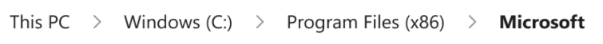
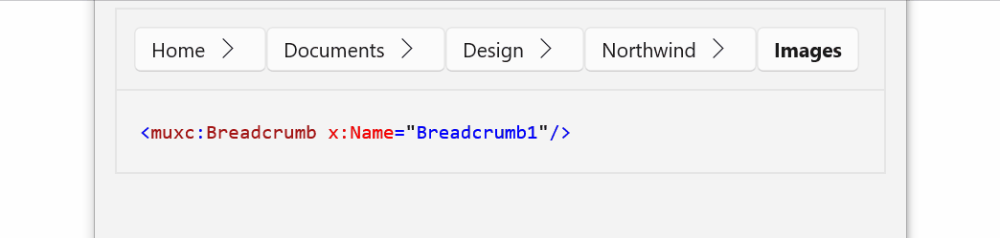

Breadcrumb control
===

> **Note:** This API has been implemented and documented.
This spec was completed with open discussion items
[in the PR](https://github.com/microsoft/microsoft-ui-xaml-specs/pull/102)
for archive purposes and so might not match the final API.

# Background

A "Breadcrumb" UX pattern provides an way to show a current position in context.
For example in Windows File Explorer the current directory is shown with a breadcrumb,
where clicking on any node takes you to that ancestor directory:



There’s currently no consistent and Fluent way to address the common UX pattern of a breadcrumb.
This control is needed for situations where the user's navigation trail (in a file system or menu system) needs
to be persistently visible.

A Breadcrumb control is movitated by its use in many app scenarios and supporting developers in migrating from WPF.
This is not the 'history' of the user's navigation, but the direct path of pages or folders from
the root node to their current position. 

## V1/V2 Breadcrumb

The work for Breadcrumb has been scoped to V1 and V2 stages of the API.
In V1 the nodes have no option to open a drop-down menu, typically used to show the node's siblings.
V2 will add this. This spec focuses on V1 Breadcrumb,
but keeping in mind that V1 is positioned in a way to have V2 features smoothly added later. 

# API Pages

## Breadcrumb class

Represents a control that shows a list of items, for example the navigation trail to the current location.

### Examples

The following example code creates a simple Breadcrumb control with three nodes.
When there is not enough width to display the whole control,
the leading nodes are replaced with a node that the user can click on,
opening the missing nodes in a flyout menu.



XAML
```XAML
<Breadcrumb x:Name="Breadcrumb1" /> 
```

C#
```cs
Breadcrumb1.ItemsSource = new string[]{ "Home", "Documents", "Design", "Northwind", "Images"}
```

If the last item in a Breadcrumb is text and is too long to fit it will be clipped
(if the item type is a string it will be trimmed, meaning shortened and replaced with an ellipsis).


#### Responding to clicks

This example shows an app with a Breadcrumb across the top, and a content area on the rest of the Window.
The Breadcrumb shows a list of items. Clicking on an item navigates the content back, and updates
the Breadcrumb.

```xaml
<Grid RowDefinitions="Auto,*">
    <Breadcrumb ItemClicked="CrumbClicked" ItemsSource="{x:Bind Items, Mode=OneWay}" />
    
    <ContentControl Grid.Row="1" Content="{x:Bind CurrentItem, Mode=OneWay}">
        ...
    </ContentControl>
</Grid>
```

```csharp
public sealed partial class MainPage : Page
{
    public ObservableCollection<Items> Items { get; }

    public ItemClickEventArgs Current Item { get; set;}

    void CrumbClicked(Breadcrumb sender, BreadcrumbItemClickedEventArgs e)
    {
        for(int i = Items.Count-1; i > e.Index; i++)
        {
            Items.RemoveAt(i);
        }

        CurrentItem = Items[i - 1];
    }

    void NavigateToItem(Item item)
    {
        Items.Add(item);
        CurrentItem = item;
    }
}
```

#### Breadcrumb.ItemTemplate property

Gets or sets the template to display an item

The Breadcrumb ItemTemplate is used to override the default display of the
individual items in the Breadcrumb control.

The following uses the ItemTemplate so that the Breadcrumb items show the Name property of the items:

```xaml
<Breadcrumb ItemsSource='{x:Bind Items}'>
    <Breadcrumb.ItemTemplate>
        <DataTemplate x:DataType='BreadcrumbItem`>
            <TextBlock Text='{x:Bind Name}/>
        </DataTemplate>
    </Breadcrumb.ItemTemplate>
</Breadcrumb>
```

Notes:
* You can use a BreadcrumbItem as the root of the DataTemplate
* If no ItemTemplate is supplied, the Breadcrumb control will convert to a string.

## Other Breadcrumb members

| Name | Description | Default |
| :---------- | :------- | :------- |
| ItemsSource | Gets or sets the content of the Breadcrumb |
| ItemClicked | Raised when a user interaction causes a jump to the CurrentItem.  |

_Spec note: the V2 of Breadcrumb will add flyouts from chevrons to view children of a node.
Additional properties will be added to the API to enable this functionality._

# API Details

**Windows.UI.Xaml.Controls namespace**

```cs
[webhosthidden]
runtimeclass BreadcrumbItemClickedEventArgs
{
    Int32 Index { get; };
    Object Item { get; };
}

[webhosthidden]
unsealed runtimeclass BreadcrumbItem : Windows.UI.Xaml.Controls.ContentControl
{
    BreadcrumbItem();
}

[webhosthidden]
unsealed runtimeclass Breadcrumb : Windows.UI.Xaml.Controls.Control
{
    Breadcrumb();

    Object ItemsSource{ get; set; };
    Object ItemTemplate{ get; set; };

    event Windows.Foundation.TypedEventHandler<Breadcrumb, BreadcrumbItemClickedEventArgs> ItemClicked;

    static Windows.UI.Xaml.DependencyProperty ItemsSourceProperty{ get; };
    static Windows.UI.Xaml.DependencyProperty ItemTemplateProperty{ get; };
}

[webhosthidden]
unsealed runtimeclass BreadcrumbItemAutomationPeer 
   : Windows.UI.Xaml.Automation.Peers.FrameworkElementAutomationPeer,
     Windows.UI.Xaml.Automation.Provider.IInvokeProvider
{
    BreadcrumbItemAutomationPeer(MU_XC_NAMESPACE.BreadcrumbItem owner);
}

```

## Theme Resources

You can modify the look of a Breadcrumb by specifying Xaml resources in your app.
For more info, see the
[lightweight styling guide](https://docs.microsoft.com/en-us/windows/uwp/design/controls-and-patterns/xaml-styles#lightweight-styling).


| Name | Description | 
| :---------- | :------- | 
| BreadcrumbNormalForegroundBrush | Sets the foreground color | 
| BreadcrumbHoverForegroundBrush | Sets the hover foreground color |
| BreadcrumbPressedForegroundBrush | Sets the pressed foreground color |
| BreadcrumbDisabledForegroundBrush | Sets the disabled foreground color |
| BreadcrumbFocusForegroundBrush | Sets the focus foreground color |
| BreadcrumbCurrentNormalForegroundBrush | Sets the foreground color for the current item |
| BreadcrumbCurrentHoverForegroundBrush | Sets the hover foreground color for the current item |
| BreadcrumbCurrentPressedForegroundBrush | Sets the pressed foreground color for the current item |
| BreadcrumbCurrentDisabledForegroundBrush | Sets the disabled foreground color for the current item |
| BreadcrumbCurrentFocusForegroundBrush | Sets the focus foreground color for the current item |
| BreadcrumbBackgroundBrush | Sets the background color |
| BreadcrumbBorderBrush | Sets the border color |
| BreadcrumbItemThemeFontSize | Sets the item font size | 


# Appendix

## Inputs and Accessibility 

## UI Automation
Breadcrumb is identified as a [UIA Navigation Landmark](https://docs.microsoft.com/windows/win32/winauto/landmark-type-identifiers). Each BreadcrumbItem will use a [InvokePattern](!https://docs.microsoft.com/dotnet/framework/ui-automation/implementing-the-ui-automation-invoke-control-pattern) with control type [Button](https://docs.microsoft.com/windows/win32/winauto/uiauto-supportbuttoncontroltype). 

## Keyboard

* The user can tab into the Breadcrumb and tab out.
The first tab in gives focus to the first (highest-level) node (if the breadcrumb is crumbled, the ellipsis button instead).
* Once the Breadcrumb has focus, the user can use the left/right arrows to navigate from node to node.
* If the Breadcrumb is crumbled and focus is on the ellipsis
  * invoking with space/enter key will open the flyout from the ellipsis, focus will move to the first item in the flyout list.
  * The down/up keys will navigate between the flyout items. The ellipsis is not focusable while the flyout is open.
  * From any item in the flyout the user can use right arrow to go to the node right of the ellipsis. 

## Gamepad

* Spatial navigation to focus and select the nodes. A flyout can be opened using the A button. 

## Screen reader

* When the focus is on a node, the screen reader will announce the node
as well as "n of m" to convey which node in the path it is. 
* If the Breadcrumb has been crumbled due to resizing
  * the ellipsis is read as 'more' and is not counted for m (the total number of nodes)
  * the screen reader will announce 'collapsed' and 'expanded' for the flyout of crumbled nodes
  * within the flyout, announce 'x of y' 
