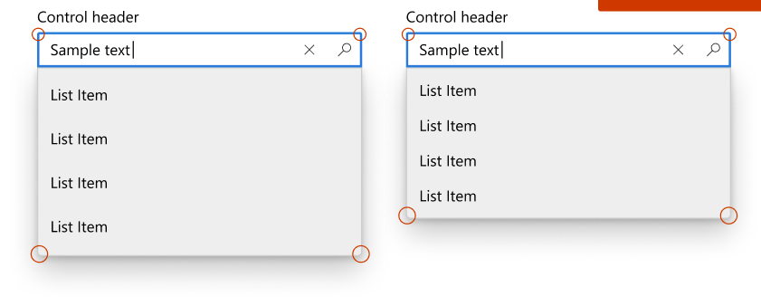
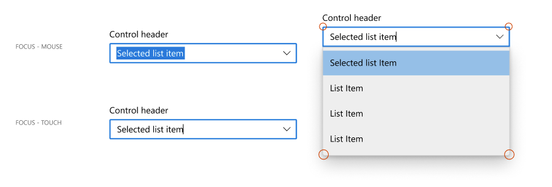

# Background

There are 2 controls that need to set CornerRadiusFilterConverter on certain states but we don't have corresponding visual state defined in markup. XAML is not lifted at this moment and we don't want touch the code in os to implement this feature.

 - AutoSuggestBox: No visual states for AutoSuggestList open/close in XAML.
 
 - ComboBox: We do have visual states for dropDown open/close, but the dropDown can open either up or down and there's no way to tell the opending direction from xaml.
 

# Description

Added AutoSuggestBoxHelper and ComboBoxHelper as attached properties to allow us register event handlers and update CornerRadius when state changes.

# API Details

```
namespace Microsoft.UI.Xaml.Controls
{
    [webhosthidden]
    [default_interface]
    runtimeclass AutoSuggestBoxHelper
    {
        static Windows.UI.Xaml.DependencyProperty ApplyDynamicCornerRadiusProperty{ get; };
        static void SetApplyDynamicCornerRadius(Windows.UI.Xaml.UIElement element, Boolean value);
        static Boolean GetApplyDynamicCornerRadius(Windows.UI.Xaml.UIElement element);
    };

    [webhosthidden]
    [default_interface]
    runtimeclass ComboBoxHelper
    {
        static Windows.UI.Xaml.DependencyProperty ApplyDynamicCornerRadiusProperty{ get; };
        static void SetApplyDynamicCornerRadius(Windows.UI.Xaml.UIElement element, Boolean value);
        static Boolean GetApplyDynamicCornerRadius(Windows.UI.Xaml.UIElement element);
    };

}
```

# Examples

```xaml
    <Style TargetType="AutoSuggestBox">
        ...
        <Setter Property="primitives:AutoSuggestBoxHelper.ApplyDynamicCornerRadius" Value="true"/>
        ...
    </Style>
```
```xaml
    <Style TargetType="ComboBox">
        ...
        <Setter Property="primitives:ComboBoxHelper.ApplyDynamicCornerRadius" Value="true"/>
        ...
    </Style>
```