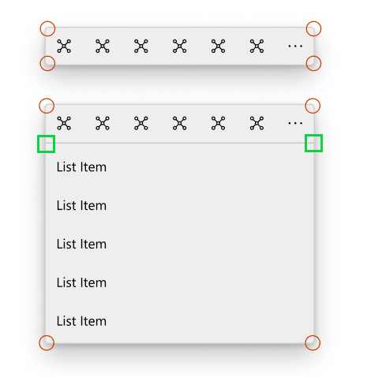

# Background

Some controls need to turn on/off part of their rounded corners depending on their states.

e.g. When CommandBarFlyout opens up its secondary menu, primary and secondary menus are clipped together we need to cear rounded corners on bottom of primary menu and top of secondary menu to close the gaps.



You can't set individual values of a CornerRadius object in markup according to our [doc](https://docs.microsoft.com/en-us/uwp/api/Windows.UI.Xaml.CornerRadius#notes-on-xaml-syntax). We need a way to get non-uniform corner radius values to implement the design above.
# Description

CornerRadiusFilterConverter helps us filter CornerRadius values on specific dirctions and set values to 0 for the rest.

# API Details

```
namespace Microsoft.UI.Xaml.Controls.Primitives
{
    [bindable]
    [webhosthidden]
    [default_interface]
    runtimeclass CornerRadiusFilterConverter : Windows.UI.Xaml.Data.IValueConverter
    {
        CornerRadiusFilterConverter();
    };
}
```

# Examples

```XAML
  <Border CornerRadius="{Binding Source={ThemeResource ControlCornerRadius}, Converter={StaticResource CornerRadiusFilterConverter}, ConverterParameter=Top}" />
```

# Remarks

Currently the ConverterParameter only accepts `Top`, `Bottom`, `Left` and `Right`. We can add more specific directions like `TopLeft` and `TopRight` in the future if there's a need.