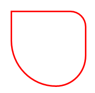
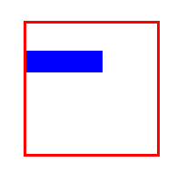

> See comments in Markdown for how to use this spec template


# Background

_This spec updates the existing [CornerRadiusToThicknessConverter](https://docs.microsoft.com/uwp/api/Microsoft.UI.Xaml.Controls.Primitives.CornerRadiusToThicknessConverter) class with new filters._

WinUI has a [CornerRadius](https://docs.microsoft.com/uwp/api/Windows.UI.Xaml.CornerRadius) struct that's used to define the rounding the 4 corners of a box, and the [Thickness](https://docs.microsoft.com/uwp/api/Windows.UI.Xaml.Thickness) struct that's used for defining the padding or margin around the 4 sides of a box.

CornerRadius defines the radius length of the circle segment that's used to draw a rounded corner. For example the following uses 4 different radii for the 4 corners (the corners are listed in clockwise order starting from the top left corner):

```xml
<Border CornerRadius="0,20,40,60" BorderBrush="Red" BorderThickness="2" Height="100" Width="100" />
```



Thickness defines 4 sides. For example the following uses 4 different values for the margins around a blue rectangle in a red box (the sides are listed in clockwise order starting from the left):

```xml
<Border BorderBrush="Red" BorderThickness="2" Height="100" Width="100" >
    <Rectangle Fill="Blue" Margin="0,20,40,60" />
</Border>
```



For consistency it's useful to be able to build a Thickness out of components of a CornerRadius. For this reason the [CornerRadiusFilterConverter](https://docs.microsoft.com/uwp/api/Microsoft.UI.Xaml.Controls.Primitives.CornerRadiusFilterConverter) exists, which can be used in Xaml markup. That converter has a [CornerRadiusFilterKind](https://docs.microsoft.com/uwp/api/Microsoft.UI.Xaml.Controls.Primitives.CornerRadiusFilterKind) that lets you define which parts to pull out, what's being added in this spec is update to that enum to allow more parts to be pulled out.

**Existing values:**
* FilterTopAndBottomFromLeft,
* FilterTopAndBottomFromRight,
* FilterLeftAndRightFromTop,
* FilterLeftAndRightFromBottom

**New values:**
* FilterTopFromTopLeft,
* FilterTopFromTopRight,
* FilterRightFromTopRight,
* FilterRightFromBottomRight,
* FilterBottomFromBottomRight,
* FilterBottomFromBottomLeft,
* FilterLeftFromBottomLeft,
* FilterLeftFromTopLeft,

The CornerRadiusFilterConverter is also updated with a new property -- Multiplier -- which is applied during the conversion. For example, setting this to -1 negates the value.

# Examples

This example creates a converter that creates a Thickness from a CornerRadius, where the Thickness is set to zeros except for its left, which uses the the left component of the corner's bottom/left, and then negates it. For example, this converts 

CornerRadius: `10, 20, 30, 40` 

Thickness: `-40, 0, 0, 0`

```xml
<CornerRadiusToThicknessConverter ConversionKind="FilterLeftFromBottomLeft" Multiplier="-1" x:Name='CornerRadiusToThickness1'/>
```

This converter can then be used elsewhere in Xaml:

```xml
<Path 
    Margin="{Binding Source={ThemeResource OverlayCornerRadius},
        Converter={StaticResource CornerRadiusToThickness1}}"
    Height="100"
    Margin="100"
    Fill="Red"
    Data="M4 0 L4 4 L0 4 A4,4 90 0 0 4 0 Z" /> 
```


# API Notes

## CornerRadiusToThicknessConverter.Multiplier property

Type: [Thickness](https://docs.microsoft.com/uwp/api/Windows.UI.Xaml.Thickness)

Multiplied to the value in the target Thickness. Defaults to (1,1,1,1)

This multiplier is a Thickness with left/top/right/bottom values, which are applied to the matching fields in the target. Note that in Xaml markup you can specify a single number and it's set to all 4 fields. For example the following sets the Multipler to (-1, -1, -1, -1):

```xml
Multipler = '-1'
```

## CornerRadiusToThicknessConverterKind enum    

**New values:**

| | |
| - | - |
| FilterTopFromTopLeft | Sets top from the top left corner |
| FilterTopFromTopRight | Sets the top from the top right corner |
| FilterRightFromTopRight | Sets the right from the top right corner |
| FilterRightFromBottomRight | Sets the right from the bottom right corner |
| FilterBottomFromBottomRight | Sets the bottom from the bottom right corner |
| FilterBottomFromBottomLeft | Sets the bottom from the bottom left corner |
| FilterLeftFromBottomLeft | Sets the left from the bottom left corner |
| FilterLeftFromTopLeft | Sets the left from the top left corner |

**Existing values:**

| | |
| - | - |
| FilterLeftAndRightFromBottom | |
| FilterLeftAndRightFromTop | |
| FilterTopAndBottomFromLeft | |
| FilterTopAndBottomFromRight | |

https://docs.microsoft.com/uwp/api/Microsoft.UI.Xaml.Controls.Primitives.CornerRadiusToThicknessConverterKind


# API Details

```cs

[webhosthidden]
[default_interface]
runtimeclass CornerRadiusToThicknessConverter : Windows.UI.Xaml.DependencyObject, Windows.UI.Xaml.Data.IValueConverter
{
    CornerRadiusToThicknessConverter();

    CornerRadiusToThicknessConverterKind  ConversionKind{ get; set; };
    static Windows.UI.Xaml.DependencyProperty ConversionKindProperty{ get; };

    // ** New **
    Thickness Multiplier{ get; set; };
    static Windows.UI.Xaml.DependencyProperty MultiplierProperty{ get; };
};

[webhosthidden]
enum CornerRadiusToThicknessConverterKind
{
  FilterTopAndBottomFromLeft,
  FilterTopAndBottomFromRight,
  FilterLeftAndRightFromTop,
  FilterLeftAndRightFromBottom,

  // New
  FilterTopFromTopLeft,
  FilterTopFromTopRight,
  FilterRightFromTopRight,
  FilterRightFromBottomRight,
  FilterBottomFromBottomRight,
  FilterBottomFromBottomLeft,
  FilterLeftFromBottomLeft,
  FilterLeftFromTopLeft,
};
```

