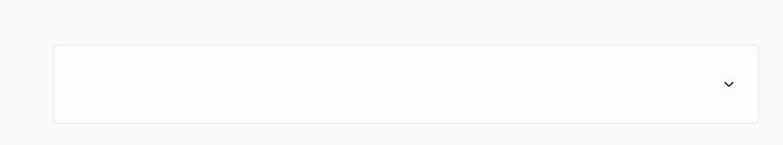
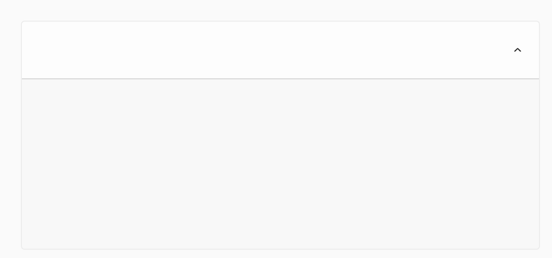
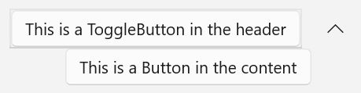

<!-- The purpose of this spec is to describe a new feature and
its APIs that make up a new feature in WinUI. -->

<!-- There are two audiences for the spec. The first are people
that want to evaluate and give feedback on the API, as part of
the submission process.  When it's complete
it will be incorporated into the public documentation at
docs.microsoft.com (http://docs.microsoft.com/uwp/toolkits/winui/).
Hopefully we'll be able to copy it mostly verbatim.
So the second audience is everyone that reads there to learn how
and why to use this API. -->

# Background
<!-- Use this section to provide background context for the new API(s) 
in this spec. -->

<!-- This section and the appendix are the only sections that likely
do not get copied to docs.microsoft.com; they're just an aid to reading this spec. -->

<!-- If you're modifying an existing API, included a link here to the
existing page(s) -->

<!-- For example, this section is a place to explain why you're adding this API rather than
modifying an existing API. -->

<!-- For example, this is a place to provide a brief explanation of some dependent
area, just explanation enough to understand this new API, rather than telling
the reader "go read 100 pages of background information posted at ...". -->
 > This spec corresponds to [this issue](https://github.com/microsoft/microsoft-ui-xaml/issues/3279) on the WinUI repo. 

Throughout Windows, different expander controls are used by various apps and surfaces. There’s currently no consistent way to address this common UX pattern. This control is needed for situations where expanding (instead of overlaying) content is needed.  An Expander control is motivated by its use in many app scenarios and supporting developers in migrating from [WPF](https://docs.microsoft.com/en-us/dotnet/desktop/wpf/controls/expander-overview?view=netframeworkdesktop-4.8) and [WCT](https://docs.microsoft.com/en-us/windows/communitytoolkit/controls/expander).  

# Description
<!-- Use this section to provide a brief description of the feature.
For an example, see the introduction to the PasswordBox control 
(http://docs.microsoft.com/windows/uwp/design/controls-and-patterns/password-box). -->
An Expander control is a UI component that provides a standard interaction for showing more content in a container that pushes adjacent content while expanding and collapsing. An Expander cannot be light dismissed and is independent of the contents inside it, including controls. Expander should be used when some content is only relevant some of the time (for example to read more information or access additional options for an item). 

# Examples
<!-- Use this section to explain the features of the API, showing
example code with each description. The general format is: 
  feature explanation,
  example code
  feature explanation,
  example code
  etc.-->
  
<!-- Code samples should be in C# and/or C++/WinRT -->

<!-- As an example of this section, see the Examples section for the PasswordBox control 
(https://docs.microsoft.com/windows/uwp/design/controls-and-patterns/password-box#examples). -->

## Create an Expander

XAML
~~~~
<muxc:Expander x:Name="SimpleExpander" />
~~~~
## Put controls inside an Expander

XAML
~~~~
<muxc:Expander x:Name="Expander2" IsExpanded="False" ExpandDirection ="Down">
    <muxc:Expander.Header>
        <ToggleButton>This is a ToggleButton in the header</ToggleButton>
    </muxc:Expander.Header>
    <muxc:Expander.Content>
        <Button>This is a Button in the content</Button>
    </muxc:Expander.Content>
</muxc:Expander>
~~~~

Updated pictures with final visuals to come. 

# API Notes
<!-- Option 1: Give a one or two line description of each API (type
and member), or at least the ones that aren't obvious
from their name.  These descriptions are what show up
in IntelliSense. For properties, specify the default value of the property if it
isn't the type's default (for example an int-typed property that doesn't default to zero.) -->

<!-- Option 2: Put these descriptions in the below API Details section,
with a "///" comment above the member or type. -->
## Notable Properties
| Name | Description | Default |
| :---------- | :------- | :------- |
| ExpandDirection | Sets the direction of expansion | Down = 0 |
| IsExpanded | Whether or not control is expanded | False |

## Events
| Name | Description | 
| :---------- | :------- | 
| Expanding | Occurs when expanded |
| Collapsed| Occurs when collapsed |

# API Details
<!-- The exact API, in MIDL3 format (https://docs.microsoft.com/en-us/uwp/midl-3/) -->
~~~~
enum ExpandDirection
{
    Down = 0,
    Up = 1
};

runtimeclass ExpanderExpandingEventArgs
{
}

runtimeclass ExpanderCollapsedEventArgs
{
}
 
unsealed runtimeclass Expander : Windows.UI.Xaml.Controls.ContentControl
{
    Expander();

    Object Header{ get; set; };
    Windows.UI.Xaml.DataTemplate HeaderTemplate{ get; set; };
    Windows.UI.Xaml.Controls.DataTemplateSelector HeaderTemplateSelector{ get; set; };

    [MUX_PROPERTY_CHANGED_CALLBACK(TRUE)]
    Boolean IsExpanded{ get; set; };

    [MUX_DEFAULT_VALUE("winrt::ExpandDirection::Down")]
    [MUX_PROPERTY_CHANGED_CALLBACK(TRUE)]
    ExpandDirection ExpandDirection{ get; set; };

    event Windows.Foundation.TypedEventHandler<Expander, ExpanderExpandingEventArgs> Expanding;
    event Windows.Foundation.TypedEventHandler<Expander, ExpanderCollapsedEventArgs> Collapsed;

    static Windows.UI.Xaml.DependencyProperty HeaderProperty{ get; };
    static Windows.UI.Xaml.DependencyProperty HeaderTemplateProperty{ get; };
    static Windows.UI.Xaml.DependencyProperty HeaderTemplateSelectorProperty{ get; };

    static Windows.UI.Xaml.DependencyProperty IsExpandedProperty{ get; };
    static Windows.UI.Xaml.DependencyProperty ExpandDirectionProperty{ get; };
}
~~~~

## Theme Resources

| Name| Description | 
| :---------- | :------- | 
| ExpanderHeaderBackground | Header background color| 
| ExpanderChevronBackground | Chevron background color| 
| ExpanderChevronForeground | Chevron foreground color| 
| ExpanderChevronMargin | Chevron margin thickness| 
| ExpanderChevronGlyph | Chevron glyph| 
| ExpanderChevronWidth | Chevron width|
| ExpanderPopinVerticalOffset | vertical offset for animation| 

# Inputs and Accessibility
## UI Automation Patterns
Expander will use a ExpandCollapsePattern. Expanding/Collapsing the expander will raise [RaisePropertyChanged](https://docs.microsoft.com/en-us/uwp/api/windows.ui.xaml.automation.peers.automationpeer.raisepropertychangedevent?view=winrt-19041) with the property changed being the [ExpandCollapseProperty](https://docs.microsoft.com/en-us/uwp/api/windows.ui.xaml.automation.expandcollapsepatternidentifiers.expandcollapsestateproperty?view=winrt-19041) property.

## Keyboard
* Tabbing brings focus to the Header, neither the entire Expander nor the chevron is a tab-stop
* When focus is on the Header, space key expands and collapse and focus does not move
* Keyboard navigation inside the Expander's Header/Content is based on the content inside them

## GamePad
The Expander can be expanded and collapsed with A. Spatial navigation will navigate between the content of the Expander. 

## Narrator
When focus is on the Header of an Expander, Narrator will announce "Expander collapsed" or "Expander expanded". With focus staying on the header, Narrator will then anounce "expanded" or "collapsed" accordingly. 

# Appendix
<!-- Anything else that you want to write down for posterity, but 
that isn't necessary to understand the purpose and usage of the API.
For example, implementation details. -->
