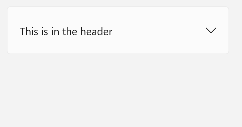

# Background

 > This spec corresponds to [this issue](https://github.com/microsoft/microsoft-ui-xaml/issues/3279) on the WinUI repo. 

Throughout Windows, different expander controls are used by various apps and surfaces.
There’s currently no consistent way to address this common UX pattern.
This control is needed for situations where expanding (instead of overlaying) content is needed.
An Expander control is motivated by its use in many app scenarios and supporting developers in migrating from
[WPF](https://docs.microsoft.com/en-us/dotnet/desktop/wpf/controls/expander-overview?view=netframeworkdesktop-4.8)
and [Windows Community Toolkit](https://docs.microsoft.com/en-us/windows/communitytoolkit/controls/expander).  

# API Pages

## Expander class

Represents the control that displays a header and a collapsible content area.

> Spec note: the Expander class and ExpandDirection enum names match WPF.

An Expander control is a UI component that provides a standard interaction for
showing more content in a container that pushes adjacent content while expanding and collapsing.
An Expander cannot be light dismissed and is independent of the contents inside it, including controls.
Expander should be used when some content is only relevant some of the time (for example to
read more information or access additional options for an item). 

### Examples

#### Create an Expander

XAML
~~~~
<muxc:Expander x:Name="DefaultExpander" 
    Header="This text is in the header" 
    Content="This is in the content"/>
~~~~

#### Put controls inside an Expander

XAML
~~~~
<muxc:Expander x:Name="Expander2" Header="This is in the header"> 
    <ToggleButton>This ToggleButton is in the Content</ToggleButton>
</muxc:Expander>
~~~~

Updated pictures with final visuals to come.

### Theme Resources

You can modify the look of an Expander by specifying Xaml resources in your app.
For more info, see the
[lightweight styling guide](https://docs.microsoft.com/en-us/windows/uwp/design/controls-and-patterns/xaml-styles#lightweight-styling).

| Name| Description | 
| :---------- | :------- | 
| ExpanderChevronMargin | Chevron margin thickness| 
| ExpanderChevronGlyph | Chevron glyph| 
| ExpanderChevronSize | Chevron size|
| ExpanderPopinVerticalOffset | vertical offset for animation| 

Some theme resources TBD.

## Expander members

### Properties

| Name | Description | Default |
| :---------- | :------- | :------- |
| ExpandDirection | Sets the direction of expansion | Down = 0 |
| IsExpanded | Whether or not control is expanded | False |

### Events
| Name | Description | 
| :---------- | :------- | 
| Expanding | Occurs when expanded |
| Collapsed| Occurs when collapsed |

# API Details

~~~~
enum ExpandDirection
{
    Down = 0,
    Up = 1
};

runtimeclass ExpanderExpandingEventArgs
{
}

runtimeclass ExpanderCollapsedEventArgs
{
}
 
unsealed runtimeclass Expander : Windows.UI.Xaml.Controls.ContentControl
{
    Expander();

    Object Header{ get; set; };
    Windows.UI.Xaml.DataTemplate HeaderTemplate{ get; set; };
    Windows.UI.Xaml.Controls.DataTemplateSelector HeaderTemplateSelector{ get; set; };

    [MUX_PROPERTY_CHANGED_CALLBACK(TRUE)]
    Boolean IsExpanded{ get; set; };

    [MUX_DEFAULT_VALUE("winrt::ExpandDirection::Down")]
    [MUX_PROPERTY_CHANGED_CALLBACK(TRUE)]
    ExpandDirection ExpandDirection{ get; set; };

    event Windows.Foundation.TypedEventHandler<Expander, ExpanderExpandingEventArgs> Expanding;
    event Windows.Foundation.TypedEventHandler<Expander, ExpanderCollapsedEventArgs> Collapsed;

    static Windows.UI.Xaml.DependencyProperty HeaderProperty{ get; };
    static Windows.UI.Xaml.DependencyProperty HeaderTemplateProperty{ get; };
    static Windows.UI.Xaml.DependencyProperty HeaderTemplateSelectorProperty{ get; };

    static Windows.UI.Xaml.DependencyProperty IsExpandedProperty{ get; };
    static Windows.UI.Xaml.DependencyProperty ExpandDirectionProperty{ get; };
}
~~~~

# Inputs and Accessibility

## UI Automation Patterns
Expander will use a ExpandCollapsePattern. Expanding/Collapsing the expander will raise [RaisePropertyChanged](https://docs.microsoft.com/en-us/uwp/api/windows.ui.xaml.automation.peers.automationpeer.raisepropertychangedevent?view=winrt-19041) with the property changed being the [ExpandCollapseProperty](https://docs.microsoft.com/en-us/uwp/api/windows.ui.xaml.automation.expandcollapsepatternidentifiers.expandcollapsestateproperty?view=winrt-19041) property.

## Keyboard
* Tabbing brings focus to the Header, neither the entire Expander nor the chevron is a tab-stop
* When focus is on the Header, space key expands and collapse and focus does not move
* Keyboard navigation inside the Expander's Header/Content is based on the content inside them

## GamePad
The Expander can be expanded and collapsed with A. Spatial navigation will navigate between the content of the Expander. 

## Screen reader
When focus is on the Header of an Expander, the screen reader will announce "Expander collapsed" or "Expander expanded". With focus staying on the header, the screen reader will then anounce "expanded" or "collapsed" accordingly. Expander should not have [focus engagement](https://docs.microsoft.com/en-us/windows/uwp/design/input/gamepad-and-remote-interactions#focus-engagement) enabled. 

<!-- # Appendix
<!-- Anything else that you want to write down for posterity, but 
that isn't necessary to understand the purpose and usage of the API.
For example, implementation details. --> 

# Open Questions
* How should properties from ContentControl (ex: Background, Foreground, FontSize) propagate?
