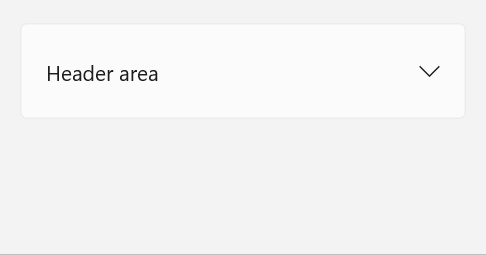

# Background

 > This spec corresponds to [this issue](https://github.com/microsoft/microsoft-ui-xaml/issues/3279) on the WinUI repo. 

Throughout Windows, different expander controls are used by various apps and surfaces.
There’s currently no consistent way to address this common UX pattern.
This control is needed for situations where expanding (instead of overlaying) content is needed.
An Expander control is motivated by its use in many app scenarios and supporting developers in migrating from
[WPF](https://docs.microsoft.com/en-us/dotnet/desktop/wpf/controls/expander-overview?view=netframeworkdesktop-4.8)
and [Windows Community Toolkit](https://docs.microsoft.com/en-us/windows/communitytoolkit/controls/expander).  

# API Pages

## Expander class

Represents the control that displays a header and a collapsible content area.

> Spec note: the Expander class and ExpandDirection enum names match WPF.

An Expander control is a UI component that provides a standard interaction for
showing more content in a container that pushes adjacent content while expanding and collapsing.
An Expander cannot be light dismissed and is independent of the contents inside it, including controls.
Expander should be used when some content is only relevant some of the time (for example to
read more information or access additional options for an item). 

# Examples
<!-- Use this section to explain the features of the API, showing
example code with each description. The general format is: 
  feature explanation,
  example code
  feature explanation,
  example code
  etc.-->
  
<!-- Code samples should be in C# and/or C++/WinRT -->

<!-- As an example of this section, see the Examples section for the PasswordBox control 
(https://docs.microsoft.com/windows/uwp/design/controls-and-patterns/password-box#examples). -->

## Create an Expander

### Examples

#### Create an Expander

XAML
~~~~
<muxc:Expander x:Name="DefaultExpander" 
    Header="Header area"  
    Content="Content area"/>
~~~~

## Put controls inside an Expander

=======

#### Put controls inside an Expander

XAML
~~~~
<muxc:Expander x:Name="Expander2" Header="This is in the header"> 
    <muxc:Expander.Header>
        <ToggleButton>This ToggleButton is in the Header</ToggleButton>
    </muxc:Expander.Header>
    <muxc:Expander.Content>
        <ToggleButton>This ToggleButton is in the Content</ToggleButton>
    </muxc:Expander.Content>
</muxc:Expander>
~~~~

Updated pictures with final visuals to come.

### Theme Resources

You can modify the look of an Expander by specifying Xaml resources in your app.
For more info, see the
[lightweight styling guide](https://docs.microsoft.com/en-us/windows/uwp/design/controls-and-patterns/xaml-styles#lightweight-styling).

| Name| Description | 
| :---------- | :------- | 
| ExpanderChevronMargin | Chevron margin thickness| 
| ExpanderChevronGlyph | Chevron glyph| 
| ExpanderChevronSize | Chevron size|
| ExpanderPopinVerticalOffset | vertical offset for animation| 

Some theme resources TBD.

## Expander members

### Properties

| Name | Description | Default |
| :---------- | :------- | :------- |
| Header | Gets or sets the content of the Header area | null | 
| ExpandDirection | Gets or sets the direction of expansion | Down = 0 |
| IsExpanded | Gets or sets whether or not control is expanded | False |
| HeaderTemplate | Gets or sets the DataTemplate to display the content of the control's header | null |
| HeaderTemplateSelector | Gets or Sets the DataTemplateSelector that enables custom template selection logic at the application level. | N/A |

### Events
| Name | Description | 
| :---------- | :------- | 
| Expanding | Occurs when expanding |
| Collapsed| Occurs when collapsing |

# API Details

~~~~
enum ExpandDirection
{
    Down = 0,
    Up = 1
};

runtimeclass ExpanderExpandingEventArgs
{
}

runtimeclass ExpanderCollapsedEventArgs
{
}
 
unsealed runtimeclass Expander : Windows.UI.Xaml.Controls.ContentControl
{
    Expander();

    Object Header{ get; set; };
    Windows.UI.Xaml.DataTemplate HeaderTemplate{ get; set; };
    Windows.UI.Xaml.Controls.DataTemplateSelector HeaderTemplateSelector{ get; set; };

    [MUX_PROPERTY_CHANGED_CALLBACK(TRUE)]
    Boolean IsExpanded{ get; set; };

    [MUX_DEFAULT_VALUE("winrt::ExpandDirection::Down")]
    [MUX_PROPERTY_CHANGED_CALLBACK(TRUE)]
    ExpandDirection ExpandDirection{ get; set; };

    event Windows.Foundation.TypedEventHandler<Expander, ExpanderExpandingEventArgs> Expanding;
    event Windows.Foundation.TypedEventHandler<Expander, ExpanderCollapsedEventArgs> Collapsed;

    static Windows.UI.Xaml.DependencyProperty HeaderProperty{ get; };
    static Windows.UI.Xaml.DependencyProperty HeaderTemplateProperty{ get; };
    static Windows.UI.Xaml.DependencyProperty HeaderTemplateSelectorProperty{ get; };

    static Windows.UI.Xaml.DependencyProperty IsExpandedProperty{ get; };
    static Windows.UI.Xaml.DependencyProperty ExpandDirectionProperty{ get; };
}
~~~~

## Theme Resources
You can modify the look of an Expander by specifying Xaml resources in your app. For more info, see the [lightweight styling guide](https://docs.microsoft.com/en-us/windows/uwp/design/controls-and-patterns/xaml-styles#lightweight-styling).

| Name| Description | Type |
| :---------- | :------- | :------- | 
| ExpanderChevronMargin | Sets the margin thickness for the chevron | Thickness |
| ExpanderChevronUpGlyph | Sets the default chevron glyph for ExpandDirection = Up | String | 
| ExpanderChevronDownGlyph | Sets the default chevron glyph for ExpandDirection = Down | String |
| ExpanderChevronSize | Sets the size of the chevron glyph | Double |
| ExpanderCornerRadius | Sets the corner radius in pixels | CornerRadius |
| ExpanderPopinVerticalOffset | Sets the vertical offset for animation | Double |
| ExpanderMinHeight | Sets the minimum height | Double |
| ExpanderPadding | Sets the padding thickness for Expander | Thickness |
| ExpanderHeaderPadding | Sets the padding thickness for the Header | Thickness |

### Under Discussion
The below properties are under discussion for how properties should propagate to Expander's Header and/or Content area.
| Name| Description | Type |
| :---------- | :------- | :------- | 
| Background | (currently) Sets the background color for the Header | Brush | 
| Foreground | (currently) Sets the foreground color for the Content | Brush | 
| FontSize | (currently) Sets the font size for the Content | Double |
| FontFamily | (currently) Sets the font family for the Content | Double |

#### Example showing these properties:

XAML
~~~~
<muxc:Expander x:Name="ExpanderWithStyleProperties" 
    Header="This is in the header"  
    Content="This is in the content" 
    Background="Cyan"/>
    Foreground="Magenta" 
    FontSize ="25" 
    FontFamily="Times New Roman" 
/>
~~~~
Some theme resources may change/update with updates to Expander.

# Inputs and Accessibility

## UI Automation Patterns
Expander will use a ExpandCollapsePattern. Expanding/Collapsing the expander will raise [RaisePropertyChanged](https://docs.microsoft.com/uwp/api/windows.ui.xaml.automation.peers.automationpeer.raisepropertychangedevent) with the property changed being the [ExpandCollapseProperty](https://docs.microsoft.com/uwp/api/windows.ui.xaml.automation.expandcollapsepatternidentifiers.expandcollapsestateproperty) property.

## Keyboard
* Tabbing brings focus to the Header, neither the entire Expander nor the chevron is a tab-stop
* After the Header is focused, any focusable content inside the Header is focused 
* When focus is on the Header, space key expands and collapse and focus does not move
* Keyboard navigation inside the Expander's Header/Content is based on the content inside them

## GamePad
The Expander can be expanded and collapsed with the A button. Spatial navigation will navigate between the content of the Expander. 

## Screen reader
When focus is on the Header of an Expander, the screen reader will announce the contents of the Header, then announce "Expander collapsed" or "Expander expanded". With focus staying on the header, the screen reader will then anounce "expanded" or "collapsed" accordingly. Within the Header or Content areas the screen reader will announce the content a developers has put inside. Expander should not have [focus engagement](https://docs.microsoft.com/en-us/windows/uwp/design/input/gamepad-and-remote-interactions#focus-engagement) enabled. 

# Appendix
<!-- Anything else that you want to write down for posterity, but 
that isn't necessary to understand the purpose and usage of the API.
For example, implementation details. --> 

# Open Questions
* How should properties from ContentControl (ex: Background, Foreground, FontSize) propagate?
* Should ExpandDirection actually be ExpanderExpandingDirection?
* Should Content default to HorizontalAlignment = Left? (See [discussion from XCG PR](https://microsoft.visualstudio.com/OS/_workitems/edit/28578487))
