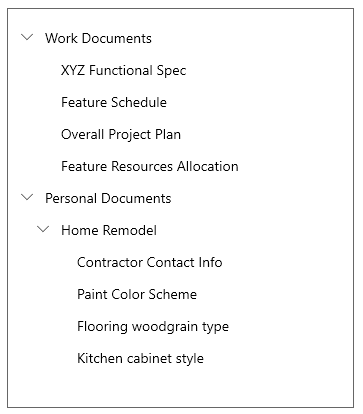

# Background

To easily track selection in nested collections, we need an object that we can use to uniquely identify an item in nested collections.
This can be done with the IndexPath.

# Description

The `IndexPath` class provides indexing of nested collections, for example in a TreeView.

# Examples

In the tree below, using the following IndexPath 
```c#

var indexPath = IndexPath.CreateFromIndices(new List<int>{ 1, 0, 3 });

```
 would select the item "Kitchen cabinet style", since it is in the second group of first nesting level, first group in the second level of nesting and is the fourth element in the last nesting level.



### Creating IndexPath objects
New IndexPaths objects can be created using the static `IndexPath.CreateFrom` and `IndexPath.CreateFromIndices` methods:

```csharp

// Points to the third element in a flat collection
var simplePath = IndexPath.CreateFrom(2);

// This is the same IndexPath as "simplePath"
var simplePathIndices = IndexPath.CreateFromIndices(new List<int>(){ 2 });

// This will point to the third child of the second element in a nested collection
var groupedPath = IndexPath.CreateFrom(1,2);

// The following IndexPath is equivalent to "groupedPath"
var groupedPathIndices = IndexPath.CreateFromIndices(new List<int>(){ 1, 2 });

```

### Comparing two IndexPaths
Comparing two `IndexPath` objects can be done using the `CompareTo` function:

```c#
var baseIndexPath = IndexPath.CreateFromIndices(new List<int> { 1, 4, 2 });

var shorterPath = IndexPath.CreateFrom(2, 0);

// Since shorterPath takes second element of first nesting, it is "greater" than baseIndexPath
Assert.AreEqual(1, shorterPath.CompareTo(baseIndexPath));


var sameLengthPath = IndexPath.CreateFromIndices(new List<int> { 1, 0, 1 });

// Since sameLength path enters before baseIndexPath on the second level, it is smaller than basePath
Assert.AreEqual(-1, sameLengthPath.CompareTo(baseIndexPath));


var baseIndexPathCopy = IndexPath.CreateFromIndices(new List<int> { 1, 4, 2 });
// Those two are the same, and thus CompareTo returns 0
Assert.AreEqual(0, baseIndexPathCopy.CompareTo(baseIndexPath));
```

# API Notes

| Function | Description |
|-|-|
|Int32 GetSize()| Returns the size of the IndexPath. |
|Int32 GetAt(Int32 index)| Returns the index for a given nesting level. |
| Int32 CompareTo(IndexPath other)| Compares the IndexPath to a different IndexPath. If the other IndexPath is behind the current IndexPath, the method returns -1, if the other IndexPath is before the current IndexPath it returns 1. In case of equality this method returns 0. |
| static IndexPath CreateFrom(Int32 index) | Creates an IndexPath that only consists of the index provided. |
| static IndexPath CreateFrom(Int32 groupIndex, Int32 itemIndex) | Creates an IndexPath with the given group index and item index for the given group. |
| static IndexPath CreateFromIndices(IVector<Int32> indices) | Creates an IndexPath from the given list of integers.

# API Details

```c++
[WUXC_VERSION_MUXONLY]
[webhosthidden]
runtimeclass IndexPath : Windows.Foundation.IStringable
{
    Int32 GetSize();
    Int32 GetAt(Int32 index);
    Int32 CompareTo(IndexPath other);

    [default_overload] [method_name("CreateFrom")]
    static IndexPath CreateFrom(Int32 index);
    [method_name("CreateFromGroupAndItemIndex")]
    static IndexPath CreateFrom(Int32 groupIndex, Int32 itemIndex);
    static IndexPath CreateFromIndices(Windows.Foundation.Collections.IVector<Int32> indices);
}
```

# Appendix

Currently we use a `Vector<int>` to store those indices. Since we don't have any operations that would modify the size of an IndexPath, that is how many nesting levels it works with, shouldn't we switch to an array to increase performance?
