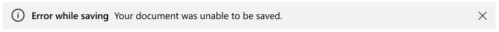
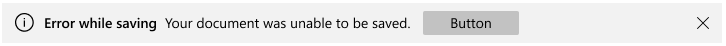
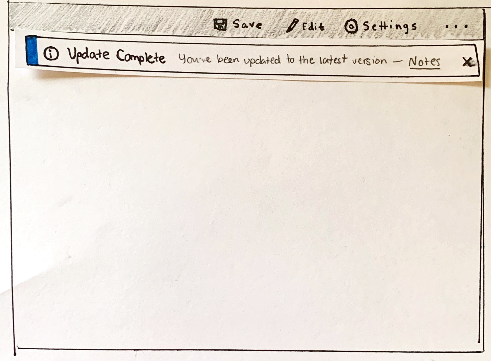
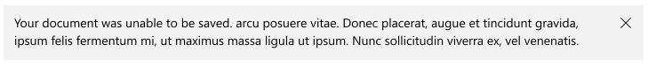
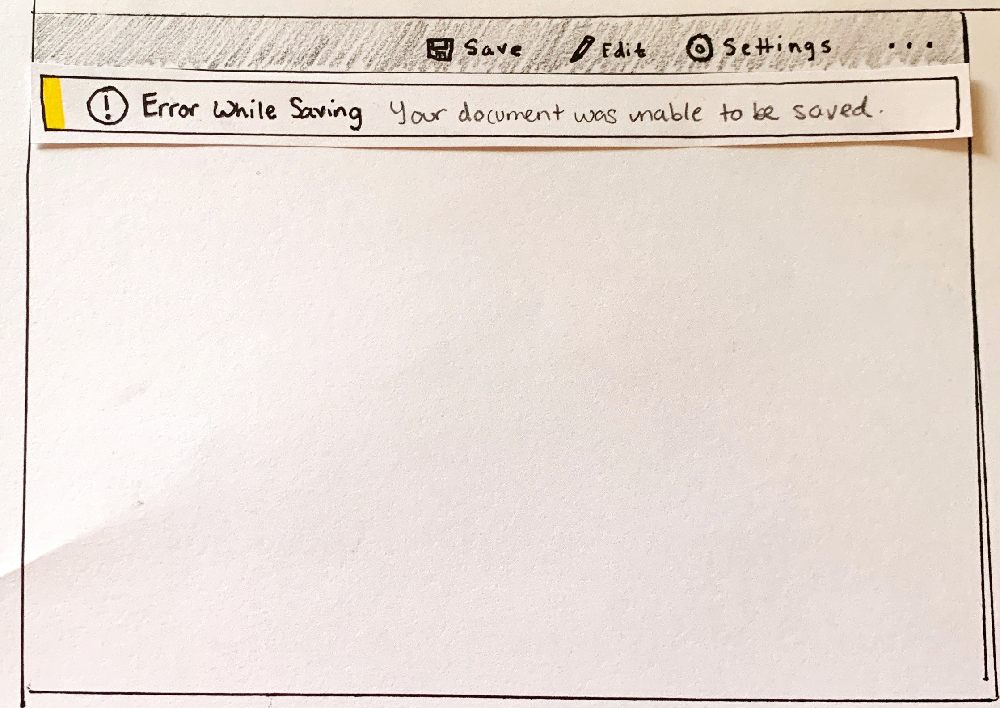
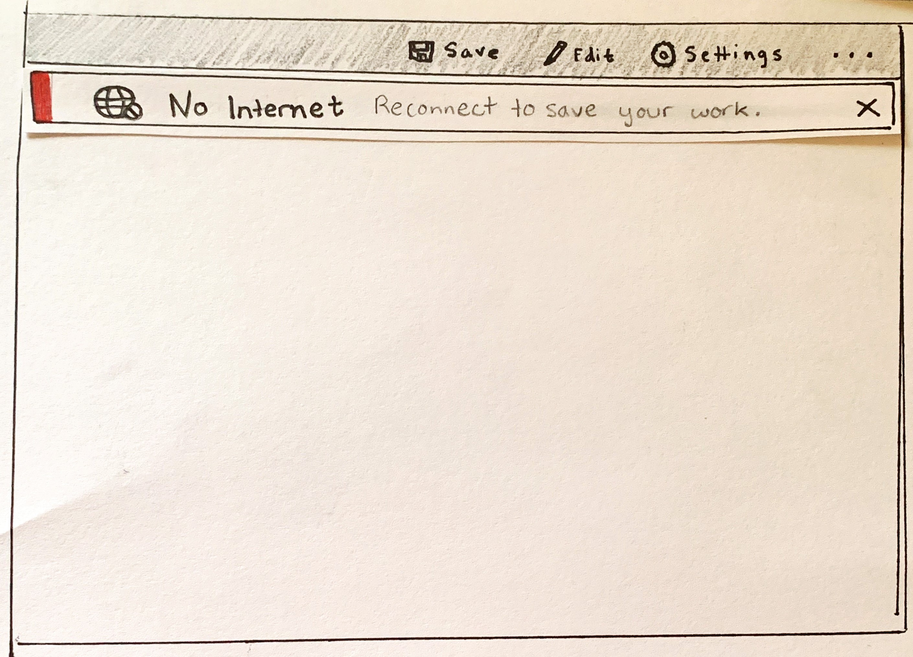
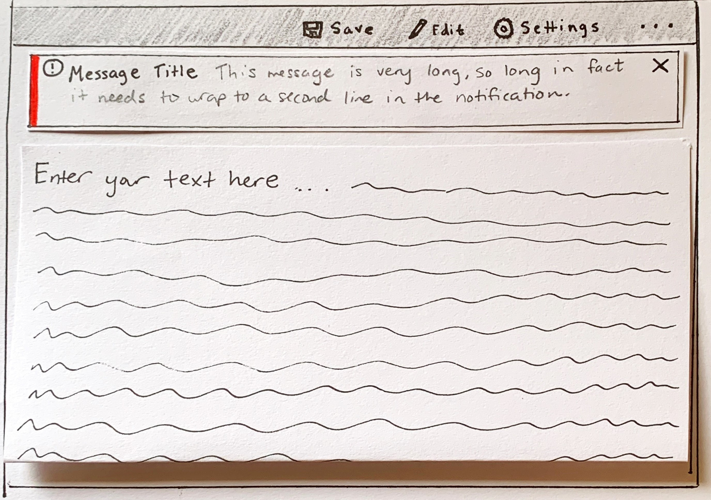

# Background
> This spec corresponds to [issue 913](https://github.com/microsoft/microsoft-ui-xaml/issues/913) on the WinUI repo.

Users should be informed about essential status changes that occur on an app level.
These status changes affect the app as a whole and can be either critical or informational.
Critical status changes like lost internet connectivity are directly impactful to app functionality while informational status changes like an update has completed and been applied are indirectly impactful to app functionality.
These notifications and corresponding information should be presented in a consistent, predictable, and relevant way to the user depending on the specific scenario.

Currently, Teaching Tip, Content Dialog, and customizations of other flyouts and dialogs exist as options to show these notifications but these controls were not specifically designed to handle app-wide status change notifications. 
Due to their visual layouts, inherent intrusiveness, or available features they are not sufficient for displaying notifications at an app-wide level.

# Description

An InfoBar is a persistent, actionable, app-wide notification intended for displaying critical or informational status messages that impact app perception or user experience.

## Is this the right control?
Use an InfoBar control when a user needs to be informed of, acknowledge, or take action on a message. By default the notification will remain in the content area until dismissed by the user but will not necessarily break user flow.

Do not use an InfoBar control to confirm or respond directly to a user action, for transient alerts, or for non-essential messages.

### Scenarios
Use an InfoBar that dismiss via the user or when the status is resolved for scenarios that **directly** impact app perception or experience ⚠

- Internet connectivity lost
- Error while saving a document when triggered automatically, not related to specific user action
- No microphone plugged in when attempting to record
- Can't connect to your phone
- The subscription to the application is expired

Use an InfoBar that dismiss via the user or a timer for scenarios that **indirectly** impact app perception or experience ℹ

- A call has begun recording
- Update applied with link to 'Release Notes'
- The terms of service have been updated and require acknowledgement
- An app-wide backup has successfully, asynchronously completed
- The subscription to the application is close to expiring


### When should a different control be used?

There are some scenarios where a Content Dialog, Flyout, or Teaching Tip may be more appropriate to use.

- For scenarios where a persistent notification is not needed, i.e. displaying information in context of a specific UI element, a [Flyout](https://docs.microsoft.com/en-us/windows/uwp/design/controls-and-patterns/dialogs-and-flyouts/flyouts) is a better option. 
- For scenarios where the application is confirming a user action, showing information the user ***must*** read, use a [Content Dialog](https://docs.microsoft.com/en-us/windows/uwp/design/controls-and-patterns/dialogs-and-flyouts/dialogs).
  - Additionally, if a status change to the app is so severe that it needs to block all further ability for the user to interact with the app, use a Content Dialog.
- For scenarios where the application is informing the user of a new feature or walking through its use, a [Teaching Tip](https://docs.microsoft.com/en-us/windows/uwp/design/controls-and-patterns/dialogs-and-flyouts/teaching-tip) is a better option.

For more info about choosing the right notification control, see the [Dialogs and Flyouts](https://docs.microsoft.com/en-us/windows/uwp/design/controls-and-patterns/dialogs-and-flyouts/) article.

# Examples

An information bar can have several configurations, here are some notable ones.

When an information bar is conveying information of a common criticality, a notification can be set to have one of many NotificationTypes to use consistent Fluent styling for it's identifiers.



If a call to action is needed, an information bar can have customizable action or hyperlink buttons.


The information bar can also be customized with its optional properties and with XAML Content to include extra buttons and other UI elements.



Mockup with custom XAML content to be added.

## Create an InfoBar

The XAML below describes an inline InfoBar with the default styling for a critical notification. An information bar can be created anywhere in the element tree or code behind. In this example, the notification is located in a ResourceDictionary, expanding to fill the width of the stack panel.

XAML
```xml
<StackPanel x:Name="ContentArea" Content="Document">
    <controls:InfoBar x:Name="UnsuccessfulSaveNotification"
        Severity="Warning"
        Title="Error while saving"
        Message="Your document was unable to be saved.">
    </controls:InfoBar>
</StackPanel>
```

C#
```C#
public MainPage()
{
    this.InitializeComponent();

    if(!SaveSuccessful())
    {
        UnsuccessfulSaveNotification.IsOpen = true;
        SetHaveDisplayedErrorNotification();
    }
}
```

Here is the visual representation of the information bar in the page.


## Notification types: consistent styling
The type of the info bar can be set via the Severity property to automatically set a consistent status color and icon dependent on the criticality of the notification.

Mockups in various Severities to be added.


## Programmatic dismiss in info bar
An info bar can be dismissed by the user via the close button or programmatically. If the notification is required to be in view until the status is resolved and you would like to remove the close button from view, you can set the IsCloseButtonVisible property to false.
By default, the close button will appear as an 'X' and the IsCloseButtonVisible property is therefore set to true.


XAML
```xml
<StackPanel x:Name="ContentArea" Content="Document">
    <controls:InfoBar x:Name="UnsuccessfulSaveNotification"
        Severity="Warning"
        Title="Error while saving"
        Message="Your document was unable to be saved."
        IsCloseButtonVisible="False">
    </controls:InfoBar>
</StackPanel>
```

Mockup with no close button to be added.

## Custom styling: status color and icon
Outside of the pre-defined notification types, the StatusColor and IconSource properties can be set to customize the styling. 

A custom background color can be set via the StatusColor property and will override the color set by a Severity if it is defined. Please keep in mind content readability and accessibility when setting your own color.

Alongside color, a custom icon can appear left of the Title and Message in the InfoBar. If a default styling is chosen, most styles have an associated icon already defined. This icon can be removed or added as a custom icon using the IconSource property. Recommended icon sizes include (TBD)px.

XAML
```xml
<StackPanel x:Name="ContentArea" Content="Document">
    <controls:InfoBar x:Name="ConnectionErrorNotification"
        Title="No Internet"
        Message="Reconnect to save your work.">
        <controls:InfoBar.IconSource>
            <controls:SymbolIconSource Symbol="NetworkOffline" />
        </controls:InfoBar.IconSource>
        <controls:InfoBar.StatusColor>
            <Color x:Key="Maroon">#800000</Color>
        </controls:InfoBar.StatusColor>
    </controls:InfoBar>
</StackPanel>
```




Mockup with custom background color and icon to be added.

## Add buttons
By default, an 'X' close button will appear as the right most component in the bar.

An additional action button can be added by setting the ActionButtonContent and ActionButtonCommand properties. There is also built-in support for a single hyperlink button to ensure text contrast remains accessible with the various background colors. We recommend that only a single action button or hyperlink button is set. Additional action buttons and hyperlinks can be added via custom content.

XAML
```xml
<StackPanel x:Name="ContentArea" Content="Document">
    <controls:InfoBar x:Name="ConnectionErrorNotification"
        Title="Error while saving"
        Message="Your document was unable to be saved."
        ActionButtonContent="Button"
        ActionButtonCommand="RedirectToNetworkSettings">
    </controls:InfoBar>
</StackPanel>
```


XAML
```xml
<StackPanel x:Name="ContentArea" Content="Document">
    <controls:InfoBar x:Name="ConnectionErrorNotification"
        Title="Error while saving"
        Message="Lorem ipsum long message">
        <controls:InfoBar.HyperlinkButtonContent
            Content="www.microsoft.com" 
            NavigateUri="http://www.microsoft.com"/>
    </controls:InfoBar>
</StackPanel>
```


## Custom content
Content can be added to an InfoBar using the Content property. If there is more content to show than what the size of an InfoBar will allow, a scrollbar will be automatically enabled to allow a user to scroll the content area.

XAML
```xml
<StackPanel x:Name="ContentArea" Content="Document">
    <controls:InfoBar x:Name="RecentUpdateNotification"
        Severity="Informational"
        Title="Update Complete!"  
            <TextBlock Text="You've been updated to the latest version &#8211;">
                <Hyperlink
                    Content="Notes"
                    NavigateUri="https://www.microsoft.com/app/releasenotes" />
            </TextBlock>
    </controls:InfoBar>
</StackPanel>
```


Mockup with custom content to be added.

## Content wrapping
By default, the text set in the Message property will wrap vertically in the control underneath the other visual components. 
If the height of the InfoBar is explicitly set, a scroll bar will be added for users to view the content.

XAML
```xml
<StackPanel x:Name="ContentArea" Content="Document">
    <controls:InfoBar x:Name="DefaultCriticalNotification"
        Severity="Critical"
        Title="Message Title"  
        Message="This message is very long, so long in fact it needs to wrap to a second line in the notification">
    </controls:InfoBar>
</StackPanel>
```




## Canceling and deferring close
The Closing event can be used to cancel and/or defer the close of an InfoBar. This can be used to keep the InfoBar open or allow time for an action or custom animation to occur. When the closing of an InfoBar is canceled, IsOpen will go back to true, however, it will stay false during the deferral. A programmatic close can also be canceled.

XAML
```xml
<controls:InfoBar x:Name="UpdateAvailable"
    Title="Update Available"
    Message="Please close this tip to apply required security updates to this application"
    Closing="InfoBar_Closing>
</controls:InfoBar>
```
C#
```C#
public void InfoBar_Closing(InfoBar sender, InfoBarClosingEventArgs args)
{
    // if scenario failed
    args.Cancel = true;
}
```

# Inputs and Accessibility
## UI Automation Patterns 

InfoBar will be Pane for inline notifications with IScrollProvider for the (conditionally) scrollable content area within the notification. 

InfoBar will implement a custom "information" Landmark.


### Keyboard Navigation 

| State | Action |
|:---|:---|
| Notification appears | No action is needed invoke the notification. <br><br> Enter: If notification is docked, InfoBar can receive focus with enter. |
| Notification receives focus | Tab: <br> If Narrator is active, InfoBar will automatically be added to the top of Narrator navigation stops thanks to its UI Automation Pattern(s), similar to popups or ContentDialog, and can be accessed via tabbing. <br><br> Enter: <br> If Narrator is not active, pressing enter will focus in and out of the InfoBar after navigating to it via tabbing.|
| Notification is tabbed through | Tab Button: <br> Will go through all actionable items, regardless of group, in order. When tab is pressed on the last element in the notification, focus will cycle to the first element in the notification.  <br> <br> Left + Right Arrow Keys: <br> Can be used to navigate between the footer Action and Close buttons if both are present. <br><br> Escape: <br> Will not close the InfoBar and will instead bubble up to the parent components. |
| Notification is dismissed | 1. X Button is pressed. <br> 2. Action Button is pressed. <br><br> * Tab increments focus to the next element but does not close the notification. |

### Narrator

InfoBar will leverage the existing APIs used by Windows Notifications.

| State | Action |
|:---|:---|
| Notification appears | Narrator will say "Click Up to move to new information from" + App Name + Notification Contents | 
| Notification receives focus | Ctrl + Narrator + Up arrow: <br> Will move focus to notification and Narrator will read the element in focus. |
| Notification is tabbed through | Tab Button: <br> Will navigate through all actionable items, regardless of group, in order. When tab is pressed on the last element in the notification, focus will cycle to the first element in the notification.  <br> <br> Swipe (for touch screen devices): <br> Will navigate through all actionable items, regardless of group, in order. When Swiping on the last element in the notification, focus will move to Narrator's fullscreen invisible Close Button and the user may double tap the screen to close the window. Swiping again will move focus out of the notification. <br><br> Left + Right Arrow Keys: <br> Can be used to navigate between the footer Action/Hyperlink and Close buttons if both are present. <br><br> Escape: <br> Will not close the InfoBar and will instead bubble up to the parent components. |
| Notification is dismissed | 1. Header Close Button is invoked. <br> 2. Action Button is invoked. <br> 3. Swipe (for touch screen devices) moves focus to Narrator's fullscreen invisible Close Button and the user double taps the screen to close the window. * Tab increments focus to the next element but does not close the notification. |

### Gamepad

| State | Action |
|:---|:---|
| Notification appears | No action is needed invoke the notification. |
| Notification receives focus | Spatial navigation: <br> Spatial navigation may be used to access the InfoBar. Guidance will be added to advise proper design consideration for InfoBar accessibility and testing for gamepad. |
| Notification is navigated | Spatial navigation: <br> Will spatially navigate focus across actionable items (without respect to group).  <br> <br> A Button: <br> Will interact with the item in focus, such as "press" the action or close button. <br><br> B Button: <br> Will not close the InfoBar and will instead bubble up to the parent components. |
| Notification is dismissed | 1. Header "X" Close Button is pressed. <br> 2. Action Button is pressed. <br> 3. B Button returns focus to the element previously in focus. |

## Enter and Exit Usability
### Flashing notifications
The InfoBar should not appear and disappear from view rapidly to prevent flashing on the screen. Avoid flashing visuals for people with photosensitivities. 

For notifications that automatically enter and exit the view via an app status condition, we recommend you include logic in your application to prevent a notification from appearing or disappearing rapidly or multiple times in a row. However, in general, this control should be used for long-lived status messages.

### Inline notifications offsetting content
For notifications that are inline with other UI content, keep in mind how the rest of the page will responsively react to the addition of the element.

Notifications with a substantial height could dramatically alter the layout of the other elements on the page. 
If the notification appears or disappears rapidly, especially in succession, the user may be confused with the changing visual state.

# Globalization and Localization

## Color and Icon
When customizing the color and icon outside of the preset Severity levels, keep in mind user expectations for the connotations from the set of standard icons and colors.

Additionally, the preset Severity colors have already been designed for theme changes, high-contrast mode, color confusion accessibility, and contrast with foreground colors. We recommend to use these colors when possible and to include custom logic in your application to adapt to the various color states and accessibility.

Please view the UX guidance for [Standard Icons](https://docs.microsoft.com/en-us/windows/win32/uxguide/vis-std-icons) and [Color](https://docs.microsoft.com/en-us/windows/win32/uxguide/vis-color) to ensure your message is communicated clearly and accessible to users.

### Severity
 Avoid setting the Severity property for a notification that does not match the information communicated in the Title, Message, or custom content.
 
 The accompanying information should aim to communicate the following to use that Severity.
 - Error: An error or problem that has occurred.
 - Warning: A condition that might cause a problem in the future.
 - Success: A long-running and/or background task has completed
 - Default: Useful information.

Icons and color should not be the only UI components signifying meaning for your notification. Text in the notification's Title and/or Message should be included to display information.

## Message 

Text in your notification will not be a constant length in all languages. For the Title and Message property this may impact whether your notification will expand to a second line. 
We recommend you avoid positioning based on message length or other UI elements set to a specific language.

The notification will follow standard mirroring behavior when localized to/from languages that are right to left (RTL) or left to right (LTR). The icon will not mirror unless there is directionality. 

Please view the guidance for [Adjust layout and fonts, and support RTL](https://docs.microsoft.com/en-us/windows/uwp/design/globalizing/adjust-layout-and-fonts--and-support-rtl) for more information about text localization in your notification.

# Remarks
## Usage Recommendations

### When to show an information bar?
An InfoBar should be shown when the state of the application is different from typical, expected functionality or when the user **needs** to acknowledge or potentially react to the presented information.

Recommended patterns for critical notifications where the application is in a negatively altered state
  - Example: Internet connectivity is required for the application to function and is not present
    - A critical information bar should remain in view until the connection is restored if most functionality is unavailable.
    - If some app functionality is possible, a critical information bar should appear and able to be dismissed by the user.
    - If/when the internet is restored the existing notification should update if it exists, and a new one should be created if the previous one had been dismissed. THe new/updated success-styled InfoBar should inform the user that "Internet is reconnected" so that they are aware app functionality is restored.
  - Example: The user's subscription to your application has expired and many features are deactivated
    - A critical information bar could remain in view with a potential action button to resubscribe.
    - Another option is to allow the user to dismiss a default-style InfoBar depending on how vital a subscription is to your application.

Recommended patterns for informational notifications where the user needs to view or react to essential information
 - Example: Terms and Conditions of the application have been updated and need to be acknowledged for continued use
   - A default information bar could appear notifying the user the T&C have updated and link to the contents. The user acknowledges these updated T&C through dismissing the notification.
 - Example: A virus scan that was running in the background of your application has completed
   - A success-styled information bar could appear notifying the user the scan has completed and direct them to view the results.

 Note: Users should **always** have the option to dismiss informational notifications.

# API Notes

### Notable Properties  

| Name | Description |
|:-:|:--|
| Severity | Gets or sets a value that indicates the  color and icon to style the InfoBar |
| IsCloseButtonVisible| Gets or sets a boolean that indicates whether a close button will appear


### Events  
| Name | Description |
|:-:|:--|
| ActionButtonClick | Occurs after the action button has been tapped. |
| CloseButtonClick | Occurs after the close button has been tapped. |
| Closed | Occurs after the information bar is closed. |
| Closing |Occurs just before the information bar begins to close. |

# Detailed Design

TBD: Include screenshots of specific designs as the next iteration after the paper mockups.
Includes specifics like:

- Default sizing of notifications (px)
- Exact colors for the different severity levels
- Exact width of color area (px)
- Margins, padding, etc.
- Text info; font, color, boldness, etc.

# API Details

```c++
enum InfoBarCloseReason
{
    CloseButton,
    Programmatic,
};

enum NotificationType
{
    Default,
    Warning,
    Error,
    Success,
}

runtimeclass InfoBarClosedEventArgs
{
    InfoBarCloseReason Reason{ get; };
};

runtimeclass InfoBarClosingEventArgs
{
    InfoBarCloseReason Reason{ get; };
    Boolean Cancel;
};

runtimeclass CloseButtonClickEventArgs
{
    Boolean IsHandled;
}

// will edit post prototype implementation
unsealed runtimeclass InfoBarTemplateSettings : Windows.UI.Xaml.DependencyObject
{
    InfoBarTemplateSettings();

    Windows.UI.Xaml.Thickness TopRightHighlightMargin;
    Windows.UI.Xaml.Thickness TopLeftHighlightMargin;

    Windows.UI.Xaml.Controls.IconElement IconElement;

    TBD ActualStatusColor; 

    static Windows.UI.Xaml.DependencyProperty TopRightHighlightMarginProperty{ get; };
    static Windows.UI.Xaml.DependencyProperty TopLeftHighlightMarginProperty{ get; };
    static Windows.UI.Xaml.DependencyProperty IconElementProperty{ get; };
    static TBD ActualStatusColor;
}

unsealed runtimeclass InfoBar : Windows.UI.Xaml.Controls.ContentControl
{
    InfoBar();

    String Title;
    String Message;

    Boolean IsOpen;
    Boolean IsCloseButtonVisible;
    Boolean ShowCloseButton;

    Object ActionButtonContent;
    Windows.UI.Xaml.Style ActionButtonStyle;
    Windows.UI.Xaml.Input.ICommand ActionButtonCommand;
    Object ActionButtonCommandParameter;

    Windows.UI.Xaml.Input.ICommand CloseButtonCommand;
    Object CloseButtonCommandParameter;

    Windows.Ui.Xaml.Controls.HyperlinkButton HyperlinkButtonContent;
    Windows.UI.Xaml.Style HyperlinkButtonStyle

    NotificationType Severity;
    Color StatusColor;
    IconSource IconSource;

    InfoBarTemplateSettings TemplateSettings{ get; };

    event Windows.Foundation.TypedEventHandler<InfoBar, Object> ActionButtonClick;
    event Windows.Foundation.TypedEventHandler<InfoBar, Object> CloseButtonClick;
    event Windows.Foundation.TypedEventHandler<InfoBar, Object> HyperlinkButtonClick;
    event Windows.Foundation.TypedEventHandler<InfoBar, InfoBarClosingEventArgs> Closing;
    event Windows.Foundation.TypedEventHandler<InfoBar, InfoBarClosedEventArgs> Closed;

    static Windows.UI.Xaml.DependencyProperty IsOpenProperty{ get; };

    static Windows.UI.Xaml.DependencyProperty TitleProperty{ get; };
    static Windows.UI.Xaml.DependencyProperty MessageProperty{ get; };

    static Windows.UI.Xaml.DependencyProperty ActionButtonContentProperty{ get; };
    static Windows.UI.Xaml.DependencyProperty ActionButtonStyleProperty{ get; };
    static Windows.UI.Xaml.DependencyProperty ActionButtonCommandProperty{ get; };
    static Windows.UI.Xaml.DependencyProperty ActionButtonCommandParameterProperty{ get; };

    static Windows.UI.Xaml.DependencyProperty CloseButtonCommandProperty{ get; };
    static Windows.UI.Xaml.DependencyProperty CloseButtonCommandParameterProperty{ get; };

    static Windows.UI.Xaml.DependencyProperty HyperlinkButtonContentProperty{ get; };
    static Windows.UI.Xaml.DependencyProperty HyperlinkButtonStyleProperty{ get; };

    static Windows.UI.Xaml.DependencyProperty NotificationTypeProperty{ get; };
    static Windows.UI.Xaml.DependencyProperty StatusColorProperty{ get; };
    static Windows.UI.Xaml.DependencyProperty IconSourceProperty{ get; };

    static Windows.UI.Xaml.DependencyProperty TemplateSettingsProperty{ get; };
}
```
# Appendix

### Design References

UI Elements for InfoBar


### Visual Components

 | Component |  Notes |
|:---:|:---|
| Container | - We recommend to place InfoBars in a layout control where the control can expand horizontally to the width of the content area.
| Title | - Semi-bolded and appears left of the Icon <br> - Recommended to be 50 characters or less
| Message | - Will appear to the right of the Title in single-height notifications, otherwise will be on a new line <br> - Recommended to be 512 characters or less
| Hyperlink | - Will appear to the right of the Message in single-height notifications, otherwise will be on a new line <br> - TBD: Color of the hyperlink will adapt to user theme and Severity level of control.
| StatusColor | - Defined by either the Severity or by setting a custom Color
| Icon | - Defined by either the Severity or by IconSource <br>
| Close button | - Will appear as 'X' by default <br> - Can be removed via IsProgrammaticDismissal
| Action button | - Optional <br> - Additional action buttons may be added through custom XAML content
| Content | - Can be customizable to include text, hyperlinks, and any other XAML content <br> - Appears between the Title/Message and any Action or Close buttons

## Behavioral Components
 | Property | Notes |
|:---:|:---|
| Opening | - An information bar is shown by setting its IsOpen property to true. |
| Closing | There are two ways an information bar can close: <br>- The program sets the IsOpen property to false <br> - The user invokes the Close button. <br> Use the InfoBarCloseReason to determine which case has occurred. <br> Closing can be prevented by setting the Cancel property to true. You can use a deferral to respond asynchronously to the event. |
| Motion | - Information bars have built in open and close animations that can be customizable using Storyboards.|

## Data and Intelligence Metrics
Recommendations from ryandemo:
- How many buttons included correlated to criticality of status message
- Track popularity of each layout mode
- Average length of time the notifications display on screen until dismissal, correlated to criticality
- How often color and/or icon customization Occurs
- How often multiple information bars appear at once and the typical distribution

## Intended features for InfoBar v2
- Built-in support for floating notifications, DisplayMode property to switch between "Docked" (current) and "Floating" mode
  - Options to show the InfoBar as a PopUp with simple positioning properties
- Positioning and re-positioning for multiple notifications
  - i.e. providing a built-in way to support a group of notifications in the bottom right corner
- Truncation option that allows the user to expand and collapse an InfoBar with multiple lines of content
