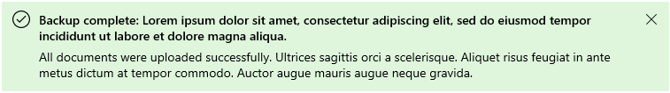

# Background
> This spec corresponds to [issue 913](https://github.com/microsoft/microsoft-ui-xaml/issues/913) on the WinUI repo.


Users should be informed about essential status changes that occur on an app level.
These status changes affect the app as a whole and can be either critical or informational.
Critical status changes like lost internet connectivity are directly impactful to app functionality while informational status changes like an update has completed and been applied are indirectly impactful to app functionality.
These notifications and corresponding information should be presented in a consistent, predictable, and relevant way to the user depending on the specific scenario.


For example the "Error while saving" message in this sample app:


Currently, [TeachingTip](https://docs.microsoft.com/uwp/api/Microsoft.UI.Xaml.Controls.TeachingTip), 
[ContentDialog](https://docs.microsoft.com/uwp/api/Windows.UI.Xaml.Controls.ContentDialog), 
and customizations of other [Flyouts](https://docs.microsoft.com/uwp/api/Windows.UI.Xaml.Controls.Flyout) and dialogs exist as options to show these notifications but these controls were not specifically designed to handle app-wide status change notifications. 
Due to their visual layouts, inherent intrusiveness, or available features they are not sufficient for displaying notifications at an app-wide level.


This spec introduces an InfoBar WinUI (Xaml) control that an app can use for these kinds of messages.


# InfoBar Class
Represents an informational control that is visible but does not interfere with the user. 


## Is this the right control?
Use an InfoBar control when a user should be informed of, acknowledge, or take action on a message. By default the notification will remain in the content area until dismissed by the user but will not necessarily break user flow.


An InfoBar will take up space in your layout and behave like any other child elements. It will not cover up other content or float on top of it.


Do not use an InfoBar control to confirm or respond directly to a user action, for time-sensitive alerts, or for non-essential messages.


## Remarks
Use an InfoBar that is dismissed by the user or when the status is resolved for scenarios that **directly** impact app perception or experience


Here are some examples:
- Internet connectivity lost
- Error while saving a document when triggered automatically, not related to specific user action
- No microphone plugged in when attempting to record
- Can't connect to your phone
- The subscription to the application is expired


Use an InfoBar that is dismissed by the user for scenarios that **indirectly** impact app perception or experience


Here are some examples:
- A call has begun recording
- Update applied with link to 'Release Notes'
- The terms of service have been updated and require acknowledgement
- An app-wide backup has successfully, asynchronously completed
- The subscription to the application is close to expiring


## When should a different control be used?

There are some scenarios where a [ContentDialog](https://docs.microsoft.com/uwp/api/Windows.UI.Xaml.Controls.ContentDialog), 
[Flyout](https://docs.microsoft.com/uwp/api/Windows.UI.Xaml.Controls.Flyout), or 
[TeachingTip](https://docs.microsoft.com/uwp/api/Microsoft.UI.Xaml.Controls.TeachingTip) may be more appropriate to use.


- For scenarios where a persistent notification is not needed, e.g. displaying information in context of a specific UI element, a [Flyout](https://docs.microsoft.com/en-us/windows/uwp/design/controls-and-patterns/dialogs-and-flyouts/flyouts) is a better option. 
- For scenarios where the application is confirming a user action, showing information the user ***must*** read, use a [ContentDialog](https://docs.microsoft.com/en-us/windows/uwp/design/controls-and-patterns/dialogs-and-flyouts/dialogs).
  - Additionally, if a status change to the app is so severe that it needs to block all further ability for the user to interact with the app, use a ContentDialog.
- For scenarios where a notification is a transient teaching moment, a [TeachingTip](https://docs.microsoft.com/en-us/windows/uwp/design/controls-and-patterns/dialogs-and-flyouts/teaching-tip) is a better option.


For more info about choosing the right notification control, see the [Dialogs and Flyouts](https://docs.microsoft.com/en-us/windows/uwp/design/controls-and-patterns/dialogs-and-flyouts/) article.


# Examples

## Create an InfoBar
The XAML below describes an inline InfoBar with the default styling for an informational notification. An info bar can be created anywhere in the element tree or code behind and will expand to fill the width of the layout control it resides in.


By default, the InfoBar will not be visible. Set the IsOpen property to true in the XAML or code behind to display the InfoBar.


XAML
```xml
<controls:InfoBar x:Name="UpdateAvailableNotification"
    Title="Update available."
    Message="Restart the application to apply the latest update.">
</controls:InfoBar>
```
C#
```C#
public MainPage()
{
    this.InitializeComponent();

    if(IsUpdateAvailable())
    {
        UpdateAvailableNotification.IsOpen = true;
    }
}
```


## Using pre-defined severity levels
The type of the info bar can be set via the Severity property to automatically set a consistent status color, icon, and assistive technology settings dependent on the criticality of the notification. If no Severity is set, the default informational styling is applied.


XAML
```xml
<controls:InfoBar x:Name="SubscriptionExpiringNotification"
    Severity="Warning"
    Title="Your subscription is expiring in 3 days"
    Message="Renew your subscription to keep all functionality" />
```


## Programmatic dismiss in InfoBar
An InfoBar can be dismissed by the user via the close button or programmatically. If the notification is required to be in view until the status is resolved and you would like to remove the ability for the user to dismiss the info bar, you can set the IsUserDismissable property to false.


By default, the close button will appear as an 'X' and the IsUserDismissable property is therefore set to true.


XAML
```xml
<controls:InfoBar x:Name="NoInternetNotification"
    Severity="Error"
    Title="No Internet"
    Message="Reconnect to continue working."
    IsUserDismissable="False" />
```


## Customization: Background color and icon
Outside of the pre-defined severity levels, the Background and IconSource properties can be set to customize the icon and background color. The InfoBar will retain the assistive technology settings of the severity defined, or default if none was defined.


A custom background color can be set via the standard Background property and will override the color set by Severity. Please keep in mind content readability and accessibility when setting your own color.


A custom icon can be set via the IconSource property. By default, an icon will be visible. This icon can be removed by setting the IsIconVisible property to false. For custom icons, the recommended icon size is 20px.


XAML
```xml
<controls:InfoBar x:Name="CallRecordingNotification"
    Title="Recording started"
    Message="Your call has begun recording."
    Background="{StaticResource LavenderBackgroundBrush}">
    <controls:InfoBar.IconSource>
        <controls:SymbolIconSource Symbol="Phone" />
    </controls:InfoBar.IconSource>
</controls:InfoBar>
```


## Add an action button

An additional action button can be added by defining your own button that inherits [ButtonBase](https://docs.microsoft.com/en-us/uwp/api/Windows.UI.Xaml.Controls.Primitives.ButtonBase) and setting it in the ActionButton property. Custom styling will be applied to action buttons of type [Button](https://docs.microsoft.com/uwp/api/Windows.UI.Xaml.Controls.Button) 
and [HyperlinkButton](https://docs.microsoft.com/uwp/api/Windows.UI.Xaml.Controls.HyperlinkButton) 
for consistency and accessibility. Outside of the ActionButton property, additional action buttons can be added via custom content and will appear below the message.


XAML
```xml
<controls:InfoBar x:Name="NoInternetNotification"
    Severity="Error"
    Title="No Internet"
    Message="Reconnect to continue working.">
    <controls:InfoBar.ActionButton>
        <Button Content="Network Settings"/>
    </controls:InfoBar.ActionButton>
</controls:InfoBar>
```


XAML
```xml
<controls:InfoBar x:Name="TermsAndConditionsUpdatedNotification"
    Title="Terms and Conditions Updated"
    Message="Dismissal of this message implies agreement to the updated Terms and Conditions. Please view the changes on our website.">
    <controls:InfoBar.ActionButton>
        <HyperlinkButton
            Content="Terms and Conditions Sep 2020" 
            NavigateUri="http://www.microsoft.com"/>
    <controls:InfoBar.ActionButton/>
</controls:InfoBar>
```


## Content wrapping
The text set in the Message property will automatically wrap vertically in the control underneath the other visual components if the control is no longer able to expand horizontally. The action button will also wrap in its own line.


XAML
```xml
<controls:InfoBar x:Name="BackupCompleteNotification"
    Severity="Success"
    Title="Backup complete: Lorem ipsum dolor sit amet, consectetur adipiscing elit, sed do eiusmod tempor incididunt ut labore et dolore magna aliqua."  
    Message="All documents were uploaded successfully. Ultrices sagittis orci a scelerisque. Aliquet risus feugiat in ante metus dictum at tempor commodo. Auctor augue mauris augue neque gravida." />
```




## Custom content
XAML content can be added to an InfoBar using the Content property. It will appear in its own line below the rest of the control content. The InfoBar will expand to fit the content defined.


XAML
```xml
<controls:InfoBar x:Name="BackupInProgressNotification"
    Title="Backup in progress"  
    Message="Your documents are being saved to the cloud"
    IsUserDismissable="False">
    <controls:InfoBar.Content>
        <ProgressBar IsIndeterminate="True" Margin="0,0,0,6"/>
    </controls:InfoBar.Content>
</controls:InfoBar>
```


# Inputs and Accessibility

## UI Automation Patterns 
InfoBar will use a Pane control pattern for inline notifications and will implement a custom "information" Landmark.


### Keyboard Navigation 
- No action is needed to invoke the InfoBar
- After navigating to the control via tabbing, the user is automatically focused into the control once navigating to the first actionable item.
- Once focused, tabbing will iterate through all actionable items in the control in order. When tab is pressed on the last element in the InfoBar, focus will continue throughout the page.
  - A user can also use the left and right arrow keys to navigate between the available buttons
- To close the InfoBar the action or close button needs to be pressed.
  - Note: Escape will not close the InfoBar and will instead bubble up the command to the parent components.

### Gamepad
- The actionable items in the control can be navigated to via spatial navigation.
- The 'A' button will interact with the item in focus, such as "press" the action or close buttons
- The InfoBar can be closed via pressing the 'X' close button, pressing the action button, or the 'B' button which will return focus to the element previously in focus.
### Assistive Technologies
InfoBar will leverage the existing APIs used by Windows Notifications. 


The behavior of the InfoBar will change for assistive technologies like Narrator depending on the Severity set by the developer. As Error and Warning InfoBars are intended to be used for scenarios that directly impact app experience they should interrupt the user more than InfoBars that are informational. View [NotificationProcessing ](https://docs.microsoft.com/en-us/windows/win32/api/uiautomationcore/ne-uiautomationcore-notificationprocessing) docs for more information on the varied intended behavior.


| Severity |  NotificationProcessing | Behavior in Screen Readers|
|:--- | :---| :---|
| Error | NotificationProcessing_ImportantAll| Add new item to the end of the queue. It doesn’t matter the source, what is currently speaking or any other items in the queue queued with a higher priority than normal text. <br><br> This will cause it to get spoken after the current utterance/string finishes. Meaning it won't interrupt the speech but it will queue itself next to be spoken, ahead of anything already queued. <br><br> Focus and keyboard will NOT interrupt or flush, pressing control will silence and flush all |
| Warning | NotificationProcessing_ImportantAll| See above |
| Success | Processing_All| Add new item to the end of the queue. <br><br> Will be added to the end of the queue meaning all existing queued text will need to be spoken before this text will be spoken. <br><br>Focus, keyboard and control will silence/flush them all
| Default | Processing_All | See above

#### Screen readers
- Entry behavior for InfoBars based on Severity:
  - Error and Warning: The most recently alerted InfoBar will take priority over other queued content and screen readers will say "Click up to move to new information from" + App Name + Notification Contents. 
    - The InfoBar message will not be silenced via keyboarding or focus.
  - Default and Success: The InfoBar will appear to the user after the current queued content is iterated through and screen readers will then say "Click up to move to new information from" + App Name + Notification Contents. 
    - The InfoBar message can be easily silenced via keyboarding, focus change, or the control key. However, a user can also navigate to the InfoBar via tabbing if silenced.
- For all InfoBars, Ctrl + Narrator + Up arrow will move focus to the first actionable item in the InfoBar after the user is notified and read the element in focus.
- A user can press F6 to navigate to the first actionable item in the InfoBar.
- For touch screen devices, swiping will navigate through all actionable items, regardless of group, in order. When Swiping on the last element in the notification, focus will move to the screen readers's fullscreen invisible Close Button and the user may double tap the screen to close the window. Swiping again will move focus out of the notification.

## Enter and Exit Usability
### Flashing content
The InfoBar should not appear and disappear from view rapidly to prevent flashing on the screen. Avoid flashing visuals for people with photosensitivities and to improve the usability of your application.


For InfoBars that automatically enter and exit the view via an app status condition, we recommend you include logic in your application to prevent content from appearing or disappearing rapidly or multiple times in a row. However, in general, this control should be used for long-lived status messages.


### Updating the InfoBar
Once the control is open, any changes made to the various properties like updating the message or Severity will not raise a notification event. If you would like to inform users that use screen readers of the InfoBar's updated content we recommend you close and re-open the control to trigger the event.


### Inline messages offsetting content
For InfoBars that are inline with other UI content, keep in mind how the rest of the page will responsively react to the addition of the element.


InfoBars with a substantial height could dramatically alter the layout of the other elements on the page. If the InfoBar appears or disappears rapidly, especially in succession, the user may be confused with the changing visual state.


# Globalization and Localization

## Color and Icon
When customizing the color and icon outside of the preset Severity levels, keep in mind user expectations for the connotations from the set of standard icons and colors.


Additionally, the preset Severity colors have already been designed for theme changes, high-contrast mode, color confusion accessibility, and contrast with foreground colors. We recommend to use these colors when possible and to include custom logic in your application to adapt to the various color states and accessibility features.


Please view the UX guidance for [Standard Icons](https://docs.microsoft.com/en-us/windows/win32/uxguide/vis-std-icons) and [Color](https://docs.microsoft.com/en-us/windows/win32/uxguide/vis-color) to ensure your message is communicated clearly and accessible to users.


### Severity
 Avoid setting the Severity property for a notification that does not match the information communicated in the Title, Message, or custom content.
 

 The accompanying information should aim to communicate the following to use that Severity.
 - Error: An error or problem that has occurred.
 - Warning: A condition that might cause a problem in the future.
 - Success: A long-running and/or background task has completed.
 - Default: General information that requires the user's attention.

Icons and color should not be the only UI components signifying meaning for your notification. Text in the notification's Title and/or Message should be included to display information.


## Message 

Text in your notification will not be a constant length in all languages. For the Title and Message property this may impact whether your notification will expand to a second line. 
We recommend you avoid positioning based on message length or other UI elements set to a specific language.


The notification will follow standard mirroring behavior when localized to/from languages that are right to left (RTL) or left to right (LTR). The icon will only mirror if there is directionality.


Please view the guidance for [Adjust layout and fonts, and support RTL](https://docs.microsoft.com/en-us/windows/uwp/design/globalizing/adjust-layout-and-fonts--and-support-rtl) for more information about text localization in your notification.


# API Notes

### Notable Properties  
| Name | Description |
|:-:|:--|
| IsOpen| Gets or sets a value that determines the visibility of the InfoBar. By default, is set to false. |
| Severity | Gets or sets a value that indicates the  color and icon to style the InfoBar. It will also define the assistive technology settings. |
| IsUserDismissable| Gets or sets a boolean that indicates whether the user will be able to dismiss the InfoBar.


### Events  
| Name | Description |
|:-:|:--|
| CloseButtonClick | Occurs after the close button has been clicked. |
| Closed | Occurs after the info bar is closed. |
| Closing |Occurs just before the info bar begins to close. |


# API Details

```c++
enum InfoBarCloseReason
{
    CloseButton = 0,
    Programmatic = 1,
};

enum InfoBarSeverity
{
    Error = 0,
    Warning = 1,
    Success = 2,
    Default = 3,
}

runtimeclass InfoBarClosedEventArgs
{
    InfoBarCloseReason Reason{ get; };
};

runtimeclass InfoBarClosingEventArgs
{
    InfoBarCloseReason Reason{ get; };
    Boolean Cancel;
    Windows.Foundation.Deferral GetDeferral();
};

unsealed runtimeclass InfoBarTemplateSettings : Windows.UI.Xaml.DependencyObject
{
    InfoBarTemplateSettings();
    Windows.UI.Xaml.Controls.IconElement IconElement;

    static Windows.UI.Xaml.DependencyProperty IconElementProperty{ get; };
}

unsealed runtimeclass InfoBar : Windows.UI.Xaml.Controls.ContentControl
{
    InfoBar();

    String Title;
    String Message;

    Boolean IsOpen;
    Boolean IsUserDismissable;
    Boolean IsIconVisible;

    Windows.UI.Xaml.Controls.Primitives.ButtonBase ActionButton;

    Windows.UI.Xaml.Style CloseButtonStyle;
    Windows.UI.Xaml.Input.ICommand CloseButtonCommand;
    Object CloseButtonCommandParameter;

    InfoBarSeverity Severity;
    IconSource IconSource;

    InfoBarTemplateSettings TemplateSettings{ get; };
    Object Content{ get; set; };
    Windows.UI.Xaml.DataTemplate ContentTemplate{ get; set; };

    event Windows.Foundation.TypedEventHandler<InfoBar, Object> CloseButtonClick;
    event Windows.Foundation.TypedEventHandler<InfoBar, InfoBarClosingEventArgs> Closing;
    event Windows.Foundation.TypedEventHandler<InfoBar, InfoBarClosedEventArgs> Closed;

    static Windows.UI.Xaml.DependencyProperty IsOpenProperty{ get; };
    static Windows.UI.Xaml.DependencyProperty TitleProperty{ get; };
    static Windows.UI.Xaml.DependencyProperty MessageProperty{ get; };
    static Windows.UI.Xaml.DependencyProperty SeverityProperty{ get; };
    static Windows.UI.Xaml.DependencyProperty IconSourceProperty{ get; };
    static Windows.UI.Xaml.DependencyProperty IsIconVisibleProperty{ get; };
    static Windows.UI.Xaml.DependencyProperty IsUserDismissableProperty{ get; };
    static Windows.UI.Xaml.DependencyProperty CloseButtonStyleProperty{ get; };
    static Windows.UI.Xaml.DependencyProperty CloseButtonCommandProperty{ get; };
    static Windows.UI.Xaml.DependencyProperty CloseButtonCommandParameterProperty{ get; };
    static Windows.UI.Xaml.DependencyProperty ActionButton{ get; };
    static Windows.UI.Xaml.DependencyProperty ContentProperty{ get; };
    static Windows.UI.Xaml.DependencyProperty ContentTemplateProperty{ get; };
    static Windows.UI.Xaml.DependencyProperty TemplateSettingsProperty{ get; };
}
```

## Theme Resources
### Notable Theme Resources
| Name | Description |
|:-:|:--|
|InfoBarHyperlinkForeground | Sets the hyperlink button text color. <br> - Note: This is set to keep hyperlinks accessible on the variously colored backgrounds defined by the severity background colors.
|InfoBarCloseButtonStyle | Sets the close button style of the InfoBar and contains the following properties: <br> - Width <br> - Height <br> - VerticalAlignment <br> - Background <br> - Margin <br> - CornerRadius
|InfoBarIconFontSize | Sets the icon size of the InfoBar. <br> - Note: Custom icons set via the IconSource property will not resize to 20px unless they are in the standard symbol set.

### All Theme Resources
- InfoBarSeverityErrorBackgroundBrush
- InfoBarSeverityWarningBackgroundBrush
- InfoBarSeveritySuccessBackgroundBrush
- InfoBarSeverityDefaultBackgroundBrush
- InfoBarHyperlinkForeground
- InfoBarBorderBrush
- InfoBarBorderThickness
- InfoBarTitleFontSize
- InfoBarTitleFontWeight
- InfoBarMessageFontSize
- InfoBarMessageFontWeight
- InfoBarMinHeight
- InfoBarCloseButtonSize
- InfoBarCloseButtonGlyphSize
- InfoBarDefaultIconGlyph
- InfoBarCriticalIconGlyph
- InfoBarWarningIconGlyph
- InfoBarSuccessIconGlyph
- InfoBarContentRootPadding
- InfoBarIconMargin
- InfoBarIconFontSize
- InfoBarTitleHorizontalLayoutMargin
- InfoBarTitleVerticalLayoutMargin
- InfoBarMessageHorizontalLayoutMargin
- InfoBarMessageVerticalLayoutMargin
- InfoBarActionHorizontalLayoutMargin
- InfoBarActionVerticalLayoutMargin
- InfoBarActionButtonMinWidth
- InfoBarActionButtonHeight
- InfoBarActionButtonPadding
- InfoBarActionButtonCornerRadius
- InfoBarHyperlinkButtonFontSize
- InfoBarHyperlinkButtonHeight
- InfoBarHyperlinkButtonPadding
- InfoBarCloseButtonSymbol
- InfoBarCloseButtonStyle

# Appendix

## Design References
UI Elements for InfoBar


### Visual Components
| Component |  Notes |
|:---:|:---|
| Container | - We recommend to place InfoBars in a layout control where the control can expand horizontally to the width of the content area.
| Icon | - Defined by either the Severity or by IconSource <br> - Can be removed by setting IsIconVisible to false
| Title | - Semi-bolded and appears right of the Icon <br> - Recommended to be 50 characters or less
| Message | - Will appear to the right of the Title in single-height notifications, otherwise will be on a new line <br> - Recommended to be 512 characters or less
| Action button |  - Will appear directly to the right of the Message in single height notifications, otherwise will be on its own new line. <br> - An action button can be any class that inherits ButtonBase however Button, HyperlinkButton, and Checkbox are our recommended options <br> - Additional action buttons may be added through custom XAML content
| Close button | - Will appear as 'X' by default <br> - Can be removed by setting IsUserDismissable to false
| Content | - Can be customizable to include text, hyperlinks, and any other XAML content <br> - Appears in its own line underneath the other InfoBar content

## Behavioral Components
| Property | Notes |
|:---:|:---|
| Opening | - An info bar is shown by setting its IsOpen property to true. |
| Closing | There are two ways an info bar can close: <br>- The program sets the IsOpen property to false <br> - The user invokes the Close button. <br> Use the InfoBarCloseReason to determine which case has occurred. <br> Closing can be prevented by setting the Cancel property to true. You can use a deferral to respond asynchronously to the event. |

### Canceling and deferring close
The Closing event can be used to cancel and/or defer the close of an InfoBar. This can be used to keep the InfoBar open or allow time for a custom action to occur. When the closing of an InfoBar is canceled, IsOpen will go back to true, however, it will stay false during the deferral. A programmatic close can also be canceled.


XAML
```xml
<controls:InfoBar x:Name="UpdateAvailable"
    Title="Update Available"
    Message="Please close this tip to apply required security updates to this application"
    Closing="InfoBar_Closing">
</controls:InfoBar>
```
C#
```C#
public void InfoBar_Closing(InfoBar sender, InfoBarClosingEventArgs args)
{
    if (args.Reason == InfoBarCloseReason.CloseButton) {
        // if scenario failed
        args.Cancel = true;
    }
    
}
```

## Data and Intelligence Metrics
Feature has received enough feedback to exit preview
- Two or more preview or production applications are using InfoBar in prerelease and providing experience feedback.
- Multiple applications are using InfoBar, measured via the occurence of the InfoBar type via telemetry and user engagement.


The feature's guidance and intended usage is consistent with design expectations
- Evaluate how long an InfoBar is displayed before dismissed correlated to the set Severity level to influence future usage guidance. 
  - Measured by the time delta between InfoBar.IsOpen = true/false via telemetry
- Evaluate how often F6 is used to navigate to an InfoBar to track feature usage.
  - Measured by the number of times F6 is used to navigate to an InfoBar's action button or close button via telemetry
- Evaluate how often color and/or icon customization occurs to investigate other built-in Severity types.
  - Measured by the number of times the IconSource and/or Background property is set via telemetry.
- Evaluate how often multiple InfoBars are on-screen at once, correlated to the set Severity level to influence future usage guidance.
  - Measured by the number of InfoBar's defined in a single application and whether isOpen is set to true on both of them at the same time. (Stretch metric)

## Features in consideration for InfoBar v2
- Built-in support for floating notifications, DisplayMode property to switch between "Docked" (current) and "Floating" mode
  - Options to show the InfoBar as a PopUp with simple positioning properties
- Positioning and re-positioning for multiple notifications
  - e.g. providing a built-in way to support a group of notifications in the bottom right corner
- Truncation option that allows the user to expand and collapse an InfoBar with multiple lines of content
- Potentially, an ActionContentArea to insert custom content in the same horizontal space as the other UI elements.
