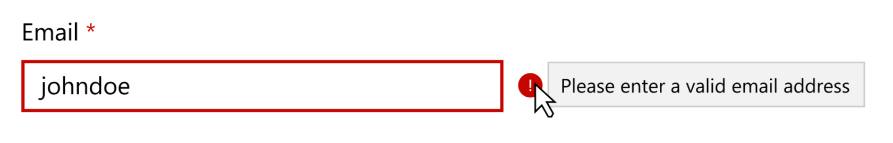
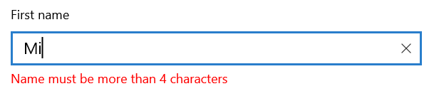
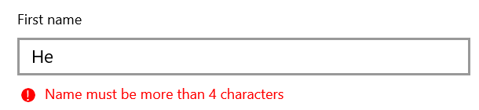

> See comments in Markdown for how to use this spec template

<!-- The purpose of this spec is to describe a new feature and
its APIs that make up a new feature in WinUI. -->

<!-- There are two audiences for the spec. The first are people
that want to evaluate and give feedback on the API, as part of
the submission process.  When it's complete
it will be incorporated into the public documentation at
docs.microsoft.com (http://docs.microsoft.com/uwp/toolkits/winui/).
Hopefully we'll be able to copy it mostly verbatim.
So the second audience is everyone that reads there to learn how
and why to use this API. -->

# Background
In WPF Developers had access to Input Validation via [INotifyDataErrorInfo](https://docs.microsoft.com/en-us/dotnet/api/system.componentmodel.inotifydataerrorinfo?view=netframework-4.7.2) We are adding the same capability to UWP.
<!-- Use this section to provide background context for the new API(s) 
in this spec. -->

<!-- This section and the appendix are the only sections that likely
do not get copied to docs.microsoft.com; they're just an aid to reading this spec. -->

<!-- If you're modifying an existing API, included a link here to the
existing page(s) -->

<!-- For example, this section is a place to explain why you're adding this API rather than
modifying an existing API. -->

<!-- For example, this is a place to provide a brief explanation of some dependent
area, just explanation enough to understand this new API, rather than telling
the reader "go read 100 pages of background information posted at ...". -->


# Description

Most applications that take user input need to have validation logic to ensure that the user has entered the expected information. The validation checks can be based on type, range, format, or other application-specific requirements. For example:



# Examples

## End to end input validation

In this sample, we want to display a validation error on a textbox when user input is invalid and the textbox loses focus. Once the textbox is in an invalid state, validation is performed every time the user input changes.  This is the recommended model for validating fields. The validation logic with DataAnnotations displayed in this sample is proper to managed apps. Native apps can use INotifyDataErrorInfo as described below and substitute their current validation logic in place of the .Net APIs.



Use INotifyDataErrorInfo with x:Bind to update your view. This API can be implemented by any class, and allows the object to raise an event if one of its properties is set to an invalid value. When the source of a Xaml x:Bind implements this interface, the logic generated by x:Bind will put the validation errors onto the bind target. Xaml controls such as TextBox will recognize these errors and provide visualization for them.

There are a set of requirements that enable input validation to occur:

1. The target property of the x:Bind matches the value of the `InputPropertyAttribute` of the target
2. The x:Bind has a `Mode` of `TwoWay`
3. The target of the bind must implement `IInputValidationControl`
4. The source of the x:Bind implements `INotifyPropertyChanged` as well as `INotifyDataErrorInfo`

### [App Code] Proper Xaml usage

Lets first start with some simple XAML that illustrates how this is done from markup. This example satisfies requirements 1-3 described above, since the `TextBox` implements the proper interfaces and specifies that the `Text` property is the input property, and we are using the proper `BindingMode`. It's important to note that the default `UpdateSourceTrigger` for TextBox is `FocusLost`, which is desirable. This ensures that the initial validation occurs after the user has finished entering input before trying to validate.

```xaml
<TextBox Text="{x:Bind ViewModel.Person.Name, Mode=TwoWay} "/>
```

### [App Code] Proper Source Implementation

Like when dealing with INotifyPropertyChanged, there is a set of "boilerplate" code that any app wanting to take advantage of validation will need to write. Since this example relies on the [System.ComponentModel.DataAnnotations.Validator](https://docs.microsoft.com/en-us/dotnet/api/system.componentmodel.dataannotations.validator?redirectedfrom=MSDN&view=netframework-4.8) class, this code is not part of the spec as the APIs must use WinRT types. It will most likely end up in the community toolkit so that this code doesn't have to be rewritten for every app. This example satisfies requirement 4, as the `ValidationBase` class implements both `INotifyPropertyChanged` and `INotifyDataErrorInfo`.

#### ValidationBase class
Validation should be performed after the value is set. This ensures that the target and source objects always maintain the same value. This is done automatically when the model derives from `ValidationBase` if the `ValidationBase.SetValue` method is used.

``` csharp
using System;
using System.Collections.Generic;
using System.Collections;
using System.ComponentModel;
using System.Runtime.CompilerServices;
using System.ComponentModel.DataAnnotations;
using System.Linq;

namespace Microsoft.Toolkit.Uwp
{
    /// <summary>
    /// An object that implements this interface is validatable. This is like the IValidatableObject interface in System.ComponentModel.DataAnnotations
    /// </summary>
    public interface IValidatable
    {
        void Validate(string memberName, object value);
    }

    /// <summary>
    /// Base class that implements INotifyPropertyChanged and INotifyDataErrorInfo boilerplate code
    /// </summary>
    public class ValidationBase : INotifyPropertyChanged, INotifyDataErrorInfo, IValidatable
    {
        public event PropertyChangedEventHandler PropertyChanged;
        public event EventHandler<DataErrorsChangedEventArgs> ErrorsChanged;

        protected void SetValue<T>(ref T currentValue, T newValue, [CallerMemberName] string propertyName = "")
        {
            if (!EqualityComparer<T>.Default.Equals(currentValue, newValue))
            {
                currentValue = newValue;
                OnPropertyChanged(propertyName, newValue);
            }
        }

        readonly Dictionary<string, List<ValidationResult>> _errors = new Dictionary<string, List<ValidationResult>>();
        public bool HasErrors
        {
            get
            {
                return _errors.Any();
            }
        }
        public IEnumerable GetErrors(string propertyName)
        {
            return _errors[propertyName];
        }

        private void OnPropertyChanged(string propertyName, object value)
        {
            PropertyChanged?.Invoke(this, new PropertyChangedEventArgs(propertyName));
            Validate(propertyName, value);
        }

        private void AddErrors(string propertyName, IEnumerable<ValidationResult> results)
        {
            if (!_errors.TryGetValue(propertyName, out List<ValidationResult> errors))
            {
                errors = new List<ValidationResult>();
                _errors.Add(propertyName, errors);
            }

            errors.AddRange(results);
            ErrorsChanged?.Invoke(this, new DataErrorsChangedEventArgs(propertyName));
        }

        private void ClearErrors(string propertyName)
        {
            if (_errors.TryGetValue(propertyName, out List<ValidationResult> errors))
            {
                errors.Clear();
                ErrorsChanged?.Invoke(this, new DataErrorsChangedEventArgs(propertyName));
            }
        }

        public void Validate(string memberName, object value)
        {
            ClearErrors(memberName);
            List<ValidationResult> results = new List<ValidationResult>();
            bool result = Validator.TryValidateProperty(
                value,
                new ValidationContext(this, null, null)
                {
                    MemberName = memberName
                },
                results
                );

            if (!result)
            {
                AddErrors(memberName, results);
            }
        }
    }
}

```
#### Model that derives from ValidationBase
In the above example, Person.Name is the source of the bind (this.ViewModel.Person.Name).  Person derives from ValidationBase, and the Name property is marked with `[MinLength]` and `[MaxLength]` data annotations. This means when `ValidationBase.SetValue` is called for the `Name` property, it will run the validation code that ensures the property is between 4 and 6 characters. 

``` csharp
using System.ComponentModel.DataAnnotations;
using Microsoft.Toolkit.Uwp;
public class Person : ValidationBase
{
    private string name;
    [MinLength(4)]
    [MaxLength(6)]
    public string Name
    {	
        get { return name; }
        set { SetValue(ref name, value); }
    }
}
```

#### The ViewModel

The “ViewModel” property is the View Model for the Page on which this TextBox is displayed (this.ViewModel).
``` csharp

public class ViewModel
{
    public ViewModel()
    {
        Person = new Person();
    }

    public Person Person { get; set; }

}
```

### [App Code] Creating a custom ValidationCommand
Specifying a custom `InputValidationCommand` allows you to override the validation behavior and ensure that once the user has entered invalid text, validation will occur on every property change.

``` csharp
using System;
using System.Linq;
using Microsoft.UI.Xaml.Controls;
using System.Reflection;

namespace Microsoft.Toolkit.Uwp
{
    public class ValidationCommand : InputValidationCommand
    {
        public ValidationCommand()
        {
        }

        public IValidatable Validator {get; set;}

        protected override void ValidateCore(IInputValidationControl validationControl)
        {
            if (validationControl.TryGetInputPropertyValue(out object value))
            {
                validator.Validate(validationControl.ValidationContext.MemberName, value);
            }
        }
    }

    public static class IInputValidationControlExtensions
    {
        // Gets the value of the InputProperty declared on the control so we an properly validate.
        public static bool TryGetInputPropertyValue(this IInputValidationControl ctrl, out object value)
        {
            Type controlType = ctrl.GetType();
            value = null;
            CustomAttributeData inputPropertyData = controlType.CustomAttributes.Where(attr => attr.AttributeType == typeof(InputPropertyAttribute)).SingleOrDefault();
            if (inputPropertyData != null)
            {
                string propertyName = inputPropertyData.NamedArguments[0].TypedValue.Value.ToString();
                value = controlType.GetProperty(propertyName).GetValue(ctrl);
            }
            return inputPropertyData != null;
        }
    }
}
```

## Custom validation UI


#### XAML
A developer wants to create their own visuals for the error message style and not use the control’s visuals at all. They may want to do this to place messages far from the control or something else.

To do this, you can instruct the `IInputValidationControl` to not display the visuals by setting the `InputValidationKind` property to `Hidden`.



```xaml
<TextBox 
        x:Name="Name" 
        Header="Name: " 
        PlaceholderText="Enter Name..." 

        Text="{x:Bind   ViewModel.Person.Name, 
                        UpdateSourceTrigger=PropertyChanged, 
                        Mode=TwoWay}" 
         InputValidationKind="Hidden"
        />

<!-- Custom error message template -->
<ItemsControl
    ItemsSource="{x:Bind Name.ValidationErrors, Mode=OneWay}"
    Foreground="Red">

    <ItemsControl.ItemTemplate>
        <DataTemplate x:DataType="ValidationError">
            <StackPanel Orientation="Horizontal" Spacing="5">
                <Border Background="Red" Margin="3" CornerRadius="10" 
                        Width="12" Height="12" VerticalAlignment="Top">
                    <TextBlock Text="!" Foreground="White" 
                               HorizontalAlignment="Center" VerticalAlignment="Center"/>
                </Border>
                <TextBlock Text="{x:Bind ErrorMessage, Mode=OneWay}"
                           />
            </StackPanel>
        </DataTemplate>
    </ItemsControl.ItemTemplate>
</ItemsControl>
```

## Customizing the error template

To modify the styling and content of your error template, use the Validation.ErrorTemplate property. The Validation.ErrorTemplate refers to either the content of the tooltip or the content of the container below the control depending on the validation mode.

If you wish to override the default visuals for errors across all forms elements in your app, override the ValidationErrorTemplate DataTemplate and use in your app.

```xaml
<ResourceDictionary>
    <DataTemplate x:Key="ValidationErrorTemplate">
        <StackPanel Orientation="Horizontal">
            <Border Background="Red" Margin="3" CornerRadius="10" Width="20" Height="20" VerticalAlignment="Top">
                <TextBlock Text="!" Foreground="White"
                HorizontalAlignment="Center" VerticalAlignment="Center"/>
            </Border>
            <TextBlock Text="{x:Bind ValidationErrors[0].ErrorContent, Mode=OneWay}"
        </StackPanel>
    </DataTemplate>
</ResourceDictionary>

<TextBox Validation.ErrorTemplate="{StaticResource ValidationErrorTemplate}"/>
```

## Change the resource color for the error and description messages
Colors for the error and description messages are defined in a standard color/brush pattern in generic.xaml that can be overridden at an app level.

```xaml
<Application.Resources>

    <!--Color for error messages-->
    <Color x:Key="SystemErrorColor">#CE3880</Color>
    <SolidColorBrush x:Key="SystemControlErrorTextForegroundBrush" Value="SystemErrorColor"/>

    <!--Brush for description messages-->
    <SolidColorBrush x:Key="SystemControlDescriptionTextForegroundBrush" Value="SystemControlPageTextBaseMediumBrush"/>

</Application.Resources>
```

## Description and Input Validation

Description text provides input to the end user on what format or content is expected from the control when it is not clear from the header and placeholder text. Description is useful outside of validation, but can be used together. Since both `Inline` errors and the description occupy the same layout slot in a template, it is expected that the description will be replaced by the error string. If the `Compact` error kind is used, then the description text stays visible.

## Validation without x:Bind
It's entirely supported to use the input validation feature without x:Bind.


### 1.10.1	C# Sample
#### XAML

```xaml
    <Grid xmlns:toolkit="using:Microsoft.Toolkit.Uwp">
      <Grid.Resources>
         <TextBoxValidator x:Key="validator" />
         <toolkit:ValidationCommand x:Key="ValidationCommand" Validator="{StaticResource validator}"/>
      </Grid.Resources>
    <TextBox x:Name="Email" 
            Header="Email" 
            ValidationContext.IsInputRequired="True"
            ValidationCommand="{StaticResource ValidationCommand}"/>
    </Grid>
```

#### C#
```csharp

public class TextBoxValidator : IValidatable
{
    private void Validate(object sender, TextChangedEventArgs e)
    {
        var foo = sender as TextBox;
        foo.ValidationErrors.Clear();
        foo.ValidationErrors.VectorChanged += OnValidationError(foo, OnValidationError);

        if (!new EmailAddressAttribute().IsValid(foo.Text))
        {
            foo.ValidationErrors.Add(new ValidationError("Email is not a valid email address"));
        }
    }
}

```

<!-- Use this section to explain the features of the API, showing
example code with each description. The general format is: 
  feature explanation,
  example code
  feature explanation,
  example code
  etc.-->
  
<!-- Code samples should be in C# and/or C++/WinRT -->

<!-- As an example of this section, see the Examples section for the PasswordBox control 
(https://docs.microsoft.com/windows/uwp/design/controls-and-patterns/password-box#examples). -->


# Remarks
<!-- Explanation and guidance that doesn't fit into the Examples section. -->

<!-- APIs should only throw exceptions in exceptional conditions; basically,
only when there's a bug in the caller, such as argument exception.  But if for some
reason it's necessary for a caller to catch an exception from an API, call that
out with an explanation either here or in the Examples -->

# API Notes
<!-- Option 1: Give a one or two line description of each API (type
and member), or at least the ones that aren't obvious
from their name.  These descriptions are what show up
in IntelliSense. For properties, specify the default value of the property if it
isn't the type's default (for example an int-typed property that doesn't default to zero.) -->

<!-- Option 2: Put these descriptions in the below API Details section,
with a "///" comment above the member or type. -->

# API Details
<!-- The exact API, in MIDL3 format (https://docs.microsoft.com/en-us/uwp/midl-3/) -->

## InputPropertyAttribute
The `InputPropertyAttribute` helps us ensure that we only generate validation code for the property specified by this attribute. This will help reduce code bloat by not generating code for properties that will never perform validation (like width). Controls can specify multiple properties as their input property. 

    /// <summary>
    /// Name of the property that is associated with user input.
    /// </summary>
    attribute InputPropertyAttribute
    {
         string Name;
    }

## InputValidationKind  
Determines how the control displays validation visuals.

    /// <summary>
    ///    Determines how the control displays its validation visuals
    /// </summary>
    [webhosthidden]
    enum InputValidationKind
    {
        /// <summary>
        /// Let's the Control dictate how to display visuals. This is the default value.
        /// </summary>
        Auto,
        /// <summary>
        /// An error icon displays to the right of the control that displays the error messages in a tool tip.
        /// </summary>
        Compact,
        /// <summary>
        /// Text for the error messages is displayed underneath the control.  
        /// </summary>
        Inline,
        /// <summary>
        /// Validation visuals are not displayed at all.
        /// </summary>
        Hidden,
    };

## InputValidationMode
Determines how the ValidationCommand should perform validation.

    /// <summary>
    ///    Determines how the ValidationCommand should perform validation
    /// </summary>
    [webhosthidden]
    enum InputValidationMode
    {
        /// <summary>
        /// Only validate on PropertyChanged once there are errors
        /// </summary>
        Default,
        /// <summary>
        /// Validation is disabled.
        /// </summary>
        Disabled,
    };


## IInputValidationControl
Any control that wants to participate in input validation should derive from this interface. This, among other things, is what allows the markup compiler to know when to generate the code necessary for listening to the `INotifyDataErrorInfo.ErrorsChanged` event and propagate the results to the `IInputValidationControl.Errors` property.

When the `ValidationCommand` property is non-null, the following will be true:
1. The control tries to invoke the command whenever its input property changes.
1. The control uses the return value of `ValidationCommand.CanValidate` to determine if it can invoke the `ValidationCommand.Validate` method
2. The default implementation of `ValidationCommand.CanValidate` returns false when the `InputValidationMode` property is set to `Disabled`, and only returns true if the he `IInputValidationControl.ValidationErrors` collection is non-empty. Custom commands are allowed to override this default behavior as they see fit.
3. When the `InputValidationKind` property is set to `Auto`, the control will use the value of the `ValidationCommand.InputValidationKind` property for the value. If both are `Auto` the default bevahior should be `Inline`.

The markup compiler uses this interface to properly generate code when using x:Bind if and only if:
1. The Source implements INotifyDataErrorInfo and INotifyPropertyChanged 
2. The Target property is the one specified by the TargetType's InputPropertyAttribute
3. The BindingMode is set to TwoWay

The code generated provides the following functions:
1. Generate code that listens to the Source's INotifyDataErrorInfo.ErrorsChanged event and populates the Target's 'IInputValidationControl.ValidationErrors' property.
2. Generate and automatically set the ValidationContext property based on the Source property. If that property has any System.ComponentModel.DataAnnotations.ValidationAttributes, the associated property on the ValidationContext class will be set.

         /// <summary>
         /// Interface for Controls that participate in input validation.
         /// <summary/>
          [webhosthidden]
         interface IInputValidationControl 
         {
             /// <summary>
             /// Collection of errors to display based on the InputValidationKind property.
            /// </summary>
            Windows.Foundation.Collections.IObservableVector<Windows.UI.Xaml.Controls.InputValidationError> ValidationErrors{ get; };
            /// <summary>
            ///  Extra information about the Source of the validation. 
            ///  Note: This is automatically set by the XAML markup compiler. See summary above. 
            /// </summary>
            Windows.UI.Xaml.Controls.InputValidationContext ValidationContext;
            /// <summary>
            ///  DataTemplate that expresses how the errors are displayed.
            /// </summary>
            Windows.UI.Xaml.DataTemplate ErrorTemplate;
            /// <summary>
            ///  Determines how the control should visualize validation errors.
            /// </summary>
            Windows.UI.Xaml.Controls.InputValidationKind InputValidationKind;
            /// <summary>
            ///  Determines how the ValidationCommand should perform validation.
            /// </summary>
            Windows.UI.Xaml.Controls.InputValidationMode InputValidationMode;
            /// <summary>
            /// Command associated with the IInputValidationControl. See InputValidationCommand for more
            /// information.
            /// </summary>
            Windows.UI.Xaml.Controls.InputValidationCommand ValidationCommand;
         };
   
## InputValidationCommand
The command allows for easy use of input validation without the need for a tight dependency on x:Bind.  This enables developers who aren't striclty using MVVM to use input validation (i.e ReactiveUI).  The InputValidationCommand is what allows for the correct-by-design approach where controls initially validate on focus lost, but then will query for validation on property changed once in an invalid state.  This wouldn't be for free, but the amount of code here is pretty trivial. We could provide some attribute or pattern that tells the markup compiler how to generate that code automatically.  

The command can shared between different IInputValidationControls, as would most likely be the case in the scenario of a forms control.  A custom command can be made that listens for changes to all errors and knows when a form has been completed and ready for submition. The control will query the command as to whether they should perform validation.

Developers can override any of this behavior by creating their own InputValidationCommand.
 
 
    /// <summary>
    /// Command that controls how an IInputValidationControl does validation.
    /// </summary>
    [webhosthidden]
    unsealed runtimeclass InputValidationCommand
    {
        [method_name("CreateInstance")] InputValidationCommand();
        Windows.UI.Xaml.Controls.InputValidationKind InputValidationKind;
        /// <summary>
        /// Called by a control to determine if it should call the Validate method.
        /// </summary>
        Boolean CanValidate(Windows.UI.Xaml.Controls.IInputValidationControl validationControl);
        /// <summary>
        /// If CanValidate returns true, Validate is invoked to perform validation on the
        /// validationControl provided.
        /// </summary>
        void Validate(Windows.UI.Xaml.Controls.IInputValidationControl validationControl);
        /// <summary>
        /// Method that derived classes implement to provide their own implementation of the CanValidate method.
        /// </summary>
        overridable Boolean CanValidateCore(Windows.UI.Xaml.Controls.IInputValidationControl validationControl);
        /// <summary>
        /// Method that derived classes implement to provide their own implementation of the Validate method.
        /// </summary>
        overridable void ValidateCore(Windows.UI.Xaml.Controls.IInputValidationControl validationControl);
    };

## ValidationContext
The `ValidationContext` class provides context as to what is being required by validation. This class is auto-generated by the XAML markup compiler in certain scenarios (see [IInputValidationControl]()). Controls can use the provided properties on the `ValidationContext` to customize their appearance.  For example, the IsInputRequired field is can allow controls to put the little * next to a header. 

Note: Intended to be extended for things like IsPhoneNumber or IsEmail that will allow controls to have other behavior (like mask text box).

    
    /// <summary>
    /// Provides more contextual information about how to validate, display, and/or format input.
    /// </summary>
    [webhosthidden]
    unsealed runtimeclass InputValidationContext
    {
        [method_name("CreateInstance")] InputValidationContext(String memberName, Boolean isRequired);
        Boolean IsInputRequired{ get; };
        String MemberName{ get; };
    };
    
## InputValidationError
Provides the error message for what should be displayed to the user.
    
    /// <summary>
    ///  Provides the error message for what should be displayed to the user.
    /// </summary>
    [webhosthidden]
    unsealed runtimeclass InputValidationError
    {
        [method_name("CreateInstance")] InputValidationError(String errorMessage);
        String ErrorMessage{ get; };
    };


# Appendix
<!-- Anything else that you want to write down for posterity, but 
that isn't necessary to understand the purpose and usage of the API.
For example, implementation details. -->
