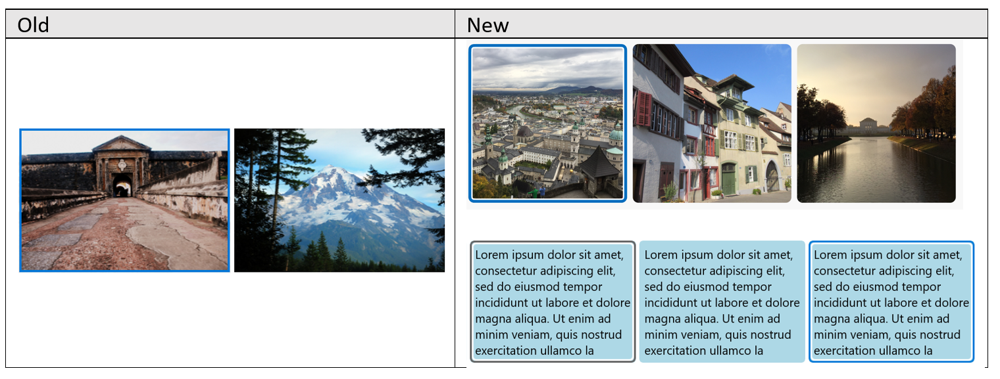
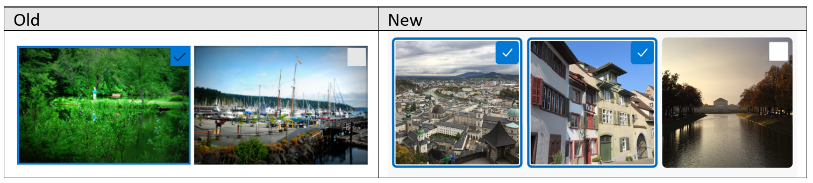
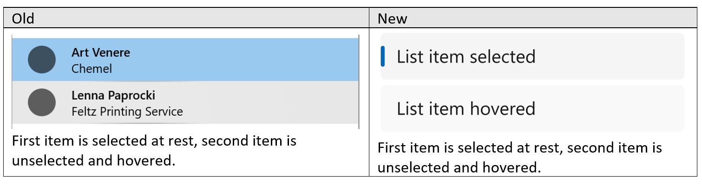
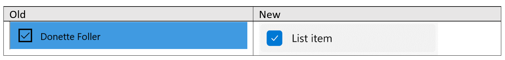

# Background
<!-- Use this section to provide background context for the new API(s) 
in this spec. -->

<!-- This section and the appendix are the only sections that likely
do not get copied to docs.microsoft.com; they're just an aid to reading this spec. -->

<!-- If you're modifying an existing API, included a link here to the
existing page(s) -->

<!-- For example, this section is a place to explain why you're adding this API rather than
modifying an existing API. -->

<!-- For example, this is a place to provide a brief explanation of some dependent
area, just explanation enough to understand this new API, rather than telling
the reader "go read 100 pages of background information posted at ...". -->
In WinUI 2.2, controls began to be re-designed to have rounded corners, marking a shift in our overall design language. There's more information on rounded corners in WinUI [here](https://docs.microsoft.com/en-us/windows/uwp/design/style/rounded-corner), but the general purpose of the rounded corners and design shift is to evoke warmth and trust, and make the UI easier for users to visually process. Since this shift, certain controls have adopted the new styling and recieved rounded corners, but some have not. This creates a strong visual inconsistency in WinUI apps, where certain pieces of an app may look modern and others may look dated. A common example of this is ListView and GridView items. These are two very heavily used controls, but their items still have squared corners and look dated when placed alongside controls that are more modernly designed, such as [NavigationView](https://docs.microsoft.com/en-us/windows/uwp/design/controls-and-patterns/navigationview) or even [Button](https://docs.microsoft.com/en-us/windows/uwp/design/controls-and-patterns/buttons).  

This spec will detail a number of changes to update the designs of ListView and GridView so that they are more visually aligned with modern WinUI controls. At a high level, some key parts of these updated styles are: rounded corners, a new selection indicator, rounded checkboxes and new checkbox design for multiple selection, and an improved border design for GridView. The spec will also go over the API changes necessary to support these new designs.

# Description
<!-- Use this section to provide a brief description of the feature.
For an example, see the introduction to the PasswordBox control 
(http://docs.microsoft.com/windows/uwp/design/controls-and-patterns/password-box). -->

ListView and GridView now have updated designs. Some of the key parts of this updated design include rounded corners, new rounded checkboxes in multi-select mode, new borders for GridView items in non-rest states, and a selection indicator for ListView items. 

The design update to ListView and GridView ensures that they conform to the modern design language introduced in WinUI 2, and help provide visual consistency across your WinUI app. However, if you have a specific item template or would prefer to revert back to previous styles, there are a few options.

### Toggling rounded corners

If needed, you can easily toggle the rounded corners of ListView and GridView items on and off. Toggle rounded corners of ListView and GridView items by setting the `ListViewItemCornerRadius` and `GridViewItemCornerRadius` ThemeResources to your desired value. 

Unless edited, these ThemeResources point to the `ControlCornerRadius` ThemeResource - so if you decide to toggle rounded corners on/off for your whole app, your ListView and GridView will apply those changes to their items as well.  

### Overhauling the built-in template with an existing style
ListView items are still customizable via the ListView's [ItemTemplate](https://docs.microsoft.com/en-us/uwp/api/windows.ui.xaml.controls.itemscontrol.itemtemplate?view=winrt-19041#Windows_UI_Xaml_Controls_ItemsControl_ItemTemplate) property, but the default built-in styles (rounded corners, selection indicator) will be combined with the style that you provide. To change these new default style components, you have a few options:

1. [Edit the control template](https://docs.microsoft.com/windows/uwp/design/controls-and-patterns/control-templates) of ListView or GridView.

2. Use an [ItemsRepeater](https://docs.microsoft.com/windows/uwp/design/controls-and-patterns/items-repeater), which allows for full customization and doesn't come with any pre-built selection model or selection visuals. 

# Examples
**GridView in single selection mode:**

In the photo-based examples below, the first item is selected in both old and new versions. In the text-based examples, the first item is hovered and the third item is selected in both old and new versions.


**GridView in multiple selection mode:**


**ListView in single selection mode:**


**ListView in multiple selection mode:**


**More ListView examples:**

The first example on the top left shows a rounded focus rect.
The second example on the top right shows extended selection mode. 

The samples in the bottom row show ListView items with different heights. 


# API Notes

<!-- Option 1: Give a one or two line description of each API (type
and member), or at least the ones that aren't obvious
from their name.  These descriptions are what show up
in IntelliSense. For properties, specify the default value of the property if it
isn't the type's default (for example an int-typed property that doesn't default to zero.) -->

<!-- Option 2: Put these descriptions in the below API Details section,
with a "///" comment above the member or type. -->

## New APIs:

`public Windows.UI.Xaml.CornerRadius ListViewItemPresenter.CheckBoxCornerRadius { get; set; }`

Gets or sets the corner radius value for the checkbox shown in multiple selection mode, if [ListView.IsMultiSelectCheckBoxEnabled](https://docs.microsoft.com/uwp/api/Windows.UI.Xaml.Controls.ListViewBase.IsMultiSelectCheckBoxEnabled) is set.

`public Windows.UI.Xaml.Media.Brush ListViewItemPresenter.CheckBoxDisabledBrush { get; set; }`

Gets or sets the brush used to render the check box background of disabled items.

`public Windows.UI.Xaml.Media.Brush ListViewItemPresenter.CheckBoxSelectedBrush { get; set; }`

Gets or sets the brush used to render the check box background of selected items. 

`public Windows.UI.Xaml.Media.Brush ListViewItemPresenter.CheckBoxSelectedPointerOverBrush { get; set; }`

Gets or sets the brush used to render the check box background of selected pointer-over items. 

`public Windows.UI.Xaml.Media.Brush ListViewItemPresenter.CheckBoxSelectedPressedBrush { get; set; }`

Gets or sets the brush used to render the check box background of selected pressed items. 

`public Windows.UI.Xaml.Media.Brush ListViewItemPresenter.CheckBoxSelectedDisabledBrush { get; set; }`

Gets or sets the brush used to render the check box background of selected disabled items. 

`public Windows.UI.Xaml.Media.Brush ListViewItemPresenter.CheckBoxBorderBrush { get; set; }`

Gets or sets the brush used to render the check box border of ListView items. 

`public Windows.UI.Xaml.Media.Brush ListViewItemPresenter.CheckBoxPointerOverBorderBrush { get; set; }`

Gets or sets the brush used to render the check box border of pointer-over ListView items. 

`public Windows.UI.Xaml.Media.Brush ListViewItemPresenter.CheckBoxPressedBorderBrush { get; set; }`

Gets or sets the brush used to render the check box border of pressed ListView items. 

`public Windows.UI.Xaml.Media.Brush ListViewItemPresenter.CheckBoxDisabledBorderBrush { get; set; }`

Gets or sets the brush used to render the check box border of disabled ListView items. 

`public Windows.UI.Xaml.Media.Brush ListViewItemPresenter.SelectedDisabledBackground { get; set; }`

Gets or sets the brush used to render the background of selected disabled ListView items.

`public boolean ListViewItemPresenter.SelectionIndicatorVisualEnabled { get; set; }`

Gets or sets a value that indicates whether the selection indicator should appear when ListView items are selected.

`public Windows.UI.Xaml.CornerRadius ListViewItemPresenter.SelectionIndicatorCornerRadius { get; set; }`

Gets or sets the corner radius value for the selection indicator.

`public Windows.UI.Xaml.Media.Brush ListViewItemPresenter.SelectionIndicatorBrush { get; set; }`

Gets or sets the brush used to render the selection indicator shown on selected ListView items. 

`public Windows.UI.Xaml.Media.Brush ListViewItemPresenter.SelectionIndicatorPointerOverBrush { get; set; }`

Gets or sets the brush used to render the selection indicator shown on a selected ListViewItem that has the pointer over it. 

`public Windows.UI.Xaml.Media.Brush ListViewItemPresenter.SelectionIndicatorPressedBrush { get; set; }`

Gets or sets the brush used to render the selection indicator shown on a selected ListViewItem that is being pressed. 

`public Windows.UI.Xaml.Media.Brush ListViewItemPresenter.SelectionIndicatorDisabledBrush { get; set; }`

Gets or sets the brush used to render the selection indicator shown on a selected disabled ListViewItem. 

`static Windows.UI.Xaml.DependencyProperty ListViewItemPresenter.SelectionIndicatorVisualEnabledProperty{ get; };`

`static Windows.UI.Xaml.DependencyProperty ListViewItemPresenter.SelectedDisabledBackgroundProperty{ get; };`

`static Windows.UI.Xaml.DependencyProperty ListViewItemPresenter.SelectionIndicatorBrushProperty{ get; };`

`static Windows.UI.Xaml.DependencyProperty ListViewItemPresenter.SelectionIndicatorPointerOverBrushProperty{ get; };`

`static Windows.UI.Xaml.DependencyProperty ListViewItemPresenter.SelectionIndicatorPressedBrushProperty{ get; };`

`static Windows.UI.Xaml.DependencyProperty ListViewItemPresenter.SelectionIndicatorDisabledBrushProperty{ get; };`

`static Windows.UI.Xaml.DependencyProperty ListViewItemPresenter.SelectionIndicatorModeProperty{ get; };`

`public ListViewItemPresenterSelectionIndicatorMode ListViewItemPresenter.SelectionIndicatorMode { get; set; }`

Specifies the alignment/style of the selection indicator that appears when ListView items are selected.

`public enum ListViewItemPresenterSelectionIndicatorMode`

Defines constants that specify the alignment/style of the selection indicator that appears when ListView items are selected.

Fields:

| Field  | Value | 
|--------|:-----:|
|   0 - Inline    |  Indicator visual appears inline with the ListViewItem content, aligned left by default.     | 
|   1 - Overlay  |   Indicator visual shows over the ListViewItem content, aligned left by default.    |


`public Windows.UI.Xaml.Media.Brush ListViewItemPresenter.PointerOverBorderBrush { get; set; }`

Gets or sets the brush used to render the outer border shown on a GridViewItem that has the pointer over it. 

`public Windows.UI.Xaml.Media.Brush ListViewItemPresenter.SelectedBorderBrush { get; set; }`

Gets or sets the brush used to render the outer selection border shown on selected GridView items. The existing SelectedPointerOverBorderBrush brush is used when the pointer is over the item. The thickness is driven by SelectedBorderThickness.

`public Windows.UI.Xaml.Media.Brush ListViewItemPresenter.SelectedPressedBorderBrush { get; set; }`

Gets or sets the brush used to render the outer selection border shown on selected & pressed GridView items.

`public Windows.UI.Xaml.Media.Brush ListViewItemPresenter.SelectedDisabledBorderBrush { get; set; }`

Gets or sets the brush used to render the outer selection border shown on selected & disabled GridView items.

`public Windows.UI.Xaml.Media.Brush ListViewItemPresenter.SelectedInnerBorderBrush { get; set; }`

Gets or sets the brush used to render the inner selection border shown on selected GridView items. The thickness is hard-coded to 1px.

`public Windows.UI.Xaml.Media.Brush ListViewItemPresenter.CheckBoxPointerOverBrush { get; set; }`

Gets or sets the brush used to render the pointer-over selection check box.

`public Windows.UI.Xaml.Media.Brush ListViewItemPresenter.CheckBoxPressedBrush { get; set; }`

Gets or sets the brush used to render the pressed selection check box.

`public Windows.UI.Xaml.Media.Brush ListViewItemPresenter.CheckPressedBrush { get; set; }`

Gets or sets the brush used to render the pressed selection checkmark.

`public Windows.UI.Xaml.Media.Brush ListViewItemPresenter.CheckDisabledBrush { get; set; }`

Gets or sets the brush used to render the disabled selection checkmark.

`static Windows.UI.Xaml.DependencyProperty ListViewItemPresenter.PointerOverBorderBrushProperty{ get; };`

`static Windows.UI.Xaml.DependencyProperty ListViewItemPresenter.SelectedBorderBrushProperty{ get; };`

`static Windows.UI.Xaml.DependencyProperty ListViewItemPresenter.SelectedPressedBorderBrushProperty{ get; };`

`static Windows.UI.Xaml.DependencyProperty ListViewItemPresenter.SelectedDisabledBorderBrushProperty{ get; };`

`static Windows.UI.Xaml.DependencyProperty ListViewItemPresenter.CheckBoxPointerOverBrushProperty{ get; };`

`static Windows.UI.Xaml.DependencyProperty ListViewItemPresenter.CheckBoxPressedBrushProperty{ get; };` 

`static Windows.UI.Xaml.DependencyProperty ListViewItemPresenter.CheckBoxDisabledBrushProperty{ get; };` 

`static Windows.UI.Xaml.DependencyProperty ListViewItemPresenter.CheckBoxSelectedBrushProperty{ get; };` 

`static Windows.UI.Xaml.DependencyProperty ListViewItemPresenter.CheckBoxSelectedPointerOverBrushProperty{ get; };` 

`static Windows.UI.Xaml.DependencyProperty ListViewItemPresenter.CheckBoxSelectedPressedBrushProperty{ get; };` 

`static Windows.UI.Xaml.DependencyProperty ListViewItemPresenter.CheckBoxSelectedDisabledBrushProperty{ get; };` 

`static Windows.UI.Xaml.DependencyProperty ListViewItemPresenter.CheckBoxBorderBrushProperty{ get; };`

`static Windows.UI.Xaml.DependencyProperty ListViewItemPresenter.CheckBoxPointerOverBorderBrushProperty{ get; };` 

`static Windows.UI.Xaml.DependencyProperty ListViewItemPresenter.CheckBoxPressedBorderBrushProperty{ get; };` 

`static Windows.UI.Xaml.DependencyProperty ListViewItemPresenter.CheckBoxDisabledBorderBrushProperty{ get; };` 

`static Windows.UI.Xaml.DependencyProperty ListViewItemPresenter.CheckPressedBrushProperty{ get; };` 

`static Windows.UI.Xaml.DependencyProperty ListViewItemPresenter.CheckDisabledBrushProperty{ get; };` 

`static Windows.UI.Xaml.DependencyProperty ListViewItemPresenter.SelectedInnerBorderBrushProperty{ get; };`

`static Windows.UI.Xaml.DependencyProperty ListViewItemPresenter.SelectionIndicatorCornerRadiusProperty { get; };`

`static Windows.UI.Xaml.DependencyProperty ListViewItemPresenter.CheckBoxCornerRadiusProperty{ get; };`


## New ThemeResources

### ListView:

```xml
<ListViewItemPresenterSelectionIndicatorMode x:Key="ListViewItemSelectionIndicatorMode">Inline</ListViewItemPresenterSelectionIndicatorMode>

<x:Boolean x:Key="ListViewItemSelectionIndicatorVisualEnabled">True</x:Boolean>

<StaticResource x:Key="ListViewItemSelectionIndicatorDisabledBrush" ResourceKey="SystemAccentColor"/>

<StaticResource x:Key="ListViewItemSelectionIndicatorPressedBrush" ResourceKey="SystemAccentColor"/>

<StaticResource x:Key="ListViewItemSelectionIndicatorPointerOverBrush"  ResourceKey="SystemAccentColor"/>

<StaticResource x:Key="ListViewItemSelectionIndicatorBrush"  ResourceKey="SystemAccentColor"/>

<StaticResource x:Key="ListViewItemCheckBoxDisabledBrush"  ResourceKey="SystemAccentColor"/>

<StaticResource x:Key="ListViewItemCheckBoxSelectedBrush"  ResourceKey="SystemAccentColor"/>

<StaticResource x:Key="ListViewItemCheckBoxSelectedPointerOverBrush"  ResourceKey="SystemAccentColor"/>

<StaticResource x:Key="ListViewItemCheckBoxSelectedPressedBrush"  ResourceKey="SystemAccentColor"/>

<StaticResource x:Key="ListViewItemCheckBoxSelectedDisabledBrush"  ResourceKey="SystemAccentColor"/>

<StaticResource x:Key="ListViewItemCheckBoxBorderBrush"  ResourceKey="SystemAccentColor"/>

<StaticResource x:Key="ListViewItemCheckBoxPointerOverBorderBrush"  ResourceKey="SystemAccentColor"/>

<StaticResource x:Key="ListViewItemCheckBoxPressedBorderBrush"  ResourceKey="SystemAccentColor"/>

<StaticResource x:Key="ListViewItemCheckBoxDisabledBorderBrush"  ResourceKey="SystemAccentColor"/> 

<CornerRadius x:Key="ListViewItemSelectionIndicatorCornerRadius">2</CornerRadius>

<CornerRadius x:Key="ListViewItemCheckBoxCornerRadius">3</CornerRadius>

<CornerRadius x:Key="ListViewItemCornerRadius">4</CornerRadius>

```

### GridView:

```xml
<StaticResource x:Key="GridViewItemBackgroundSelectedDisabled"  ResourceKey="SystemAccentColor"/> 

<StaticResource x:Key="GridViewItemSelectedBorderBrush"  ResourceKey="SystemAccentColor"/>

<StaticResource x:Key="GridViewItemSelectedPointerOverBorderBrush"  ResourceKey="SystemAccentColor"/>

<StaticResource x:Key="GridViewItemSelectedPressedBorderBrush"  ResourceKey="SystemAccentColor"/> 

<StaticResource x:Key="GridViewItemSelectedDisabledBorderBrush"  ResourceKey="SystemAccentColor"/>

<StaticResource x:Key="GridViewItemCheckBoxDisabledBrush"  ResourceKey="SystemAccentColor"/>

<StaticResource x:Key="GridViewItemCheckBoxSelectedBrush"  ResourceKey="SystemAccentColor"/>

<StaticResource x:Key="GridViewItemCheckBoxSelectedPointerOverBrush"  ResourceKey="SystemAccentColor"/>

<StaticResource x:Key="GridViewItemCheckBoxSelectedPressedBrush"  ResourceKey="SystemAccentColor"/>

<StaticResource x:Key="GridViewItemCheckBoxSelectedDisabledBrush"  ResourceKey="SystemAccentColor"/>

<StaticResource x:Key="GridViewItemCheckBoxBorderBrush"  ResourceKey="SystemAccentColor"/>

<StaticResource x:Key="GridViewItemCheckBoxPointerOverBorderBrush"  ResourceKey="SystemAccentColor"/>

<StaticResource x:Key="GridViewItemCheckBoxPressedBorderBrush"  ResourceKey="SystemAccentColor"/>

<StaticResource x:Key="GridViewItemCheckBoxDisabledBorderBrush"  ResourceKey="SystemAccentColor"/>

<StaticResource x:Key="GridViewItemSelectedInnerBorderBrush"  ResourceKey="SystemAccentColor"/>

<CornerRadius x:Key="GridViewItemCheckBoxCornerRadius">3</CornerRadius>

<CornerRadius x:Key="GridViewItemCornerRadius">4</CornerRadius>

```

# API Details
```cs

unsealed runtimeclass ListViewItemPresenter
    : Windows.UI.Xaml.Controls.ContentPresenter
{
    [method_name("CreateInstance")] ListViewItemPresenter();
    Boolean SelectionCheckMarkVisualEnabled;
    Windows.UI.Xaml.Media.Brush CheckHintBrush;
    Windows.UI.Xaml.Media.Brush CheckSelectingBrush;
    Windows.UI.Xaml.Media.Brush CheckBrush;
    Windows.UI.Xaml.Media.Brush DragBackground;
    Windows.UI.Xaml.Media.Brush DragForeground;
    Windows.UI.Xaml.Media.Brush FocusBorderBrush;
    Windows.UI.Xaml.Media.Brush PlaceholderBackground;
    // ===============================================================
    //                      vv  CHANGED  vv
    // ===============================================================
    Windows.UI.Xaml.Media.Brush PointerOverBackground;
    Windows.UI.Xaml.Media.Brush SelectedBackground;
    Windows.UI.Xaml.Media.Brush SelectedPointerOverBackground;
    // ===============================================================
    //                       ^^ CHANGED ^^ 
    // ===============================================================
    Windows.UI.Xaml.Media.Brush SelectedForeground;
    Windows.UI.Xaml.Media.Brush SelectedPointerOverBorderBrush;
    Windows.UI.Xaml.Thickness SelectedBorderThickness;
    Double DisabledOpacity;
    Double DragOpacity;
    Double ReorderHintOffset;
    [deprecated("Use ContentPresenter.HorizontalContentAlignment instead of ListViewItemPresenterHorizontalContentAlignment. For more info, see MSDN.", deprecate, Windows.Foundation.UniversalApiContract, 1)]
    Windows.UI.Xaml.HorizontalAlignment ListViewItemPresenterHorizontalContentAlignment;
    [deprecated("Use ContentPresenter.VerticalContentAlignment instead of ListViewItemPresenterVerticalContentAlignment. For more info, see MSDN.", deprecate, Windows.Foundation.UniversalApiContract, 1)]
    Windows.UI.Xaml.VerticalAlignment ListViewItemPresenterVerticalContentAlignment;
    [deprecated("Use ContentPresenter.Padding instead of GridViewItemPresenterPadding. For more info, see MSDN.", deprecate, Windows.Foundation.UniversalApiContract, 1)]
    Windows.UI.Xaml.Thickness ListViewItemPresenterPadding;
    Windows.UI.Xaml.Thickness PointerOverBackgroundMargin;
    Windows.UI.Xaml.Thickness ContentMargin;
    static Windows.UI.Xaml.DependencyProperty SelectionCheckMarkVisualEnabledProperty{ get; };
    static Windows.UI.Xaml.DependencyProperty CheckHintBrushProperty{ get; };
    static Windows.UI.Xaml.DependencyProperty CheckSelectingBrushProperty{ get; };
    static Windows.UI.Xaml.DependencyProperty CheckBrushProperty{ get; };
    static Windows.UI.Xaml.DependencyProperty DragBackgroundProperty{ get; };
    static Windows.UI.Xaml.DependencyProperty DragForegroundProperty{ get; };
    static Windows.UI.Xaml.DependencyProperty FocusBorderBrushProperty{ get; };
    static Windows.UI.Xaml.DependencyProperty PlaceholderBackgroundProperty{ get; };
    static Windows.UI.Xaml.DependencyProperty PointerOverBackgroundProperty{ get; };
    static Windows.UI.Xaml.DependencyProperty SelectedBackgroundProperty{ get; };
    static Windows.UI.Xaml.DependencyProperty SelectedForegroundProperty{ get; };
    static Windows.UI.Xaml.DependencyProperty SelectedPointerOverBackgroundProperty{ get; };
    static Windows.UI.Xaml.DependencyProperty SelectedPointerOverBorderBrushProperty{ get; };
    static Windows.UI.Xaml.DependencyProperty SelectedBorderThicknessProperty{ get; };
    static Windows.UI.Xaml.DependencyProperty DisabledOpacityProperty{ get; };
    static Windows.UI.Xaml.DependencyProperty DragOpacityProperty{ get; };
    static Windows.UI.Xaml.DependencyProperty ReorderHintOffsetProperty{ get; };
    [deprecated("Use ContentPresenter.HorizontalContentAlignment instead of ListViewItemPresenterHorizontalContentAlignment. For more info, see MSDN.", deprecate, Windows.Foundation.UniversalApiContract, 1)]
    static Windows.UI.Xaml.DependencyProperty ListViewItemPresenterHorizontalContentAlignmentProperty{ get; };
    [deprecated("Use ContentPresenter.VerticalContentAlignment instead of ListViewItemPresenterVerticalContentAlignment. For more info, see MSDN.", deprecate, Windows.Foundation.UniversalApiContract, 1)]
    static Windows.UI.Xaml.DependencyProperty ListViewItemPresenterVerticalContentAlignmentProperty{ get; };
    [deprecated("Use ContentPresenter.Padding instead of GridViewItemPresenterPadding. For more info, see MSDN.", deprecate, Windows.Foundation.UniversalApiContract, 1)]
    static Windows.UI.Xaml.DependencyProperty ListViewItemPresenterPaddingProperty{ get; };
    static Windows.UI.Xaml.DependencyProperty PointerOverBackgroundMarginProperty{ get; };
    static Windows.UI.Xaml.DependencyProperty ContentMarginProperty{ get; };

    [contract(Windows.Foundation.UniversalApiContract, 1)]
    [static_name("Windows.UI.Xaml.Controls.Primitives.IListViewItemPresenterStatics2", 4cb3b945-d24d-42a3-9e83-a86d0618bf1b)]
    [interface_name("Windows.UI.Xaml.Controls.Primitives.IListViewItemPresenter2", f5dc5496-e122-4c57-a625-ac4b08fb2d4c)]
    {
        // ===============================================================
        //                       vv CHANGED vv 
        // ===============================================================
        Windows.UI.Xaml.Media.Brush SelectedPressedBackground;
        Windows.UI.Xaml.Media.Brush PressedBackground;
        // ===============================================================
        //                       ^^ CHANGED ^^ 
        // ===============================================================
        Windows.UI.Xaml.Media.Brush CheckBoxBrush;
        Windows.UI.Xaml.Media.Brush FocusSecondaryBorderBrush;
        Windows.UI.Xaml.Controls.Primitives.ListViewItemPresenterCheckMode CheckMode;
        Windows.UI.Xaml.Media.Brush PointerOverForeground;
        static Windows.UI.Xaml.DependencyProperty SelectedPressedBackgroundProperty{ get; };
        static Windows.UI.Xaml.DependencyProperty PressedBackgroundProperty{ get; };
        static Windows.UI.Xaml.DependencyProperty CheckBoxBrushProperty{ get; };
        static Windows.UI.Xaml.DependencyProperty FocusSecondaryBorderBrushProperty{ get; };
        static Windows.UI.Xaml.DependencyProperty CheckModeProperty{ get; };
        static Windows.UI.Xaml.DependencyProperty PointerOverForegroundProperty{ get; };
    }

    [contract(Windows.Foundation.UniversalApiContract, 5)]
    [static_name("Windows.UI.Xaml.Controls.Primitives.IListViewItemPresenterStatics3", c3d3d11e-fa26-4ce7-a4ed-ff948f01b7c0)]
    [interface_name("Windows.UI.Xaml.Controls.Primitives.IListViewItemPresenter3", 36620013-0390-4e30-ad97-8744404f7010)]
    {
        Windows.UI.Xaml.Media.Brush RevealBackground;
        Windows.UI.Xaml.Media.Brush RevealBorderBrush;
        Windows.UI.Xaml.Thickness RevealBorderThickness;
        Boolean RevealBackgroundShowsAboveContent;
        static Windows.UI.Xaml.DependencyProperty RevealBackgroundProperty{ get; };
        static Windows.UI.Xaml.DependencyProperty RevealBorderBrushProperty{ get; };
        static Windows.UI.Xaml.DependencyProperty RevealBorderThicknessProperty{ get; };
        static Windows.UI.Xaml.DependencyProperty RevealBackgroundShowsAboveContentProperty{ get; };
    }

    // ===============================================================
    //                         vv  NEW vv
    // ===============================================================
    [contract(Windows.Foundation.UniversalApiContract, 13)]
    {
        Windows.UI.Xaml.Media.Brush SelectedDisabledBackground;
        Windows.UI.Xaml.Media.Brush CheckPressedBrush;
        Windows.UI.Xaml.Media.Brush CheckDisabledBrush;
        Windows.UI.Xaml.Media.Brush CheckBoxPointerOverBrush;
        Windows.UI.Xaml.Media.Brush CheckBoxPressedBrush;
        Windows.UI.Xaml.Media.Brush CheckBoxDisabledBrush;
        Windows.UI.Xaml.Media.Brush CheckBoxSelectedBrush;
        Windows.UI.Xaml.Media.Brush CheckBoxSelectedPointerOverBrush;
        Windows.UI.Xaml.Media.Brush CheckBoxSelectedPressedBrush;
        Windows.UI.Xaml.Media.Brush CheckBoxSelectedDisabledBrush;
        Windows.UI.Xaml.Media.Brush CheckBoxBorderBrush;
        Windows.UI.Xaml.Media.Brush CheckBoxPointerOverBorderBrush;
        Windows.UI.Xaml.Media.Brush CheckBoxPressedBorderBrush;
        Windows.UI.Xaml.Media.Brush CheckBoxDisabledBorderBrush;
        Windows.UI.Xaml.CornerRadius CheckBoxCornerRadius;
        Windows.UI.Xaml.CornerRadius SelectionIndicatorCornerRadius;
        Boolean SelectionIndicatorVisualEnabled;
        Windows.UI.Xaml.Controls.Primitives.ListViewItemPresenterSelectionIndicatorMode SelectionIndicatorMode;
        Windows.UI.Xaml.Media.Brush SelectionIndicatorBrush;
        Windows.UI.Xaml.Media.Brush SelectionIndicatorPointerOverBrush;
        Windows.UI.Xaml.Media.Brush SelectionIndicatorPressedBrush;
        Windows.UI.Xaml.Media.Brush SelectionIndicatorDisabledBrush;
        Windows.UI.Xaml.Media.Brush SelectedBorderBrush;
        Windows.UI.Xaml.Media.Brush SelectedPressedBorderBrush;
        Windows.UI.Xaml.Media.Brush SelectedDisabledBorderBrush;
        Windows.UI.Xaml.Media.Brush SelectedInnerBorderBrush;
        Windows.UI.Xaml.Media.Brush PointerOverBorderBrush;
        static Windows.UI.Xaml.DependencyProperty SelectedDisabledBackgroundProperty{ get; };
        static Windows.UI.Xaml.DependencyProperty CheckPressedBrushProperty{ get; };
        static Windows.UI.Xaml.DependencyProperty CheckDisabledBrushProperty{ get; };
        static Windows.UI.Xaml.DependencyProperty CheckBoxPointerOverBrushProperty{ get; };
        static Windows.UI.Xaml.DependencyProperty CheckBoxPressedBrushProperty{ get; };
        static Windows.UI.Xaml.DependencyProperty CheckBoxDisabledBrushProperty{ get; };
        static Windows.UI.Xaml.DependencyProperty CheckBoxSelectedBrushProperty{ get; };
        static Windows.UI.Xaml.DependencyProperty CheckBoxSelectedPointerOverBrushProperty{ get; };
        static Windows.UI.Xaml.DependencyProperty CheckBoxSelectedPressedBrushProperty{ get; };
        static Windows.UI.Xaml.DependencyProperty CheckBoxSelectedDisabledBrushProperty{ get; };
        static Windows.UI.Xaml.DependencyProperty CheckBoxBorderBrushProperty{ get; };
        static Windows.UI.Xaml.DependencyProperty CheckBoxPointerOverBorderBrushProperty{ get; };
        static Windows.UI.Xaml.DependencyProperty CheckBoxPressedBorderBrushProperty{ get; };
        static Windows.UI.Xaml.DependencyProperty CheckBoxDisabledBorderBrushProperty{ get; };
        static Windows.UI.Xaml.DependencyProperty CheckBoxCornerRadiusProperty{ get; };
        static Windows.UI.Xaml.DependencyProperty SelectionIndicatorCornerRadiusProperty{ get; };
        static Windows.UI.Xaml.DependencyProperty SelectionIndicatorVisualEnabledProperty{ get; };
        static Windows.UI.Xaml.DependencyProperty SelectionIndicatorModeProperty{ get; };
        static Windows.UI.Xaml.DependencyProperty SelectionIndicatorBrushProperty{ get; };
        static Windows.UI.Xaml.DependencyProperty SelectionIndicatorPointerOverBrushProperty{ get; };
        static Windows.UI.Xaml.DependencyProperty SelectionIndicatorPressedBrushProperty{ get; };
        static Windows.UI.Xaml.DependencyProperty SelectionIndicatorDisabledBrushProperty{ get; };
        static Windows.UI.Xaml.DependencyProperty SelectedBorderBrushProperty{ get; };
        static Windows.UI.Xaml.DependencyProperty SelectedPressedBorderBrushProperty{ get; };
        static Windows.UI.Xaml.DependencyProperty SelectedDisabledBorderBrushProperty{ get; };
        static Windows.UI.Xaml.DependencyProperty SelectedInnerBorderBrushProperty{ get; };
        static Windows.UI.Xaml.DependencyProperty PointerOverBorderBrushProperty{ get; };
    }  
    // ===============================================================
    //                         ^^ NEW ^^
    // ===============================================================
};
```

```cs

namespace Windows.UI.Xaml.Controls.Primitives
{

    [contract(Windows.Foundation.UniversalApiContract, 1)]
    [webhosthidden]
    enum ListViewItemPresenterCheckMode
    {
        Inline,
        Overlay,
    };

    // ===============================================================
    //                         vv NEW vv
    // ===============================================================
    [contract(Windows.Foundation.UniversalApiContract, 13)]
    [webhosthidden]
    enum ListViewItemPresenterSelectionIndicatorMode
    {
        Inline,
        Overlay,
    };
    // ===============================================================
    //                         ^^ NEW ^^
    // ===============================================================
}
```

# Appendix
## Miscellaneous Implementation Details

### New Visual State Group and States:

#### For reference, existing visual group and states for the SelectionMode==Multiple option: 

**VisualStateGroup MultiSelectStates**

VisualState MultiSelectDisabled  for selectionMode != Multiple

VisualState MultiSelectEnabled   for selectionMode == Multiple


#### New visual group and states for the Selection==Single or Extended options: 

**VisualStateGroup SelectionIndicatorStates**

VisualState SelectionIndicatorDisabled  for selectionMode == None or Multiple

VisualState SelectionIndicatorEnabled   for selectionMode == Single or Extended

### Changes to existing APIs:
All of the following APIs will affect the rounded backplate of the item, rather than the overall footprint as they did prior. 

`public Windows.UI.Xaml.Media.Brush ListViewItemPresenter.PointerOverBackground { get; set; }`

`public Windows.UI.Xaml.Media.Brush ListViewItemPresenter.SelectedBackground { get; set; }`

`public Windows.UI.Xaml.Media.Brush ListViewItemPresenter.SelectedPointerOverBackground { get; set; }`

`public Windows.UI.Xaml.Media.Brush ListViewItemPresenter.PressedBackground { get; set; }`

`public Windows.UI.Xaml.Media.Brush ListViewItemPresenter.SelectedPressedBackground { get; set; }`

## Detailed Task Breakdown for styling implementation

1. GridView visual improvements

    a. Items have rounded corners at rest.

    b. Items have a new rounded inner white border when in selected states (including multiple and single selection modes).

    c. In all non-rest states, items have a rounded grey backplate. For Selected and Pressed states, backplate slightly darker than hover backplate. 

    d. In hover state specifically: Items have a rounded, light grey border and a backplate with a light grey fill (same color as ListView).

    e. Existing accent color border that’s displayed in selected states will have rounded corners to match items.

    f. Focus rect will need to be rounded to adhere to shape of backplate.

2. ListView visual improvement

    a. A rounded gray backplate will be added within the footprint of the item, with 2px top/bottom  and 4px left/right margin from the overall footprint on all sides. This backplate will appear in all non-rest states.

    b. An accent color selection indicator visual will appear left-aligned to the backplate with no left margin when an item is selected/clicked in any state. 

    c. Items will need a 2px top/bottom margin to be distinct from one another. This margin should be taken from the backplate. The overall footprint of item shouldn’t change. 

    d. Focus rect will need to be rounded to adhere to backplate rather than overall footprint.

    e. APIs will be added to support the new selection indicator and backplate. See API notes for more details.

3. Checkbox visual changes for ListView and GridView

    a. Round and update checkbox visuals used for multiple selection mode in ListView and GridView so that they match the current styling and behavior of CheckBox control (in terms of color, font, shape, animation).

    b. GridView checkbox should have rounded corners a dark grey border.

    c. On pressed and disabled states, GridView checkbox border color lightens. 

4. Inset backplate interaction for ListView controls

    a. ListView items will now have an inset rounded backplate that is smaller than their overall footprint. The overall footprint should still be clickable and have the same interaction as if you’d clicked on the inset backplate.

5. Add animation for selection indicator

    a. Add animations for reveal/dismissal of selection indicator for ListView controls. The animation will consist of the indicator going from invisible -> small -> full size upon reveal, and full size -> smaller -> invisible upon dismissal. This animation will apply to both single and extended selection modes if applicable.

6. Miscellaneous

    a. Implement global resources that allow the developer to un-round any/all GridView or ListView item corners, similar to the ControlCornerRadius resource that currently exists but does not directly affect ListView/GridViewItems.

    b. If the developer chooses to un-round corners, borders on selected GridView items should be un-rounded as well. Checkboxes within GridViewItems in multiple selection mode should be inset 1px from their original location in this scenario. Focus rects for ListView and GridView  should be un-rounded.

### Selection Indicator specifics
The selection indicator should be centered with a fixed margin on the top and bottom, and a minimum height of 16px. With this system, items with a line height of one or two will have the same size indicator (minimum size indicator), but it will grow larger as the line height increases. 
