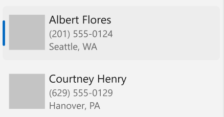

# Background

In WinUI 2.2, controls began to be re-designed to have rounded corners, marking a shift in our overall design language. 
There's more information on rounded corners in WinUI [here](https://docs.microsoft.com/en-us/windows/uwp/design/style/rounded-corner), 
but the general purpose of the rounded corners design shift is to evoke warmth and trust, 
and make the UI easier for users to visually process. 
Since this shift, certain controls have adopted the new styling and recieved rounded corners, but some have not. 
This creates a strong visual inconsistency in WinUI apps, where certain pieces of an app may look modern and others may look dated. 
A common example of this is ListView and GridView items. 
These are two very heavily used controls, but their items still have squared corners and look dated when placed alongside 
controls that are more modernly designed, such as 
[NavigationView](https://docs.microsoft.com/en-us/windows/uwp/design/controls-and-patterns/navigationview) 
or even [Button](https://docs.microsoft.com/en-us/windows/uwp/design/controls-and-patterns/buttons).  

This spec will detail a number of changes to update the designs of ListView and GridView so that they are more 
visually aligned with modern WinUI controls. At a high level, some key parts of these updated styles are: 
rounded corners, a new selection indicator, rounded checkboxes and new checkbox design for multiple selection, 
and an improved border design for GridView.

The new APIs for these features are on
[ListViewItemPresenter](https://docs.microsoft.com/uwp/api/Windows.UI.Xaml.Controls.Primitives.ListViewItemPresenter),
which is the low level Xaml element that draws items for both ListView and GridView
(there's no GridViewItempresenter).
An app can use these APIs directly, but most apps work just with ListView/GridView, which internally uses those elements.

The other way to configure these features is with new Xaml theme resource keys.
Theme resources aren't literally an API (no IDL), but an API-like pattern that should be 
documented in class pages on docs.microsoft.com.

## Visual Examples

**GridView in single selection mode:**

In the photo-based examples below, the first item is selected in both old and new versions. In the text-based examples, the first item is hovered and the third item is selected in both old and new versions.


**Multiple selection mode:**

When a GridView or ListView is using checkboxes for multiple selection, the checkboxs are now rounded.
In these examples
[ListViewBase.IsMultiSelectCheckBoxEnabled](https://docs.microsoft.com/uwp/api/Windows.UI.Xaml.Controls.ListViewBase.IsMultiSelectCheckBoxEnabled)
is true, and [ListViewBase.SelectionMode](https://docs.microsoft.com/uwp/api/Windows.UI.Xaml.Controls.ListViewBase.SelectionMode)
is set to to either Multiple or Extended.


**ListView in single selection mode:**

Single selection now uses a "pill" selection visualization (selection indicator):


**More ListView examples:**

The first example on the top left shows a rounded focus rect.
The second example on the top right shows extended selection mode. 
The samples in the bottom row show ListView items with different heights.

[ListViewBase.IsMultiSelectCheckBoxEnabled](https://docs.microsoft.com/uwp/api/Windows.UI.Xaml.Controls.ListViewBase.IsMultiSelectCheckBoxEnabled)
is false, so the selection indicator is not shown as checkboxes.


# API Pages

## ListView/GridView class

> Spec note: Following text is updates to existing class description

You can modify the look of a ListView/GridView by specifying Xaml resources in your app.
For more info, see the
[lightweight styling guide](https://docs.microsoft.com/en-us/windows/uwp/design/controls-and-patterns/xaml-styles#lightweight-styling).

| Resource key | Description |
| - | - |
| ListViewItemCornerRadius | Corner radius for corner rounding in a ListViewItem |
| GridViewItemCornerRadius | Corner radius for corner rounding in a GridViewItem |

By default, these theme resources use the `ControlCornerRadius` resource value -
so if you decide to modify corners for your whole app by defining that resource,
your ListView and GridView will apply those changes to their items as well.  

### Examples

Round the corners of items in a ListView to a radius of 5px, for the whole app.

```xml
<Application.Resources>
    <CornerRadius x:Key="ListViewItemCornerRadius">5</CornerRadius>
</Application.Resources>
```

## ListViewItemPresenter properties

> New properties for 
[ListViewItemPresenter](https://docs.microsoft.com/uwp/api/Windows.UI.Xaml.Controls.Primitives.ListViewItemPresenter).

`public CornerRadius CheckBoxCornerRadius { get; set; }`

Gets or sets the corner radius value for the checkbox shown in multiple selection mode, if [ListView.IsMultiSelectCheckBoxEnabled](https://docs.microsoft.com/uwp/api/Windows.UI.Xaml.Controls.ListViewBase.IsMultiSelectCheckBoxEnabled) is set.

`public Brush CheckBoxDisabledBrush { get; set; }`

Gets or sets the brush used to render the check box background of disabled items.

`public Brush CheckBoxSelectedBrush { get; set; }`

Gets or sets the brush used to render the check box background of selected items. 

`public Brush CheckBoxSelectedPointerOverBrush { get; set; }`

Gets or sets the brush used to render the check box background of selected pointer-over items. 

`public Brush CheckBoxSelectedPressedBrush { get; set; }`

Gets or sets the brush used to render the check box background of selected pressed items. 

`public Brush CheckBoxSelectedDisabledBrush { get; set; }`

Gets or sets the brush used to render the check box background of selected disabled items. 

`public Brush CheckBoxBorderBrush { get; set; }`

Gets or sets the brush used to render the check box border of ListView items. 

`public Brush CheckBoxPointerOverBorderBrush { get; set; }`

Gets or sets the brush used to render the check box border of pointer-over ListView items. 

`public Brush CheckBoxPressedBorderBrush { get; set; }`

Gets or sets the brush used to render the check box border of pressed ListView items. 

`public Brush CheckBoxDisabledBorderBrush { get; set; }`

Gets or sets the brush used to render the check box border of disabled ListView items. 

`public Brush SelectedDisabledBackground { get; set; }`

Gets or sets the brush used to render the background of selected disabled ListView items.

`public boolean SelectionIndicatorVisualEnabled { get; set; }`

Gets or sets a value that indicates whether the selection indicator should appear when ListView items are selected.

`public CornerRadius SelectionIndicatorCornerRadius { get; set; }`

Gets or sets the corner radius value for the selection indicator.

`public Brush SelectionIndicatorBrush { get; set; }`

Gets or sets the brush used to render the selection indicator shown on selected ListView items. 

`public Brush SelectionIndicatorPointerOverBrush { get; set; }`

Gets or sets the brush used to render the selection indicator shown on a selected ListViewItem that has the pointer over it. 

`public Brush SelectionIndicatorPressedBrush { get; set; }`

Gets or sets the brush used to render the selection indicator shown on a selected ListViewItem that is being pressed. 

`public Brush SelectionIndicatorDisabledBrush { get; set; }`

Gets or sets the brush used to render the selection indicator shown on a selected disabled ListViewItem. 

`public ListViewItemPresenterSelectionIndicatorMode SelectionIndicatorMode { get; set; }`

Specifies the alignment/style of the selection indicator that appears when ListView items are selected.

`public Brush PointerOverBorderBrush { get; set; }`

Gets or sets the brush used to render the outer border shown on a GridViewItem that has the pointer over it. 

`public Brush SelectedBorderBrush { get; set; }`

Gets or sets the brush used to render the outer selection border shown on selected GridView items. The existing SelectedPointerOverBorderBrush brush is used when the pointer is over the item. The thickness is driven by SelectedBorderThickness.

`public Brush SelectedPressedBorderBrush { get; set; }`

Gets or sets the brush used to render the outer selection border shown on selected & pressed GridView items.

`public Brush SelectedDisabledBorderBrush { get; set; }`

Gets or sets the brush used to render the outer selection border shown on selected & disabled GridView items.

`public Brush SelectedInnerBorderBrush { get; set; }`

Gets or sets the brush used to render the inner selection border shown on selected GridView items. The thickness is hard-coded to 1px.

`public Brush CheckBoxPointerOverBrush { get; set; }`

Gets or sets the brush used to render the pointer-over selection check box.

`public Brush CheckBoxPressedBrush { get; set; }`

Gets or sets the brush used to render the pressed selection check box.

`public Brush CheckPressedBrush { get; set; }`

Gets or sets the brush used to render the pressed selection checkmark.

`public Brush CheckDisabledBrush { get; set; }`

Gets or sets the brush used to render the disabled selection checkmark.


## ListViewItemPresenterSelectionIndicatorMode enum

Defines constants that specify the alignment/style of the selection indicator that appears when ListView items are selected. These field names align with existing ListViewItemPresenterCheckMode.

Fields:

| Field  | Value |
|--------|:-----:|
|   0 - Inline    |  Indicator visual appears inline with the ListViewItem content, aligned left by default.     |
|   1 - Overlay  |   Indicator visual shows over the ListViewItem content, aligned left by default.    |

Example of a ListView with an inline selection indicator:



Example of a ListView with an overlayed selection indicator:


## New ThemeResources

> Xaml controls can be configured in part by setting theme resources. Below are all of the new
theme resource keys, along with their default values.

### ListView

```xml
<ListViewItemPresenterSelectionIndicatorMode x:Key="ListViewItemSelectionIndicatorMode">Inline</ListViewItemPresenterSelectionIndicatorMode>

<x:Boolean x:Key="ListViewItemSelectionIndicatorVisualEnabled">True</x:Boolean>

<StaticResource x:Key="ListViewItemSelectionIndicatorDisabledBrush" ResourceKey="SystemAccentColor"/>

<StaticResource x:Key="ListViewItemSelectionIndicatorPressedBrush" ResourceKey="SystemAccentColor"/>

<StaticResource x:Key="ListViewItemSelectionIndicatorPointerOverBrush"  ResourceKey="SystemAccentColor"/>

<StaticResource x:Key="ListViewItemSelectionIndicatorBrush"  ResourceKey="SystemAccentColor"/>

<StaticResource x:Key="ListViewItemCheckBoxDisabledBrush"  ResourceKey="SystemAccentColor"/>

<StaticResource x:Key="ListViewItemCheckBoxSelectedBrush"  ResourceKey="SystemAccentColor"/>

<StaticResource x:Key="ListViewItemCheckBoxSelectedPointerOverBrush"  ResourceKey="SystemAccentColor"/>

<StaticResource x:Key="ListViewItemCheckBoxSelectedPressedBrush"  ResourceKey="SystemAccentColor"/>

<StaticResource x:Key="ListViewItemCheckBoxSelectedDisabledBrush"  ResourceKey="SystemAccentColor"/>

<StaticResource x:Key="ListViewItemCheckBoxBorderBrush"  ResourceKey="SystemAccentColor"/>

<StaticResource x:Key="ListViewItemCheckBoxPointerOverBorderBrush"  ResourceKey="SystemAccentColor"/>

<StaticResource x:Key="ListViewItemCheckBoxPressedBorderBrush"  ResourceKey="SystemAccentColor"/>

<StaticResource x:Key="ListViewItemCheckBoxDisabledBorderBrush"  ResourceKey="SystemAccentColor"/> 

<CornerRadius x:Key="ListViewItemSelectionIndicatorCornerRadius">2</CornerRadius>

<CornerRadius x:Key="ListViewItemCheckBoxCornerRadius">3</CornerRadius>

<CornerRadius x:Key="ListViewItemCornerRadius">4</CornerRadius>

```

### GridView:

```xml
<StaticResource x:Key="GridViewItemBackgroundSelectedDisabled"  ResourceKey="SystemAccentColor"/> 

<StaticResource x:Key="GridViewItemSelectedBorderBrush"  ResourceKey="SystemAccentColor"/>

<StaticResource x:Key="GridViewItemSelectedPointerOverBorderBrush"  ResourceKey="SystemAccentColor"/>

<StaticResource x:Key="GridViewItemSelectedPressedBorderBrush"  ResourceKey="SystemAccentColor"/> 

<StaticResource x:Key="GridViewItemSelectedDisabledBorderBrush"  ResourceKey="SystemAccentColor"/>

<StaticResource x:Key="GridViewItemCheckBoxDisabledBrush"  ResourceKey="SystemAccentColor"/>

<StaticResource x:Key="GridViewItemCheckBoxSelectedBrush"  ResourceKey="SystemAccentColor"/>

<StaticResource x:Key="GridViewItemCheckBoxSelectedPointerOverBrush"  ResourceKey="SystemAccentColor"/>

<StaticResource x:Key="GridViewItemCheckBoxSelectedPressedBrush"  ResourceKey="SystemAccentColor"/>

<StaticResource x:Key="GridViewItemCheckBoxSelectedDisabledBrush"  ResourceKey="SystemAccentColor"/>

<StaticResource x:Key="GridViewItemCheckBoxBorderBrush"  ResourceKey="SystemAccentColor"/>

<StaticResource x:Key="GridViewItemCheckBoxPointerOverBorderBrush"  ResourceKey="SystemAccentColor"/>

<StaticResource x:Key="GridViewItemCheckBoxPressedBorderBrush"  ResourceKey="SystemAccentColor"/>

<StaticResource x:Key="GridViewItemCheckBoxDisabledBorderBrush"  ResourceKey="SystemAccentColor"/>

<StaticResource x:Key="GridViewItemSelectedInnerBorderBrush"  ResourceKey="SystemAccentColor"/>

<CornerRadius x:Key="GridViewItemCheckBoxCornerRadius">3</CornerRadius>

<CornerRadius x:Key="GridViewItemCornerRadius">4</CornerRadius>

```

# API Details

```cs

unsealed runtimeclass ListViewItemPresenter
    : Controls.ContentPresenter
{
    // ... 
    // existing 
    // ...

    [contract(Windows.Foundation.UniversalApiContract, 13)]
    {
        Brush SelectedDisabledBackground;
        Brush CheckPressedBrush;
        Brush CheckDisabledBrush;
        Brush CheckBoxPointerOverBrush;
        Brush CheckBoxPressedBrush;
        Brush CheckBoxDisabledBrush;
        Brush CheckBoxSelectedBrush;
        Brush CheckBoxSelectedPointerOverBrush;
        Brush CheckBoxSelectedPressedBrush;
        Brush CheckBoxSelectedDisabledBrush;
        Brush CheckBoxBorderBrush;
        Brush CheckBoxPointerOverBorderBrush;
        Brush CheckBoxPressedBorderBrush;
        Brush CheckBoxDisabledBorderBrush;
        CornerRadius CheckBoxCornerRadius;
        CornerRadius SelectionIndicatorCornerRadius;
        Boolean SelectionIndicatorVisualEnabled;
        Windows.UI.Xaml.Controls.Primitives.ListViewItemPresenterSelectionIndicatorMode SelectionIndicatorMode;
        Brush SelectionIndicatorBrush;
        Brush SelectionIndicatorPointerOverBrush;
        Brush SelectionIndicatorPressedBrush;
        Brush SelectionIndicatorDisabledBrush;
        Brush SelectedBorderBrush;
        Brush SelectedPressedBorderBrush;
        Brush SelectedDisabledBorderBrush;
        Brush SelectedInnerBorderBrush;
        Brush PointerOverBorderBrush;

        static DependencyProperty SelectedDisabledBackgroundProperty{ get; };
        static DependencyProperty CheckPressedBrushProperty{ get; };
        static DependencyProperty CheckDisabledBrushProperty{ get; };
        static DependencyProperty CheckBoxPointerOverBrushProperty{ get; };
        static DependencyProperty CheckBoxPressedBrushProperty{ get; };
        static DependencyProperty CheckBoxDisabledBrushProperty{ get; };
        static DependencyProperty CheckBoxSelectedBrushProperty{ get; };
        static DependencyProperty CheckBoxSelectedPointerOverBrushProperty{ get; };
        static DependencyProperty CheckBoxSelectedPressedBrushProperty{ get; };
        static DependencyProperty CheckBoxSelectedDisabledBrushProperty{ get; };
        static DependencyProperty CheckBoxBorderBrushProperty{ get; };
        static DependencyProperty CheckBoxPointerOverBorderBrushProperty{ get; };
        static DependencyProperty CheckBoxPressedBorderBrushProperty{ get; };
        static DependencyProperty CheckBoxDisabledBorderBrushProperty{ get; };
        static DependencyProperty CheckBoxCornerRadiusProperty{ get; };
        static DependencyProperty SelectionIndicatorCornerRadiusProperty{ get; };
        static DependencyProperty SelectionIndicatorVisualEnabledProperty{ get; };
        static DependencyProperty SelectionIndicatorModeProperty{ get; };
        static DependencyProperty SelectionIndicatorBrushProperty{ get; };
        static DependencyProperty SelectionIndicatorPointerOverBrushProperty{ get; };
        static DependencyProperty SelectionIndicatorPressedBrushProperty{ get; };
        static DependencyProperty SelectionIndicatorDisabledBrushProperty{ get; };
        static DependencyProperty SelectedBorderBrushProperty{ get; };
        static DependencyProperty SelectedPressedBorderBrushProperty{ get; };
        static DependencyProperty SelectedDisabledBorderBrushProperty{ get; };
        static DependencyProperty SelectedInnerBorderBrushProperty{ get; };
        static DependencyProperty PointerOverBorderBrushProperty{ get; };
    }  
};
```

```cs

namespace Windows.UI.Xaml.Controls.Primitives
{

    [contract(Windows.Foundation.UniversalApiContract, 13)]
    [webhosthidden]
    enum ListViewItemPresenterSelectionIndicatorMode
    {
        Inline,
        Overlay,
    };
}
```

# Appendix

## Overhauling the built-in template with an existing style

These new styles are "opt-in" - you'll need the latest version of WinUI to recieve them, and WinUI2 will have a style that sets these properties. However, if you're using the newest version of WinUI and still want to change your styles back, read below. 

ListView items are still customizable via the ListView's 
[ItemTemplate](https://docs.microsoft.com/en-us/uwp/api/windows.ui.xaml.controls.itemscontrol.itemtemplate?view=winrt-19041#Windows_UI_Xaml_Controls_ItemsControl_ItemTemplate)
property, but the default built-in styles (rounded corners, selection indicator) will
be combined with the style that you provide. To change these new default style components, you have a few options:

1. [Edit the control template](https://docs.microsoft.com/windows/uwp/design/controls-and-patterns/control-templates) of ListView or GridView.

2. Use an [ItemsRepeater](https://docs.microsoft.com/windows/uwp/design/controls-and-patterns/items-repeater), which allows for full customization and doesn't come with any pre-built selection model or selection visuals. 


## Miscellaneous Implementation Details

### New Visual State Group and States:

#### For reference, existing visual group and states for the SelectionMode==Multiple option: 

**VisualStateGroup MultiSelectStates**

VisualState MultiSelectDisabled  for selectionMode != Multiple

VisualState MultiSelectEnabled   for selectionMode == Multiple


#### New visual group and states for the Selection==Single or Extended options: 

**VisualStateGroup SelectionIndicatorStates**

VisualState SelectionIndicatorDisabled  for selectionMode == None or Multiple

VisualState SelectionIndicatorEnabled   for selectionMode == Single or Extended

### Changes to existing APIs:
All of the following APIs will affect the rounded backplate of the item, rather than the overall footprint as they did prior. 

`public Brush PointerOverBackground { get; set; }`

`public Brush SelectedBackground { get; set; }`

`public Brush SelectedPointerOverBackground { get; set; }`

`public Brush PressedBackground { get; set; }`

`public Brush SelectedPressedBackground { get; set; }`

## Detailed Task Breakdown for styling implementation

1. GridView visual improvements

    a. Items have rounded corners at rest.

    b. Items have a new rounded inner white border when in selected states (including multiple and single selection modes).

    c. In all non-rest states, items have a rounded grey backplate. For Selected and Pressed states, backplate slightly darker than hover backplate. 

    d. In hover state specifically: Items have a rounded, light grey border and a backplate with a light grey fill (same color as ListView).

    e. Existing accent color border that’s displayed in selected states will have rounded corners to match items.

    f. Focus rect will need to be rounded to adhere to shape of backplate.

2. ListView visual improvement

    a. A rounded gray backplate will be added within the footprint of the item, with 2px top/bottom  and 4px left/right margin from the overall footprint on all sides. This backplate will appear in all non-rest states.

    b. An accent color selection indicator visual will appear left-aligned to the backplate with no left margin when an item is selected/clicked in any state. 

    c. Items will need a 2px top/bottom margin to be distinct from one another. This margin should be taken from the backplate. The overall footprint of item shouldn’t change. 

    d. Focus rect will need to be rounded to adhere to backplate rather than overall footprint.

    e. APIs will be added to support the new selection indicator and backplate. See API notes for more details.

3. Checkbox visual changes for ListView and GridView

    a. Round and update checkbox visuals used for multiple selection mode in ListView and GridView so that they match the current styling and behavior of CheckBox control (in terms of color, font, shape, animation).

    b. GridView checkbox should have rounded corners a dark grey border.

    c. On pressed and disabled states, GridView checkbox border color lightens. 

4. Inset backplate interaction for ListView controls

    a. ListView items will now have an inset rounded backplate that is smaller than their overall footprint. The overall footprint should still be clickable and have the same interaction as if you’d clicked on the inset backplate.

5. Add animation for selection indicator

    a. Add animations for reveal/dismissal of selection indicator for ListView controls. The animation will consist of the indicator going from invisible -> small -> full size upon reveal, and full size -> smaller -> invisible upon dismissal. This animation will apply to both single and extended selection modes if applicable.

6. Miscellaneous

    a. Implement global resources that allow the developer to un-round any/all GridView or ListView item corners, similar to the ControlCornerRadius resource that currently exists but does not directly affect ListView/GridViewItems.

    b. If the developer chooses to un-round corners, borders on selected GridView items should be un-rounded as well. Checkboxes within GridViewItems in multiple selection mode should be inset 1px from their original location in this scenario. Focus rects for ListView and GridView  should be un-rounded.

### Selection Indicator specifics
The selection indicator should be centered with a fixed margin on the top and bottom, and a minimum height of 16px. With this system, items with a line height of one or two will have the same size indicator (minimum size indicator), but it will grow larger as the line height increases. 
