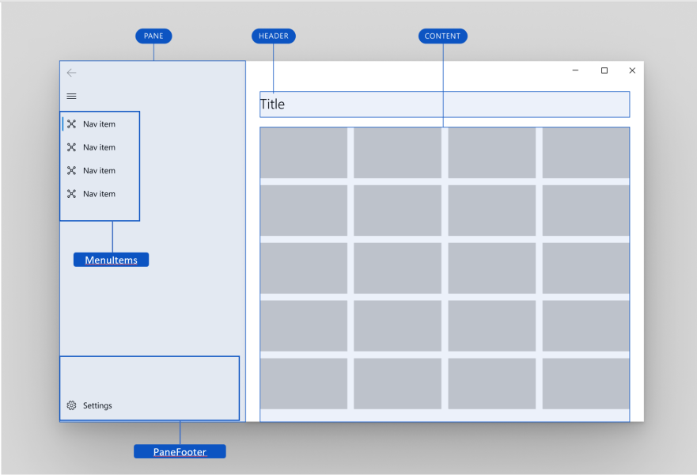
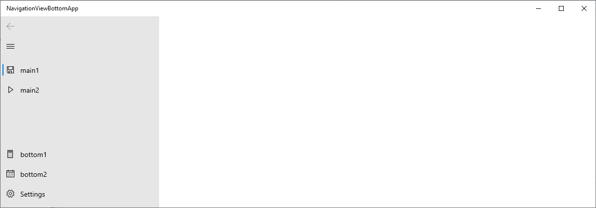
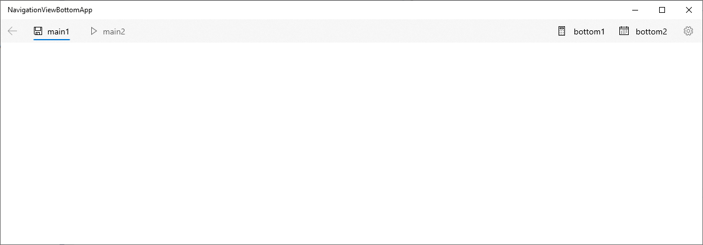
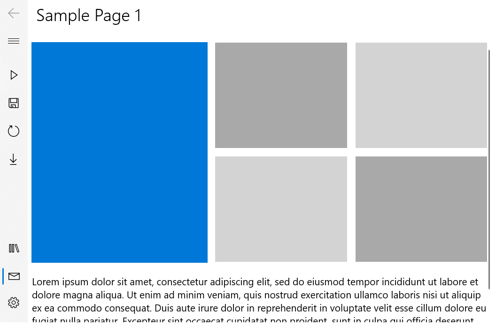

# Background
Today, [NavigationView](https://docs.microsoft.com/en-us/windows/uwp/design/controls-and-patterns/navigationview)
provides a place in its
[Pane](https://docs.microsoft.com/en-us/windows/uwp/design/controls-and-patterns/navigationview) 
to show any number of items.
The primary purpose of these items is to be a list of navigation links within the app that hosts NavigationView,
likely as a root element.
This navigation list is top aligned when NavigationView is shown in one of its left 
[display modes](https://docs.microsoft.com/en-us/windows/uwp/design/controls-and-patterns/navigationview#display-modes), 
and left aligned when NavigationView is in its top 
[display mode](https://docs.microsoft.com/en-us/windows/uwp/design/controls-and-patterns/navigationview#display-modes).
See the left-aligned NavigationView example below for reference:



NavigationView provides a built-in 
[Settings item](https://docs.microsoft.com/en-us/uwp/api/microsoft.ui.xaml.controls.navigationview.settingsitem?view=winui-2.3), 
which is always positioned at the bottom or right of the Pane, and a 
[PaneFooter](https://docs.microsoft.com/en-us/uwp/api/microsoft.ui.xaml.controls.navigationview.panefooter?view=winui-2.3) 
area that positions custom content adjacent to the Settings item.
Although an app developer can place any content into PaneFooter, including other NavigationViewItems, 
this content will not participate in the selection model and animations of 
the MenuItems navigation list and Settings item. So if an item in MenuItems is selected, and the user
clicks on an item in the PaneFooter, it will not de-select the previous item.

Some apps may wish to visually group navigation items into top-aligned and bottom-aligned lists
(or left- and right-aligned lists), for example:





While this grouping is possible today by putting NavigationViewItems into the PaneFooter, 
the approach creates a poor selection and interaction experience as described above.
That's being corrected in this spec with a new FooterMenuItems property.

As a result, keyboard and assistive technology users will feel that the footer list behavior meets
their expectations -  the top and bottom menu items will be specified as two separate lists, 
but it will be smooth to navigate from one to the other. See more in Accessibility section below.
Selection behavior and animations will also feel better integrated into the whole NavigationView control, 
as bottom menu items will participate in the same selection model as top menu items. 

# Description

## NavigationView.FooterMenuItems

Use the FooterMenuItems to place navigation items at the end of the navigation pane,
contrasted with the MenuItems property which places items at the start of the pane.

```cs
public IList<object> FooterMenuItems { get; }
```

The default Settings item will be added to into the FooterMenuItems collection at compile time - therefore, adding items into FooterMenuItems will by default display them before the Settings item. 
The Settings item can still be toggled using the `IsSettingsVisible` property. 
Note: this is the recommended way to remove the Settings item, although it's possible 
to remove it manually by removing it from the FooterMenuItems collection itself. Adding or moving the Settings item is not a supported scenario.

Below is an example of a NavigationView with a FooterMenu where the Mail item is selected.



See also the `FooterMenuItemsSource` property.

## NavigationView.SettingsItem

_This isn't a new property to this spec, but has new behavior remarks here_

Gets the navigation item that represents the entry point to app settings.

```cs
public object SettingsItem { get; }
```

### Remarks

This item also appears by default as the last item in the `FooterMenuItems` collection.
To remove the settings item, though, rather than removing it from the collection,
use the `IsSettingsVisible` property.

## NavigationView.PaneFooter

_This isn't a new property to this spec, but has new behavior remarks here_

Gets or sets the content for the pane footer.

### Remarks

_In addition to existing remarks ..._

The PaneFooter is placed at the end of the navigation pane, but before the 
FooterMenuItems. You can place any content into the PaneFooter, but you should not
put NavigationViewItems into it, because they will not participate in the 
selection model for the NavigationView; clicking on them will not raise the
[NavigationView.SelectionChanged](https://docs.microsoft.com/uwp/api/Microsoft.UI.Xaml.Controls.NavigationView.SelectionChanged)
event.

# Examples

## Add footer menu items in markup

```xaml
    <muxc:NavigationView>
        <muxc:NavigationView.MenuItems>
            <muxc:NavigationViewItem Icon="Play" Content="main1"/>
            <muxc:NavigationViewItem Icon="Save" Content="main2"/>
            <muxc:NavigationViewItem Icon="Refresh" Content="main2"/>
            <muxc:NavigationViewItem Icon="Download" Content="main2"/>
        </muxc:NavigationView.MenuItems>

        <muxc:NavigationView.FooterMenuItems>
            <muxc:NavigationViewItem Icon="Library" Content="bottom1" Padding="0,0,12,0"/>
            <muxc:NavigationViewItem Icon="Mail" Content="bottom2" Padding="0,0,12,0"/>
        </muxc:NavigationView.FooterMenuItems>
        
    </muxc:NavigationView>
```


# API Notes

`public IList<object> FooterMenuItems { get; }`

Gets the list of objects to be used as navigation items in the footer menu.

`public object FooterMenuItemsSource { get; set; }`

Sets or gets the object that represents the navigation items to be used in the footer menu.

# API Details

```c++
unsealed runtimeclass NavigationView : Windows.UI.Xaml.Controls.ContentControl
{
    {
        Windows.Foundation.Collections.IVector<Object> FooterMenuItems{ get; };
        Object FooterMenuItemsSource { get; set; };
    }
    
    static Windows.UI.Xaml.DependencyProperty FooterMenuItemsProperty{ get; };
    static Windows.UI.Xaml.DependencyProperty FooterMenuItemsSourceProperty{ get; };
}
```

# Appendix

## Selection
When users invoke a navigation item, that item will become selected and show its selection indicator. 
At most one navigation item can be selected at a given time.
The selection indicator will animate smoothly between items in the MenuItems list and FooterMenuItems list including the optional built-in Settings menu item.

In order to achieve consistent animations and allow for only one navigation item to be selected at a time, all navigation items should be in the same selection model. To achieve this, a large collection that consists of two smaller collections (specifically FooterMenuItems and MenuItems) will be used as the source.

## Accessibility
Screen readers will announce MenuItems and FooterMenuItems as two separate lists, including position in set. 
Unlike previous behavior, the Settings item will be announced as a part of the FooterMenuItems list - specifically, its index should be announced relative to the other items in the list. For example, if there are three elements in the FooterMenuItemsList, Settings would be announced as 3 of 3.

### Keyboarding
Given the following list, keyboarding actions should be as follows:
- Home
- Mail

<!-- -->

- Account
- Sync Now
- Settings

Users should be able to Tab between these two lists.

If keyboard focus is on Mail:
- Up arrow moves focus to Home
- Down arrow moves focus to Account
- Tab moves focus to Account (unless an item in the FooterMenu is selected, in which case focus should go to that item).
- Home moves focus to Home
- End does nothing

If keyboard focus is on Account:
- Up arrow moves focus to Mail
- Down arrow moves focus to Sync Now
- Tab moves focus to the first focusable item in NavigationView's Header or Content (same behavior as on Settings item today).
- Home does nothing
- End moves focus to Settings

If keyboard focus is on Settings:
- Up arrow moves focus to Sync Now
- Down arrow does nothing (same as today)
- Tab moves focus to a Header or Content item (same as today).
- Home moves focus to Account
- End does nothing
