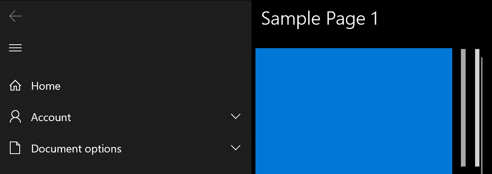
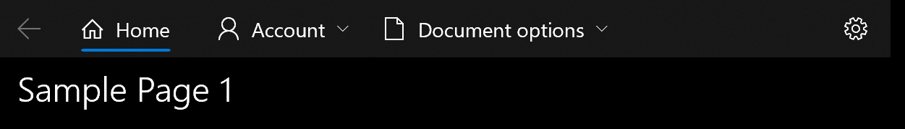
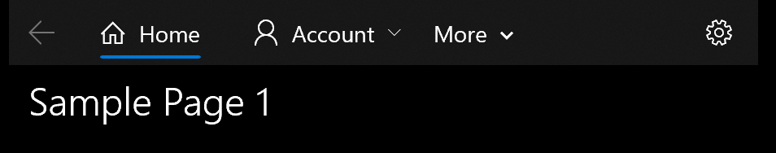

# Background

A customer requested the ability to change the default size of the chevrons in hierarchical NavigationView using lightweight styling. 
Today, the sizes are hardcoded and require retemplating to modify. 

Here's what the chevrons look like today.

As you can see from the screenshots, the hierarchical items' chevrons use two different sizes depending on layout, left or top. 
To simplify the lightweight styling story and reduce the number of new resources, there's a suggestion to **unify on a single chevron size**.

In addition, there's a difference in visual treatment between the hierarchical items' chevrons and the overflow More button's chevrons when in top mode.
The difference feels deliberate because the behaviors of these items are different: the items' chevrons are a separate hit target while the more chevron is part of the more button's hit target.

There's a customer proposal that I hope to receive design feedback on: **increase the default chevron size of the hierarchical items when in top mode and introduce a new "double chevron" metaphor for the more button:**

# Proposed fix
The recommendation from design is to replace the More button, both text and chevron, with an ellipsis glyph. We should use the same button treatment as the overflow button in CommandBar.
