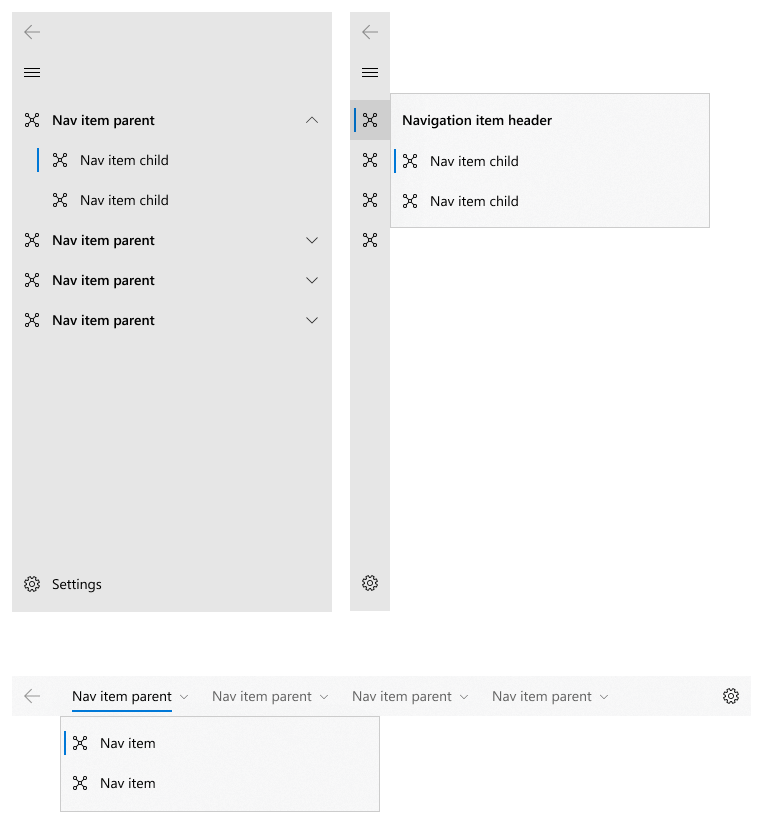

# Background
The Xaml [NavigationView](https://docs.microsoft.com/uwp/api/Microsoft.UI.Xaml.Controls.NavigationView) control enables navigation of app content. It has a header, a view for the main content, and a menu pane for navigation commands. There is additional discussion about how to use this control in the [Navigation view](https://docs.microsoft.com/en-us/windows/uwp/design/controls-and-patterns/navigationview) design document.

Currently, NavigationView's MenuItems list allows for displaying a flat list of items in the pane. 
It's common for apps to want to present users with a hierarchical navigation tree. 
This feature adds the capability to nest items within the pane.

# Hierarchy
To show a hierarchical list of nested navigation items in the pane, use NavigationViewItem's `MenuItems` property.
Each *NavigationViewItem* can contain other NavigationViewItems and organizing elements like item headers and separators. 
Although NavigationViewItem can contain any number of nested levels, we recommend keeping your app’s navigation hierarchy shallow. 
We believe two levels is ideal for usability and comprehension.

NavigationView shows hierarchy in all its pane display modes, including Top and LeftCompact.

*Note:* The following is a comp and will be updated with screenshots before this doc is published.


## Selection
By default, any item can contain children, be invoked, or be selected.
There's more detail about the [ItemInvoked](https://docs.microsoft.com/en-us/uwp/api/microsoft.ui.xaml.controls.navigationview.iteminvoked?view=winui-2.3) and [SelectionChanged](https://docs.microsoft.com/en-us/uwp/api/microsoft.ui.xaml.controls.navigationview.selectionchanged?view=winui-2.3) events later in this document.
When providing users with a hierarchical tree of navigation options, you may choose to make parent items non-selectable, for example when your app doesn't have a destination page associated with that parent item.
To prevent an item from showing the selection indicator when invoked, set its [SelectsOnInvoked](https://docs.microsoft.com/en-us/uwp/api/microsoft.ui.xaml.controls.navigationviewitem.selectsoninvoked?view=winui-2.3) property to False.

Selected items will draw their selection indicators along their left edge when in left mode or their bottom edge when in top mode. 
The selected item may not always remain visible.
For example, the selected item may be a child node inside a non-expanded subtree.
In this situation, the first visible ancestor of the selected item will show as selected, and the selection indicator will move as users expand the subtree. 
The entire navigation view will show no more than one selection indicator.

## Keyboarding
Users can move focus around the navigation view using their [keyboard](https://docs.microsoft.com/en-us/windows/uwp/design/input/keyboard-interactions). 
The arrow keys expose "inner navigation" within the pane and follow the interactions provided in [tree view](https://docs.microsoft.com/en-us/windows/uwp/design/controls-and-patterns/tree-view).
- **Up arrow** moves focus to the item directly above the item currently in focus
- **Down arrow** moves focus the item directly below the item currently in focus; note that the items do not need to be visually adjecent, focus will move from the last item in the pane's list to the settings item.
- **Right arrow**
  - if the current item is a collapsed parent with children, right arrow expands the item but does not move focus
  - if the current item is an expanded parent with children, right arrow moves focus to the first child
  - if the current item is a leaf node, right arrow does nothing
- **Left arrow** 
  - if the current item is a collapsed parent with children, left arrow does nothing
  - if the current item is an expanded parent with children, left arrow collapse the item but does not move focus
  - if the current item is a leaf node, left arrow moves focus to the current item's parent

# Examples

## Add items in markup
Declare app navigation hierarchy in markup.

```Xaml
<muxc:NavigationView>
    <muxc:NavigationView.MenuItems>
        <muxc:NavigationViewItem Content="Home" Icon="Home" ToolTipService.ToolTip="Home"/>
        <muxc:NavigationViewItem Content="Collections" 
                            Icon="Keyboard" ToolTipService.ToolTip="Collections">
            <muxc:NavigationViewItem.MenuItems>
                <muxc:NavigationViewItem Content="Bookshelf" 
                                Icon="Library" ToolTipService.ToolTip="Bookshelf"/>
                <muxc:NavigationViewItem Content="Mail" 
                                Icon="Mail" ToolTipService.ToolTip="Mail"/>
            </muxc:NavigationViewItem.MenuItems>
        </muxc:NavigationViewItem>
    </muxc:NavigationView.MenuItems>
</muxc:NavigationView>
```

## Add items using data binding


# Remarks
<!-- Explanation and guidance that doesn't fit into the Examples
section.  For example, see the Remarks for the MediaPlayerElement 
(https://docs.microsoft.com/uwp/api/Windows.UI.Xaml.Controls.MediaPlayerElement#remarks). -->


# API Notes
<!-- Give a one or two line description of each API (type
and member), or at least the ones that aren't obvious
from their name.  These descriptions are what show up
in IntelliSense. -->


# API Details
```c++
[WUXC_VERSION_PREVIEW]
[webhosthidden]
runtimeclass NavigationViewExpandingEventArgs
{
    NavigationViewItemBase ExpandingItemContainer { get; };
}

[WUXC_VERSION_PREVIEW]
[webhosthidden]
runtimeclass NavigationViewCollapsedEventArgs
{
    NavigationViewItemBase CollapsedItemContainer { get; };
}

[WUXC_VERSION_RS3]
[webhosthidden]
[WUXC_INTERFACE_NAME("INavigationView", f209ce15-391a-42ca-9fc6-f79da65aca32)]
[WUXC_STATIC_NAME("INavigationViewStatics", 363a86c7-72da-4420-b871-15d9d0d45756)]
[WUXC_CONSTRUCTOR_NAME("INavigationViewFactory", e50687c1-b7c2-4975-ad7a-5f4fe6a514c9)]
[MUX_PROPERTY_CHANGED_CALLBACK(TRUE)]
[MUX_PROPERTY_CHANGED_CALLBACK_METHODNAME("OnPropertyChanged")]
unsealed runtimeclass NavigationView : Windows.UI.Xaml.Controls.ContentControl
{
...
    [WUXC_VERSION_PREVIEW]
    {
        event Windows.Foundation.TypedEventHandler<NavigationView, NavigationViewExpandingEventArgs> Expanding;
        event Windows.Foundation.TypedEventHandler<NavigationView, NavigationViewCollapsedEventArgs> Collapsed;

        void Expand(NavigationViewItem item);
        void Collapse(NavigationViewItem item);
    }
}

[WUXC_VERSION_RS3]
[webhosthidden]
[WUXC_INTERFACE_NAME("INavigationViewItemBase", edf04eb1-37d1-471f-8570-3829ee5b2bc6)]
[WUXC_CONSTRUCTOR_NAME("INavigationViewItemBaseFactory", eb014cef-7890-4ebb-8245-02e8510f321d)]
[default_interface]
unsealed runtimeclass NavigationViewItemBase : Windows.UI.Xaml.Controls.ContentControl
{
    [WUXC_VERSION_PREVIEW]
    {
        Boolean IsSelected{ get; set; };
        static Windows.UI.Xaml.DependencyProperty IsSelectedProperty { get; };
    }
}

[WUXC_VERSION_RS3]
[webhosthidden]
[WUXC_INTERFACE_NAME("INavigationViewItem", 8614be0f-b7b6-4851-960a-f5e3f69f624a)]
[WUXC_STATIC_NAME("INavigationViewItemStatics", 803c0081-fda5-4b90-aace-3f2306dbe5c4)]
[WUXC_CONSTRUCTOR_NAME("INavigationViewItemFactory", 973bdb4a-7e08-4f76-923c-f12bd685e86e)]
unsealed runtimeclass NavigationViewItem : NavigationViewItemBase
{
...
    [WUXC_VERSION_PREVIEW]
    {
        [MUX_DEFAULT_VALUE("false")]
        Boolean IsExpanded{ get; set; };
        [MUX_DEFAULT_VALUE("false")]
        Boolean HasUnrealizedChildren{ get; set; };
        [MUX_DEFAULT_VALUE("false")]
        Boolean IsChildSelected{ get; };

        [MUX_PROPERTY_CHANGED_CALLBACK(TRUE)]
        Windows.Foundation.Collections.IVector<Object> MenuItems{ get; };
        [MUX_PROPERTY_CHANGED_CALLBACK(TRUE)]
        Object MenuItemsSource{ get; set; };

        static Windows.UI.Xaml.DependencyProperty IsExpandedProperty{ get; };
        static Windows.UI.Xaml.DependencyProperty HasUnrealizedChildrenProperty{ get; };
        static Windows.UI.Xaml.DependencyProperty IsChildSelectedProperty{ get; };
        static Windows.UI.Xaml.DependencyProperty MenuItemsProperty{ get; };
        static Windows.UI.Xaml.DependencyProperty MenuItemsSourceProperty{ get; };
    }
}

```

# Appendix
<!-- Anything else that you want to write down for posterity, but 
that isn't necessary to understand the purpose and usage of the API.
For example, implementation details. -->
