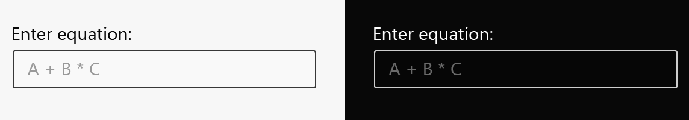
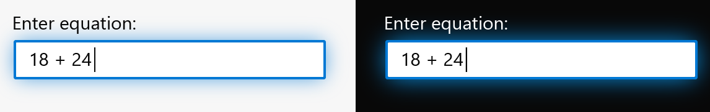
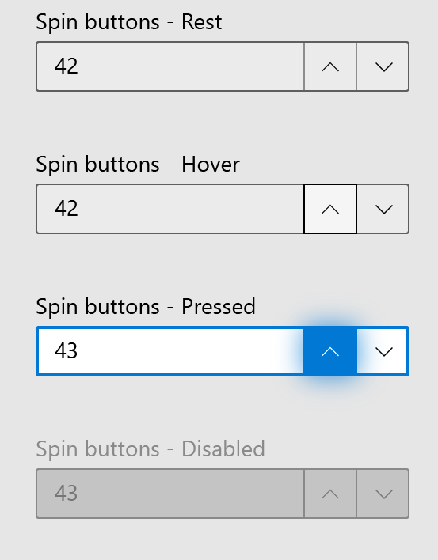

# Number box

<!-- The purpose of this spec is to describe a new feature and
its APIs that make up a new feature in WinUI. -->

<!-- There are two audiences for the spec. The first are people
that want to evaluate and give feedback on the API, as part of
the submission process.  When it's complete
it will be incorporated into the public documentation at
docs.microsoft.com (http://docs.microsoft.com/uwp/toolkits/winui/).
Hopefully we'll be able to copy it mostly verbatim.
So the second audience is everyone that reads there to learn how
and why to use this API. -->

## Background
<!-- Use this section to provide background context for the new API(s) 
in this spec. -->

<!-- This section and the appendix are the only sections that likely
do not get copied to docs.microsoft.com; they're just an aid to reading this spec. -->

<!-- If you're modifying an existing API, included a link here to the
existing page(s) -->

<!-- For example, this section is a place to explain why you're adding this API rather than
modifying an existing API. -->

<!-- For example, this is a place to provide a brief explanation of some dependent
area, just explanation enough to understand this new API, rather than telling
the reader "go read 100 pages of background information posted at ...". -->


## Description
<!-- Use this section to provide a brief description of the feature.
For an example, see the introduction to the PasswordBox control 
(http://docs.microsoft.com/windows/uwp/design/controls-and-patterns/password-box). -->

Number box is a numerics only text control with support for validation, increment stepping, and computing inline calculations.

**Important APIs:** [NumberBox class](https://docs.microsoft.com/en-us/uwp/api/microsoft.ui.xaml.controls.numberbox) [TODO - generated with MSDN documentation on publication.]

## Is this the right control? 

Use a **NumberBox** to capture and display mathematical input. A **NumberBox** can also be enabled with basic calculator support to compute multiplication, division, addition, and subtraction across parenthetical order with standard operator precedence.

## Examples
<!-- Use this section to explain the features of the API, showing
example code with each description. The general format is: 
  feature explanation,
  example code
  feature explanation,
  example code
  etc.-->
  
<!-- Code samples should be in C# and/or C++/WinRT -->

<!-- As an example of this section, see the Examples section for the PasswordBox control 
(https://docs.microsoft.com/windows/uwp/design/controls-and-patterns/password-box#examples). -->

### Create a simple NumberBox

XAML
```XAML
<NumberBox AutomationProperties.Name="simple NumberBox" Header="Enter equation:" PlaceholderText="A + B * C" />
```



### Enable calculation support

XAML
```XAML
<NumberBox AutomationProperties.Name="NumberBox for simple calculations" 
    Header="Enter equation:" 
    PlaceholderText="A + B * C" 
    AcceptsCalculation="True" />
```



### Add increment and decrement stepping

XAML
```XAML
<NumberBox AutomationProperties.Name="NumberBox for items in order" 
    StepFrequency="0.1"
    SpinButtonPlacementMode="Inline"
    HyperDragEnabled="True" 
    HyperScrollEnabled="True" />
```



### Format display and output

XAML
```XAML
<NumberBox AutomationProperties.Name="NumberBox for solution components" 
    Header="Enter a percentage:"
    PlaceholderText="2/3" 
    MinMaxMode="WrapEnabled"
    MinValue="0"
    MaxValue="100" 
    AreLeadingZerosTrimmed="False"
    DecimalPrecision="5"
    DoesInputRound=False" />
```

## Remarks
<!-- Explanation and guidance that doesn't fit into the Examples section. -->

<!-- APIs should only throw exceptions in exceptional conditions; basically,
only when there's a bug in the caller, such as argument exception.  But if for some
reason it's necessary for a caller to catch an exception from an API, call that
out with an explanation either here or in the Examples -->

## API Notes
<!-- Option 1: Give a one or two line description of each API (type
and member), or at least the ones that aren't obvious
from their name.  These descriptions are what show up
in IntelliSense. For properties, specify the default value of the property if it
isn't the type's default (for example an int-typed property that doesn't default to zero.) -->

<!-- Option 2: Put these descriptions in the below API Details section,
with a "///" comment above the member or type. -->


## API Notes

### Notable Properties  

| Name | Description |
|:-:|:--|
| StepFrequency | Gets or sets the value part of a value range that steps should be created for. |

## API Details
<!-- The exact API, in MIDL3 format (https://docs.microsoft.com/en-us/uwp/midl-3/) -->

```c++ 
enum NumberBoxSpinButtonPlacementMode
{
    Hidden,
    Inline,
};

enum NumberBoxBasicValidationMode
{
    InvalidInputOverwritten,
    IconMessage,
    TextBlockMessage,
    Disabled,
};

enum NumberBoxMinMaxMode
{
    None,
    MinEnabled,
    MaxEnabled,
    MinAndMaxEnabled,
    WrapEnabled,
};

runtimeclass NumberBoxValueChangedEventArgs
{
    String Text;
    Double Value
};

runtimeclass NumberBoxTextChangedEventArgs
{
    String Text;
    Double Value
};

unsealed runtimeclass NumberBox : Windows.UI.Xaml.Controls.TextBox
{
    NumberBox();
    
    Double Value;
    
    NumberBoxBasicValidationMode BasicValidationMode;
    TextBlock ValidationErrorMessage;
    
    Boolean AcceptsCalculation;
    Boolean EnterTriggersEvaluation;
    
    NumberBoxSpinButtonPlacementMode SpinButtonPlacementMode;
    Boolean HyperDragEnabled;
    Boolean HyperScrollEnabled;
    Double StepFrequency;
  
    Boolean AreLeadingZerosTrimmed;
    Double DecimalPrecision;
    Boolean DoesInputRound;
    
    NumberBoxMinMaxMode MinMaxMode;
    Double MinValue;
    Double MaxValue;

    NumberBoxTemplateSettings TemplateSettings{ get; };

    event Windows.Foundation.TypedEventHandler<NumberBox, NumberBoxValueChangedEventArgs> ValueChanged;
    event Windows.Foundation.TypedEventHandler<NumberBox, NumberBoxTextChangedEventArgs> TextChanged;

    static Windows.UI.Xaml.DependencyProperty ValueProperty{ get; };
    
    static Windows.UI.Xaml.DependencyProperty BasicValidationModeProperty{ get; };
    static Windows.UI.Xaml.DependencyProperty ValidationErrorMessageProperty{ get; };
    
    static Windows.UI.Xaml.DependencyProperty AcceptsCalculationProperty{ get; };
    static Windows.UI.Xaml.DependencyProperty EnterTriggersEvaluationProperty{ get; };
    
    static Windows.UI.Xaml.DependencyProperty SpinButtonEnabledProperty{ get; };
    static Windows.UI.Xaml.DependencyProperty HyperDragEnabledProperty{ get; };
    static Windows.UI.Xaml.DependencyProperty HyperScrollEnabledProperty{ get; };   
    static Windows.UI.Xaml.DependencyProperty StepFrequencyProperty{ get; };
    
    static Windows.UI.Xaml.DependencyProperty AreLeadingZerosTrimmedProperty{ get; };
    static Windows.UI.Xaml.DependencyProperty DecimalPrecisionProperty{ get; };
    static Windows.UI.Xaml.DependencyProperty DoesInputRoundProperty{ get; };
    
    static Windows.UI.Xaml.DependencyProperty MinMaxModeProperty{ get; };
    static Windows.UI.Xaml.DependencyProperty MinValueProperty{ get; };
    static Windows.UI.Xaml.DependencyProperty MaxValueProperty{ get; };
}
```

## Appendix
<!-- Anything else that you want to write down for posterity, but 
that isn't necessary to understand the purpose and usage of the API.
For example, implementation details. -->

### Behavioral Components

| Property | Notes |
|:---:|:---|
| InputScope | "Number" will be used for the InputScope. This may be overwritten by the developer but alternative InputScope types will not be explicitly supported. | 
| AcceptsCalculation | NumberBox will provide computation support for multiplication, division, addition, and subtraction across parenthetical order with standard operator precedence; i.e., [ 0-9()+-/* ] |
| Validation | * If BasicValidationMode="Disabled", no automatic validation will occur. This setting allows developers to configure custom validation via [Input Validation]( https://github.com/microsoft/microsoft-ui-xaml-specs/blob/user/lucashaines/inputvalidation/active/InputValidation/InputValidation.md). <br><br> * If BasicValidationMode="TextBlockMessage" or BasicValidationMode="IconMessage", input that is outside the bounds of MinValue/MaxValue or non-numerical/formulaic will trigger a validation warning consistent with [Input Validation]( https://github.com/microsoft/microsoft-ui-xaml-specs/blob/user/lucashaines/inputvalidation/active/InputValidation/InputValidation.md). A MinValue error will display "Minimum is [MinValue]." A MaxValue error will display "Maximum is [MaxValue]." Input errors will display "Only use numbers and ()+-/*." <br><br> * If BasicValidationMode="InvalidInputOverwritten", input that is non-numerical/formulaic will automatically be overwritten with the last legal value. Input that is outside the bounds of MinValue/MaxValue will be coerced to the respective bound. |
| Events | * Loss of focus, "=", and stepping [SEE API NOTES > SPINBUTTON && HYPER SCROLL && HYPER DRAG && KEYBOARD STEPPING] will trigger evalution. <br><br> * When Text (derived from TextBox) is changed by codebehind or user input on the evaluation triggers noted above, the TextChanging event will be fired. After, if BasicValidationEnabled="True", validation will be performed [See API NOTES > VALIDATION]. Text will then be updated and the TextChanged event will be fired. Text will then be converted to a Double and the ValueChanging event event will be fired. After, Value will be updated and the ValueChanged event will be fired. <br><br> * When Value is changed by codebehind, the ValueChanging event will be fired. After, if BasicValidationEnabled="True", validation will be performed [See API NOTES > VALIDATION]. Value will then be updated and the ValueChanged event will be fired. Value will then be converted to a String and the TextChanging event event will be fired.  After, Text will be updated and the TextChanged event will be fired. <br><br> * Each event affords the developer the opportunity to perform value manipulation or manually configured validation. |
|Decimal Precision | * Positive DecimalPrecision values truncate post-decimal values. E.g., DecimalPrecision="5", DoesInputRound="False", input is 6.1234567, Text="6.12345" on evalutation. E.g., DecimalPrecision="5", input is 6.123, Text="6.12300" on evalutation. <br><br> * Negative DecimalPrecision values truncate pre-decimal values. E.g., DecimalPrecision="-3", DoesInputRound="False", input is 54321, Text="54000" on evalutation. E.g., DecimalPrecision="-3", DoesInputRound="True", input is 54321, Text="55000" on evalutation. <br><br> * "0" gets auto-filled on leading decimal. E.g., input is .4, Text="0.4" on evaluation. |
| SpinButton | * If a calculation is stepped, it will be calculated before the step is applied. |
| Hyper Scroll | * Focus and hover required for hyper scroll behavior to take place as to not reduce quality of experience on scrollable surfaces. <br><br> * If a calculation is stepped, it will be calculated before the step is applied.|
| Hyper Drag | * If a calculation is stepped, it will be calculated before the step is applied. |
| Keyboard Stepping | * Up and Down arrow keys will increment and decrement the Text/Value when NumberBox is in focus. <br><br> * If a calculation is stepped, it will be calculated before the step is applied. |

### Inputs and Accessibility

#### UI Automation Patterns 

#### Keyboard Navigation 
| State | Action |
|:---|:---|
| | |

#### Narrator

| State | Action |
|:---|:---|
| | |

#### Gamepad  

| State | Action |
|:---|:---|
| | |

### Data and Intelligence Metrics

##### P0: Feature Key Performance Indicators
    
##### P1: Feature Performance Indicators

##### P2+: Trailing Indicators

## Open Questions

* How should SpinButton styling be exposed?

* Should "Enter" trigger evaluation or would that conflict with anticipated form submission? 

* Should the validation text resize the width of the control, or should it wrap onto multiple lines?

* Is there value in creating a preview for calculation results? @mdtauk created a few example visualizations: 


* Can touch/virtual keyboards intelligently adapt to numeral-formulaic input?

