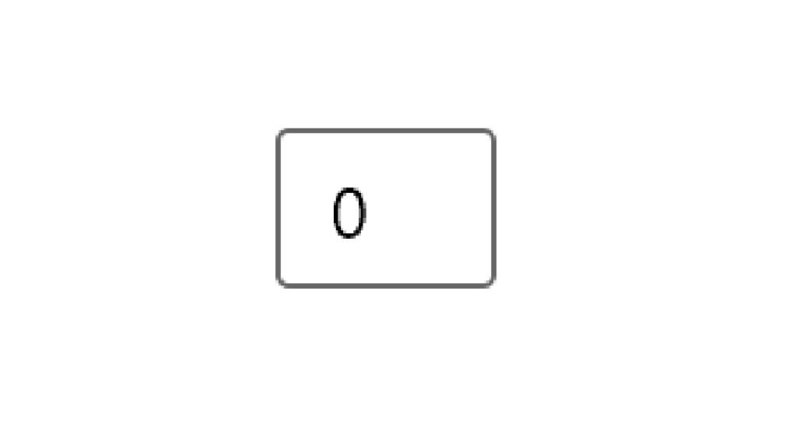
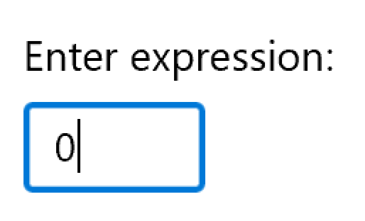
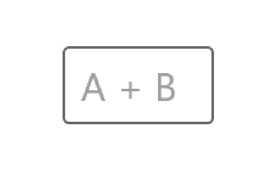
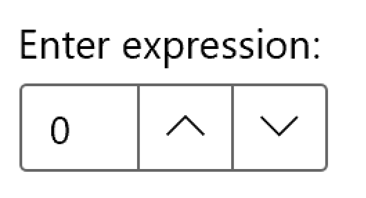
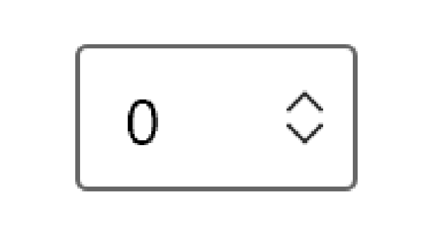
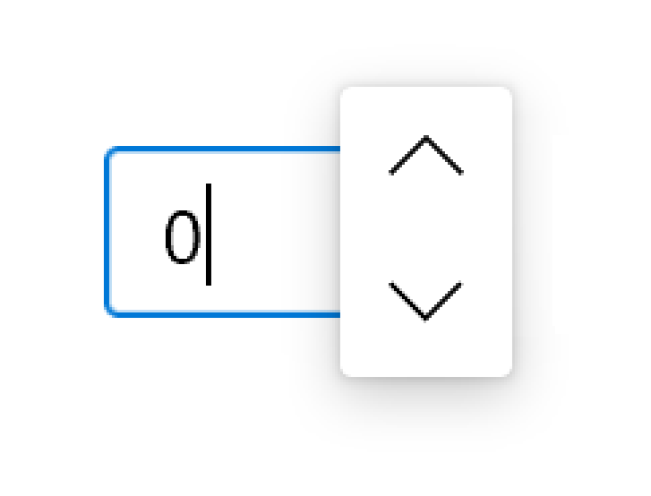
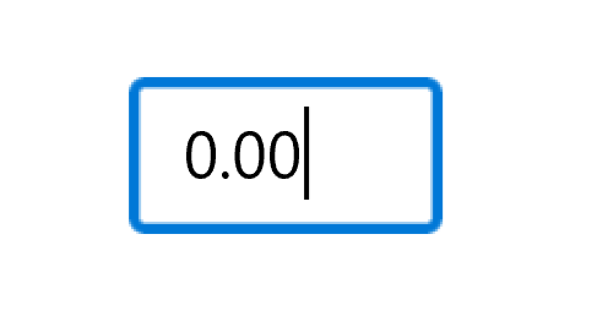

# Number box

## Background
Xaml has a TextBox control for text input, which can be used for numeric input, but numeric input scenarios benefit from custom features, such as buttons to increment/decrement. The NumberBox control in this spec provides these features. This will ship as part of the [WinUI package](https://www.nuget.org/packages/Microsoft.UI.Xaml), not as part of the Windows OS.

## Description
Represents a control that can be used to display and edit numbers. This supports validation, increment stepping, and computing inline calculations of basic equations, such as multiplication, division, addition, and subtraction.

## Is this the right control? 

You can use a NumberBox control to capture and display mathematic input. If you need an editable text box that accepts more than numbers, use the [TextBox](https://docs.microsoft.com/uwp/api/Windows.UI.Xaml.Controls.TextBox) control. If you need an editable text box that accepts passwords or other sensitive input, see [PasswordBox](https://docs.microsoft.com/uwp/api/windows.ui.xaml.controls.passwordbox). If you need a text box to enter search terms, see [AutoSuggestBox](https://docs.microsoft.com/uwp/api/windows.ui.xaml.controls.autosuggestbox). If you need to enter or edit formatted text, see [RichEditBox](https://docs.microsoft.com/uwp/api/windows.ui.xaml.controls.richeditbox).

## Examples

### Create a simple NumberBox

Here's the XAML for a basic NumberBox that demonstrates the default look. Use [x:Bind](https://docs.microsoft.com/en-us/windows/uwp/xaml-platform/x-bind-markup-extension#property-path) to ensure the data displayed to the user remains in sync with the data stored in your app. 


```XAML
<NumberBox Value="{x:Bind Path=ViewModel.NumberBoxValue, Mode=TwoWay}" />
```


### Labeling NumberBox

Use `Header` or `PlaceholderText` if the purpose of the NumberBox isn't clear. `Header` is visible whether or not the NumberBox has a value. 

```XAML
<NumberBox Header="Enter expression:"
    Value="{x:Bind Path=ViewModel.NumberBoxValue, Mode=TwoWay}" />
```



`PlaceholderText` is displayed inside the NumberBox and disappears once a value has been entered.

```XAML
<NumberBox PlaceholderText="A + B"
    Value="{x:Bind Path=ViewModel.NumberBoxValue, Mode=TwoWay}" />
```



### Enable calculation support

Setting the `AcceptsCalculation` property to true enables NumberBox to evaluate basic inline expressions such as multiplication, division, addition, and subtraction using standard order of operations. Evaluation is triggered on loss of focus or when the user presses the "Enter" key. Once an expression is evaluated, the original form of the expression is not preserved.

XAML
```XAML
<NumberBox Value="{x:Bind Path=ViewModel.NumberBoxValue, Mode=TwoWay}"
    AcceptsCalculation="True" />
```

### Add increment and decrement stepping

Use the `SpinButtonPlacementMode` property to enable buttons in the NumberBox control that can be clicked to increment or decrement the value in the NumberBox. These buttons will be disabled if a Maximum or Minimum value would be surpassed with another step. The amount of increment/decrement is specified with the `StepFrequency` property, which defaults to 1.

This defaults to `Hidden`, but NumberBox offers two visible placement modes: `Inline` and `Compact`. Set `SpinButtonPlacementMode` to `Inline` to enable the buttons to appear beside the control. 

XAML
```XAML
<NumberBox Value="{x:Bind Path=ViewModel.NumberBoxValue, Mode=TwoWay}"
    StepFrequency="2"
    SpinButtonPlacementMode="Inline" />
```



Set `SpinButtonPlacementMode` to `Compact` to enable the buttons to appear as a Flyout only when the NumberBox is in focus.  

XAML
```XAML
<NumberBox Value="{x:Bind Path=ViewModel.NumberBoxValue, Mode=TwoWay}"
    StepFrequency="2"
    SpinButtonPlacementMode="Compact" />
```





### Enabling input validation

Setting `ValidationMode` to `InvalidInputOverwritten` will enable NumberBox to overwrite invalid input that is not numerical nor legally formulaic with the last valid value when evaluation is triggered on loss of focus or a press of the "Enter" key.

XAML
```XAML
<NumberBox Header="Quantity"
    Value="{x:Bind Path=ViewModel.NumberBoxValue, Mode=TwoWay}"
    ValidationMode="InvalidInputOverwritten" />
```

Setting `ValidationMode` to `Disabled` allows custom input validation to be configured.  

### Formatting input 

[Number formatting](https://docs.microsoft.com/en-us/uwp/api/windows.globalization.numberformatting) can be used to format the value of a Numberbox by configuring an instance of a formatting class and assigning it to the `NumberFormatter` property. Decimal, currency, percent, and significant figures are few of the number formatting classes available. 

Here is an example of using DecimalFormatter to format a NumberBox's value to have one integer digit and two fraction digits:  

XAML
```XAML
<NumberBox  x:Name="FormattedNumberBox"
Value="{x:Bind Path=ViewModel.NumberBoxValue, Mode=TwoWay}" />
```

C#
```C#
private void SetNumberBoxNumberFormatter()
{
    DecimalFormatter formatter = new DecimalFormatter();
    formatter.IntegerDigits = 1;
    formatter.FractionDigits = 2;
    FormattedNumberBox.NumberFormatter = formatter;
}
```



### Enabling hyper scroll 

Setting `IsHyperScrollEnabled` to true enables the value of NumberBox to be incremented or decremented by scrolling when a NumberBox has focus and is being hovered over. 

XAML
```XAML
<NumberBox Value="{x:Bind Path=ViewModel.NumberBoxValue, Mode=TwoWay}"
    IsHyperScrollEnabled="True" />
```

## Remarks

### Input Scope

`Number` will be used for the [input scope](https://docs.microsoft.com/en-us/uwp/api/Windows.UI.Xaml.Input.InputScopeNameValue). This input scope is intended for working with digits 0-9. This may be overwritten but alternative InputScope types will not be explicitly supported. 

### Not a Number

When a NumberBox is cleared of input, `Value` will be set to `NaN` to indicate no numerical value is present. 

## Recommendations

* `Text` and `Value` make it easy to capture the value of a NumberBox as a String or as a Double without needing to convert the value bewteen types. When programmatically altering the value of a NumberBox, it is recommended to do so through the `Value` property. `Value` will overwrite `Text` in initial set up. After the initial set up, changes to one will be progrogated to the other, but consistently making programmatic changes through `Value` helps avoid any conceptual misunderstanding that NumberBox will accept non-numeric characters through `Text`.  

## API Notes

### Notable Properties  

| Name | Description |
|:-:|:--|
| StepFrequency | Gets or sets the value part of a value range that steps should be created for. |

## API Details
<!-- todo: Missing some APIs in here, like TemplatSettings class and event args classes -->

```c++ 
enum NumberBoxSpinButtonPlacementMode
{
    Hidden,
    Compact,
    Inline,
};

enum NumberBoxValidationMode
{
    InvalidInputOverwritten,
    Disabled,
};

runtimeclass NumberBoxValueChangedEventArgs
{
    Double OldValue{ get; };
    Double NewValue{ get; };
};

unsealed runtimeclass NumberBox : Windows.UI.Xaml.Controls.Control
{
    NumberBox();

    Double Minimum;
    Double Maximum;
    Double Value;
    Double StepFrequency;

    String Header;
    DataTemplate HeaderTemplate;
    String Text; 
    String PlaceholderText;
    
    FlyoutBase SelectionFlyout;
    SolidColorBrush SelectionHighlightColor;
    TextReadingOrder TextReadingOrder;
    Boolean PreventKeyboardDisplayOnProgrammaticFocus;
    Object Description;
  
    NumberBoxValidationMode ValidationMode;

    Boolean AcceptsCalculation;

    NumberBoxSpinButtonPlacementMode SpinButtonPlacementMode{ get; set; };

    Boolean IsHyperScrollEnabled;
    Boolean IsWrapEnabled;

    Windows.Globalization.NumberFormatting.INumberFormatter2 NumberFormatter;

    event Windows.Foundation.TypedEventHandler<NumberBox, NumberBoxValueChangedEventArgs> ValueChanged;
    
    static Windows.UI.Xaml.DependencyProperty MinimumProperty{ get; };
    static Windows.UI.Xaml.DependencyProperty MaximumProperty{ get; };
    static Windows.UI.Xaml.DependencyProperty ValueProperty{ get; };
    static Windows.UI.Xaml.DependencyProperty StepFrequencyProperty{ get; };
    
    static Windows.UI.Xaml.DependencyProperty Header{ get; };
    static Windows.UI.Xaml.DependencyProperty HeaderTemplate{ get; };
    static Windows.UI.Xaml.DependencyProperty Text{ get; };
    static Windows.UI.Xaml.DependencyProperty PlaceholderText{ get; };
    
    static Windows.UI.Xaml.DependencyProperty ValidationModeProperty{ get; };
    
    static Windows.UI.Xaml.DependencyProperty AcceptsCalculationProperty{ get; };
    
    static Windows.UI.Xaml.DependencyProperty SpinButtonPlacementModeProperty{ get; };
    
    static Windows.UI.Xaml.DependencyProperty IsHyperScrollEnabledProperty{ get; };   
    static Windows.UI.Xaml.DependencyProperty IsWrapEnabled{ get; };
    
    static Windows.UI.Xaml.DependencyProperty NumberFormatter{ get; };
}
```

## Appendix

### Behavioral Components

| Property | Notes |
|:---:|:---|
| InputScope | "Number" will be used for the InputScope. This may be overwritten by the developer but alternative InputScope types will not be explicitly supported. | 
| AcceptsCalculation | NumberBox will provide computation support for multiplication, division, addition, and subtraction across parenthetical order with standard operator precedence; i.e., [ 0-9()+-/* ] |
| Validation | * If ValidationMode="Disabled", no automatic validation will occur. This setting allows developers to configure custom validation via [Input Validation]( https://github.com/microsoft/microsoft-ui-xaml-specs/blob/user/lucashaines/inputvalidation/active/InputValidation/InputValidation.md). <br><br> * If ValidationMode="InvalidInputOverwritten", input that is non-numerical/formulaic will automatically be overwritten with the last legal value. |
| Events | * Loss of focus, "Enter", and stepping [SEE API NOTES > SPINBUTTON && HYPER SCROLL && HYPER DRAG && KEYBOARD STEPPING] will trigger evalution. <br><br> * When Text (derived from TextBox) is changed by codebehind or user input on the evaluation triggers noted above, the TextChanging event will be fired. After, if ValidationEnabled="True", validation will be performed [See API NOTES > VALIDATION]. Text will then be updated and the TextChanged event will be fired. Text will then be converted to a Double and the ValueChanging event event will be fired. After, Value will be updated and the ValueChanged event will be fired. <br><br> * When Value is changed by codebehind, the ValueChanging event will be fired. After, if ValidationEnabled="True", validation will be performed [See API NOTES > VALIDATION]. Value will then be updated and the ValueChanged event will be fired. Value will then be converted to a String and the TextChanging event event will be fired.  After, Text will be updated and the TextChanged event will be fired. |
| SpinButton | * When SpinButtonPlacementMode="Compact", the SpinButton will appear over NumberBox as a Flyout when NumberBox is in foucs.  <br><br> * If a pre-evaluation expression is stepped, it will be evaluated before the "step" is applied. <br><br> * SpinButton will disable increment/decrement buttons when the limits imposed by Maximum or Minimum would not allow another respective step. <br><br> * If IsWrapEnabled = "true", a step will not stop at the Minium or Maxmum, it will wrap instead. For example, if Minimum="0", Maximum="100", StepFrequency="5", and Value="98", and IsWrapEnabled="True", an incremental step results in Value="3".  |
| Hyper Scroll | * Allows a user to step by scrolling while focused in NumberBox. Align behavior with VS Blend implementation. * Focus and hover required for hyper scroll behavior to take place as to not reduce quality of experience on scrollable surfaces. <br><br> * If a calculation is stepped, it will be calculated before the step is applied. |
| Keyboard Stepping | * Up and Down arrow keys will increment and decrement the Text/Value when NumberBox is in focus. <br><br> * If a calculation is stepped, it will be calculated before the step is applied. |

### Inputs and Accessibility

#### UI Automation Patterns 

#### Keyboard Navigation 
| State | Action |
|:---|:---|
| Focus is on item in tab stop order before NumberBox | Tab moves focus into NumberBox's editable text field. |
| Focus is on NumberBox's editable text field. | Tab triggers evaluation and moves focus to validation error message if one is returned. Otherwise, tab moves focus to SpinButton (Decrement) if visible or out of NumberBox and to the next item in the tab stop order otherwise. |
| Focus is on NumberBox's validation error message. | Tab moves focus to NumberBox's SpinButton (Decrement). |
| Focus is on NumberBox's SpinButton (Decrement). | Tab moves focus to SpinButton (Increment). |
| Focus is on NumberBox's SpinButton (Increment). | Tab moves focus out of NumberBox and to the next item in the tab stop order. |

#### Narrator

| State | Action |
|:---|:---|
| Focus is moved to NumberBox's editable text field. | AutomationProperty.Name, Header, and Text properties are read. |
| Evaluation is triggered. | Evaluation is announced. |
| Validation Error Message is returned. | Error message is announced. |
| Focus is moved to NumberBox's validation error message. | Error message is announced. |
| Focus is moved to NumberBox's SpinButton (Decrement). | Property name is announced. |
| Focus is moved to NumberBox's SpinButton (Increment). | Property name is announced.  |


#### Gamepad  

| State | Action |
|:---|:---|
| Focus is near NumberBox | Spatial navigation may be used to access NumberBox where NumberBox's editable text field first receives focus. |
| Focus is on NumberBox's editable text field. | Spatial navigation: <br> Spatial navigation will navigate between the SpinButton, the editable textfield, or away from NumberBox. <br><br> A: <br> Will enter input mode. Calculation will be triggered on exit of input mode. <br><br> B (while in input mode): <br> Will trigger evaluation and exit input mode. |
| Focus is on NumberBox's SpinButton (Decrement). | Spatial navigation: <br> Spatial navigation will navigate between the SpinButton, the editable textfield, or away from NumberBox. <br><br> A: <br> Invoke decrement SpinButton action. |
| Focus is on NumberBox's SpinButton (Increment). | Spatial navigation: <br> Spatial navigation will navigate between the SpinButton, the editable textfield, or away from NumberBox. <br><br> A: <br> Invoke increment SpinButton action. |

### Data and Intelligence Metrics
##### P0: Feature Key Performance Indicators

Feature has received enough app/developer validation and feedback for it to exit preview.

* KPI: Three or more first party applications are validating the feature in prerelease.
    * Measurement: Occurrence of NumberBox type in apps on developer devices via telemetry (running under debugger). **Note for telemetry sampling considerations:** Need to be cautious for WinUI as it does not work the same way as with OS SDK. If the solution is not carefully considered, it will result in too little dev data (at 2% sampling) or too much end-user data (at 100% sampling) and hence throttling (telemetry data loss). Requires further investigation. 
    * Measurement: Count of users providing feedback on GitHub/UserVoice/Feedback Hub/SIUF.
    
Developers feel delighted and satisfied with the feature. 

* KPI: Dev NSAT is positive (min), >20 (aspirational) as we exit 2019.
    * Measurement: Developer survey via SIUF, e.g.: "How useful is the feature?"
    
##### P1: Feature Performance Indicators

Calculation support is leveraged by developers + appropriately surfaced to end users. 

* KPI: ~4% of unique instances of NumberBox surface an equation evaluation. 
    * Measurement: Ratio of occurances of NumberBox triggering evaluations compared to total count of NumberBox instances. 
    
##### P2+: Trailing Indicators

N/A

## V2 Feature Additions

#### Required

| Feature | Notes |
|:---:|:---|
| Input Validation | <br><br> * Add TextBlockMessage and IconMessage modes to ValidationMode. Both are dependant on WinUI [Input Validation]( https://github.com/microsoft/microsoft-ui-xaml-specs/blob/user/lucashaines/inputvalidation/active/InputValidation/InputValidation.md) work. <br><br> * If ValidationMode="TextBlockMessage" or ValidationMode="IconMessage", input that is outside the bounds of Minimum/Maximum or non-numerical/formulaic will trigger a validation warning consistent with [Input Validation]( https://github.com/microsoft/microsoft-ui-xaml-specs/blob/user/lucashaines/inputvalidation/active/InputValidation/InputValidation.md). A Minimum error will display "Minimum is [Minimum]." A Maximum error will display "Maximum is [Maximum]." Input errors will display "Only use numbers and ()+-/* ." Division by zero will return "Division by 0 unsupported." |
| Hyper Drag | * Allows a user to step by focusing on a NumberBox and dragging the cursor while clicking. Align to WinRT XAML Toolkit's NumericUpDown and VS Blend's implementation. <br><br> * If a calculation is stepped, it will be calculated before the step is applied. |

#### Explore

* Is there value in creating a preview for calculation results? @mdtauk created some example visualizations: 


