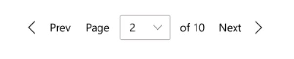

# Pager control

## Background

A UI pager is a common control that lets a user page through content, rather than scroll or pan. A common experience is to provide preview/next buttons, and a way to jump to a specific page.

The absence of a standard WinUI pager control, last seen in Xaml as DataPager in Silverlight, has been a pain point in both WPF and UWP that has forced a variety of unfavorable workarounds for developers. Inclusion of this control in UWP would resolve an ecosystem gap and enable developers to efficiently deliver UI paging experiences in their applications. Through XAML Islands, it may also provide an opportunity to benefit WPF developers working with DataGrid or ListView. The scope of this control is not to provide a data paging solution at this time, but to start with UI paging as a foundation on top of which data paging may be later integrated.


## Description
<!-- Use this section to provide a brief description of the feature.
For an example, see the introduction to the PasswordBox control 
(http://docs.microsoft.com/windows/uwp/design/controls-and-patterns/password-box). -->

A pager control is a UI component that provides a standard interaction for pagination with a layout view (ListView, GridView, ItemsRepeater, DataGrid, etc.). A pager control is independent of the layout views and does not control any of the data being displayed in the layout view. 

**Important APIs:** [PagerControl class](https://docs.microsoft.com/en-us/uwp/api/microsoft.ui.xaml.controls.pagercontrol)

This control can be configured to use one of three different display modes shown below:

### ComboBox Mode


### NumberBox Mode


### NumericalButtonPanel Mode 


## Is this the right control? 

Use a **PagerControl** to create a navigation interface for an end user to page through content instead of scrolling or panning. 

Scrolling through all content in a single view can make it harder for the end user to find specific information and it can lead to performance issues when the content needs to be refreshed. **PagerControl** can be used as an alternate solution so the user can consume a subset of the content without needing to scroll. They can then page through the rest of the content to find what they are looking for. 

## Examples

A pager control has three different display modes and each display mode has configurable components within them. 

### ComboBox Display Mode


### Pager Control Editable NumberBox Display Mode 


### Pager Control Numerical Button Panel Display Mode


A pager control does not require you to provide a max number of pages to the control. If the max number of pages is unknown, here is what each display mode will look like. 

### ComboBox Display Mode

(add comps)

### Pager Control Editable NumberBox Display Mode 

(add comps)

### Pager Control Numerical Button Panel Display Mode

(add comps)

You can choose to customize the look of a pager control by changing the visibility of the first, previous, next, and last buttons. They can be configured to always be visible, hidden, or hidden when the selected index is the first or last page in the range. When the last page is selected, the next and last buttons will be disabled and same when the first page is selected for the first and previous page. The prefix and suffix text can also be customized to display a string you provide. 

## Creating a pager control 

Here is the XAML for how to add a pager control to your application using the auto display mode. Auto will choose to use the combo box mode if the NumberOfPages property is less than 11 and will show the number box mode if it is greater than 11. In this example, combo box will be chosen. 

XAML
```XAML
<Grid>
        <!-- DataGrid Layout -->
        <controls:PagerControl x:Name="MainPagerControl"
                DisplayMode="Auto"
                NumberOfPages="10"
                FirstButtonVisibility="None"
                PreviousButtonVisibility="AlwaysVisible"
                NextButtonVisibility="AlwaysVisible"
                LastButtonVisibility="None"
                Prefix="Page"
                Suffix="of 10"/>
        </controls:PagerControl>
</Grid>
```

Below is the XAML for how to add the numerical button panel display mode. This mode is not part of the auto mode and needs to be explicitly set. The prefix and suffix properties do not apply to this mode so they will be ignored if they are set. The EllipsisShowFirstAndLast property is specific to this mode and controls if the button panel will always show the first and last page. This will also display ellipsis before the last page and after the first page to indicate that there are pages between the page numbers being shown and the last page. They will automatically be hidden if the pages being shown are close to the beggining or end of the page range. 

XAML
```XAML
<Grid>
        <!-- ListView Layout -->
        <controls:PagerControl x:Name="MainPagerControl"
                DisplayMode="NumericalButtonPanel"
	        NumberOfPages="10"
                FirstButtonVisibility="None"
                PreviousButtonVisibility="AlwaysVisible"
                NextButtonVisibility="AlwaysVisible"
                LastButtonVisibility="None"
	        EllipsisShowFirstAndLast="True">
	</controls:PagerControl>
</Grid>
```

### Customize edge buttons

You can customize the visibility of each of the edge buttons (the first, previous, next, and last) by setting their visibility properties. In this example, the first and previous buttons will always be visible while the next button will be hidden when the last page is selected. The last button will be hidden. By default, all buttons will be set to AlwaysVisible.

XAML
```XAML
<Grid>
        <!-- ListView Layout -->
        <controls:PagerControl x:Name="MainPagerControl"
                DisplayMode="ComboBox"
                NumberOfPages="10"
                FirstButtonVisibility="AlwaysVisible"
                PreviousButtonVisibility="AlwaysVisible"
                NextButtonVisibility="HiddenOnEdge"
                LastButtonVisibility="None"
                Prefix="Page"
                Suffix="of 10"/>
        </controls:PagerControl>
</Grid>
```

### Handling a page change event

When a user interacts with the pager control and selects an edge button or page number, the page changed event will be fired. This event will provide the index the user is coming from (previousPage) and the index the user is navigating to (currentPage). Below is a code example of how to handle this event. 

XAML
```XAML
<Grid>
        <!-- DataGrid Layout -->
        <controls:PagerControl x:Name="MainPagerControl"
                DisplayMode="Auto"
                NumberOfPages="10"
                FirstButtonVisibility="None"
                PreviousButtonVisibility="AlwaysVisible"
                NextButtonVisibility="AlwaysVisible"
                LastButtonVisibility="None"
                Prefix="Page"
                Suffix="of 10"/>
        </controls:PagerControl>
</Grid>
```
C#
(insert code sample)
```C#
```

## API Notes
| Name | Description| Default | 
|:---:|:---|:---|
| PagerDisplayMode | Enum that contains 4 values (Auto, ComboBox, NumberBox, ButtonPanel) to represent the look of the pager control. When Auto is selected, the display mode will be ComboBox if the NumberOfPages property is less than 11 otherwise it will be NumberBox. | Auto |
| PagerButtonVisibilityBehavior | Enum that contains 4 values (Auto, AlwaysVisible, HiddenOnEdge, None) that allows the app developer to hide or show the four edge buttons. HiddenOnEdge will remove the appropriate buttons if the selected page is the last or first page. When the last page is selected, the next and last buttons will be disabled and same when the first page is selected for the first and previous page. When Auto is selected, the visibility mode will be AlwaysVisible. | Auto |
| NumberOfPages | Sets the max number of pages the index control will iterate through. The default will represent an infinite page range. | -1 |
| First, Previous, Next, and Last ButtonCommand | Specially handle the button pressed event for when the end user selects the buttons. | N/A |
| First, Previous, Next, and Last Style | Give the developer the option to customize the style by changing the text or glyph for the edge buttons.| N/A |
| ButtonPanelShowFirstAndLast | Boolean to display the ellipses and the first and last index of the numerical button panel display mode. | True |
| SelectedIndex | The index that is currently selected. It will default to the first index. | 0 |
| PrefixText | Developer can change the prefix text for the combobox and number box display mode options. | "Page" |
| SuffixText | Developer can change the suffix text for the combobox and number box display mode options. | "of (NumberofPages)". If NumberOfPages is infinite, display nothing |
| PagerControlPageChangedEvent | Event that is fired when the end user selects a button from the number panel, any of the 4 directional buttons, or selects an option from the combobox or enters a number in the numberbox. This event will return the index number that the end user selected. If the end user enters a number greter than the number of pages this event will return the last page. If the end user enters a number less than 1 the event will return 1. | N/A |

### Design Components and Functionality

 | Component |  Notes |
|:---:|:---|
| LastButton | * Button displaying text and/or glyph indicating that the user may navigate to the last index. <br> * Automatically disabled when at last index. <br> * Can be set to not be visible when at the last index.  <br><br>  |
| FirstButton | * Button displaying text and/or glyph indicating that the user may navigate to the first index. <br> * Automatically disabled when at first index. <br> * Can be set to not be visible when at the first index.  <br><br>  |
| NextButton | * Button displaying text and/or glyph indicating that the user may navigate to the next index. <br> * Automatically disabled when at last index. <br> * Can be set to not be visible when at the last index. <br><br>  |
| PreviousButton | * Button displaying text and/or glyph indicating that the user may navigate to the previous index. <br> * Automatically disabled when at first index. <br> * Can be set to not be visible when at the first index.  <br><br>  |
| Ellipsis | * Button, reading "...", used before or after the first/last index to indicate an accessible but omitted range of indexes. <br> * Visibility of the first/last index can be disabled. <br> <br> * Only visible when using button panel as the display mode.  <br><br>  |
| PrefixText | * Text displayed before the ComboBox or NumberBox indexing component. <br><br>  |
| SuffixText | * When a total number of indices (N) is given, this suffix string will appear after the ComboBox indexing component or NumberBox component and read "of N". Localization will put "N" where it should be in a given language. <br><br>  |

## API Details

```c++ 
enum PagerDisplayMode
{
    Auto,
    ComboBox,
    NumberBox,
    ButtonPanel,
};

enum PagerButtonVisibilityBehavior
{
    Auto,
    AlwaysVisible,
    HiddenOnEdge,
    None,
};

runtimeclass PagerControlPageChangedEventArgs
{
    Integer NewIndex{get; };
    Integer PreviousIndex{get; };
};

runtimeclass PagerControl
{
    PagerControl();

    PagerDisplayMode Display;
    
    Integer NumberOfPages;
    
    PagerButtonVisibilityBehavior FirstButtonVisibility;
    PagerButtonVisibilityBehavior PreviousButtonVisibility;
    PagerButtonVisibilityBehavior NextButtonVisibility;
    PagerButtonVisibilityBehavior LastButtonVisibility;

    FirstButtonCommand="FirstButtonPressedEvent"
    PreviousButtonCommand="PreviousButtonPressedEvent"
    NextButtonCommand="NextButtonPressedEvent"
    LastButtonCommand="LastButtonPressedEvent"
    PagerInputCommand="PagerInputEvent"

    Windows.UI.Xaml.Input.ICommand FirstButtonCommand;
    Windows.UI.Xaml.Input.ICommand PreviousButtonCommand;
    Windows.UI.Xaml.Input.ICommand NextButtonCommand;
    Windows.UI.Xaml.Input.ICommand LastButtonCommand;
    Windows.UI.Xaml.Input.ICommand PagerInputCommand;
    
    Windows.UI.Xaml.Style FirstButtonStyle;
    Windows.UI.Xaml.Style PreviousButtonStyle;
    Windows.UI.Xaml.Style NextButtonStyle;
    Windows.UI.Xaml.Style LastButtonStyle;
    
    Boolean ButtonPanelShowFirstAndLast;
    Integer SelectedIndex;
    
    String PrefixText;
    String SuffixText;

    event Windows.Foundation.TypedEventHandler<PagerControl, PagerControlPageChangedEventArgs> PageChanged;

    static Windows.UI.Xaml.DependencyProperty DisplayProperty{ get; };
    
    static Windows.UI.Xaml.DependencyProperty NumberOfPagesProperty{ get; };
    
    static Windows.UI.Xaml.DependencyProperty FirstButtonVisibilityProperty{ get; };
    static Windows.UI.Xaml.DependencyProperty PreviousButtonVisibilityProperty{ get; };
    static Windows.UI.Xaml.DependencyProperty NextButtonVisibilityProperty{ get; };
    static Windows.UI.Xaml.DependencyProperty LastButtonVisibilityProperty{ get; };

    static Windows.UI.Xaml.DependencyProperty FirstButtonCommandProperty{ get; };
    static Windows.UI.Xaml.DependencyProperty PreviousButtonCommandProperty{ get; };
    static Windows.UI.Xaml.DependencyProperty NextButtonCommandProperty{ get; };
    static Windows.UI.Xaml.DependencyProperty LastButtonCommandProperty{ get; };
    static Windows.UI.Xaml.DependencyProperty PagerInputCommandProperty{ get; };
    
    static Windows.UI.Xaml.DependencyProperty FirstButtonStyleProperty{ get; };
    static Windows.UI.Xaml.DependencyProperty PreviousButtonStyleProperty{ get; };
    static Windows.UI.Xaml.DependencyProperty NextButtonStyleProperty{ get; };
    static Windows.UI.Xaml.DependencyProperty LastButtonStyleProperty{ get; };

    static Windows.UI.Xaml.DependencyProperty ButtonPanelShowFirstAndLastProperty{ get; };
    static Windows.UI.Xaml.DependencyProperty SelectedIndexProperty{get; };
    
    static Windows.UI.Xaml.DependencyProperty PrefixTextProperty{ get; };
    static Windows.UI.Xaml.DependencyProperty SuffixTextProperty{ get; };
}
```

## Appendix

Here are some end user scenarios for why a developer would want to choose one display mode over the others: 

Button Panel
* Max wants to search a clothing store's inventory to find a new pair of blue tennis shoes. He searches for blue tennis shoes on the site and is presented with the list of search results. He then scans through the images and descriptions on the first page and does not find anything he likes. He then navigates to the next page and continues searching until he finds the blue tennis shoes he is looking for. 

Combo Box/Number Box
* Jill opens an application that displays the produce inventory for her grocery store. She sorts her list of results alphabetically and wants to navigate to the page that has the results starting with "L". She knows that what she is looking for is on one of the pages in the middle and wants to navigate there from the list of pages. From there, she can go to the next or previous page to find where the items starting with "L" are. 

Any Display Mode
* Samanatha opens up an application for the first time and is presented with a tutorial window to show her how to use the application. She needs to move through each page of the tutorial sequentially in order to continue using the application. 

## Accessibility

### UI Automation Patterns 
* ComboBox and NumberBox will use the control patterns already assigned to them. The pager control will use the selection provider pattern and the individual buttons will use selection item provider. 
      * Reasoning: I did not choose the invoke control pattern because the documentation says that an element can disappear from the automation tree immediately upon being invoked. I don’t want this to happen because once the end user selects a button, an event needs to be fired to notify which page needs to be displayed. 

### Keyboarding
* Pager Control should be added as a navigation landmark. 
* End users should be able to tab to put focus on the first item in the control. 
* Left and right arrows will navigate between the items in the control. 
* The default accessibility behavior of the combo box and number box will be applied to this control.  

### Narrator
* When the focus is on the control, narrator will announce "pager". 
* When the focus is on the first, last, previous, or next button narrator will announce "first page", "last page", "next page", or "previous page". 
        * If the buttons have text properties set by the developer, narrator will announce that text instead of the default announcement. 
* When the focus is on a number button, narrator will announce "page x of y". 
* Combo box and number box modes will use the default narrator announcements for combo box and number box when the user puts focus on them. 
* When the user enters a value in to the number box, narrator will announce the number entered. 

### GamePad 
* Pager Control will not have engagement. The internal components (ComboBox and NumberBox) will keep their current engagement and accessibility features for game pad. 
* The user can use the right and left arrow keys to navigate between the buttons and use the A button to select an item. 
* Guidance will be added for app developers that are targeting Xbox applications to not place items to the left or right of the pager control. 
        * Text added to guidance: “If you are developing an application that will target Xbox, we recommend not placing any UI elements to the left or right of the pager control so the end user does not have to navigate through the pager control in order to reach the next UI element.” 

### Localization
* The numbers will follow standard behavior when localized to/from a language that uses a numeral system that differs from Western Arabic. 
* The prefix and suffix text will follow standard mirroring behavior when localized to/from languages that are RTL or LTR. 

## Data and Intellegence Metrics 

Adoption and validation of the control in the community
* Measurement: Use telemetry to determine how many first and third party developers are using the control in preview. 
* Measurement: Count of posts providing feedback to us through Github and Discord. 

Questions that can be answered through telemetry metrics to help focus future features and improvements: 
Which display mode is the most commonly used? 
* Measurement: Count of how many applications include the pager control type broken out by display mode.

How often are developers using this control with an indefinite number of pages?
* Measurement: Count of how many applications include the pager control type and have the NumberOfPages property empty.


## Open Questions 
* Should the combo box mode be an editable combo box? My worry with making it an editable combo box is the validity of having the number box mode. Would it hurt to have both editable combo box and number box as options?
* I use the terms index and page throughout this document and the APIs. The APIs are all index while the documentation is mostly using page. Should I update the APIs to use page instead of index?
* There are certain APIs that are specific to one of the three display modes and they will be ignored if the display mode chosen does not support those APIs. Is that something that needs to be reconsidered so it does not cause confusion for the developers?
* The enum for the edge button visibility has the four values Auto, AlwaysVisible, HiddenOnEdge, and None. Do those names make sense and translate to the intended behavior? Does the enum name make sense?
* The ButtonPanelShowFirstAndLast property will show or hide both the first and last page in the numerical button panel. Should this API be split in to two so the developer can show or hide the first and last button individually?
* Is there a shortcut we can add to make it easier to move to the next and previous page? Maybe utilize the left and right bumper?
* How does narrator handle localization? In the “page x of y” scenario how would that work if we switch from LTR to RTL?


