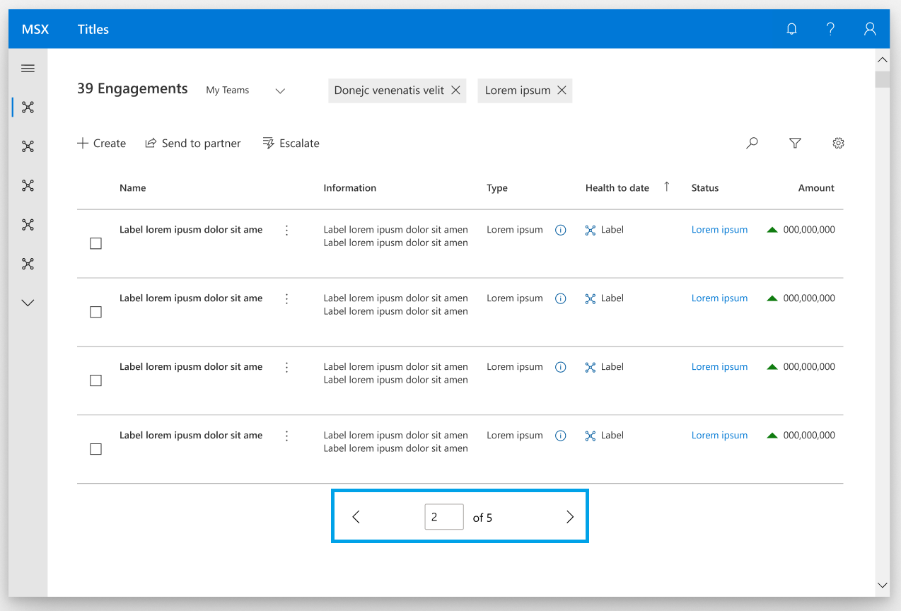

# Pager control

<!-- The purpose of this spec is to describe a new feature and
its APIs that make up a new feature in WinUI. -->

<!-- There are two audiences for the spec. The first are people
that want to evaluate and give feedback on the API, as part of
the submission process.  When it's complete
it will be incorporated into the public documentation at
docs.microsoft.com (http://docs.microsoft.com/uwp/toolkits/winui/).
Hopefully we'll be able to copy it mostly verbatim.
So the second audience is everyone that reads there to learn how
and why to use this API. -->

## Background
<!-- Use this section to provide background context for the new API(s) 
in this spec. -->

<!-- This section and the appendix are the only sections that likely
do not get copied to docs.microsoft.com; they're just an aid to reading this spec. -->

<!-- If you're modifying an existing API, included a link here to the
existing page(s) -->

<!-- For example, this section is a place to explain why you're adding this API rather than
modifying an existing API. -->

<!-- For example, this is a place to provide a brief explanation of some dependent
area, just explanation enough to understand this new API, rather than telling
the reader "go read 100 pages of background information posted at ...". -->


## Description
<!-- Use this section to provide a brief description of the feature.
For an example, see the introduction to the PasswordBox control 
(http://docs.microsoft.com/windows/uwp/design/controls-and-patterns/password-box). -->

This widget would provide a customizable pager UI, generic states, and generic events that can be configured to navigate pages for several view controls.

## Examples
<!-- Use this section to explain the features of the API, showing
example code with each description. The general format is: 
  feature explanation,
  example code
  feature explanation,
  example code
  etc.-->
  
<!-- Code samples should be in C# and/or C++/WinRT -->

<!-- As an example of this section, see the Examples section for the PasswordBox control 
(https://docs.microsoft.com/windows/uwp/design/controls-and-patterns/password-box#examples). -->

A pager control can have several configurations, including these notable ones.

### ComboBox Pager Control


XAML
```XAML
<GridView x:Name="gridView1" ... />
    <controls:PagerControl x:Name="MainPagerControl"
        DisplayMode="ComboBox"
	NumberOfPages="10"
        FirstButtonVisibility="None"
        PreviousButtonVisibility="AlwaysVisible"
        PreviousButtonText="Prev"
        NextButtonVisibility="AlwaysVisible"
        NextButtonText="Next"
        LastButtonVisibility="None"
	Prefix="Page"
	Suffix="of "/>
</Grid>
```

### Numerical Button Panel Pager Control


XAML
```XAML
<GridView x:Name="gridView1" ... />
    <controls:PagerControl x:Name="MainPagerControl"
        DisplayMode="NumericalButtonPanel"
	NumberOfPages="10"
        FirstButtonVisibility="AlwaysVisible"
        PreviousButtonVisibility="AlwaysVisible"
        NextButtonVisibility="AlwaysVisible"
        LastButtonVisibility="AlwaysVisible"
        EllipsisEnabled="True"
	EllipsisShowFirstAndLast="True"
        NumberOfIndicesShowing="6"
	EllipsisMaxBefore="5"
	EllipsisMaxAfter="1"/>
</Grid>
```

### Editable TextBox Pager Control



XAML
```XAML
<GridView x:Name="gridView1" ... />
    <controls:PagerControl x:Name="MainPagerControl"
        DisplayMode="EditableTextBox"
        NumberOfPages="5"
	FirstButtonVisibility="None"
        PreviousButtonVisibility="AlwaysVisible"
        NextButtonVisibility="AlwaysVisible"
        LastButtonVisibility="None"
	Suffix="of "/>
</Grid>
```


## Remarks
<!-- Explanation and guidance that doesn't fit into the Examples section. -->

<!-- APIs should only throw exceptions in exceptional conditions; basically,
only when there's a bug in the caller, such as argument exception.  But if for some
reason it's necessary for a caller to catch an exception from an API, call that
out with an explanation either here or in the Examples -->

## API Notes
<!-- Option 1: Give a one or two line description of each API (type
and member), or at least the ones that aren't obvious
from their name.  These descriptions are what show up
in IntelliSense. For properties, specify the default value of the property if it
isn't the type's default (for example an int-typed property that doesn't default to zero.) -->

<!-- Option 2: Put these descriptions in the below API Details section,
with a "///" comment above the member or type. -->

## API Details
<!-- The exact API, in MIDL3 format (https://docs.microsoft.com/en-us/uwp/midl-3/) -->

```c++ 
enum DisplayMode
{
    Auto,
    ComboBox,
    TextBox,
    ButtonPanel,
};


enum ButtonVisibilityMode
{
    Auto,
    AlwaysVisible,
    HiddenOnLast,
    None,
};

runtimeclass PagerControl
{
    PagerControl();

    DisplayMode Display;
    Windows.UI.Xaml.Style DisplayModeStyle;
    
    ButtonVisibilityMode FirstButtonVisibility;
    ButtonVisibilityMode PreviousButtonVisibility;
    ButtonVisibilityMode NextButtonVisibility;
    ButtonVisibilityMode LastButtonVisibility;
    
    IconSource FirstButtonGlyph;
    IconSource PreviousButtonGlyph;
    IconSource NextButtonGlyph;
    IconSource LastButtonGlyph;
    
    String FirstButtonText;
    String PreviousButtonText;
    String NextButtonText;
    String LastButtonText;
    
    Windows.UI.Xaml.Style FirstButtonStyle;
    Windows.UI.Xaml.Style PreviousButtonStyle;
    Windows.UI.Xaml.Style NextButtonStyle;
    Windows.UI.Xaml.Style LastButtonStyle;
    
    Integer NumberOfIndicesShowing;
    Boolean EllipsisEnabled;
    Boolean EllipsisShowFirstAndLast;
    Integer EllipsisMaxBefore;
    Integer EllipsisMaxAfter;
    
    String PrefixText;
    String SuffixText
    Integer NumberOfPages;

    static Windows.UI.Xaml.DependencyProperty DisplayProperty{ get; };
    static Windows.UI.Xaml.DependencyProperty DisplayModeStyleProperty{ get; };
    
    static Windows.UI.Xaml.DependencyProperty FirstButtonVisibilityProperty{ get; };
    static Windows.UI.Xaml.DependencyProperty PreviousButtonVisibilityProperty{ get; };
    static Windows.UI.Xaml.DependencyProperty NextButtonVisibilityProperty{ get; };
    static Windows.UI.Xaml.DependencyProperty LastButtonVisibilityProperty{ get; };
    
    static Windows.UI.Xaml.DependencyProperty FirstButtonGlyphProperty{ get; };
    static Windows.UI.Xaml.DependencyProperty PreviousButtonGlyphProperty{ get; };
    static Windows.UI.Xaml.DependencyProperty NextButtonGlyphProperty{ get; };
    static Windows.UI.Xaml.DependencyProperty LastButtonGlyphProperty{ get; };
    
    static Windows.UI.Xaml.DependencyProperty FirstButtonTextProperty{ get; };
    static Windows.UI.Xaml.DependencyProperty PreviousButtonTextProperty{ get; };
    static Windows.UI.Xaml.DependencyProperty NextButtonTextProperty{ get; };
    static Windows.UI.Xaml.DependencyProperty LastButtonTextProperty{ get; };
    
    static Windows.UI.Xaml.DependencyProperty FirstButtonStyleProperty{ get; };
    static Windows.UI.Xaml.DependencyProperty PreviousButtonStyleProperty{ get; };
    static Windows.UI.Xaml.DependencyProperty NextButtonStyleProperty{ get; };
    static Windows.UI.Xaml.DependencyProperty LastButtonStyleProperty{ get; };

    static Windows.UI.Xaml.DependencyProperty NumberOfIndicesShowingProperty{ get; };
    static Windows.UI.Xaml.DependencyProperty EllipsisEnabledProperty{ get; };
    static Windows.UI.Xaml.DependencyProperty EllipsisShowFirstAndLastProperty{ get; };
    static Windows.UI.Xaml.DependencyProperty EllipsisMaxBeforeProperty{ get; };
    static Windows.UI.Xaml.DependencyProperty EllipsisMaxAfterProperty{ get; };
    
    static Windows.UI.Xaml.DependencyProperty PrefixTextProperty{ get; };
    static Windows.UI.Xaml.DependencyProperty SuffixTextProperty{ get; };
    static Windows.UI.Xaml.DependencyProperty NumberOfPagesProperty{ get; };
}
```

# Appendix
<!-- Anything else that you want to write down for posterity, but 
that isn't necessary to understand the purpose and usage of the API.
For example, implementation details. -->

### Visual Components

 | Component |  Notes |
|:---:|:---|
| DisplayMode | * Used to set either a button panel (default) or an editable ComboBox as the indexing component. <br> * When set to be a button panel, the number of visible indices can be specified. <br><br>  &nbsp;&nbsp;&nbsp;&nbsp;&nbsp;&nbsp;&nbsp;&nbsp;  |
| LastButton | * Button displaying text and/or glyph indicating that the user may navigate to the last index. <br> * Automatically disabled when at last index. <br> * Can be set to not be visible when at the last index.  <br><br>  |
| FirstButton | * Button displaying text and/or glyph indicating that the user may navigate to the first index. <br> * Automatically disabled when at first index. <br> * Can be set to not be visible when at the first index.  <br><br>  |
| NextButton | * Button displaying text and/or glyph indicating that the user may navigate to the next index. <br> * Automatically disabled when at last index. <br> * Can be set to not be visible when at the last index. <br><br>  |
| PreviousButton | * Button displaying text and/or glyph indicating that the user may navigate to the previous index. <br> * Automatically disabled when at first index. <br> * Can be set to not be visible when at the first index.  <br><br>  |
| Ellipsis | * Button, often reading "...", used between indexes and before or after the first/last index to indicate an accessible but omitted range of indexes. <br> * MaxBefore and MaxAfter properties can be used to set  how many indices appear between the current page and the ellipsis before/after it. <br> * Visibility of the first/last index can be disabled. <br> * Only visible when using button panel as the display mode.  <br><br>  |
| PrefixText | * Text displayed before the editable ComboBox indexing component. <br><br>  |
| NumberOfPages | * When a total number of indices (N) is given, this suffix string will appear after the editable ComboBox indexing component and read "of N". Localization will put "N" where it should be in a given language. <br><br>  |

### Accessibility

| State | Action | Narrator |
|:---|:---|:---|
| UI pager is first focused on by tabbing | Focus defaults to the next page button if available (current page otherwise) after announcing accessible name of UI pager. | “Page selector. Next page is N." |
| UI pager is tabbed through | Tab Button: <br> Will go through all actionable items in order without regard to groups. <br> <br> Arrow keys: <br> Will be able to explore groups in the specified directions. Pressing the down arrow key at the bottom of the ComboBox will wrap the user to the top. <br> <br> Escape: <br> Will escape UI pager. <br> <br> Enter and Spacebar: <br> Will select the component focused on. <br> <br> Home: <br> Will move focus to "go back" elements. In the ComboBox, it will jump the user to the first index. <br> <br> End: <br> Will move focus to "go forward" elements. In the ComboBox, it will jump the user to the last index. | Narrator will announce an accessible name of the visual component. Ex:<br><br> “first page button” <br><br> “previous page button” <br><br> “1st page” <br><br> “current page” <br><br> "page selection drop down menu: current page is 1” | 

### API Surface Example

```XAML
<PagerControl
    DisplayMode = { Auto | ButtonPanel | EditableComboBox }
    DisplayModeStyle  { string }
    NumberOfIndicesShowing = { int }
    FirstButton = { Auto | AlwaysVisible | HiddenOnFirst | None }
    FirstButtonGlyph = { string }
    FirstButtonText = { string }
    FirstButtonStyle = { string }
    PreviousButton = { Auto | AlwaysVisible | HiddenOnFirst | None }  
    PreviousButtonGlyph = { string }
    PreviousButtonText = { string }
    PreviousButtonStyle = { string }
    NextButton = { Auto | AlwaysVisible | HiddenOnLast | None } 
    NextButtonGlyph = { string }
    NextButtonText = { string }
    NextButtonStyle = { string }
    LastButton = { Auto | AlwaysVisible | HiddenOnLast | None } 
    LastButtonGlyph = { string }
    LastButtonText = { string }
    LastButtonStyle = { string }
    EllipsisEnabled = { True | False }
    EllipsisMaxBefore = { int }
    EllipsisMaxAfter = { int }
    EllipsisShowBounds = { True | False }
    PrefixText = { string }  
    NumberOfPages = { int } >
</PagerControl>
```
