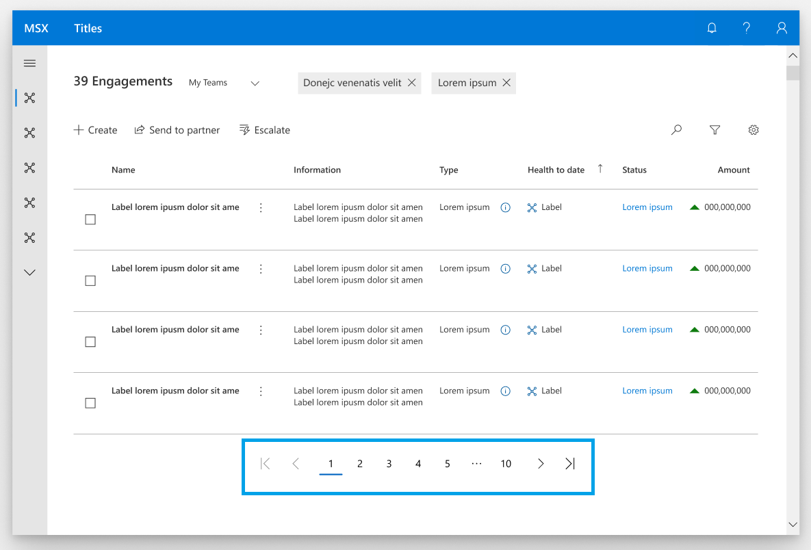

# Pager control

## Background

A UI pager is a common control that lets a user page through a long list, rather than scroll or pan. A common experience is to provide preview/next buttons, and a way to jump to a specific page.

The absence of a standard WinUI pager control, last seen in Xaml as DataPager in Silverlight, has been a pain point in both WPF and UWP that has forced a variety of unfavorable workarounds for developers. Inclusion of this control in UWP would resolve an ecosystem gap and enable developers to efficiently deliver UI paging experiences in their applications. Through XAML Islands, it may also provide an opportunity to benefit WPF developers working with DataGrid or ListView. The scope of this control is not to provide a data paging solution at this time, but to start with UI paging as a foundation on top of which data paging may be later integrated.


## Description
<!-- Use this section to provide a brief description of the feature.
For an example, see the introduction to the PasswordBox control 
(http://docs.microsoft.com/windows/uwp/design/controls-and-patterns/password-box). -->

A pager control is a UI component that can be added to your UI to provide a standard interaction for pagination with a layout view (ListView, GridView, ItemsRepeater, DataGrid, etc.) 

**Important APIs:** [PagerControl class](https://docs.microsoft.com/en-us/uwp/api/microsoft.ui.xaml.controls.pagercontrol)

This control can be configured to use three different display modes shown below:

### ComboBox Mode


### NumberBox Mode


### ButtonPanel Mode 


For more info about choosing the right display mode, see the pager control guidance page.

## Is this the right control? 

Use a **PagerControl** to create a navigation interface for an end user to page through content instead of scrolling or panning through the content in a single view. Scrolling through all content in a single view can make it harder for the end user to find specific information and it can lead to performance issues if the view needs to constantly update with new data. **PagerControl** can be used as an alternate solution so the user can consume a subset of the content without needing to scroll. They can then page through the rest of the content to find what they are looking for. 

## Examples
The pager control has three different display modes and each display mode has configurable components within them. The examples below show the default configurations for each mode. 

### ComboBox Display Mode
The Prefix and Suffix properties are specific to the combo box and number box modes. They will be ignored if the button panel mode is chosen as the display. 


XAML
```XAML
<GridView x:Name="gridView1" ... />
<controls:PagerControl x:Name="MainPagerControl"
        DisplayMode="ComboBox"
	NumberOfPages="10"
        FirstButtonVisibility="None"
        PreviousButtonVisibility="AlwaysVisible"
        PreviousButtonText="Prev"
        NextButtonVisibility="AlwaysVisible"
        NextButtonText="Next"
        LastButtonVisibility="None"
	FirstButtonCommand="FirstButtonPressedEvent"
        PreviousButtonCommand="PreviousButtonPressedEvent"
        NextButtonCommand="NextButtonPressedEvent"
        LastButtonCommand="LastButtonPressedEvent"
        PagerInputCommand="PagerInputEvent"
	Prefix="Page"
	Suffix="of 10"/>
</Grid>
```

### Pager Control Button Panel Display Mode
The EllipsisAreEnabled and EllipsisShowFirstAndLast properties are specific to this mode. They will be ignored if another mode is selected.



XAML
```XAML
<GridView x:Name="gridView1" ... />
<controls:PagerControl x:Name="MainPagerControl"
        DisplayMode="NumericalButtonPanel"
	NumberOfPages="10"
        FirstButtonVisibility="None"
        PreviousButtonVisibility="AlwaysVisible"
        NextButtonVisibility="AlwaysVisible"
        LastButtonVisibility="None"
        FirstButtonCommand="FirstButtonPressedEvent"
        PreviousButtonCommand="PreviousButtonPressedEvent"
        NextButtonCommand="NextButtonPressedEvent"
        LastButtonCommand="LastButtonPressedEvent"
        PagerInputCommand="PagerInputEvent"
        EllipsisAreEnabled="True"
	EllipsisShowFirstAndLast="True"
	/>
</Grid>
```

### Pager Control Editable NumberBox Display Mode 
The Prefix and Suffix properties are specific to the combo box and number box modes. They will be ignored if the button panel mode is selected.


XAML
```XAML
<GridView x:Name="gridView1" ... />
<controls:PagerControl x:Name="MainPagerControl"
        DisplayMode="NumberBox"
        NumberOfPages="5"
	FirstButtonVisibility="None"
        PreviousButtonVisibility="AlwaysVisible"
        NextButtonVisibility="AlwaysVisible"
        LastButtonVisibility="None"
	FirstButtonCommand="FirstButtonPressedEvent"
        PreviousButtonCommand="PreviousButtonPressedEvent"
        NextButtonCommand="NextButtonPressedEvent"
        LastButtonCommand="LastButtonPressedEvent"
        PagerInputCommand="PagerInputEvent"
	Suffix="of 5"/>
</Grid>
```

You can choose to customize the look of the pager control by hiding or showing the first, previous, next, and last buttons and changing the prefix and suffix text i nthe combo box and number box modes. 

## Adding a PagerControl to Your Application

Here is an example of how to add the PagerControl to your application. It can be added on the page as shown below, or can be used in the template of the layout view you prefer to use. PagerControl is added to the template for DataGrid and ItemsRepeater in WinUI 2.x and will be added to ListView and GridView in WinUI 3. 

(Insert XAML and code behind example here. This will also be added to the XAML controls gallery.)

## API Notes
| Name | Description| Default | 
|:---:|:---:| :---|
| PagerDisplayMode | Enum that contains 4 values (Auto, ComboBox, NumberBox, ButtonPanel) that the developer can change to fit their scenario. When Auto is selected, the display mode will be ComboBox. The control will default to auto. | Auto |
| NumberOfPages | Sets the max number of pages the index control will iterate through. | 10 |
| ButtonVisibilityMode | Enum (Auto, AlwaysVisible, HiddenOnEdge, None) that allows the app developer to hide or show the four edge buttons. HiddenOnEdge will remove the appropriate buttons if the selected page is the last or first page. When the last page is selected, the next and last buttons will be disabled and same when the first page is selected for the first and previous page. When Auto is selected, the visibility mode will be AlwaysVisible. | Auto |
| First, Previous, Next, and Last ButtonCommand | Specially handle the button pressed event for when the end user selects the first button. | 
| First, Previous, Next, and Last ButtonGlyph | Give the developer the option to customize the control by changing the glyph for the first button. | First: (waiting for design input) Previous: ChevronLeft Next: ChevronRight Last: (waiting for design input)
| First, Previous, Next, and Last ButtonText | Give the developer the option to customize the control by changing the text for the buttons.| 
| NumberOfIndicesShowing | Determine the number of indices showing in the number panel display mode. If the max number of pages is 10 but the number of indices is 5, the number panel will show 1,2,3,4,5 and when the user selects next, the indices will be 2,3,4,5,6. | 7 |
| EllipsisShowFirstAndLast | Boolean to display the first and last index of a buttonpanel if the ellipsis is enabled. |True
| SelectedIndex | The index that is currently selected. | 0 |
| PrefixText | Developer can change the prefix text for the combobox display mode option. | "Page" |
| SuffixText | Developer can change the suffix text for the combobox display mode option. | "of (NumberofPages)". If NumberOfPages is infinite, display nothing |
| PagerControlPageChangedEvent | Event that is fired when the end user selects a button from the number panel, any of the 4 directional buttons, or selects an option from the combobox or enters a number in the numberbox. This event will return the index number that the end user selected. If the end user enters a number greter than the number of pages this event will return the last page. If the end user enters a number less than 1 the event will return 1. | |

### Design Components and Functionality

 | Component |  Notes |
|:---:|:---|
| LastButton | * Button displaying text and/or glyph indicating that the user may navigate to the last index. <br> * Automatically disabled when at last index. <br> * Can be set to not be visible when at the last index.  <br><br>  |
| FirstButton | * Button displaying text and/or glyph indicating that the user may navigate to the first index. <br> * Automatically disabled when at first index. <br> * Can be set to not be visible when at the first index.  <br><br>  |
| NextButton | * Button displaying text and/or glyph indicating that the user may navigate to the next index. <br> * Automatically disabled when at last index. <br> * Can be set to not be visible when at the last index. <br><br>  |
| PreviousButton | * Button displaying text and/or glyph indicating that the user may navigate to the previous index. <br> * Automatically disabled when at first index. <br> * Can be set to not be visible when at the first index.  <br><br>  |
| Ellipsis | * Button, often reading "...", used between indexes and before or after the first/last index to indicate an accessible but omitted range of indexes. <br> * Visibility of the first/last index can be disabled. <br> <br> * Only visible when using button panel as the display mode.  <br><br>  |
| PrefixText | * Text displayed before the editable ComboBox or NumberBox indexing component. <br><br>  |
| SuffixText | * When a total number of indices (N) is given, this suffix string will appear after the editable ComboBox indexing component and read "of N". Localization will put "N" where it should be in a given language. <br><br>  |

## API Details
<!-- The exact API, in MIDL3 format (https://docs.microsoft.com/en-us/uwp/midl-3/) -->

```c++ 
enum PagerDisplayMode
{
    Auto,
    ComboBox,
    NumberBox,
    ButtonPanel,
};

enum PagerButtonVisibilityBehavior
{
    Auto,
    AlwaysVisible,
    HiddenOnEdge,
    None,
};

runtimeclass PagerControlPageChangedEventArgs
{
    Integer CurrentPage{get; };
    Integer PreviousPage{get; };
}

runtimeclass PagerControl
{
    PagerControl();

    PagerDisplayMode Display;
    
    Integer NumberOfPages;
    
    PagerButtonVisibilityBehavior FirstButtonVisibility;
    PagerButtonVisibilityBehavior PreviousButtonVisibility;
    PagerButtonVisibilityBehavior NextButtonVisibility;
    PagerButtonVisibilityBehavior LastButtonVisibility;

    FirstButtonCommand="FirstButtonPressedEvent"
    PreviousButtonCommand="PreviousButtonPressedEvent"
    NextButtonCommand="NextButtonPressedEvent"
    LastButtonCommand="LastButtonPressedEvent"
    PagerInputCommand="PagerInputEvent"

    Windows.UI.Xaml.Input.ICommand FirstButtonCommand;
    Windows.UI.Xaml.Input.ICommand PreviousButtonCommand;
    Windows.UI.Xaml.Input.ICommand NextButtonCommand;
    Windows.UI.Xaml.Input.ICommand LastButtonCommand;
    Windows.UI.Xaml.Input.ICommand PagerInputCommand;
    
    Windows.UI.Xaml.Style FirstButtonStyle;
    Windows.UI.Xaml.Style PreviousButtonStyle;
    Windows.UI.Xaml.Style NextButtonStyle;
    Windows.UI.Xaml.Style LastButtonStyle;
    
    Boolean EllipsisShowFirstAndLast;
    Integer SelectedIndex;
    
    String PrefixText;
    String SuffixText;

    event Windows.Foundation.TypedEventHandler<PagerControl, PagerControlPageChangedEventArgs> PageChanged;

    static Windows.UI.Xaml.DependencyProperty DisplayProperty{ get; };
    
    static Windows.UI.Xaml.DependencyProperty NumberOfPagesProperty{ get; };
    
    static Windows.UI.Xaml.DependencyProperty FirstButtonVisibilityProperty{ get; };
    static Windows.UI.Xaml.DependencyProperty PreviousButtonVisibilityProperty{ get; };
    static Windows.UI.Xaml.DependencyProperty NextButtonVisibilityProperty{ get; };
    static Windows.UI.Xaml.DependencyProperty LastButtonVisibilityProperty{ get; };

    static Windows.UI.Xaml.DependencyProperty FirstButtonCommandProperty{ get; };
    static Windows.UI.Xaml.DependencyProperty PreviousButtonCommandProperty{ get; };
    static Windows.UI.Xaml.DependencyProperty NextButtonCommandProperty{ get; };
    static Windows.UI.Xaml.DependencyProperty LastButtonCommandProperty{ get; };
    static Windows.UI.Xaml.DependencyProperty PagerInputCommandProperty{ get; };
    
    static Windows.UI.Xaml.DependencyProperty FirstButtonStyleProperty{ get; };
    static Windows.UI.Xaml.DependencyProperty PreviousButtonStyleProperty{ get; };
    static Windows.UI.Xaml.DependencyProperty NextButtonStyleProperty{ get; };
    static Windows.UI.Xaml.DependencyProperty LastButtonStyleProperty{ get; };

    static Windows.UI.Xaml.DependencyProperty EllipsisShowFirstAndLastProperty{ get; };
    static Windows.UI.Xaml.DependencyProperty SelectedIndexProperty{get; };
    
    static Windows.UI.Xaml.DependencyProperty PrefixTextProperty{ get; };
    static Windows.UI.Xaml.DependencyProperty SuffixTextProperty{ get; };
}
```

## Appendix
<!-- Anything else that you want to write down for posterity, but 
that isn't necessary to understand the purpose and usage of the API.
For example, implementation details. -->

Here are some end user scenarios for why a developer would want to choose one display mode over the others: 

Button Panel
* Max wants to search a clothing store's inventory to find a new pair of blue tennis shoes. He searches for blue tennis shoes on the site and is presented with the list of search results. He then scans through the images and descriptions on the first page and does not find anything he likes. He then navigates to the next page and continues searching until he finds the blue tennis shoes he is looking for. 

Combo Box/Number Box
* Jill opens an application that displays the produce inventory for her grocery store. She sorts her list of results alphabetically and wants to navigate to the page that has the results starting with "L". She knows that what she is looking for is on one of the pages in the middle and wants to navigate there from the list of pages. From there, she can go to the next or previous page to find where the items starting with "L" are. 

Any Display Mode
* Samanatha opens up an application for the first time and is presented with a tutorial window to show her how to use the application. She needs to move through each page of the tutorial sequentially in order to continue using the application. 

## Accessibility

### UI Automation Patterns 
* ComboBox and NumberBox will use the control patterns already assigned to them. The pager control will use the selection provider pattern and the individual buttons will use selection item provider. 
* Reasoning: I did not choose the invoke control pattern because the documentation says that an element can disappear from the automation tree immediately upon being invoked. I don’t want this to happen because once the end user selects a button, an event needs to be fired to notify which page needs to be displayed. 

### Keyboarding
* Pager Control should be added as a navigation landmark. 
* End users should be able to tab to put focus on the first item in the control. 
* Left and right arrows will navigate between the items in the control. 
* The default accessibility behavior of the combo box and number box will be applied to this control.  

### Narrator
* When the focus is on the control, narrator will announce "pager". 
* When the focus is on the first, last, previous, or next button narrator will announce "first page", "last page", "next page", or "previous page". 
        * If the buttons have text properties set by the developer, narrator will announce that text instead of the default announcement. 
* When the focus is on a number button, narrator will announce "page x of y". 
* Combo box and number box modes will use the default narrator announcements for combo box and number box when the user puts focus on them. 
* When the user enters a value in to the number box, narrator will announce the number entered. 

### GamePad 
* Pager Control will not have engagement. The internal components (ComboBox and NumberBox) will keep their current engagement and accessibility features for game pad. 
* The user can use the right and left arrow keys to navigate between the buttons and use the A button to select an item. 
* Guidance will be added for app developers that are targeting Xbox applications to not place items to the left or right of the pager control. 
        * Text added to guidance: “If you are developing an application that will target Xbox, we recommend not placing any UI elements to the left or right of the pager control so the end user does not have to navigate through the pager control in order to reach the next UI element.” 

### Localization
* The numbers will follow standard behavior when localized to/from a language that uses a numeral system that differs from Western Arabic. 
* The prefix and suffix text will follow standard mirroring behavior when localized to/from languages that are RTL or LTR. 

## Data and Intellegence Metrics 

Adoption and validation of the control in the community
* Measurement: Use telemetry to determine how many first and third party developers are using the control in preview. 
* Measurement: Count of posts providing feedback to us through Github and Discord. 

Questions that can be answered through telemetry metrics to help focus future features and improvements: 
Which display mode is the most commonly used? 
* Measurement: Count of how many applications include the pager control type broken out by display mode.

Which layout view is this control being used with the most?  
 * Help drive improvements for keyboarding and to detemine which layout views we should focus on adding pager control to first. I'm not sure if this is something that can be measured. 

How often are developers using this control with an indefinite number of pages?
* Measurement: Count of how many applications include the pager control type and have the NumberOfPages property empty. 


## Open Questions 
* It would be cool to measure which layout view is most commonly used with the pager control, is that possible to measure using telemetry?
* Is there a shortcut we can add to make it easier to move to the next and previous page? Maybe utilize the left and right bumper?
* How does narrator handle localization? In the “page x of y” scenario how would that work if we switch from LTR to RTL?


