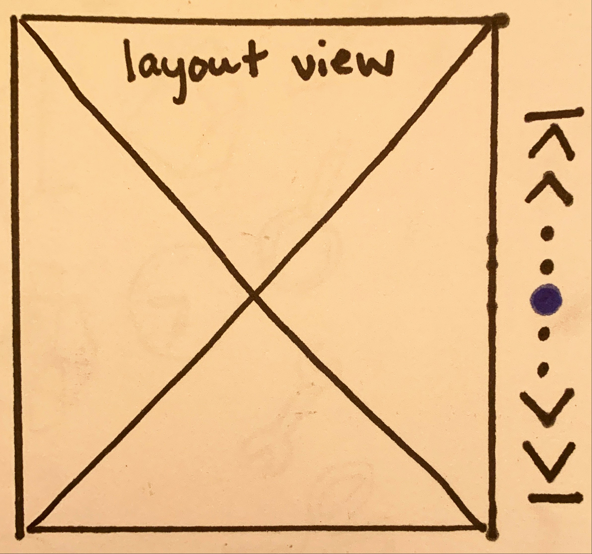

# Background
There is a need for WinUI to support vertical pagination UI that resides to the left or right of the layout view with "pip" glyphs and arrow navigation. 
This pagination experience is independent of the layout UI and is mostly supported via the existing Numerical ButtonPanel DisplayMode in PagerControl. The two main customizations are below:
- Glyphs (pips) to represent pages
- Vertical orientation

The below spec identifies the visual and interactive differences between the new VerticalPips DisplayMode and the ButtonPanel DisplayMode along with the available theme resources for further customization.
# Description
A new DisplayMode to PagerControl, VerticalPips is for scenarios requiring vertical pagination UI when the exact page number is not visually required; e.g. reading lists, app drawers, or photo viewers.

## What is a pip?
Pips represent a unit of numerical value, typically represented as dots, however can be customized to other glyphs like dashes or squares. For Fluent vertical pagination, by default, a solid dot will represent each page of the layout.

# Examples

## Default VerticalPips
A PagerControl set to the VerticalPips display mode, showing the default UI components.


XAML
```XAML
<Grid> 
    <muxc:PagerControl x:Name="pager"
            DisplayMode="VerticalPips"/>
    </muxc:PagerControl>
</Grid>
```
code

## ButtonPanel edge buttons for VerticalPips
A PagerControl set to the VerticalPips display mode supporting the ButtonPanel edge button property to enable persistent first and last edge buttons.



XAML
```XAML
<Grid> 
    <muxc:PagerControl x:Name="pager"
            DisplayMode="VerticalPips"
            ButtonPanelAlwaysShowFirstAndLastPageIndex="True"/>
    </muxc:PagerControl>
</Grid>
```

## Custom pip glyphs
TBD on glyph customization implementation

# Remarks
## Configuration
The VerticalPips DisplayMode will support the UI behavior of the various configurations in the ButtonPanel DisplayMode with the recommended defaults shown below:

| Name | Description| Default | 
|:---:|:---|:---|
| FirstButtonVisibility | Visibility of the button displaying text and/or glyph indicating that the user may navigate to the first index. | Hidden |
| PreviousButtonVisibility | Visibility of the button displaying text and/or glyph indicating that the user may navigate to the previous index.| HiddenOnEdge |
| NextButtonVisibility | Visibility of the button displaying text and/or glyph indicating that the user may navigate to the next index. | HiddenOnEdge |
| LastButtonVisibility | Visibility of the button displaying text and/or glyph indicating that the user may navigate to the last index. | Hidden |
| NumberOfPages | Sets the max number of pages the index control will iterate through. The default will represent an infinite page range. | -1 |
| ButtonPanelAlwaysShowFirstAndLastPage | Boolean to display the ellipses* and the first and last index of the numerical button panel display mode. | True |
| SelectedPageIndex | The 0 based index that is currently selected. It will default to the first index. | 0 |

*Note: A design solution is still needed to determine behavior when the number of pages is greater than the number of visible pips. I do not anticipate it will be ellipses and instead enabled via pip size variation to imitate a change in scrolling focus. See design open question below.


# Input & Accessibility
The VerticalPips DisplayMode will support the same functionality that the ButtonPanel DisplayMode does with the following notes:

## Keyboarding
- Up and down arrows (instead of left and right) will navigate between the items in the control.

## Touch
For touch screen devices, a vertical swipe directly to the left or right of the pager will navigate to the previous or next page.*
 - An "up" swipe will navigate to the previous page.
 - A "down" swipe will navigate to the next page.

*Interaction still to be discussed with design.
# API Notes

## Direct API changes
Addition of the VerticalPips DisplayMode.
| Name | Description| Default | 
|:---:|:---|:---|
| PagerControlDisplayMode | Enum that contains 5 values (Auto, ComboBox, NumberBox, ButtonPanel, VerticalPips) to represent the look of the pager control. When Auto is selected, the display mode will be ComboBox if the NumberOfPages property is less than 11 otherwise it will be NumberBox. | Auto |

IDL addition:
```IDL
enum PagerControlDisplayMode
{
    Auto,
    ComboBox,
    NumberBox,
    ButtonPanel,
    VerticalPips,
};
```
## UI Components
Transforms of existing glyphs for First, Previous, Next, and Last button 270 degrees from current orientation.

## Theme Resources
Open question: Glyph customization via a Style property in API or as a theme resource?
| Name | Description | Type 
|:-:|:--| :-- |
| PagerControlVerticalPipDefaultGlyph | Sets the default vertical pip glyph | String |
| PagerControlVerticalPipSelectedGlyph | Sets the vertical pip glyph when selected | String |
| PagerControlVerticalPipGlyphFontSize* | Sets the size in pixels of the vertical pip glyph | Double |
| PagerControlVerticalPipSelectedGlyphFontSize* | Sets the size in pixels of the vertical pip glyph when selected | Double |
| PagerControlVerticalPipDefaultForegroundBrush* | Sets the foreground brush of the default vertical pip glyphs| SolidColorBrush
| PagerControlVerticalPipSelectedForegroundBrush* | Sets the foreground brush of the vertical pip glyph when selected
| PagerControlVerticalPipPointerOver* | Sets the pointer over/hover visual state for the vertical pip display mode | StaticResource
| PagerControlVerticalPipPressed* | Sets the pressed visual state for the vertical pip display mode | StaticResource
| PagerControlVerticalPipSelected* | Sets the selected visual state for the vertical pip display mode | StaticResource
| PagerControlVerticalPipMargin* | Sets the margin, in pixels, between each vertical pip glyph | Thickness

*These resources would be for complex glyph customization and are a lower priority ask. These are only proposals based on current design explorations and only potentially in scope.

# Appendix
- The functionality for screen readers is the exact same as a ButtonPanel even though it is announcing numerical pages. This is due to the fact that the pips are still a representation of the specific page a user is on. Visually, it is less important to know the exact page number and total number of pages, however to users of screen readers, knowledge of the page in context with others remains as required.

# Open questions
## General
- Do we need to support navigation arrows displaying dependent on hover?
  - Potentially.
- Do we need to support looping pagination?
  - At this time, likely not. 
- Does an orientation property in PagerControl make sense considering the possibility of other DisplayModes supporting a vertical orientation?
  - At this time, no.

## For design
- What is the recommended size of the pips? If a user provides a larger/smaller set how will we adjust?
  - My initial thoughts: Recommended size to be consistent of the default arrow glyphs. The spacing between the pips will scale based on pixel size of chosen glyph.
- How large will the touch targets be on the glyphs?
- If we reach the max number of recommended pips, what should occur? Should there be a max number?
  - Initial explorations: Pip size variance and dot centering animations, see Instagram-like horizontal mockup below from [@Paelaez](https://medium.com/@Pelaez/recreating-instagrams-page-control-ebc2103b8a39)
  
- By default, how are we representing a selected pip? Are we?
  - My initial thoughts: By changing the foreground color of the solid dot to the user's accent color and increasing the size of the dot.

## For dev
- Should the pip glyph customization replicate the existing pattern for First, Previous, Next, and Last button in that it is via a built-in Style property?
  - Initial thoughts: No. This fits as a theme resource.
- _If_ we supported navigation arrows display dependent on hover, would this functionality require its own property to turn on/off this behavior?
- _If_ we supported looping pagination, I would anticipate a property to customize turning on/off that behavior. Is this something that ButtonPanel can also take advantage of?
  - Initial thoughts: This could be enabled with a new event that fires once the user tries to navigate past the last page. The application can then handle the pagination back to the first if desired.
- Should we set default PagerControlButtonVisibilityBehavior for each button by DisplayMode? This would entail adding an "Auto" option as the default for each DisplayMode to have their own custom visibility defaults for each button among the Visible, HiddenOnEdge, and Hidden.
  - Initial thoughts: Yes, but as a slightly lower priority, especially if we feel the VerticalPips DisplayMode shouldn't encourage the first/last buttons by default.

# Prioritization
*May move up or down in prioritization based on need.
## P0
- Glyphs to represent pages (pips)
- Verticality of keyboard/touch interaction and glyph orientation
- Functionality to enable the option to vary arrow visibility dependent on user hover*
## P1
- Basic glyph customization:
  - Resources to change default and selected pip glyph (will keep default icon size)
  - Resources to change default and selected pip glyph foreground color (could drop in priority dependent on complexity)
- Add an 'Auto' property to the PagerControlButtonVisibility enum to set custom button defaults by DisplayMode.
- Event to fire once the user attempts to navigate past the last page to enable looping behavior in the application*
- A MaxPagesDisplayed property to enable the scrolling UI design when the number of pages is greater than the number of pages shown in the control.*
## P2
- Complex glyph customization:
  - Resources to change default and selected pip glyph font size that ties to the hover target.
  - Resources to change margin between pips
  - Resources to change pointer over, pressed, and selected visual state 