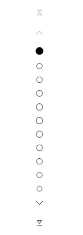
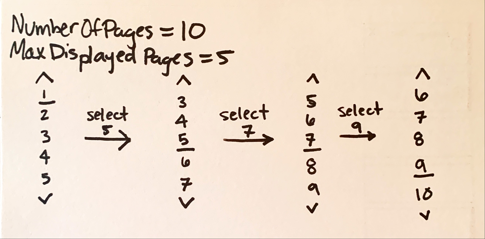

> See and note [PipsPager](https://github.com/microsoft/microsoft-ui-xaml-specs/blob/user/gabilka/PipsPager/active/PipsPager/PipsPager.md) spec for the most recent update about this UI. This VerticalPips to PagerControl spec is now outdated.
# Background
There is a need for WinUI to support vertical pagination UI that resides to the left or right of the layout view with "pip" glyphs and arrow navigation. 
This pagination experience is independent of the layout UI and is supported via customizations of the existing Numerical ButtonPanel DisplayMode in PagerControl. The main customizations are below:
- Glyphs (pips) to represent pages
- Vertical orientation: VerticalPips display mode
- Arrow visiblility dependent on user hover: VisibleOnHover button visibility
- Display any number of pages, different behavior if less than total number of pages: MaxDisplayedPages property

The below spec identifies the visual and interactive differences between the new VerticalPips DisplayMode and the ButtonPanel DisplayMode, associated new functionalities for Pips, and new theme resources for further customization.

# Description
A new DisplayMode to PagerControl, VerticalPips is for scenarios requiring vertical pagination UI when the exact page number is not visually required; e.g. reading lists, app drawers, or photo viewers.

## What is a pip?
Pips represent a unit of numerical value, typically represented as dots, however can be customized to other glyphs like dashes or squares. For Fluent vertical pagination, by default, a solid dot will represent each page of the layout.

# Examples

## Default VerticalPips
A PagerControl set to the VerticalPips display mode, showing the default UI components.


XAML
```XAML
<Grid> 
    <muxc:PagerControl x:Name="pager"
            DisplayMode="VerticalPips"
            NumberOfPages="5"
            SelectedPageIndex="2"/>
    </muxc:PagerControl>
</Grid>
```

## Recommended VerticalPips configuration with VisibleOnHover button visibility
A PagerControl set to the VerticalPips display mode with the recommended button visibility property settings. The VisibleOnHover property, new to PagerControl, would enable the option to only show the arrow when the user is hovering over the PagerControl.


XAML
```XAML
<Grid> 
    <muxc:PagerControl x:Name="pager"
            DisplayMode="VerticalPips"
            NumberOfPages="5"
            SelectedPageIndex="2"
            FirstButtonVisibility="None"
            NextButtonVisibility="VisibleOnHover"
            PreviousButtonVisibility="VisibleOnHover"
            LastButtonVisibility="None"/>
    </muxc:PagerControl>
</Grid>
```

## Number of pages displayed less than total
A PagerControl set to the Vertical Pips display mode where MaxDisplayedPages is set to ten and the NumberOfPages is greater. This keeps the control height stable to a specific maximum when the number of total pages varies.

XAML
```XAML
<Grid> 
    <muxc:PagerControl x:Name="pager"
            DisplayMode="VerticalPips"
            NumberOfPages="20"
            MaxDisplayedPages="12"/>
    </muxc:PagerControl>
</Grid>
```

Prototype:



## Custom pip glyphs
[TBD](#p1) on glyph customization implementation

# Remarks
## Configuration
The VerticalPips DisplayMode will support the UI behavior of the various configurations in the ButtonPanel DisplayMode with the recommended configuration shown below:

| Name | Description| Recommended for VerticalPips | PagerControl Default |
|:---:|:---|:---| :--- |
| FirstButtonVisibility | Visibility of the button displaying text and/or glyph indicating that the user may navigate to the first index. | Hidden | HiddenOnEdge |
| PreviousButtonVisibility | Visibility of the button displaying text and/or glyph indicating that the user may navigate to the previous index.| **VisibleOnHover*** | HiddenOnEdge |
| NextButtonVisibility | Visibility of the button displaying text and/or glyph indicating that the user may navigate to the next index. | **VisibleOnHover*** | HiddenOnEdge |
| LastButtonVisibility | Visibility of the button displaying text and/or glyph indicating that the user may navigate to the last index. | Hidden | HiddenOnEdge |
| ButtonPanelAlwaysShowFirstAndLastPage | Note: This property only applies to the button panel display mode. Boolean to display the ellipses and the first and last index of the numerical button panel display mode. | N/A for VerticalPips | True | 
| **MaxDisplayedPages** | Note: This property only applies to the ButtonPanel and VerticalPips display modes. Sets the max number of pages that will be _visible_ and displayed to the user at a time in the PagerControl. By default the control will show 5 pages to appear at once. | 5 | 5 |
| NumberOfPages | Sets the max number of pages the index control will iterate through. The default will represent an infinite page range. | -1 | - 1 |
| SelectedPageIndex | The 0 based index that is currently selected. It will default to the first index. | 0 | 0 |

*VisibleOnHover button visibility enum and MaxDisplayedPages property proposed as new API and described in our [API Notes](#addition-of-visibleOnHover-to-the-PagerControlButtonVisibility-enum).


# API Notes

## Direct API changes
### Addition of VerticalPips to the DisplayMode enum
| Name | Description| Default | 
|:---:|:---|:---|
| PagerControlDisplayMode | Enum that contains 5 values (Auto, ComboBox, NumberBox, ButtonPanel, **VerticalPips**) to represent the look of the pager control. When Auto is selected, the display mode will be ComboBox if the NumberOfPages property is less than 11 otherwise it will be NumberBox. | Auto |

```IDL
enum PagerControlDisplayMode
{
    Auto,
    ComboBox,
    NumberBox,
    ButtonPanel,
    VerticalPips, // new
};
```

### Addition of VisibleOnHover to the PagerControlButtonVisibility enum
A new state to display the pagination buttons dependent on user hover over the PagerControl. Space will be reserved in the layout for these buttons to appear. 
If the user hovers anywhere in the PagerControl bounding box, all intended* arrows will be visible


*Open question around how the application chooses whether the visiblility on hover is HiddenOnEdge or Visible. The default PagerControlButtonVisibility is HiddenOnEdge.

```IDL
enum PagerControlButtonVisibility
{
    Visible,
    HiddenOnEdge,
    VisibleOnHover, // new
    VisibleOnHoverOnEdge // do we need two on hover properties here?
    Hidden,
    
};
```

### Addition of MaxDisplayedPages
A new property that will only apply to the ButtonPanel and VerticalPips display modes for the user to define how many numbers/glyphs can be displayed in the panel at once. By default, this property is set to 5 to represent the current PagerControl behavior in ButtonPanel. 

```IDL
unsealed runtimeclass PagerControl : Windows.UI.Xaml.Controls.Control
{
  ...
  Integer MaxDisplayedPages //new
  ...
};
```

If the MaxDisplayedPages <= NumberOfPages the number of displayed pages will be the number of pages. There is different UI behavior for each display mode if the MaxDisplayedPages > NumberOfPages: 

#### VerticalPips display mode
The user will view a scrolling animation when navigating to the pips to keep them centered.

In below sketch, the pips have been replaced with their numerical representation for clarity.

#### ButtonPanel display mode
TBD: Introduces edge cases when the MaxDisplayedPages is very low with the ellipsis behavior. Continued discussion with Marissa here.

Open questions:
- Behavior for edge cases:
  - How will this handle multiple ellipses with a small # of displayed pages?
  - Is there a difference when ButtonPanelAlwaysShowFirstAndLastPage is true/false?
    - If less than 5 then there is there a different way to handle this...guidance to be > 5?
  - Change on selected page?
- Is width changing a problem with this?
- Are ellipsis considered a "page"?

## UI Components
- Transforms of existing glyphs for First, Previous, Next, and Last button 270 degrees from current orientation.
- Flexibility in control height to allow number of pips to be defined by user via the MaxDisplayedPages property


## Theme Resources
| Name | Description | Type
|:-:|:--| :-- |
| PagerControlVerticalPipDefaultGlyph | Sets the default vertical pip glyph | String |
| PagerControlVerticalPipSelectedGlyph | Sets the vertical pip glyph when selected | String |
| PagerControlVerticalPipGlyphFontSize | Sets the size in pixels of the vertical pip glyph | Double |
| PagerControlVerticalPipSelectedGlyphFontSize | Sets the size in pixels of the vertical pip glyph when selected | Double |
| PagerControlVerticalPipDefaultForegroundBrush* | Sets the foreground brush of the default vertical pip glyphs| SolidColorBrush
| PagerControlVerticalPipSelectedForegroundBrush* | Sets the foreground brush of the vertical pip glyph when selected | SolidColorBrush
| PagerControlVerticalPipPointerOver* | Sets the pointer over/hover visual state for the vertical pip display mode | StaticResource
| PagerControlVerticalPipPressed* | Sets the pressed visual state for the vertical pip display mode | StaticResource
| PagerControlVerticalPipSelected* | Sets the selected visual state for the vertical pip display mode | StaticResource
| PagerControlVerticalPipMargin* | Sets the margin, in pixels, between each vertical pip glyph | Thickness
| PagerControlVerticalPipGlyphWidth | Sets the bounding box width for each vertical pip glyph | Double
| PagerControlVerticalPipGlyphHeight | Sets the bounding box height for each vertical pip glyph | Double

*These resources would be for complex glyph customization and are potentially a lower priority ask. See [Prioritization](#prioritization) for more info on intended features.


# Input & Accessibility

## Vertical Pips DisplayMode
The VerticalPips DisplayMode will support the same functionality that the ButtonPanel DisplayMode does with the following notes:

### Keyboarding
- The PagerControl is a tab stop which will navigate to the first selectable item -- first button, previous button, or first page. Any visible buttons can be navigated to via tab. This is default behavior in PagerControl.
- Up and down arrows (instead of left and right) will navigate between the pips. The pips will not be a tab stop.

### Touch
For touch screen devices, a vertical swipe directly to the left or right of the pager will navigate to the previous or next page.*
 - An "up" swipe will navigate to the previous page.
 - A "down" swipe will navigate to the next page.

The user can also touch to select the individual pip if able.

### Narrator
Same as ButtonPanel, copied below:
- When the focus is on the control, narrator will announce "pager".
- When the focus is on the first, last, previous, or next button narrator will announce "first page", "last page", "next page", or "previous page". 
  - If the buttons have text properties set by the developer, narrator will announce that text instead of the default announcement.
- When the focus is on a number button, narrator will announce "page x of y".

## VisibleOnHover button visibility
TBD for ComboBox and NumberBox display modes in discussion with Marissa.

### ButtonPanel & VerticalPips keyboarding
- On tab, the arrow will come into view and receive focus for the user to select with the enter (and space?) key.
  - When the user is focused anywhere in the PagerControl the VisibleOnHover buttons will be visible.

# Appendix
- The functionality for screen readers is the exact same as a ButtonPanel even though it is announcing numerical pages. This is due to the fact that the pips are still a representation of the specific page a user is on. Visually, it is less important to know the exact page number and total number of pages, however to users of screen readers, knowledge of the page in context with others remains as required.

# Open questions

## General
- Does an orientation property in PagerControl make sense considering the possibility of other DisplayModes supporting a vertical orientation?
  - At this time, no since the orientation property would be unique to pips.
- When NumberOfPages is zero or one, what is the expected behavior of the PagerControl? Is this app behavior or built-in to the control?
  - The PagerControl should disappear from view, similar to a scroll bar. In Windows, even if the accessibility setting: automatically hide scroll bars in Windows is turned off (so scroll bars are always visible) scroll bars won't appear if the page doesn't require one in the first place.
- What should this be named? 😁
- For VisibleOnHover, how can we customize the property for the user to still be able to choose between HiddenOnEdge and Visible on hover?

## For dev
- Should we set default PagerControlButtonVisibilityBehavior for each button by DisplayMode? This would entail adding an "Auto" option as the default for each DisplayMode to have their own custom visibility defaults for each button among the Visible, HiddenOnEdge, and Hidden.
  - Initial thoughts: Yes, especially if we feel the VerticalPips DisplayMode shouldn't encourage the first/last buttons by default and we have the opportunity currently to do this. However, it currently lower priority than the other required features.

## For design
- How do we show an unselected pip from a selected one?
  - My initial thoughts: Unselected pips should be the "disabled" brush color while selected should be black/white/accent color dependent on the user theme.
- What is the size of the pips/arrows/touch targets? If a user provides a larger/smaller set how will we adjust?
  - P0: Our recommended sizes for our needs consistent with the other PagerControl display modes.
  - Initial explorations for P2: The user can customize their glyph and spacing via a theme resource.
- What touch gestures should we support for navigating between the layout pages?
  - P0: Swipe/flick up and down to the left and right of the PagerControl
  - P2: Long press?

# Prioritization
*Feature may move up or down in priority based on need.
## P0
- Glyphs to represent pages (pips)
- Verticality of keyboard/touch interaction and glyph orientation
- Functionality to enable the option to vary arrow visibility dependent on user hover
- A MaxDisplayedPages property to enable the scrolling UI design when the number of pages is greater than the number of pages shown in the control.

## P1
- Basic glyph customization:
  - Resources to change default and selected pip glyph via icon from MDL2 library
  - Resources to change default and selected pip glyph font size and bounding box
  - Resources to change default and selected pip glyph foreground color (could drop in priority dependent on complexity)

## P2
- Complex glyph customization:
  - Resources to change margin between pips
  - Resources to change pointer over, pressed, and selected visual state
- Add an 'Auto' property to the PagerControlButtonVisibility enum to set custom button defaults by DisplayMode.
- Event to fire once the user attempts to navigate past the last page to enable looping behavior in the application 
- Long-press to change pages (unsure of details here)
