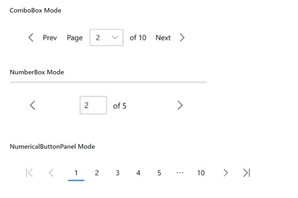
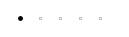
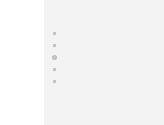
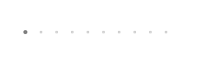
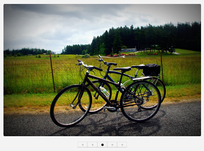
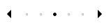

# Background

In many applications, media and data is shown in various layouts like lists, grids, and tables.
Instead of scrolling or panning through the content,
users are able to page through the content with previous and next buttons or jump to specific pages. 

This UI pagination behavior is supported in WinUI currently with the PagerControl. 
(See PagerControl [spec](https://github.com/microsoft/microsoft-ui-xaml-specs/blob/user/savoyschuler/pagercontrol/active/PagerControl/PagerControl.md) 
and PagerControl [proposal](https://github.com/microsoft/microsoft-ui-xaml/issues/60) 
for the latest updates.) The PagerControl works with page numbers in a few different formats:



A common UI pattern not yet supported by the existing PagerControl visualizations appears in
media viewer scenarios like photo carousels or app lists.
In these scenarios, the pages are commonly indicated with 'dot' glyphs instead of
numbers to encourage discovery of content and reduce unneccessary UI elements on the page.
Conceptually, this is similar to an unordered list represented by bullet points instead of numbers. 


The new PipsPager control can  be used when the page content is not explicitly ordered and
a symbol or glyph can instead represent the page number.

# API Pages

## PipsPager class

Represents a control that provides interaction and navigation of a paginated layout view 
(ListView, GridView, ItemsRepeater, DataGrid, etc.) when the page numbers do not need to be visually known.

The PipsPager, like the other pager controls, is independent of the layout views and
does not control any of the data being displayed in the layout view.

### Is this the right control?

Use a PipsPager when the content in the layout is not explicitly ordered by relevancy or 
you desire a glyph-based representation of numbered pages.
This UI is commonly used in photo viewers, app lists, and when display space is limited.
The PipsPager can be oriented vertically or horizontally.

### What is a pip?

Pips represent a unit of numerical value, typically represented as dots,
however can be customized to other glyphs like dashes or squares.
In the PipsPager control by default, a solid dot will represent each page of the layout. 
They can be selected by the user to navigate to a specific page.

### Examples

#### Create a PipsPager

A PipsPager with five visible pips that can be selected by the user to jump to that specific page.
Additionally, the user can use navigational buttons; previous and next, to change the selected page incrementally. 
Navigating beyond the first or last item does not wrap around.
By default, the navigational buttons are collapsed, the pips are oriented horizontally,
and the total number of pages is infinite.



XAML
```XAML 
<muxc:PipsPager x:Name="DefaultPipsPager" />
```

#### PipsPager with visible navigational buttons

The visibility of the previous and next buttons can be set via the
`PreviousButtonVisibility` and `NextButtonVisibility` properties. 
These buttons allow the user to incrementally select a page. The possible values are:
- Visible: The button is visible and enabled, except it is hidden at the extents.
  - For example, when the current page is the first page, the previous button is hidden.
  - Note: Hidden means that the button is invisible but does take up layout space.
- VisibleOnPointerOver: The behavior is the same as Visible *except* that the button is only Visible when
the user is hovering over the paging UI with their cursor.
- Collapsed: The button is not visible to the user and does **not** take up layout space.


XAML
```XAML 
<muxc:PipsPager x:Name="VisibleButtonPipsPager"
  NumberOfPages="5"
  PreviousButtonVisibility="Visible"
  NextButtonVisibility="Visible" />
```

#### Vertical PipsPager with VisibleOnPointerOver button visibility

The PipsPager can also be oriented vertically which does not change its behavior or interaction.
The various button visibility modes can apply to either orientation.
The below example highlights the VisibleOnPointerOver button visibility.



XAML
```XAML 
<muxc:PipsPager x:Name="VerticalPipsPager"
  NumberOfPages="5"
  Orientation="Vertical" 
  PreviousButtonVisibility="VisibleOnPointerOver" 
  NextButtonVisibility="VisibleOnPointerOver" />
```

#### Number of pages displayed less than total

If the number of pages of content is large and do not need to be navigated to at once,
the MaxVisiblePips property can be set to limit the number of visible, interactable, pips.
If the NumberOfPages is greater than the MaxVisiblePips then the pips will scroll so that the selected page is
centered in the control. If the NumberOfPages is equal to or less than the MaxVisiblePips,
no scrolling will occur and the number of pips shown will be the same as the NumberOfPages.

By default, the number of visible pips is 5.



XAML
```XAML
<muxc:PipsPager x:Name="ScrollingPipsPager"
  NumberOfPages="20"
  MaxVisiblePips="10" />
```

#### Integrate PipsPager with a Collection control

Commonly, a PipsPager is used in conjunction with a Collection control.
The below example shows how to bind a PipsPager with a FlipView to provide
an extra way to navigate through content and indicate its page.

Note: To use the PipsPager as a page indicator **only**,
set IsEnabled to false in the control to disable user interaction.



XAML
``` XAML
<StackPanel>
  <FlipView x:Name="Gallery" MaxWidth="400" Height="270" ItemsSource="{x:Bind Pictures}">
      <FlipView.ItemTemplate>
          <DataTemplate x:DataType="x:String">
              <Image Source="{x:Bind Mode=OneWay}"/>
          </DataTemplate>
      </FlipView.ItemTemplate>
  </FlipView>

  <!-- The SelectedPageIndex is bound to the FlipView to keep the two in sync -->
  <muxc:PipsPager x:Name="FlipViewPipsPager"
      HorizontalAlignment="Center"
      Margin="0, 10, 0, 0"
      NumberOfPages="{x:Bind Pictures.Count}"
      SelectedPageIndex="{x:Bind Path=Gallery.SelectedIndex, Mode=TwoWay}" />
</StackPanel>
```
#### Pip and Button customization

The navigational buttons and pips are able to be customized via the PreviousButtonStyle, NextButtonStyle, SelectedPipStyle, and DefaultPipStyle.

If the PreviousButtonStyle or NextButtonStyle sets the Visibility, Opacity, or IsEnabled properties on the navigational button, it will take precedence over PreviousButtonVisibility or NextButtonVisibility respectively.

Similarly, the SelectedPipStyle and DefaultPipStyle will take precedence over the values in the theme resources.



XAML
``` XAML
<Page.Resources>
    <Style x:Key="NavButtonBaseStyle" TargetType="Button" BasedOn="{StaticResource NavigatonButtonBaseStyle}">
        <Setter Property="Width" Value="30" />
        <Setter Property="Height" Value="30" />
        <Setter Property="FontSize" Value="12" />
    </Style>

    <Style x:Key="PreviousButtonStyle" BasedOn="{StaticResource NavButtonBaseStyle}" TargetType="Button">
        <Setter Property="Content" Value="&#xEDDB;" />
    </Style>

    <Style x:Key="NextButtonStyle" BasedOn="{StaticResource NavButtonBaseStyle}" TargetType="Button">
        <Setter Property="Content" Value="&#xEDDC;" />
    </Style>
</Page.Resources>

<muxc:PipsPager x:Name="CustomNavButtonPipsPager"
  PreviousButtonStyle="{StaticResource PreviousButtonStyle}"
  NextButtonStyle="{StaticResource NextButtonStyle}" />
```
## PipsPager member notes

| Name | Description| Default | 
|:---:|:---|:---|
| NumberOfPages | Sets the max number of pages the index control will iterate through. The default will represent an infinite page range. | -1
| PreviousButtonStyle and NextButtonStyle | Gives the developer the option to customize the style by changing the text or glyph for the edge buttons. | The Previous/Next page button glyph, "Content", and PipsPagerNavigationButtonBaseStyle defined in theme resources.
| DefaultPipStyle and SelectedPipStyle | Gives the developer the option to customize the style by changing the appearance of the pips. | Based on default and selected pip theme resources and the PipsPagerButtonBaseStyle defined in theme resources.
| NextButtonVisibility | Sets the visibility of the button that navigates to the next item. | Collapsed |
| PreviousButtonVisibility | Sets the visibility of the button that navigates to the previous item. | Collapsed |
| SelectedPageIndex | The 0 based index that is currently selected. It will default to the first index. | 0
| MaxVisiblePips | The maximum number of pips that will appear in the control at once. If the NumberOfPages is greater than this value, the UI will scroll so that the selected pip is centered. | 5
| Orientation | The orientation of the control. Can be either Vertical or Horizontal. | Horizontal
| PipsPagerSelectedIndexChangedEvent | Event that is fired after the user selects a pip or the directional buttons. This event will return the index number of the page that the user selected. | N/A

## PipsPager Theme Resources

You can modify the look of a PipsPager by specifying Xaml resources in your app.
For more info, see the
[lightweight styling guide](https://docs.microsoft.com/en-us/windows/uwp/design/controls-and-patterns/xaml-styles#lightweight-styling).

| Resource key | Description | Type
|:-:|:--| :-- |
| PipsPagerButtonWidth | Sets the bounding box width for each pip | Double |
| PipsPagerButtonHeight | Sets the bounding box height for each pip | Double |
| PipsPagerButtonBorderThickness | Sets the border thickness for each pip | Thickness |
| PipsPagerNavigationButtonBorderThickness | Sets the border thickness for each navigational button | Thickness |
| PipsPagerSelectedGlyph | Sets the pip glyph when selected in MDL2 icon set | String |
| PipsPagerDefaultGlyph | Sets the default pip glyph in MDL2 icon set | String |
| PipsPagerNavigationButtonHeight | Sets the height for each navigational button | Double |
| PipsPagerNavigationWidth | Sets the width for each navigational button | Double |
| PipsPagerNavigationButtonFontSize | Sets the font size for each navigational button | Double |
| PipsPagerSelectedGlyphFontSize | Sets the size in pixels of the pip glyph when selected | Double |
| PipsPagerDefaultGlyphFontSize | Sets the size in pixels of the pip glyph at rest| Double |

## PipsPagerButtonVisibility enum

Defines constants that specify how a the buttons of a PipsPager are to be displayed.

| Value | Description |
|:---:|:---|
| Visible | The button is visible and enabled, except it is hidden at the extents. For example, when the current page is the first page, the previous button is hidden. |
| VisibleOnPointerOver | The behavior is the same as Visible *except* that the button is only Visible when the user is hovering over the paging UI with their cursor. |
| Collapsed | The button is not visible to the user and does **not** take up layout space. (Default for ) |

## PipsPagerTemplateSettings

Defines properties that you can establish template bindings to if defining a new template for the PipsPager.

| Value | Description |
|:---:|:---|
| PipsPagerItems | The collection of items to represent the pips in the PipsPager. |


# API Details

```IDL
enum PipsPagerButtonVisibility
{
  Visible,
  VisibleOnPointerOver,
  Collapsed, 
}

runtimeclass PipsPagerSelectedIndexChangedEventArgs
{
    Int32 NewPageIndex{get; };
    Int32 PreviousPageIndex{get; };
};

unsealed runtimeclass PipsPagerTemplateSettings : Windows.UI.Xaml.DependencyObject
{
    Windows.Foundation.Collections.IVector<Object> PipsPagerItems { get; }; 
}


unsealed runtimeclass PipsPager : Windows.UI.Xaml.Controls.Control
{
    PipsPager();

    [MUX_DEFAULT_VALUE("-1")]
    Int32 NumberOfPages;

    [MUX_DEFAULT_VALUE("0")]
    Int32 SelectedPageIndex;

    [MUX_DEFAULT_VALUE("5")]
    Int32 MaxVisiblePips;

    [MUX_DEFAULT_VALUE("Horizontal")]
    Windows.UI.Xaml.Controls.Orientation Orientation;

    [MUX_DEFAULT_VALUE("Collapsed")]
    PipsPagerButtonVisibility PreviousButtonVisibility;    
    [MUX_DEFAULT_VALUE("Collapsed")]
    PipsPagerButtonVisibility NextButtonVisibility;

    Windows.UI.Xaml.Style PreviousButtonStyle;
    Windows.UI.Xaml.Style NextButtonStyle; 

    Windows.UI.Xaml.Style SelectedPipStyle;
    Windows.UI.Xaml.Style DefaultPipStyle;


    event Windows.Foundation.TypedEventHandler<PipsPager, PipsPagerSelectedIndexChangedEventArgs> SelectedIndexChanged;

    PipsPagerTemplateSettings TemplateSettings{ get; };

    static Windows.UI.Xaml.DependencyProperty NumberOfPagesProperty{ get; };
    static Windows.UI.Xaml.DependencyProperty SelectedPageIndexProperty{ get; };
    static Windows.UI.Xaml.DependencyProperty MaxVisiblePipsProperty{ get; };
    static Windows.UI.Xaml.DependencyProperty OrientationProperty{ get; };
    static Windows.UI.Xaml.DependencyProperty PreviousButtonVisibilityProperty { get; };
    static Windows.UI.Xaml.DependencyProperty NextButtonVisibilityProperty { get; };
    static Windows.UI.Xaml.DependencyProperty PreviousButtonStyleProperty{ get; };
    static Windows.UI.Xaml.DependencyProperty NextButtonStyleProperty{ get; };
    static Windows.UI.Xaml.DependencyProperty SelectedPipStyleProperty{ get; };
    static Windows.UI.Xaml.DependencyProperty DefaultPipStyleProperty{ get; };
}
```


# Input & Accessibility

## Keyboard

- Tab navigation into the PipsPager proceeds through the first actionable item. This would be the previous button (if not Collapsed) or the currently selected pip. Any directional buttons can be navigated to via tab if they are not Collapsed and will be visible on focus.
- The arrow keys can be used to navigate between the pips and directional buttons. Independent of the orientation set, the left and up arrow keys will change focus to the previous pip or to the previous button and the right and down arrow keys will change focus to the next pip or the next button.
- The actionable items can be selected with the space bar.

## Gamepad

- The PipsPager can be navigated to via spatial navigation. The selected pip will automatically take focus and the pips will be selected when navigated to and focused. Independent of the PipsPagerButtonVisibility settings, the navigation buttons will not be visible to the user. 
  - In horizontal orientation left and right spatial navigation will focus and select the pips. The PipsPager will be navigated out of when the user navigates up or down or when the user attempts to navigate past the first or last page. We recommend that developers do not place UI directly to the left or right of a horizontally oriented PipsPager. 
  - In vertical orientation up and down spatial navigation will focus and select the pips. The PipsPager will be navigated out of when the user navigates left or right or when the user attempts to navigate past the first or last page. We recommend that developers do not place UI directly above or below a vertically oriented PipsPager. 

## Touch

For touch-optimized experiences, we recommend that developers integrate the PipsPager with a view control (i.e. FlipView, see guidance [above](#integrate-pipsPager-with-a-collection-control)) to take advantage of on-content pagination with touch.

The user can also touch to select the individual pip if able.

## Screen readers

- When the focus is on the control, the screen reader will announce "pager".
- When the focus is on the previous or next button the screen reader will announce "previous page" or "next page". 
  - If the buttons have text properties set by the developer, the screen reader will announce that text instead of the default announcement.
- When the focus is on a pip, the screen reader will announce "page x of y".
  - When the number of pages is infinite, the screen reader will announce "page x".
- When the pip is selected, the screen reader will announce "page x of y selected".


# Open Questions

- How can we optimize for touch input at this form factor?
  - Relatedly, would the PipsPager benefit from a 'Standard' visualization where the pips and navigational buttons increase in size and are touch accessible by default.
- Should selection follow focus in keyboard and Gamepad input?
