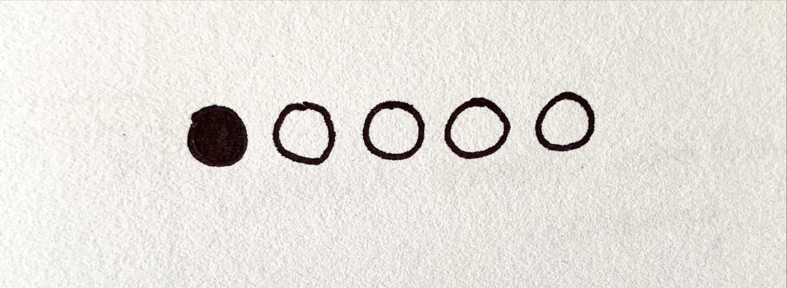
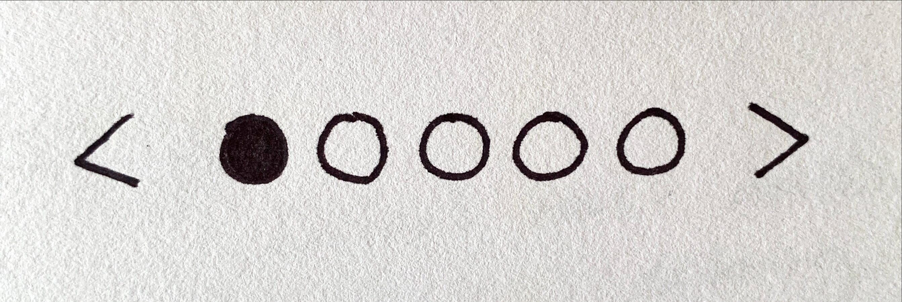

# Background
In many applications, media and data is shown in various layouts like lists, grids, and tables. Instead of scrolling or panning through the content, users are able to page through the content with previous and next buttons or jump to specific pages. This UI pagination behavior is supported in WinUI currently with the PagerControl. See PagerControl [spec](https://github.com/microsoft/microsoft-ui-xaml-specs/blob/user/savoyschuler/pagercontrol/active/PagerControl/PagerControl.md) and PagerControl [proposal](https://github.com/microsoft/microsoft-ui-xaml/issues/60) for the latest updates.

A common UI pattern not yet supported by the existing PagerControl visualizations appears in media viewer scenarios like photo carousels or app lists. In these scenarios, the pages are commonly indicated with 'dot' glyphs instead of numbers. Conceptually, this is similar to an unordered list represented by bullet points instead of numbers. We would like to introduce a PipsPager to be used when the page content is not explicitly ordered and a symbol or glyph can instead represent the page number. 

# Description
The PipsPager is a UI component that provides a standard interaction for pagination with a layout view (ListView, GridView, ItemsRepeater, DataGrid, etc.) when the page numbers do not need to be visually known. The PipsPager, like the other pager controls, is independent of the layout views and does not control any of the data being displayed in the layout view.

## Is this the right control?
Use a PipsPager when the content in the layout is not explicitly ordered by relevancy or you desire a glyph-based representation of numbered pages. This UI is commonly used in photo viewers, app lists, and when display space is limited. The PipsPager can be oriented vertically or horizontally.

### What is a pip?
Pips represent a unit of numerical value, typically represented as dots, however can be customized to other glyphs like dashes or squares. In the PipsPager control by default, a solid dot will represent each page of the layout. They can be selected by the user to navigate to a specific page.

# Examples

## Create a PipsPager
A PipsPager with five pages that can be selected by the user. By default, the previous and next buttons are collapsed and the pips are oriented horizontally.

<!--  -->

XAML
```XAML 
    <controls:PipsPager NumberOfPages="5"/>
```

## PipsPager with visible buttons
The visibility of the previous and next buttons can be set via the PreviousButtonVisibility and NextButtonVisibility properties. These buttons allow the user to select a page
- Visible: The button is visible and selectable. An exception to this is that if the selected page is on the associated "edge" of the button then the button will be hidden.
  - The edge for the previous button is the first page and the edge for the next button is the last page.
  - Note: Hidden means that the button is invisible but does take up layout space.
- VisibleOnHover: The behavior is the same as Visible *except* that the button is only Visible when the user is hovering over the paging UI with their cursor.
- Collapsed: The button is not visible to the user and does **not** take up layout space.

<!--  -->

XAML
```XAML 
    <controls:PipsPager NumberOfPages="5"
      PreviousButtonVisibility=Visible
      NextButtonVisibility=Visible />
```

## Vertical PipsPager with VisibleOnHover button visibility
The PipsPager can also be oriented vertically which does not change its behavior or interaction. The various button visibility modes can apply to either orientation. The below example highlights the VisibleOnHover button visibility.

<!--  -->

XAML
```XAML 
    <IndicatorPager NumberOfPages="5"
      Orientation=Vertical 
      PreviousButtonVisibility=VisibleOnHover 
      NextButtonVisibility= VisibleOnHover />
```

## Number of pages displayed less than total
If the number of pages of content is large and do not need to be navigated to at once, the MaxVisualIndicators property can be set to limit the number of visible, interactable, pips. If the NumberOfPages is greater than the MaxVisualIndicators then the pips will scroll so that the selected page is centered in the control. If the NumberOfPages is equal to or less than the MaxVisualIndicators, no scrolling will occur and the number of pips shown will be the same as the NumberOfPages.

<!--  -->

XAML
```XAML
<IndicatorPager NumberOfPages="20"
      MaxVisualIndicators="12" />
```

## Pip and Button customization
The buttons and pips can be customized via the PreviousButtonStyle, NextButtonStyle, SelectedIndicatorButtonStyle, and DefaultIndicatorButtonStyle. As a note, setting the PreviousButtonStyle and NextButtonStyle can overwrite what is set in PreviousButtonVisibility and NextButtonVisibility. Additionally, the SelectedIndicatorButtonStyle and DefaultIndicatorButtonStyle can overwrite what is set in the theme resources.

XAML and example image to be added.

# API Notes
| Name | Description| Default | 
|:---:|:---|:---|
| PipsPagerButtonVisibility | Enum that contains 3 values (Visible, VisibleOnHover, Collapsed) that allows the developer to show or hide the two navigation buttons. <br> - Visible: The button is visible and selectable. An exception to this is that if the selected page is on the associated "edge" of the button then the button will be hidden.<br> - VisibleOnHover: The behavior is the same as Visible *except* that the button is only Visible when the user is hovering over the paging UI with their cursor. <br> - Collapsed: The button is not visible to the user and does **not** take up layout space. | Collapsed |
| NumberOfPages | Sets the max number of pages the index control will iterate through. The default will represent an infinite page range. | -1
| Previous and Next Style | Give the developer the option to customize the style by changing the text or glyph for the edge buttons. | N/A
| SelectedPageIndex | The 0 based index that is currently selected. It will default to the first index. | 0
| MaxVisualIndicators | The maximum number of pips that will appear in the control at once. If the NumberOfPages is greater than this value, the UI will scroll so that the selected pip is centered. | 5
| Orientation | The orientation of the control. Can be either Vertical or Horizontal. | Horizontal
| PipsPagerSelectedIndexChangedEvent | Event that is fired after the user selects a pip or the directional buttons. This event will return the index number of the page that the user selected. | N/A
*Command for the buttons?

# API Details
```IDL
enum PipsPagerButtonVisibility
{
  Visible,
  VisibleOnHover,
  Collapsed, 
}

runtimeclass PipsPagerSelectedIndexChangedEventArgs
{
    Int32 NewPageIndex{get; };
    Int32 PreviousPageIndex{get; };
};

unsealed runtimeclass PipsPagerTemplateSettings : Windows.UI.Xaml.DependencyObject
{
    Windows.Foundation.Collections.IVector<Object> PipsPagerItems { get; }; 
}


unsealed runtimeclass PipsPager : Windows.UI.Xaml.Controls.Control
{
    PipsPager();

    [MUX_DEFAULT_VALUE("0")]
    Int32 NumberOfPages;

    [MUX_DEFAULT_VALUE("0")]
    Int32 SelectedPageIndex;

    [MUX_DEFAULT_VALUE("5")]
    Int32 MaxVisualIndicators;

    [MUX_DEFAULT_VALUE("Horizontal")]
    Windows.UI.Xaml.Controls.Orientation Orientation;

    [MUX_DEFAULT_VALUE("Collapsed")]
    PagerControlButtonVisibility PreviousButtonVisibility;    
    [MUX_DEFAULT_VALUE("Collapsed")]
    PagerControlButtonVisibility NextButtonVisibility;

    Windows.UI.Xaml.Style PreviousButtonStyle;
    Windows.UI.Xaml.Style NextButtonStyle; 

    Windows.UI.Xaml.Style SelectedIndicatorButtonStyle;
    Windows.UI.Xaml.Style DefaultIndicatorButtonStyle;


    event Windows.Foundation.TypedEventHandler<PipsPager, PipsPagerSelectedIndexChangedEventArgs> PipsPagerSelectedIndexChanged;

    PipsPagerTemplateSettings TemplateSettings{ get; };

    static Windows.UI.Xaml.DependencyProperty NumberOfPagesProperty{ get; };
    static Windows.UI.Xaml.DependencyProperty SelectedPageIndexProperty{ get; };
    static Windows.UI.Xaml.DependencyProperty MaxVisualIndicatorsProperty{ get; };
    static Windows.UI.Xaml.DependencyProperty OrientationProperty{ get; };
    static Windows.UI.Xaml.DependencyProperty PreviousButtonVisibilityProperty { get; };
    static Windows.UI.Xaml.DependencyProperty NextButtonVisibilityProperty { get; };
    static Windows.UI.Xaml.DependencyProperty PreviousButtonStyleProperty{ get; };
    static Windows.UI.Xaml.DependencyProperty NextButtonStyleProperty{ get; };
    static Windows.UI.Xaml.DependencyProperty SelectedIndicatorButtonStyleProperty{ get; };
    static Windows.UI.Xaml.DependencyProperty DefaultIndicatorButtonStyleProperty{ get; };

```


## Theme Resources
| Name | Description | Type
|:-:|:--| :-- |
| PipsPagerDefaultIndicator | Sets the default pip glyph in MDL2 icon set | String |
| PipsPagerSelectedIndicator | Sets the pip glyph when selected in MDL2 icon set | String |
| PipsPagerIndicatorFontSize | Sets the size in pixels of the pip glyph | Double |
| PipsPagerSelectedIndicatorFontSize | Sets the size in pixels of the pip glyph when selected | Double |
| PipsPagerDefaultForegroundBrush | Sets the foreground brush of the default pip glyphs| SolidColorBrush
| PipsPagerSelectedForegroundBrush | Sets the foreground brush of the pip glyph when selected | SolidColorBrush
| PipsPagerPointerOver | Sets the pointer over/hover visual state for the pip display mode | Brush
| PipsPagerPressed | Sets the pressed visual state for the pip display mode | Brush
| PipsPagerSelected | Sets the selected visual state for the pip display mode | Brush
| PipsPagerMargin | Sets the margin, in pixels, between each pip glyph | Thickness
| PipsPagerIndicatorWidth | Sets the bounding box width for each pip glyph | Double
| PipsPagerIndicatorHeight | Sets the bounding box height for each pip glyph | Double


# Input & Accessibility

## Keyboard
- The PipsPager is a tab stop which will navigate to the first selectable item -- first button, previous button, or first pip. Any visible directional buttons can be navigated to via tab.
- The arrow keys can be used to navigate between the pips and directional buttons. Independent of the orientation set, the left and up arrow keys will change focus to the previous pip or to the previous button and the right and down arrow keys will change focus to the next pip or the next button.

## Touch
For touch screen devices, a vertical swipe on the pager will navigate to the previous or next page.
 - An "up" swipe will navigate to the previous page.
 - A "down" swipe will navigate to the next page.

The user can also touch to select the individual pip if able.

## Screen readers
- When the focus is on the control, the screen reader will announce "pager".
- When the focus is on the previous or next button the screen reader will announce "first page", "last page", "next page", or "previous page". 
  - If the buttons have text properties set by the developer, the screen reader will announce that text instead of the default announcement.
- When the focus is on an indicator button, the screen reader will announce "page x of y".


# Open Questions
- When the pips take focus via the keyboard are they selected?
- Are there any other specific touch interactions?
- Is there additional animation or customization associated with the MaxVisualIndicators property? E.g. pip size decreasing when there are more pages to navigate to.
- Should functionality for wizard/step-like UX be supported by PipsPager?
  - The pager is cognizant of the pages it has passed and the pages to come and there is specific styling applied to this.
