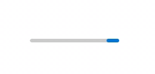

# Background

The Xaml [ProgressBar](https://docs.microsoft.com/uwp/api/Microsoft.UI.Xaml.Controls.ProgressBar) control is used to show progress of an operation, where the typical visual appearance is a bar that animates a filled area as progress continues. (There's also a [ProgressRing](https://docs.microsoft.com/uwp/api/Windows.UI.Xaml.Controls.ProgressRing) control that shows a circle rather than a line.)

The update in this spec is for a feature to make the bar appear such that the rectangle wraps around from one side to the other (when in indetermine mode). This is implemented by having two rectangles, so during the "wrap" what you see is actually a partial rectangle on the right and another partial one on the left:

| Previous | Wrapping |
| - | - |
|  |  |

The current single rectangle is controlled by two read-only properties:  
`ContainerAnimationStartPosition` and  
`ContainerAnimationEndPosition`. 

These are exposed by the ProgressBar's [TemplateSettings](https://docs.microsoft.com/uwp/api/Windows.UI.Xaml.Controls.ProgressBar.TemplateSettings), and consumed by the control template. 

The new APIs are a second pair of these properties to similarly control the second rectangle:  
`Container2AnimationStartPosition` and  
`Container2AnimationEndPosition`

# Examples

From the ProgressBar's new built-in control template, the following is used to animate the second rectangle by binding to the `Container2AnimationStartPosition` and `Container2AnimationEndPosition` properties:

```Xml
<DoubleAnimationUsingKeyFrames
    Storyboard.TargetName="IndeterminateProgressBarIndicator2"
    Storyboard.TargetProperty="(UIElement.RenderTransform).(CompositeTransform.TranslateX)">

    <SplineDoubleKeyFrame KeyTime="0" 
    Value="{Binding RelativeSource={RelativeSource TemplatedParent},
Path=TemplateSettings.Container2AnimationStartPosition}" 
    KeySpline="0.4, 0.0, 0.6, 1.0" />

    <SplineDoubleKeyFrame KeyTime="0:0:0.75" 
    Value="{Binding RelativeSource={RelativeSource TemplatedParent}, 
Path=TemplateSettings.Container2AnimationStartPosition}" KeySpline="0.4, 0.0, 0.6, 1.0" />

    <SplineDoubleKeyFrame KeyTime="0:0:2" 
    Value="{Binding RelativeSource={RelativeSource TemplatedParent}, Path=TemplateSettings.Container2AnimationEndPosition}" KeySpline="0.4, 0.0, 0.6, 1.0" />

</DoubleAnimationUsingKeyFrames>
```


# Remarks

The `Container2AnimationStartPosition` and `Container2AnimationEndPosition` are intended to be used together, and can be used with the `ContainerAnimationStartPosition` and `ContainerAnimationEndPosition` properties.

# API Notes

New properties on [ProgressBarTemplateSettings](https://docs.microsoft.com/uwp/api/Microsoft.UI.Xaml.Controls.ProgressBarTemplateSettings):

| API | Note |
| - | - |
| Container2AnimationStartPosition | Gets the "From" point of the second container animation that animates the ProgressBar. This is intended to be used with the Container2AnimationEndPosition property |
| Container2AnimationEndPosition | Gets the target "To" point of the second container animation that animates the ProgressBar. This is intended to be used with the Container2AnimationStartPosition property|


> Note: Update the  doc pages on the existing property pari to say "first".

# API Details

```c++
[webhosthidden]
unsealed runtimeclass ProgressBarTemplateSettings : Windows.UI.Xaml.DependencyObject
{
    ...

    Double Container2AnimationStartPosition { get; };
    static Windows.UI.Xaml.DependencyProperty Container2AnimationStartPositionProperty{ get; };

    Double Container2AnimationEndPosition { get; };
    static Windows.UI.Xaml.DependencyProperty Container2AnimationEndPositionProperty{ get; };

}
```
