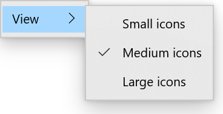
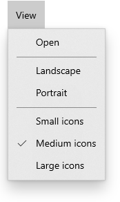

# Description
A radio button menu flyout item is a menu item that is mutually exclusive with other menu items in its group. 
This control contol allows apps to present users with menus containing multiple options, where a user would choose only of these options at a given time.


# Examples

Add two or more `RadioMenuFlyoutItem`s to the content of *MenuBarItem*, *MenuFlyout*, or *MenuFlyoutSubItem*.



````Xaml
<MenuFlyoutSubItem Text="View">
    <muxc:RadioMenuFlyoutItem Text="Small icons"/>
    <muxc:RadioMenuFlyoutItem Text="Medium icons" IsChecked="True"/>
    <muxc:RadioMenuFlyoutItem Text="Large icons"/>
</MenuFlyoutSubItem>
````
<br/>
For multiple groupings of radio buttons within a single menu, be sure to specify the `GroupName` property of each set.



````Xaml
<muxc:MenuBar Margin="24">
    <muxc:MenuBarItem Title="View">
        <MenuFlyoutItem Text="Open"/>
        <MenuFlyoutSeparator/>
        <muxc:RadioMenuFlyoutItem Text="Landscape" GroupName="OrientationGroup"/>
        <muxc:RadioMenuFlyoutItem Text="Portrait" GroupName="OrientationGroup"/>
        <MenuFlyoutSeparator/>
        <muxc:RadioMenuFlyoutItem Text="Small icons" GroupName="SizeGroup"/>
        <muxc:RadioMenuFlyoutItem Text="Medium icons" IsChecked="True" GroupName="SizeGroup"/>
        <muxc:RadioMenuFlyoutItem Text="Large icons" GroupName="SizeGroup"/>
    </muxc:MenuBarItem>
</muxc:MenuBar>
````

# API Notes
## Class: RadioMenuFlyoutItem
| Member Name | Description |
|:- |:--|
| IsChecked | Gets or sets whether the RadioMenuFlyoutItem is checked. |
| GroupName | Gets or sets the name that specifies which RadioMenuFlyoutItem controls are mutually exclusive.|


# API Details
[WUXC_VERSION_PREVIEW]
[webhosthidden]
[MUX_PROPERTY_CHANGED_CALLBACK(TRUE)]
unsealed runtimeclass RadioMenuFlyoutItem : Windows.UI.Xaml.Controls.MenuFlyoutItem
{
    RadioMenuFlyoutItem();

    Boolean IsChecked;
    String GroupName;

    static Windows.UI.Xaml.DependencyProperty IsCheckedProperty{ get; };
    static Windows.UI.Xaml.DependencyProperty GroupNameProperty{ get; };
}
