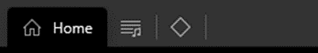
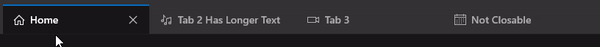
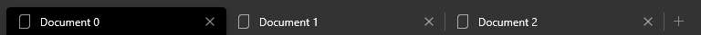

<!-- The purpose of this spec is to describe a new feature and
its APIs that make up a new feature in WinUI. -->

<!-- There are two audiences for the spec. The first are people
that want to evaluate and give feedback on the API, as part of
the submission process.  When it's complete
it will be incorporated into the public documentation at
docs.microsoft.com (http://docs.microsoft.com/uwp/toolkits/winui/).
Hopefully we'll be able to copy it mostly verbatim.
So the second audience is everyone that reads there to learn how
and why to use this API. -->

# Background
<!-- Use this section to provide background context for the new API(s) 
in this spec. -->

<!-- This section and the appendix are the only sections that likely
do not get copied to docs.microsoft.com; they're just an aid to reading this spec. -->

<!-- If you're modifying an existing API, included a link here to the
existing page(s) -->

<!-- For example, this section is a place to explain why you're adding this API rather than
modifying an existing API. -->

<!-- For example, this is a place to provide a brief explanation of some dependent
area, just explanation enough to understand this new API, rather than telling
the reader "go read 100 pages of background information posted at ...". -->

> This spec corresponds to [issue 2007](https://github.com/microsoft/microsoft-ui-xaml/issues/2007) on the WinUI repo.

The WinUI TabView is missing two main features relative to the Windows Community Toolkit (WCT) TabView:
* **TabWidthMode: Compact** ([WCT API Link](https://docs.microsoft.com/en-us/dotnet/api/microsoft.toolkit.uwp.ui.controls.tabwidthmode?view=win-comm-toolkit-dotnet-stable)) 
* **Overlay close button** ([WCT API Link](https://docs.microsoft.com/en-us/dotnet/api/microsoft.toolkit.uwp.ui.controls.tabview.isclosebuttonoverlay?view=win-comm-toolkit-dotnet-stable#Microsoft_Toolkit_Uwp_UI_Controls_TabView_IsCloseButtonOverlay))

Once these feature gaps have been closed and the WinUI TabView is at parity with the Windows Community Toolkit version, we will be able to deprecate the WCT TabView control.

# Description
<!-- Use this section to provide a brief description of the feature.
For an example, see the introduction to the PasswordBox control 
(http://docs.microsoft.com/windows/uwp/design/controls-and-patterns/password-box). -->

## TabViewWidthMode: Compact

This change introduces a new value to the existing `TabViewWidthMode` enum: `Compact`.

Setting `Compact` will cause unselected tab headers to display only the tab's icon. If an icon is not set, the tab will display nothing.

The selected tab will render at its natural size (ie. the size it would render in `SizeToContent` mode.)



## CloseButtonOverlayMode

Describes the behavior of the x-to-close button found on each TabViewItem. 

The `CloseButtonOverlayMode` enum has three values: {`Auto`, `OnHover`, `Persistent`}

> The `CloseButtonOverlayMode` will only effect tabs that are closeable - ie. the value of the `TabViewItem`'s `IsClosable` property is `TRUE`.

`OnHover`: The x-to-close button only appears on the selected tab and any tabs that are being hovered.



`Persistent`: The x-to-close button always appears on every tab. 



`Auto`: Maps to `Persistent`.

> Prior to this change, the behavior of the x-to-close button was always `Persistent` with no option to change the behavior.

> See the [Appendix](#Appendix) section for why this value is an enum and not a boolean.

# Examples
<!-- Use this section to explain the features of the API, showing
example code with each description. The general format is: 
  feature explanation,
  example code
  feature explanation,
  example code
  etc.-->
  
<!-- Code samples should be in C# and/or C++/WinRT -->

<!-- As an example of this section, see the Examples section for the PasswordBox control 
(https://docs.microsoft.com/windows/uwp/design/controls-and-patterns/password-box#examples). -->


# Remarks
<!-- Explanation and guidance that doesn't fit into the Examples section. -->

<!-- APIs should only throw exceptions in exceptional conditions; basically,
only when there's a bug in the caller, such as argument exception.  But if for some
reason it's necessary for a caller to catch an exception from an API, call that
out with an explanation either here or in the Examples -->

# API Notes
<!-- Option 1: Give a one or two line description of each API (type
and member), or at least the ones that aren't obvious
from their name.  These descriptions are what show up
in IntelliSense. For properties, specify the default value of the property if it
isn't the type's default (for example an int-typed property that doesn't default to zero.) -->

<!-- Option 2: Put these descriptions in the below API Details section,
with a "///" comment above the member or type. -->

# API Details
<!-- The exact API, in MIDL3 format (https://docs.microsoft.com/en-us/uwp/midl-3/) -->

```
[WUXC_VERSION_MUXONLY]
[webhosthidden]
enum TabViewWidthMode
{
    Equal = 0,
    SizeToContent = 1,
    Compact = 2,
};

[WUXC_VERSION_PREVIEW]
[webhosthidden]
enum TabViewCloseButtonOverlayMode
{
    Auto = 0,
    OnHover = 1,
    Persistent = 2,
};

[WUXC_VERSION_MUXONLY]
[webhosthidden]
[contentproperty("TabItems")]
unsealed runtimeclass TabView : Windows.UI.Xaml.Controls.Control
{

    [WUXC_VERSION_PREVIEW]
    [MUX_DEFAULT_VALUE("winrt::TabViewCloseButtonOverlayMode::Persistent")]
    [MUX_PROPERTY_CHANGED_CALLBACK(TRUE)]
    TabViewCloseButtonOverlayMode CloseButtonOverlayMode{ get; set; };

    [WUXC_VERSION_PREVIEW]
    static Windows.UI.Xaml.DependencyProperty CloseButtonOverlayModeProperty{ get; };
}
```

# Appendix
<!-- Anything else that you want to write down for posterity, but 
that isn't necessary to understand the purpose and usage of the API.
For example, implementation details. -->

**Why is CloseButtonOverlayMode an enum and not a boolean?**

1. The corresponding visual effect might change over time

The CloseButtonOverlayMode enum describes a visual effect that is likely to change over time. For example, Spartan Edge used the hover model, whereas chromium Ege uses a persistent model. An enum allows that platform to have an opinion (via `Auto`) and an option to change the behavior over time in a way that a boolean does not. 

2. Per-device input support

The original spec had discussion around the desired default (persistent vs. hover) both in the context of user experience as well as touch-friendliness. An enum value provides the platform an option to set per-device or per-input behavior if desired.

3. Futureproofing

An enum gives the platform an option to introduce other modes in the future. Although there haven't been specific modes proposed yet, an enum leaves the door open for changes.