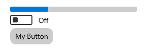

<!-- The purpose of this spec is to describe a new feature and
its APIs that make up a new feature in WinUI. -->

<!-- There are two audiences for the spec. The first are people
that want to evaluate and give feedback on the API, as part of
the submission process.  When it's complete
it will be incorporated into the public documentation at
docs.microsoft.com (http://docs.microsoft.com/uwp/toolkits/winui/).
Hopefully we'll be able to copy it mostly verbatim.
So the second audience is everyone that reads there to learn how
and why to use this API. -->

# Background
<!-- Use this section to provide background context for the new API(s)
in this spec. -->

<!-- This section and the appendix are the only sections that likely
do not get copied to docs.microsoft.com; they're just an aid to reading this spec. -->

<!-- If you're modifying an existing API, included a link here to the
existing page(s) -->

<!-- For example, this section is a place to explain why you're adding this API rather than
modifying an existing API. -->

<!-- For example, this is a place to provide a brief explanation of some dependent
area, just explanation enough to understand this new API, rather than telling
the reader "go read 100 pages of background information posted at ...". -->

> See [proposal document](https://github.com/Microsoft/microsoft-ui-xaml/issues/684) for information on this feature's scope, and see the [parent proposal document](https://github.com/microsoft/microsoft-ui-xaml/issues/524) for information about design application of this feature.

# Description
<!-- Use this section to provide a brief description of the feature.-->
The ``CornerRadius`` property for controls and their templates can be easily customized/themed through the introduction of new [Lightweight styling](https://docs.microsoft.com/en-us/windows/uwp/design/controls-and-patterns/xaml-styles#lightweight-styling) resources.

# Examples
The following example cover common use-case scenarios where an app-author would like to customize the corner radii of one or more controls.

## Setting the CornerRadii of controls
There are three main ways to set the corner radius' of controls, depending on the scope and level of granularity desired when customizing/setting the corners.

### Global CornerRadius changes
To make large changes globally and consistently to all controls within a scope, defining/overriding the ``ControlCornerRadius`` and ``OverlayCornerRadius`` resources from generic.xaml will affect all controls that benefit from rounded edges.

``` xml
<Application.Resources>
  <Thickness x:Key="ControlCornerRadius">10</Thickness>
  <Thickness x:Key="OverlayCornerRadius">10</Thickness>
</Application.Resources>
```

### Varied Scope Control-specific CornerRadius changes
Using [Lightweight styling](https://docs.microsoft.com/windows/uwp/design/controls-and-patterns/xaml-styles#lightweight-styling), you can customize at which scope you want corner radius values of specific controls to be changed.

``` xml
<Page.Resources>
  <Thickness x:Key="ButtonCornerRadius">5</Thickness>
  <Thickness x:Key="ProgressBarCornerRadius">3</Thickness>
</Page.Resources>
```

This can apply at a page level (shown above) and app level (like ``Application.Resources``) or scoped to a container:

``` xml
<Grid>
  <Grid.Resources>
    <Thickness x:Key="ButtonCornerRadius">5</Thickness>
  </Grid.Resources>
  <Button Content="My Rounded Button"/>
</Grid>
```

### Chaning the CornerRadius property on a control
Lastly, you can also change the CornerRadius property directly on the control itself, either via a style (which can be scoped) or via the ``CornerRadius`` property on the control itself.

An example of indirect corner radius property setting on a style (can be scoped):
``` xml
<Style TargetType="Button">
  <Setter Property="CornerRadius" Value="6"/>
</Style>
```

An example of a corner radius property on the control itself:
``` xml
<Button CornerRadius="6" Content="My Rounded Button"/>
```

Depending on the control you set the ``CornerRadius`` property on, it will effect it differently. If you want to edit the radiis more individually (e.g. the ProgressBar's fill roundness versus ProgressBar's background roundess), consider using the corrent Lightweight styling resource instead.

# Remarks
<!-- Explanation and guidance that doesn't fit into the Examples
section.  For example, see the Remarks for the MediaPlayerElement
(https://docs.microsoft.com/uwp/api/Windows.UI.Xaml.Controls.MediaPlayerElement#remarks). -->
Much like the relationship between our [System Colors](https://docs.microsoft.com/en-us/windows/uwp/design/style/color) and our [Theme Brushes](https://docs.microsoft.com/en-us/windows/uwp/design/controls-and-patterns/xaml-theme-resources#the-xaml-color-ramp-and-theme-dependent-brushes), there are two *system* [Lightweight styling](https://docs.microsoft.com/en-us/windows/uwp/design/controls-and-patterns/xaml-styles#lightweight-styling) resources that control at a high-level the general corner roundness of controls (e.g. buttons and sliders) and overlays (e.g. flyouts and popups), and then there are control-specific Lightweight styling resources that allow customizing the corner radius on a per-control basis.

Depending on the granularity desired by the app-author, they can override either or both global and control-specific Lightweight resources depending, with the control-specific resources taking priority over the global ones when both specified.

```xml
<Page.Resources>
  <Thickness x:Key="ControlCornerRadius">2</Thickness>
  <Thickness x:Key="ButtonCornerRadius">10</Thickness>
</Page.Resources>

<Grid>
  <StackPanel>
    <ProgressBar Maximum="100" Value="30" Width="250" Height="10"/>
    <ToggleSwitch ToolTipService.ToolTip="Toggle Switch"/>
    <Button Content="My Button"/>
  </StackPanel>
</Grid>
```



In this example, all controls' border radii have been set to two via the ``ControlCornerRadius`` global resource, and the Button is honoring the control-specific reource ``ButtonCornerRadius``.

# API Notes
<!-- Give a one or two line description of each API (type
and member), or at least the ones that aren't obvious
from their name.  These descriptions are what show up
in IntelliSense. -->

|Global Lightweight resource| Default value |
|:-|:-:|
| ControlCornerRadius | 2 |
| OverlayCornerRadius | 4 |

## Affected controls
>Below is a list of control-specific [Lightweight styling](https://docs.microsoft.com/windows/uwp/design/controls-and-patterns/xaml-styles#lightweight-styling) resources that are getting updated and tied to the global Lightweight resources mentioned above.

This list also covers which part or parts of a certain control's template will get this new CornerRadius value applied, as some templates have multiple places where a CornerRadius attribute must be changed.

### ControlCornerRadius
The following table details out the controls who's values corresponds to the global CornerRadius value for ``ControlCornerRadius``.

|#| Control | Lightweight resource(s) | Affected template attribute/style |
|:-:|:-|:-|:-|
|1| Button | ButtonCornerRadius | CornerRadius Property (Setter in Style) |
|2| Checkbox | CheckboxCornerRadius | RootGrid (Grid), NormalRectangle (Checkbox Box Rectangle) |
|3| TextBox | TextBoxCornerRadius | BorderElement (Border) |
|4| AutoSuggestBox | AutoSuggestBoxCornerRadius | AutoSuggestBoxTextBoxStyle (CornerRadius Property definition) |
|5| Slider | SliderCornerRadius | HorizontalTrackRect, HorizontalDecreaseRect, VerticalTrackRect, VerticalDecreaseRect (All Rectangles) |
|6| ComboBox | ComboBoxCornerRadius, ComboBoxItemCornerRadius | CornerRadius Property (Setter in Style) |
|7| DatePicker | DatePickerCornerRadius | CornerRadius Property (Setter in Style) |
|8| TimePicker | TimePickerCornerRadius | CornerRadius Property (Setter in Style) |
|9| CalendarDatePicker | CalendarDatePickerCornerRadius | CornerRadius Property (Setter in Style) |
|10| ProgressBar | ProgressBarFillCornerRadius, ProgressBarBackgroundCornerRadius | DeterminateRoot (Fill, is a Border element) ProgressBarIndicator (Background, is a Rectangle element) |
|11| RichEditBox | RichEditBoxCornerRadius | CornerRadius Property (Setter in Style) |
|12| ToggleButton | ToggleButtonCornerRadius | CornerRadius Property (Setter in Style) |
|13| SplitButton | SplitButtonCornerRadius | CornerRadius Property (Setter in Style) |
|14| DropDownButton | DropDownButtonCornerRadius | CornerRadius Property (Setter in Style) |
|15| PasswordBox | PasswordBoxCornerRadius | CornerRadius Property (Setter in Style) |
|16| RichEditBox | RichEditBoxCornerRadius | CornerRadius Property (Setter in Style) |
|17| Tab Control | TabControlCornerRadius | *tbd* |
|18| ToggleSplitButton | ToggleSplitButtonCornerRadius | CornerRadius Property (Setter in Style) *Top,Bottom only on one side for each button "split"* |
|19| FlipView | FlipViewCornerRadius | *tbd* |
|20| GridView | GridViewCornerRadius | *tbd* |
|21| ListView | ListViewCornerRadius | *tbd* |
|22| TreeView | TreeViewCornerRadius | *tbd* |

#### Control "Bars"
The following controls receiving rounded corners don't back backplates that can round per-say, but instead have visual components (dubbed "bars") that indicate selection or state that will be getting rounded.

|#| Control | Lightweight resource(s) | Affected template attribute/style |
|:-:|:-|:-|:-|
|1| NavigationView | NavigationViewSelectorCornerRadius | NavigationViewItemPresenter *(Top and Left style)* SelectionIndicator (Rectangle) |
|2| Pivot | PivotSelectorCornerRadius | FocusFollower (Rectangle) |
|3| ScrollIndicator | ScrollIndicatorCornerRadius | *tbd* |
|4| ColorPicker | ColorPickerCornerRadius | *tbd* |
|5| MediaPlayerElement | MediaPlayerElementTrackCornerRadius | *tbd* |

### OverlayCornerRadius
The following table details out the controls who's values corresponds to the global CornerRadius value for ``OverlayCornerRadius``.

|#| Control | Lightweight resource(s) | Affected template attribute/style |
|:-:|:-|:-|:-|
|1| ContentDialog | ContentDialogCornerRadius | CornerRadius Property (Setter in Style) |
|2| Flyout | FlyoutCornerRadius | CornerRadius Property (Setter in Style) |
|3| ComboBox Popup | ComboBoxPopupCornerRadius | PopupBorder (Border) |
|4| DatePicker Flyout | DatePickerFlyoutCornerRadius | DatePickerFlyoutPresenter (CornerRadius property) |
|5| TimePicker Flyout | TimePickerFlyoutCornerRadius | TimePickerFlyoutPresenter (CornerRadius property) |
|6| MenuFlyout | MenuFlyoutCornerRadius | MenuFlyoutPresenter (DefaultMenuFlyoutPresenterStyle CornerRadius propery) |
|7| CommandBar Overflow | CommandBarOverflowCornerRadius | OverflowContentRoot (Grid) |
|8| Tooltip | ToolTipCornerRadius| LayoutRoot (ContentPresenter CornerRadius property) |
|9| AutoSuggestBox Popup | AutoSuggestBoxSuggestionsCornerRadius | SuggestionsContainer (Border) |
|10| ToggleSplitButton Dropdown | ToggleSplitButtonDropdownCornerRadius | *tbd* |
|11| MenuBar Flyout | MenuBarFlyoutCornerRadius | *tbd* |
|12| TeachingTip | TeachingTipCornerRadius | *tbd* |
|13| CalendarDatePicker | CalendarDatePickerFlyoutCornerRadius | FlyoutPresenter CornerRadius (Setter in AttachedFlyout Style) |
|14| CommandBarFlyout | CommandBarFlyoutCornerRadius | *tbd* |

## CornerRadiusResources API (P2)
>This API follows a very similar model to that of the [ColorSchemeResources](https://docs.microsoft.com/en-us/windows/uwp/design/style/color#how-to-use-colorschemeresources).

``CornerRadiusResources`` is a class that has a property for every control-specific CornerRadius Lightweight styling resource that exists, and allows a condensed, easy-to-read-and-share styling format.

```xml
<Grid.Resources>
    <CornerRadiusResources
      MenuFlyout="2"
      ComboBox="5"
      ProgressBar="3"/>
</Grid.Resources>
```

# Open Questions
