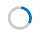

# Background
>See proposal documents for:
>
> [determinate mode for ProgressRing](https://github.com/microsoft/microsoft-ui-xaml/issues/688) 
>
> [ProgressRing style](https://github.com/microsoft/microsoft-ui-xaml/issues/837)
>
> [Guidance for Progress controls](https://github.com/microsoft/microsoft-ui-xaml/issues/880)

Progress controls indicate to a user that an operation is occuring. 
Xaml has two controls for this:
* the [ProgressBar](https://docs.microsoft.com/uwp/api/Windows.UI.Xaml.Controls.ProgressBar)
control, which shows progress on a rectangle
* and the
[ProgressRing](https://docs.microsoft.com/uwp/api/Windows.UI.Xaml.Controls.ProgressRing)
control, which shows progress on a circle.

Progress _Bar_ has both a determinate and indeterminate mode.
In determine mode the rectangle goes from empty to full, in indeterminate mode it shows an animation.
Progress _Ring_ currently only has an indeterminate mode, but this spec is adding an indeterminate mode.

# ProgressRing Description
Represents a control that indicates that an operation is ongoing. 
The typical visual appearance is a ring-shaped "spinner" that animates a filled area as progress continues.

By default, ProgressRing will display an indeterminate spinner that continuously 
animates until the control is no longer visible ?? or 
[ProgressRing.IsActive](https://docs.microsoft.com/uwp/api/Microsoft.UI.Xaml.Controls.ProgressRing.IsActive)
is set to false. You can change the behavior to display
a determinate ring that fills in based on the value you provide, using the `IsIndeterminate` property.

# Examples

The following examples show how to use the `IsIndeterminate` property to change the mode of 
the ProgressRing and the Value property to change the proportionate amount indicated. 

## Indeterminate ProgressRing

```xml
<ProgressRing IsActive="True" Height="100" Width="100"/>
```


## Determinate ProgressRing

??

```xml
<ProgressRing IsActive="True"  Value="75" IsIndeterminate="False"/>
```


# API Notes

ProgressRing can now be used in scenarios where progress is determinate or indeterminate. 
With this additional capability, 
the determinate ProgressRing does not represent a "hung" state where the end user cannot interact
with the app. 

Previously, guidance recommended that ProgressRing only be used when the user cannot continue to interact with the app, 
but this is no longer the only use case and ProgressRing can be used in scenarios where user interaction can continue 
while the ring is spinning. An example of this would be when a video is loading on a page and a progress ring is displayed 
while the media is loading. The end user can still interact with other UI elements on the page while they wait 
for the media to load.

|Name | Type | Description | Default | 
|:--|:-:|:-:|:-:|
| IsIndeterminate | boolean | Gets or sets a value that indicates whether the progress ring reports generic progress with a repeating pattern (indeterminate progress) or reports progress based on the Value property (determinate progress) | True | 
| IsActive | boolean | Gets or sets a value that indicates whether the progress ring is being displayed to the end user. If IsActive is false, the ProgressRing is not shown, but space is reserved for it in the UI layout. To not reserve space for it, set its Visibility property to Collapsed. | True |
| Value | double | Gets or sets the current setting of the range control, which may be coerced. The value ranges from 0 to 100??. Has no effect when `IsIndeterminte` is true. | 0-100 | 
| Maximum | double | Gets or sets the highest possible `Value` of the range element. Has no effect when `IsIndeterminate` is true.
| Minimum | double | Gets or sets the lowest possible `Value` of the range element. Has no effect when `IsIndeterminate` is true.
| DeterminateSource | IAnimatedVisualSource | Gets or sets the animation file used for the determinate state of the ring. | N/A | 
| IndeterminateSource | IAnimatedVisualSource | Gets or sets the animation file used for the indeterminate state of the ring. | N/A | 


ets or sets the highest possible Value of the range element.

# API Details

```xaml
[webhosthidden]
unsealed runtimeclass ProgressRing : Windows.UI.Xaml.Controls.Control
{
    ProgressRing();

    Boolean IsActive{ get; set; };

    Boolean IsIndeterminate{ get; set; };
    IAnimatedVisualSource DeterminateSource{ get; set; };
    IAnimatedVisualSource IndeterminateSource{ get; set; };

    Double Value;
    Double Minimum;
    Double Maximum;

    ProgressRingTemplateSettings TemplateSettings{ get; };

    static Windows.UI.Xaml.DependencyProperty IsActiveProperty{ get; };
    static Windows.UI.Xaml.DependencyProperty IsIndeterminateProperty{ get; };
    static Windows.UI.Xaml.DependencyProperty DeterminateSourceProperty{ get; };
    static Windows.UI.Xaml.DependencyProperty IndeterminateSourceProperty{ get; };
    static Windows.UI.Xaml.DependencyProperty ValueProperty{ get; };
    static Windows.UI.Xaml.DependencyProperty MinimumProperty{ get; };
    static Windows.UI.Xaml.DependencyProperty MaximumProperty{ get; };
}
```


# Appendix
<!-- Anything else that you want to write down for posterity, but 
that isn't necessary to understand the purpose and usage of the API.
For example, implementation details. -->

## Design Behavior Details
The determinate progress ring will be an empty ring when the progress is set to a value of 0. 
When value is set to 1, a blue dot will appear and then continue to fill as the value increases. 
When the value is set to 98 or 99, the ring will not be completely filled 
to indicate to the user that progress is not complete. 
