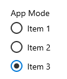
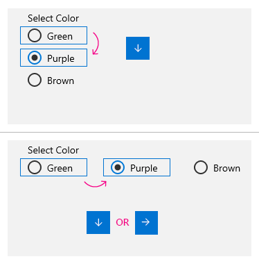
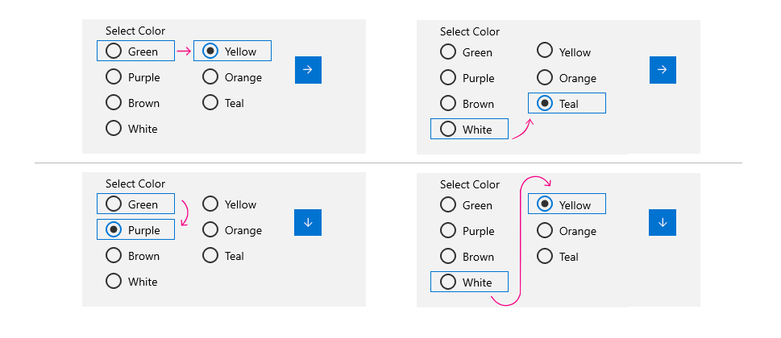

# Background
Radio buttons are used for mutually exclusive options in an app. When the users selects
one of a group, the previously-checked button is unchecked. Consequently, radio buttons
must be grouped, which is done with the Xaml [RadioButton](https://docs.microsoft.com/uwp/api/Windows.UI.Xaml.Controls.RadioButton)
control by setting the GroupName property on each button to the same value.

That mechanism is awkward, and doesn't by default give the right keyboarding or
accessibility behavior.

The RadioButtons control in this spec is introduced to help solve those issues.
It's like a ListView control, but the items in the list are RadioButton controls.

# Description

RadioButtons is a new control that enables you to create groups of RadioButton elements easily,
while also correctly supporting keyboarding and narrator functionality.

# Examples

The following example demonstrates how to create a small collective group of RadioButton elements
using the RadioButtons control.

```xaml
<muxc:RadioButtons Header="App Mode" SelectedIndex="2">
    <x:String>Item 1</x:String>
    <x:String>Item 2</x:String>
    <x:String>Item 3</x:String>         
</muxc:RadioButtons>
```



## DataBinding with RadioButtons
An example of simple data binding of the ItemsSource with RadioButtons.

```xaml
<muxc:RadioButtons Header="App Mode" ItemsSource="{x:Bind radioButtonItems}" />
```

```C#
public sealed partial class MainPage : Page
{
    public class OptionDataModel
    {
        public string Label;
        public override string ToString()
        {
            return Label;
        }
    }

    List<OptionDataModel> radioButtonItems;

    public MainPage()
    {
        this.InitializeComponent();

        radioButtonItems = new List<OptionDataModel>();
        radioButtonItems.Add(new OptionDataModel() { label = "Item 1" });
        radioButtonItems.Add(new OptionDataModel() { label = "Item 2" });
        radioButtonItems.Add(new OptionDataModel() { label = "Item 3" });
    }
}
```

## Multiple Columns
Some groups of RadioButton elements may want a multi-column layout. This is an example on how to
set that up.

```xaml
<muxc:RadioButtons Header="App Mode" MaxColumns="3">
    <x:String>Column 1</x:String>
    <x:String>Column 2</x:String>
    <x:String>Column 3</x:String>
    <x:String>Column 1</x:String>
    <x:String>Column 2</x:String>
    <x:String>Column 3</x:String>
</muxc:RadioButtons>
```


# Remarks
The RadioButtons control has special navigation behavior that helps not only keyboard accelerant users, but also accessibility users to navigate the list more quickly and more easily.

## Putting focus into the RadioButtons list
There are two states that the RadioButtons control can have with it's RadioButton content:

- A list of RadioButton controls where none are selected/checked
- A list of RadioButton controls where one is already selected/checked

The following two sections (below) cover the focus behavior when tabbing into the list in both cases outlined in the bullet list above.

### A RadioButton is selected
When a RadioButton is selected and the user tabs into the list, focus is put on the selected RadioButton.

|Focus is on button<br>RadioButton group does not have focus| Tab has been pressed<br>RadioButton group now has focus|
|:--:|:--:|
|  | |

### No RadioButton is selected
When no RadioButton controls are selected in the RadioButtons list, focus is put on the first RadioButton in the list.

> Note: The RadioButton that receives tab focus from this initial navigation will **not be selected/checked**.

|Focus is on button<br>RadioButton group does not have focus | Tab has been pressed<br>RadioButton group now has focus|
|:--:|:--:|
|  | |

## Keyboard navigation
When you have a single column list of RadioButton control options and you have already put focus onto an item, you can navigate the RadioButtons list in logical sequential order using the keyboard.

- The down or right arrow keys will move to the "next" logical item
- The up or left arrow keys will move to the "previous" logical item



## Multi-Column RadioButtons list
In instances where there is more that one column of RadioButton items within a single RadioButtons list control, the list will flow a column-major layout.

|MaximumColumns not specified <br>OR<br> MaximumColumns = 1 |  MaximumColumns = 2 |
|:--:|:--:|
|  |  |

The markup remains almost the same, and is in the "logial" order that the keyboard behavior will navigate through is indicated in the markup.

The only change is to the number of columns specified, which is defined in the ``MaximumColumns`` property.

```xml
<RadioButtons Header="Select Number" MaximumColumns="2">
    <x:String>1</x:String>
    <x:String>2</x:String>
    <x:String>3</x:String>
    <x:String>4</x:String>
</RadioButtons>
```

If you specify an odd number of items in the RadioButtons group list, or define an odd number for the way it's split (via ``MaximumColumns``) the group will put the trailing number in the first column, and divide the rest evenly.

|MaximumColumns = 3|
|:--|
||

```xml
<RadioButtons Header="Select Number" MaximumColumns="3">
    <x:String>1</x:String>
    <x:String>2</x:String>
    <x:String>3</x:String>
    <x:String>4</x:String>
    <x:String>5</x:String>
    <x:String>6</x:String>
    <x:String>7</x:String>
</RadioButtons>
```

### Navigating with multiple columns
The keyboarding behavior is the same as the single-column navigation, it just wraps to the next column when there is more than one defined.



## Selection follows Focus
When you are navigating a RadioButtons list via the keyboard, as focus is placed on a previous or next RadioButton item, that item will also get selected/checked. This means the previous item that was selected/checked will be unselected, and the currently focused one will be instead.

|Before keyboard navigation | After keyboard navigation|
|:--|:--|
|  | |
| Focus is on the "2" RadioButton, and it is shown as selected | The down or right arrow key has been pressed, so focus was moved to the "3" RadioButton, thus selected 3 and unselected 2. |

# API Details

## RadioButtons

```
namespace Microsoft.UI.Xaml.Controls
{
[webhosthidden]
[contentproperty("Items")]
unsealed runtimeclass RadioButtons : Windows.UI.Xaml.Controls.Control
{
    RadioButtons();

    Object ItemsSource;
    Windows.Foundation.Collections.IVector<Object> Items{ get; };
    Windows.UI.Xaml.DataTemplate ItemTemplate;

    Windows.UI.Xaml.DependencyObject ContainerFromItem(Object item);
    Windows.UI.Xaml.DependencyObject ContainerFromIndex(Int32 index);

    Int32 SelectedIndex;
    Object SelectedItem;
    event Windows.UI.Xaml.Controls.SelectionChangedEventHandler SelectionChanged;

    Int32 MaxColumns;
    Object Header;

    static Windows.UI.Xaml.DependencyProperty ItemsSourceProperty{ get; };
    static Windows.UI.Xaml.DependencyProperty ItemsProperty{ get; };
    static Windows.UI.Xaml.DependencyProperty ItemTemplateProperty{ get; };
    static Windows.UI.Xaml.DependencyProperty SelectedIndexProperty{ get; };
    static Windows.UI.Xaml.DependencyProperty SelectedItemProperty{ get; };
    static Windows.UI.Xaml.DependencyProperty MaxColumnsProperty{ get; };
    static Windows.UI.Xaml.DependencyProperty HeaderProperty{ get; };
}
}
```

## RadioButtons Automation Peer

```
namespace Microsoft.UI.Xaml.Automation.Peers
{
[webhosthidden]
unsealed runtimeclass RadioButtonsListViewItemAutomationPeer : Windows.UI.Xaml.Automation.Peers.ListViewItemAutomationPeer
{
    RadioButtonsListViewItemAutomationPeer(RadioButtonsListViewItem owner);
}
}
```

## RadioButtons Primitives

```
namespace Microsoft.UI.Xaml.Controls.Primitives
{
[webhosthidden]
unsealed runtimeclass RadioButtonsListView : Windows.UI.Xaml.Controls.ListView
{
    RadioButtonsListView();
}

[webhosthidden]
[default_interface]
unsealed runtimeclass RadioButtonsListViewItem : Windows.UI.Xaml.Controls.ListViewItem
{
    RadioButtonsListViewItem();
}
}
```

# API Notes

| Name | Description |
|:-:|:--|
| Header | Places a text label above the group of RadioButton elements and is exposed to the UIA tree via the DataContext property on the RadioButtons control's ContentPresenter. |
| HeaderTemplate | The template that specifies the visualization of the header object |
| SelectedItem | Gets or sets the selected item. Selection is denoted by that item's RadioButton icon being checked. |
| SelectedIndex | Gets or sets the selected index. Selection is denoted by that item's RadioButton icon being checked.|
| Items | Gets or sets an object source used to generate the content of the ItemsControl. All items placed within the RadioButtons control will get the content of a generated RadioButton. |
| ItemsSource | Gets or sets an object source used to generate the content of the ItemsControl. |
| ItemTemplate | The template set on any generated RadioButton elements within the RadioButtons control. If the root of the ItemTemplate is a RadioButton it will be used as the generated container. |
| MaxColumns | Defines the number of columns used to determine the control's layout |
