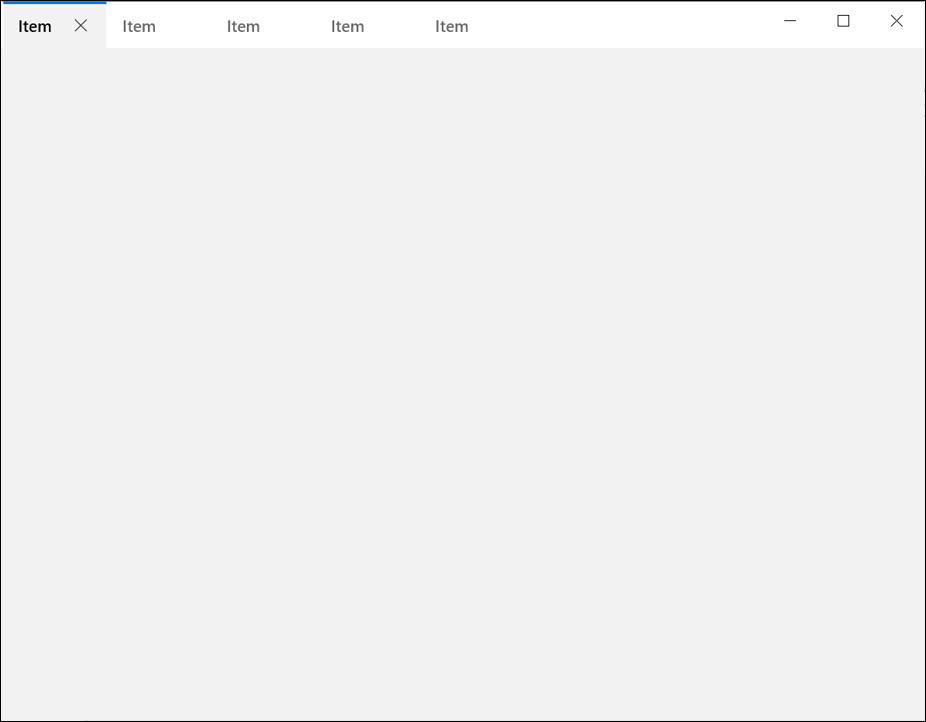
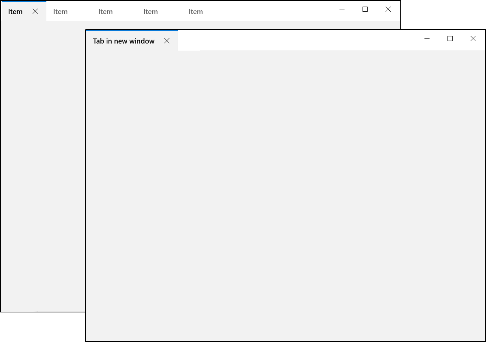
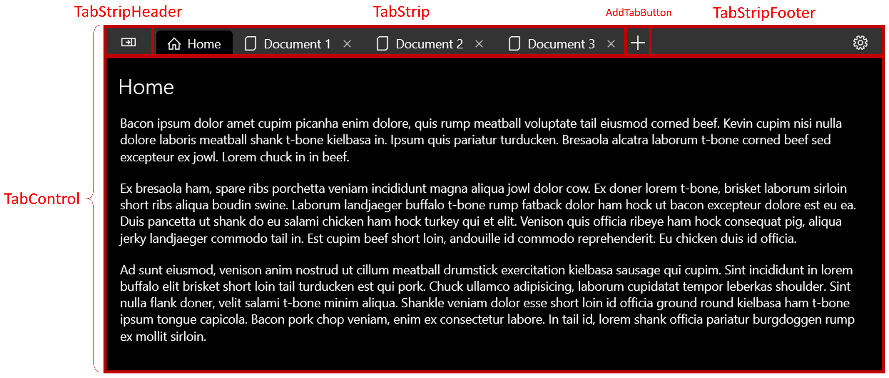
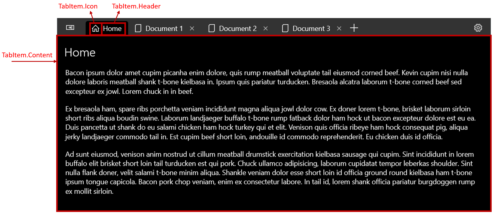

<!-- The purpose of this spec is to describe a new feature and
its APIs that make up a new feature in WinUI. -->

<!-- There are two audiences for the spec. The first are people
that want to evaluate and give feedback on the API, as part of
the submission process.  When it's complete
it will be incorporated into the public documentation at
docs.microsoft.com (http://docs.microsoft.com/uwp/toolkits/winui/).
Hopefully we'll be able to copy it mostly verbatim.
So the second audience is everyone that reads there to learn how
and why to use this API. -->

# Background
<!-- Use this section to provide background context for the new API(s) 
in this spec. -->

<!-- This section and the appendix are the only sections that likely
do not get copied to docs.microsoft.com; they're just an aid to reading this spec. -->

<!-- If you're modifying an existing API, included a link here to the
existing page(s) -->

<!-- For example, this section is a place to explain why you're adding this API rather than
modifying an existing API. -->

<!-- For example, this is a place to provide a brief explanation of some dependent
area, just explanation enough to understand this new API, rather than telling
the reader "go read 100 pages of background information posted at ...". -->

> See [proposal document](https://github.com/Microsoft/microsoft-ui-xaml/issues/304) for more background

The TabView control is a way to display a set of tabs and their respective content. Tab controls are useful for displaying several pages (or documents) of content while giving a user the capability to rearrange, open, or close new tabs. 


Tab-like UI comes in two distinct styles that affect not only the visualization of the control, but also the user experience:
* Static tabs
    * Generally display a set number of pages
    * User can change between pages, but cannot open new pages, close pages, or rearrange pages
* Document tabs
    * Display a variable number of pages
    * User can add, remove, and rearrange pages
    * User can "tear off" tabs into their own window or "recombine" tabs from one group into another group

The Xaml platform already provides several controls to represent "static-style tabs" including [Pivot](https://docs.microsoft.com/en-us/windows/uwp/design/controls-and-patterns/pivot) and top [NavigationView](https://docs.microsoft.com/en-us/windows/uwp/design/controls-and-patterns/navigationview#display-modes). However, these controls do not well support "document-style" tabs due to a variety of limitations, including:
* Significant effort up to (and including) retemplating to build simple tabs
* No built-in support for closing tabs
* No built-in support for drag/drop into new windows
* No built-in support for moving a tab from a window and combining it with another window
* Limited keyboard and accessibility support

This spec therefore covers "document-style tabs" specifically as this platform gap isn't easily solved with an app-side workaround. 

# Description
<!-- Use this section to provide a brief description of the feature.
For an example, see the introduction to the PasswordBox control 
(http://docs.microsoft.com/windows/uwp/design/controls-and-patterns/password-box). -->

The Tab control is a collection of tabs that each represents a new page or document in your app. Tab controls are useful when your app has several pages of content and the user expects to be able to add, close, and rearrange the pages.

**Is this the right control?**

Use a TabView to help the user manage multiple app pages or documents within the same window. 

Do not use a TabView to display a static set of tabs that the user cannot rearrange, open, or close. Use a Pivot or top NavigationView instead. 

# Examples
<!-- Use this section to explain the features of the API, showing
example code with each description. The general format is: 
  feature explanation,
  example code
  feature explanation,
  example code
  etc.-->

<!-- As an example of this section, see the Examples section for the PasswordBox control 
(https://docs.microsoft.com/windows/uwp/design/controls-and-patterns/password-box#examples). -->

## To replicate the behavior of Microsoft Edge

``` xml
<TabView TabViewItemWidthMode="Equal"
            CanCloseTabs="True"
            CloseButtonOverlay="OnHover"
            CanDragTabs="True"
            CanReorderTabs="True"
            TabDraggedOutside="OpenTabInNewWindow"
            AddTabButtonClick="NewTab_Click">
    ...
</TabView>
```

## Put TabView in the titlebar area



This sample demonstrates how to extend the TabView into the title bar area and also specify a portion of the UI as the draggable region, using [CoreApplicationViewTitleBar.ExtendViewIntoTitleBar](https://docs.microsoft.com/uwp/api/Windows.ApplicationModel.Core.CoreApplicationViewTitleBar.ExtendViewIntoTitleBar). Per the [titlebar customization guidelines](https://docs.microsoft.com/en-us/windows/uwp/design/shell/title-bar), we must set a [specific drag region](https://docs.microsoft.com/en-us/windows/uwp/design/shell/title-bar#draggable-regions) (the space that a user can use to drag the window around the screen using mouse or touch). If we don't specify the drag region, the entire titlebar area remains draggable (meaning input won't be routed to the tabs, making the tabs unclickable).

``` xml
<Page>
    <Grid>
        <TabView>
            <TabViewItem Icon="Home" Header="Home" IsCloseable="False" />
            <TabViewItem Icon="Document" Header="Document 1" />
            <TabViewItem Icon="Document" Header="Document 2" />
            <TabViewItem Icon="Document" Header="Document 3" />
        </TabView>

        <Grid x:Name="CustomDragRegion" Width="200" Height="40" HorizontalAlignment="Right" VerticalAlignment="Top" />
    </Grid>
</Page>
```

``` csharp
// Customize the titlebar area using the guidance from here: https://docs.microsoft.com/en-us/windows/uwp/design/shell/title-bar
public MainPage()
{
    this.InitializeComponent();

    var coreTitleBar = CoreApplication.GetCurrentView().TitleBar;
    coreTitleBar.ExtendViewIntoTitleBar = true;

    Window.Current.SetTitleBar(CustomDragRegion);
}
```

## Create a new window when tearing out tabs



See the [TabView tear out sample](https://github.com/windows-toolkit/Sample-TabView-TearOff/tree/master/TabViewTear) for a more complete sample.

``` xml
<TabView CanDragTabs="True"
            CanReorderTabs="True"
            TabDraggedOutside="TabView_TabDraggedOutside">
```
``` csharp
// NOTE: The app is responsible for writing this code. We will provide a sample that may look something like:
private async void TabView_TabDraggedOutside(object sender, TabDraggedOutsideEventArgs e)
{
    // Create a new AppWindow
    AppWindow newWindow = await AppWindow.TryCreateAsync();

    // Create the content for the new window
    var newPage = new MainPage();

    // Remove tab from existing list
    Tabs.Items.Remove(e.Tab);

    // Add tab to list of Tabs on new page
    newPage.AddItemToTabs(e.Tab);

    // Set the Window's content to the new page
    ElementCompositionPreview.SetAppWindowContent(newWindow, newPage);

    // Show the window
    await newWindow.TryShowAsync();
}
```

## Databind to a set of tabs 

``` xml
<TabView ItemsSource="{x:Bind TabViewItemCollection}" />
```

## Add a new tab using the Add (+) Tab Button
The TabView control provides an Add (+) Tab button at the end of the tab strip. When the user clicks the Add Tab button, the control will fire an event which you can listen to in order to add a new tab.

``` xml
<controls:TabView
    x:Name="TabRoot"
    AddTabButtonClick="AddTabButton_Click"
    >
    <!-- ... some tabs ... -->
</controls:TabView>
```

``` csharp

private void AddTabButton_Click(TabView sender, TabViewAddTabButtonClickEventArgs e)
{
    CreateNewTab();
}

private void CreateNewTab()
{
    // MyDocument is a data object that represents the content inside a Tab
    MyDocument doc = new MyDocument();
    doc.Title = "New Document";
    doc.Content = GenerateBaconIpsum();
    doc.Icon = new SymbolIcon(Symbol.Document);

    // Create a new TabViewItem from the MyDocument object and add it to the Items collection
    TabRoot.Items.Add(CreateNewTabFromDocument(doc));
}

private TabViewItem CreateNewTabFromDocument(MyDocument doc)
{
    TabViewItem newItem = new TabViewItem();

    newItem.Header = doc.Title;
    newItem.Icon = doc.Icon;

    // The Content of a TabViewItem is often a frame which hosts a page.
    Frame frame = new Frame();
    newItem.Content = frame;
    frame.Navigate(typeof(DocumentPage), doc);

    return newItem;
}

```

## Implement browser-style keyboarding behavior

The below example shows how to use KeyboardAccelerators to enable the following experiences:
* Open a new tab with CTRL+T
* Close the selected tab with CTRL+W
* Change the selected tab with CTRL+1 through CTRL+8
* Select the last tab with CTRL+9

``` xml
<controls:TabView
    x:Name="TabRoot"
    >
    <controls:TabView.KeyboardAccelerators>
        <KeyboardAccelerator Key="T" Modifiers="Control" Invoked="NewTabKeyboardAccelerator_Invoked" />
        <KeyboardAccelerator Key="W" Modifiers="Control" Invoked="CloseSelectedTabKeyboardAccelerator_Invoked" />
        <KeyboardAccelerator Key="Number1" Modifiers="Control" Invoked="NavigateToNumberedTabKeyboardAccelerator_Invoked" />
        <KeyboardAccelerator Key="Number2" Modifiers="Control" Invoked="NavigateToNumberedTabKeyboardAccelerator_Invoked" />
        <KeyboardAccelerator Key="Number3" Modifiers="Control" Invoked="NavigateToNumberedTabKeyboardAccelerator_Invoked" />
        <KeyboardAccelerator Key="Number4" Modifiers="Control" Invoked="NavigateToNumberedTabKeyboardAccelerator_Invoked" />
        <KeyboardAccelerator Key="Number5" Modifiers="Control" Invoked="NavigateToNumberedTabKeyboardAccelerator_Invoked" />
        <KeyboardAccelerator Key="Number6" Modifiers="Control" Invoked="NavigateToNumberedTabKeyboardAccelerator_Invoked" />
        <KeyboardAccelerator Key="Number7" Modifiers="Control" Invoked="NavigateToNumberedTabKeyboardAccelerator_Invoked" />
        <KeyboardAccelerator Key="Number8" Modifiers="Control" Invoked="NavigateToNumberedTabKeyboardAccelerator_Invoked" />
        <KeyboardAccelerator Key="Number9" Modifiers="Control" Invoked="NavigateToNumberedTabKeyboardAccelerator_Invoked" />
    </controls:TabView.KeyboardAccelerators>
    <!-- ... some tabs ... -->
</controls:TabView>
```

``` csharp

private void NewTabKeyboardAccelerator_Invoked(KeyboardAccelerator sender, KeyboardAcceleratorInvokedEventArgs args)
{
    // See previous sample
    CreateNewTab();
}

private void CloseSelectedTabKeyboardAccelerator_Invoked(KeyboardAccelerator sender, KeyboardAcceleratorInvokedEventArgs args)
{
    // Only close the selected tab if it is closeable
    if (((TabViewItem)TabRoot.SelectedItem).IsCloseable)
    {
        TabRoot.Items.Remove(TabRoot.SelectedItem);
    }
}

private void NavigateToNumberedTabKeyboardAccelerator_Invoked(KeyboardAccelerator sender, KeyboardAcceleratorInvokedEventArgs args)
{
    int tabToSelect = 0;

    switch (sender.Key)
    {
        case Windows.System.VirtualKey.Number1:
            tabToSelect = 0;
            break;
        case Windows.System.VirtualKey.Number2:
            tabToSelect = 1;
            break;
        case Windows.System.VirtualKey.Number3:
            tabToSelect = 2;
            break;
        case Windows.System.VirtualKey.Number4:
            tabToSelect = 3;
            break;
        case Windows.System.VirtualKey.Number5:
            tabToSelect = 4;
            break;
        case Windows.System.VirtualKey.Number6:
            tabToSelect = 5;
            break;
        case Windows.System.VirtualKey.Number7:
            tabToSelect = 6;
            break;
        case Windows.System.VirtualKey.Number8:
            tabToSelect = 7;
            break;
        case Windows.System.VirtualKey.Number9:
            // Select the last tab
            tabToSelect = TabRoot.Items.Count - 1;
            break;
    }

    // Only select the tab if it is in the list
    if (tabToSelect < TabRoot.Items.Count)
    {
        TabRoot.SelectedIndex = tabToSelect;
    }
}

```

## Combine tabs from one window into another window
TODO -- should this be part of the "tab tear out" sample above?

# Remarks
<!-- Explanation and guidance that doesn't fit into the Examples
section.  For example, see the Remarks for the MediaPlayerElement 
(https://docs.microsoft.com/uwp/api/Windows.UI.Xaml.Controls.MediaPlayerElement#remarks). -->

## Keyboard guidance for App Developers
The [Appendix/Detailed Keyboarding Behavior](#detailed-keyboarding-behavior) section outlines built-in keyboarding behavior provided by the TabView. This section discusses specific recommendations to extend the keyboarding functionality for your app.

* If your app does not already handle the CTRL+T shortcut, consider using it to open a new tab.
* If your app does not already handle the CTRL+W shortcut, consider using it to close the selected tab.
* Consider maintaining a list of recently closed Tabs. If the user presses CTRL+SHIFT+T, they expect recently closed tabs to be reopened.
* Modern browsers support selecting tabs when pressing CTRL and a number. Consider handling Ctrl+1 through 8, which should select that number Tab. Additionally, you can consider handling Ctrl+9 which selects the last tab (regardless of the number of tabs).
* If users can perform more commands on a Tab than just closing the Tab (for example, pinning a Tab or duplicating a Tab), consider adding a context menu to the TabViewItem. 

# API Notes
<!-- Give a one or two line description of each API (type
and member), or at least the ones that aren't obvious
from their name.  These descriptions are what show up
in IntelliSense. -->

### TabView properties, events, methods

| Property | Description |
|:-------- |:----------- |
| AddTabButtonCommand | Gets or sets the command to invoke when the Add button is tapped. |
| AddTabButtonCommandParameter | Gets or sets the parameter to pass to the command for the Add button. |
| CanDragTabs | Gets or sets a value that indicates whether tabs in the collection can be dragged. Default is true. |
| CanReorderTabs | Gets or sets a value that indicates whether tabs in the collection can be reordered through user interaction. Default is true. |
| IsAddTabButtonVisible | Determines if the plus button appears to the right of the tab strip |
| ItemsSource | Gets or sets an object source used to generate the tabs. |
| Items | Gets the collection used to generate the tabs. |
| ItemTemplate | Gets or sets the DataTemplate used to display each item. |
| ItemTemplateSelector | Gets or sets a reference to a custom DataTemplateSelector logic class. The DataTemplateSelector referenced by this property returns a template to apply to items. |
| SelectedIndex | Gets or sets the index of the selected item. |
| SelectedItem | Gets or sets the selected item. |
| TabStripHeader | Content to the left of the tab strip. |
| TabStripFooter | Content to the right of the tab strip. |
| TabViewItemWidthMode | Specifies how the tabs should be sized. Values are {Actual, Equal}. Default is Actual. |

| Event | Description |
|---|---|
| AddTabButtonClick | Fires when the + button is clicked. |
| SelectionChanged | Occurs when the currently selected tab changes. |
| TabClosing | Fires when a tab is about to be closed. Can be cancelled to prevent closure. |
| TabDraggedOutside | Fires when a Tab is dragged outside of the Tab bar. |

| Method | Description |
|---|---|
| DependencyObject ContainerFromItem(object item) | Returns the generated container for the specified item. |
| DependencyObject ContainerFromIndex(Int32 index) | Returns the generated container for the specified index. |

### TabViewItem properties and events

| Property | Description |
|:-------- |:----------- |
| Content | The main content that appears in the tab. |
| Header | The content that appears inside the tab itself.  |
| HeaderTemplate | Template for the header object. |
| Icon | Icon for the tab. |
| IsCloseable | Determines if the tab shows a close button. Default is "True". |

| Event | Description |
|---|---|
| TabClosing | Fires when a tab's close button is clicked. |

# API Details
<!-- The exact API, in MIDL3 format (https://docs.microsoft.com/en-us/uwp/midl-3/) -->

```
namespace MU_XC_NAMESPACE
{

[WUXC_VERSION_PREVIEW]
[webhosthidden]
enum TabViewItemWidthMode
{
    Actual = 0,
    Equal = 1,
};

[WUXC_VERSION_PREVIEW]
[webhosthidden]
runtimeclass TabViewTabClosingEventArgs
{
    Object Item { get; };

    Boolean Cancel { get; set; };
}

[WUXC_VERSION_PREVIEW]
[webhosthidden]
unsealed runtimeclass TabView : Windows.UI.Xaml.Controls.Control
{
    TabView();

    [MUX_DEFAULT_VALUE("winrt::TabViewItemWidthMode::Actual")]
    [MUX_PROPERTY_CHANGED_CALLBACK(TRUE)]
    TabViewItemWidthMode TabViewItemWidthMode{ get; set; };

    // TODO: Remove
    [MUX_DEFAULT_VALUE("true")]
    Boolean CanCloseTabs{ get; set; };

    [MUX_DEFAULT_VALUE("true")]
    Boolean CanDragTabs{ get; set; };

    // TODO: Add
    [MUX_DEFAULT_VALUE("true")]
    Boolean CanReorderTabs{ get; set; };

    Object TabStripFooterContent{ get; set; };
    Windows.UI.Xaml.DataTemplate TabStripFooterContentTemplate{ get; set; };
    
    Object TabStripHeader{ get; set; };
    Windows.UI.Xaml.DataTemplate TabStripHeaderTemplate{ get; set; };

    [MUX_DEFAULT_VALUE("true")]
    Boolean IsAddTabButtonVisible{ get; set; };
    Windows.UI.Xaml.Input.ICommand AddTabButtonCommand{ get; set; };
    Object AddTabButtonCommandParameter{ get; set; };

    event Windows.Foundation.TypedEventHandler<TabView, TabViewTabClosingEventArgs> TabClosing;

    // TODO: Update parameter to TabViewAddTabButtonClickEventArgs
    event Windows.Foundation.TypedEventHandler<TabView, TabViewAddTabButtonClickEventArgs> AddTabButtonClick;

    // TODO: Add
    event Windows.Foundation.TypedEventHandler<TabView, TabDraggedOutsideEventArgs> TabDraggedOutside;

    // From ListView
    [MUX_PROPERTY_CHANGED_CALLBACK(TRUE)]
    Object ItemsSource;

    [MUX_PROPERTY_CHANGED_CALLBACK(TRUE)]
    Windows.Foundation.Collections.IVector<Object> Items{ get; };

    Windows.UI.Xaml.DataTemplate ItemTemplate;
    Windows.UI.Xaml.Controls.DataTemplateSelector ItemTemplateSelector{ get; set; };

    [MUX_DEFAULT_VALUE("-1")]
    [MUX_PROPERTY_CHANGED_CALLBACK(TRUE)]
    Int32 SelectedIndex;

    [MUX_PROPERTY_CHANGED_CALLBACK(TRUE)]
    Object SelectedItem;

    Windows.UI.Xaml.DependencyObject ContainerFromItem(Object item);
    Windows.UI.Xaml.DependencyObject ContainerFromIndex(Int32 index);

    event Windows.UI.Xaml.Controls.SelectionChangedEventHandler SelectionChanged;

    static Windows.UI.Xaml.DependencyProperty TabViewItemWidthModeProperty{ get; };
    static Windows.UI.Xaml.DependencyProperty CanCloseTabsProperty{ get; };
    static Windows.UI.Xaml.DependencyProperty CanDragTabsProperty{ get; };
    // TODO: Add
    static Windows.UI.Xaml.DependencyProperty CanReorderTabsProperty{ get; };
    static Windows.UI.Xaml.DependencyProperty TabStripFooterContentProperty{ get; };
    static Windows.UI.Xaml.DependencyProperty TabStripFooterContentTemplateProperty{ get; };
    static Windows.UI.Xaml.DependencyProperty TabStripHeaderProperty{ get; };
    static Windows.UI.Xaml.DependencyProperty TabStripHeaderTemplateProperty{ get; };
    static Windows.UI.Xaml.DependencyProperty IsAddTabButtonVisibleProperty{ get; };
    static Windows.UI.Xaml.DependencyProperty AddTabButtonCommandProperty{ get; };
    static Windows.UI.Xaml.DependencyProperty AddTabButtonCommandParameterProperty{ get; };

    static Windows.UI.Xaml.DependencyProperty ItemsSourceProperty{ get; };
    static Windows.UI.Xaml.DependencyProperty ItemsProperty{ get; };
    static Windows.UI.Xaml.DependencyProperty ItemTemplateProperty{ get; };
    static Windows.UI.Xaml.DependencyProperty ItemTemplateSelectorProperty{ get; };
    static Windows.UI.Xaml.DependencyProperty SelectedIndexProperty{ get; };
    static Windows.UI.Xaml.DependencyProperty SelectedItemProperty{ get; };
}

[WUXC_VERSION_PREVIEW]
[webhosthidden]
unsealed runtimeclass TabViewItem : Windows.UI.Xaml.Controls.ListViewItem
{
    TabViewItem();

    Object Header{ get; set; };

    Windows.UI.Xaml.DataTemplate HeaderTemplate{ get; set; };

    Windows.UI.Xaml.Controls.IconElement Icon{ get; set; };

    [MUX_DEFAULT_VALUE("true")]
    [MUX_PROPERTY_CHANGED_CALLBACK(TRUE)]
    Boolean IsCloseable{ get; set; };

    static Windows.UI.Xaml.DependencyProperty HeaderProperty{ get; };
    static Windows.UI.Xaml.DependencyProperty HeaderTemplateProperty{ get; };
    static Windows.UI.Xaml.DependencyProperty IconProperty{ get; };
    static Windows.UI.Xaml.DependencyProperty IsCloseableProperty{ get; };

    // TODO: Add
    event Windows.Foundation.TypedEventHandler<TabViewItem, TabViewTabClosingEventArgs> TabClosing;
}

}

namespace MU_XCP_NAMESPACE
{

[WUXC_VERSION_PREVIEW]
[webhosthidden]
unsealed runtimeclass TabViewListView : Windows.UI.Xaml.Controls.ListView
{
    TabViewListView();
}

}

namespace MU_XAP_NAMESPACE
{

[WUXC_VERSION_PREVIEW]
[webhosthidden]
unsealed runtimeclass TabViewAutomationPeer : Windows.UI.Xaml.Automation.Peers.FrameworkElementAutomationPeer
{
    TabViewAutomationPeer(MU_XC_NAMESPACE.TabView owner);
}

[WUXC_VERSION_PREVIEW]
[webhosthidden]
unsealed runtimeclass TabViewItemAutomationPeer : Windows.UI.Xaml.Automation.Peers.ListViewItemAutomationPeer
{
    TabViewItemAutomationPeer(MU_XC_NAMESPACE.TabViewItem owner);
}

}
```

# Appendix
<!-- Anything else that you want to write down for posterity, but 
that isn't necessary to understand the purpose and usage of the API.
For example, implementation details. -->





## Detailed Keyboarding Behavior

This section discusses the built-in keyboarding functionality of the TabView control. The [Keyboard Guidance for App Developers](#Keyboard-guidance-for-App-Developers) section discusses specific recommendations to extend the keyboarding functionality for apps using TabView.

### TAB and Arrow key behavior in the TabStrip
When focus moves into the TabStrip area, the selected TabViewItem gains focus. The user can then use the LEFT/RIGHT arrow keys to move focus (not selection) to other tabs in the TabStrip. Arrow focus is trapped inside the Tab content area. To move focus out of the TabStrip area, the user can press the TAB key which will move focus to the next focusable element. 

_Move focus via TAB_


_ARROW does not cycle focus_


### Selecting a tab
When a TabViewItem has focus, pressing SPACE or ENTER will select that TabViewItem.

_Use ARROW to move focus, ENTER to select tab_


### Shortcuts for selecting adjacent tabs
Ctrl+TAB will select the next TabViewItem.
Ctrl+Shift+TAB will select the previous TabViewItem.
TAB selection cycles (meaning if the user has selected the last tab and presses Ctrl+TAB, the first tab becomes selected).

### Closing a tab 
Hitting CTRL+F4 will close the selected TabViewItem (assuming it is closable). 

# Open Questions
