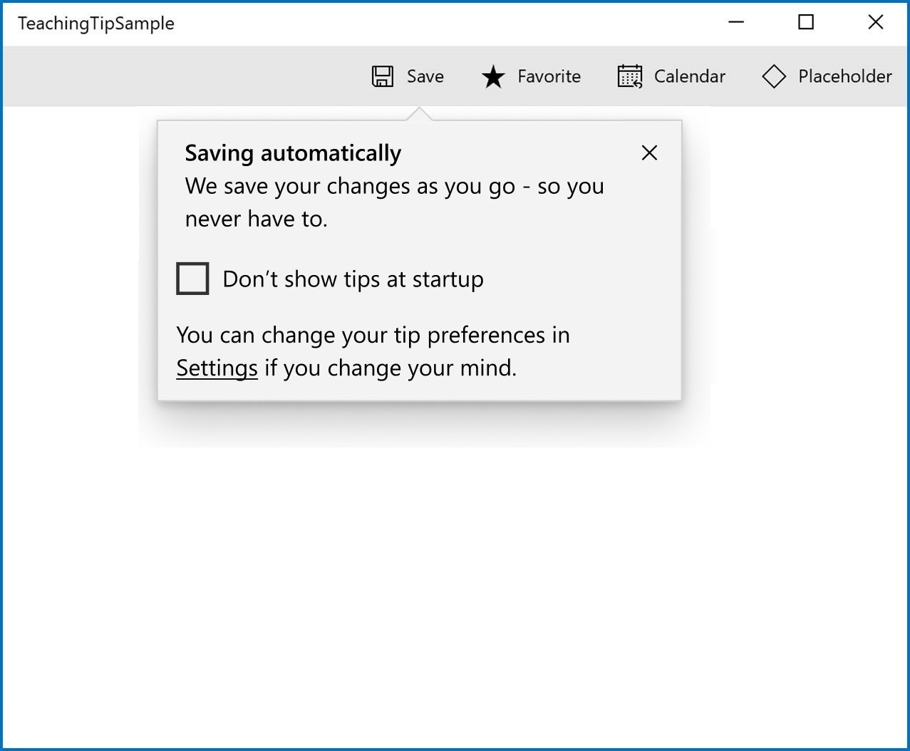
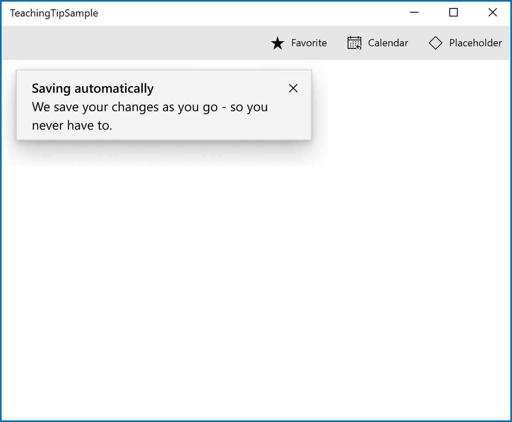

# Teaching tip

## Description

A teaching tip is a content-rich nonmodal flyout that provides contextual information. A teaching tip looks like a flyout, except that it may target a UI element with a pointer or be persistent and require the user to manually dismiss it. A teaching tip is often used for informing, reminding, and teaching users about important and new features that may enhance their experience. 

**Important APIs:** [TeachingTip class]() [Link TODO]

A teaching tip may also be light-dismiss enabled or used without a pointer indicating reference to any specific UI element. 


### Is this the right control? 

Use a **TeachingTip** control to inform users about new and important updates and features, focus users on a component to advise them about its options or state, remind users of nonessential options that would improve their experience, or teach users how a task should be completed. 

Because a teaching tip is transient, it would not be the recommended control for notifying users about important errors and statuses, prompting users for event handling, nor displaying a list of items or events that have been handled. 

<!-- Explain why TT is not recommended for notifications --> 


## Examples

The teaching tip has several states, including these notable ones.

A teaching tip can point to a specific UI element to enhance contextual clarity of the information it is presenting. 

<a href="url"></a>

A teaching tip can be used without a pointer when the information that it is presenting is not specific to a UI element. 

<a href="url"></a>

A teaching tip can require manual acknowledgement before dismissing or a teaching tip may also be light-dismiss enabled so that it will dismiss when a user scrolls or interacts with other elements of the application.

<a href="url"></a>


## Create a teaching tip

<!-- Use the Password property to get or set the contents of the PasswordBox. You can do this in the handler for the PasswordChanged event to perform validation while the user enters the password. Or, you can use another event, like a button Click, to perform validation after the user completes the text entry. -->

Here's the XAML for a teaching tip control that demonstrates the default look of the TeachingTip with a title and subtitle. 

When the user clicks the button, a teaching tip will appear and display a message to the user. 

XAML
```XAML
<Button Content="Save" Click="OnFirstSaveButtonClick">
    <muxc:TeachingTip.Attach> 
        <muxc:TeachingTip x:Name="AutoSaveTip"
            Title="Saving automatically"
            Subtitle="We save your changes as you go - so you never have to.">
        </muxc:TeachingTip>
    </muxc:TeachingTip.Attach>
</Button>
```

C#
```C#
public void OnFirstSaveButtonClick(object sender, RoutedEventArgs args)
{
   AutoSaveTip.IsOpen = true;
}
```

Here's the result when this code runs and the clicks the button.

<a href="url"></a>

### Add a margin 

A teaching tip can have a margin added by setting the Margin property. When a teaching tip is attached to a UI element, a margin will move it away from the UI element it is pointing to. When a teaching tip is not attached to anything, a margin will move it away from the side of the app window it is positioned towards. 

XAML
```XAML
<Button Content="Save" Click="OnFirstSaveButtonClick">
    <muxc:TeachingTip> 
        <muxc:TeachingTip x:Name="AutoSaveTip"
            Title="Saving automatically"
            Subtitle="We save your changes as you go - so you never have to."
            Margin="80">
        </muxc:TeachingTip>
    </muxc:TeachingTip.Attach>
</Button>
```

C#
```C#
public void OnFirstSaveButtonClick(object sender, RoutedEventArgs args)
{
   AutoSaveTip.IsOpen = true;
}
```

<a href="url"></a>

### Point to a UI element

You can change the teaching tip to point to a specific UI element by setting the TeachingTipPlacementMode property. For a targeted teaching tip, this placement will be relative to the UI element target. For a non-targeted teaching tip, this placement will relative to app window.  

XAML
```XAML
<Button Content="Tip Example" Click="OnFirstSaveButtonClick">
    <muxc:TeachingTip.Attach> 
        <muxc:TeachingTip x:Name="AutoSaveTip"
            Title="Saving automatically"
            Subtitle="We save your changes as you go - so you never have to."
            Margin="15"/>
        </muxc:TeachingTip>
    </muxc:TeachingTip.Attach>
</Button>
```

C#
```C#
public void OnFirstSaveButtonClick(object sender, RoutedEventArgs args)
{
   AutoSaveTip.IsOpen = true;
}
```

<a href="url"></a>

### Add content

Content can be added to a teaching tip using the Content property. If there is more content to show than what the size of a teaching tip will allow, a scrollbar will be automatically enabled to allow a user to scroll the content area. 

XAML
```XAML
<Button Content="Tip Example" Click="OnFirstSaveButtonClick">
    <muxc:TeachingTip.Attach> 
        <muxc:TeachingTip x:Name="AutoSaveTip"
            Title="Saving automatically"
            Subtitle="We save your changes as you go - so you never have to."
            Margin="15">
                <StackPanel>
                    <CheckBox Content="Don't show tips at start up" Checked="HandleChecked" Unchecked="HandleUnchecked" />
                    <TextBlock>You can change your tip preferences in <Hyperlink NavigateUri="app:/item/SettingsPage">Settings</Hyperlink> if you change your mind.</TextBlock>
                </StackPanel>
        </muxc:TeachingTip>
    </muxc:TeachingTip.Attach>
</Button>
```

C#
```C#
public void OnFirstSaveButtonClick(object sender, RoutedEventArgs args)
{
   AutoSaveTip.IsOpen = true;
}
```

<a href="url"></a>

### Add buttons

A close button is automatically added to the top of a teaching tip. However, a close button with custom text that is placed at the button of a teaching tip can be used instead by setting the TeachingTipCloseButtonKind property. A custom action button can also be added by setting ActionButtonText, ActionButtonCommand and the ActionButtonCommandParameter properties. 

XAML
```XAML
<Button Content="Tip Example" Click="OnFirstSaveButtonClick">
    <muxc:TeachingTip.Attach> 
        <muxc:TeachingTip x:Name="AutoSaveTip"
            Title="Saving automatically"
            Subtitle="We save your changes as you go - so you never have to."
            ActionButtonText="Disable"
            ActionButtonCommand="DisableAutoSave"
            CloseButtonKind="Footer"
            CloseButtonText="Got it!"
            Margin="15">
                <CheckBox Content="Don't show tips at start up" Checked="HandleChecked" Unchecked="HandleUnchecked" />
                <p>You can change your tip preferences in <a href="app:/item/SettingsPage">Settings</a> if you change your mind.</p>
        </muxc:TeachingTip>
    </muxc:TeachingTip.Attach>
</Button>
```

C#
```C#
public void OnFirstSaveButtonClick(object sender, RoutedEventArgs args)
{
    TeachingTipExample.IsOpen=true;
}
```

<a href="url"></a>

### Hero content

Edge to edge content can be added to a teaching tip by setting the HeroContent property. The location of hero content can be set to the top or bottom of a teaching tip by setting the HeroContentPlacement property.

XAML
```XAML
<Button Content="Tip Example" Click="OnFirstSaveButtonClick">
    <muxc:TeachingTip.Attach> 
        <muxc:TeachingTip x:Name="AutoSaveTip"
            Title="Saving automatically"
            Subtitle="We save your changes as you go - so you never have to."
            <muxc:TeachingTip.HeroContent>
                <Image Source="Assets/Giraffe.png" />
            </muxc:TeachingTip.HeroContent>
            Margin="15">
        </muxc:TeachingTip>
    </muxc:TeachingTip.Attach>
</Button>
```

C#
```C#
public void OnFirstSaveButtonClick(object sender, RoutedEventArgs args)
{
    TeachingTipExample.IsOpen=true;
}
```

<a href="url"></a>

### Add an icon

An icon can be added to the side of the title and subtitle using the IconSource property.

XAML
```XAML
<Button Content="Tip Example" Click="OnFirstSaveButtonClick">
    <muxc:TeachingTip.Attach> 
        <muxc:TeachingTip x:Name="AutoSaveTip"
            Title="Saving automatically"
            Subtitle="We save your changes as you go - so you never have to."
            IconSource="SaveIcon.png"
            Margin="15">
        </muxc:TeachingTip>
    </muxc:TeachingTip.Attach>
</Button>
```

C#
```C#
public void OnFirstSaveButtonClick(object sender, RoutedEventArgs args)
{
    TeachingTipExample.IsOpen=true;
}
```

<a href="url"></a>

### Enable light-dismiss

A teaching tip may be light-dismiss enabled so that it will dismiss when a user scrolls or interacts with other elements of the application.

XAML
```XAML
<Button Content="Tip Example" Click="OnFirstSaveButtonClick">
    <muxc:TeachingTip.Attach> 
        <muxc:TeachingTip x:Name="AutoSaveTip"
            Title="Saving automatically"
            Subtitle="We save your changes as you go - so you never have to."
            IsLightDismissEnabled="True"
            Margin="15">
        </muxc:TeachingTip>
    </muxc:TeachingTip.Attach>
</Button>
```

C#
```C#
public void OnFirstSaveButtonClick(object sender, RoutedEventArgs args)
{
    TeachingTipExample.IsOpen=true;
}
```

<a href="url"></a>

### Preferred placement

Preferred placement of a teaching tip can be set using the TeachingTipPlacementMode property. If the preferred placement would not leave enough room for the teaching tip to show, another placement mode will automatically be chosen.

XAML
```XAML
<Button Content="Tip Example" Click="OnFirstSaveButtonClick">
    <muxc:TeachingTip.Attach> 
        <muxc:TeachingTip x:Name="AutoSaveTip"
            Title="Saving automatically"
            Subtitle="We save your changes as you go - so you never have to."
            PreferredPlacement="TopEdgeAlignedLeft"
            Margin="20,50,0,0"/>
        </muxc:TeachingTip>
    </muxc:TeachingTip.Attach>
</Button>
```

C#
```C#
public void OnFirstSaveButtonClick(object sender, RoutedEventArgs args)
{
    TeachingTipExample.IsOpen=true;
}
```

<a href="url"></a>

### Escaping window bounds

On Windows 19H1 and above, a teaching tip can escape window bounds by setting the ShouldConstrainToRootBounds property.

XAML
```XAML
<Button Content="Tip Example" Click="OnFirstSaveButtonClick">
    <muxc:TeachingTip.Attach> 
        <muxc:TeachingTip x:Name="AutoSaveTip"
            Title="Saving automatically"
            Subtitle="We save your changes as you go - so you never have to."
            PreferredPlacement="BottomEdgeAlignedRight"
            Margin="-80,-50,0,0"
            ShouldConstrainToRootBounds="False">
        </muxc:TeachingTip>
    </muxc:TeachingTip.Attach>
</Button>
```

C#
```C#
public void OnFirstSaveButtonClick(object sender, RoutedEventArgs args)
{
    TeachingTipExample.IsOpen=true;
}
```

<a href="url"></a>

### Deferred close

The close event of a teaching tip can be deffered to allow time for an action or custom animation to occur. 

```XAML
<Button Content="Tip Example">
    <muxc:TeachingTip.Attach> 
        <muxc:TeachingTip x:Name="EnableNewSettingsTip"
            Title="Title string"
            Subtitle="Body text in a minimum height tip."
            Closing="OnTipClosing">
        </muxc:TeachingTip>
    </muxc:TeachingTip.Attach>
</Button>
```

```C#

public void OnTipClosing(object sender, TeachingTipClosingEventArgs args)
{
    if (args.Reason == TeachingTipCloseReason.CloseButton)
    {
        using(args.GetDeferral())
        {
            bool success = await UpdateUserSettings(User thisUsersID);
            if(!success)
            {
                //We were not able to update the settings! Don't close the tip and display the reason why.
                args.Cancel = true;
                ShowLastErrorMessage();
            }
        }
    }
}
```

### Related articles 

* [Dialogs and flyouts](https://docs.microsoft.com/en-us/windows/uwp/design/controls-and-patterns/dialogs-and-flyouts/index)

## Recommendations
* Tips are impermanent and should not contain information or options that are critical to the experience of an application. 
* Try to avoid showing teaching tips too often. Teaching tips are most likely to each recieve individual attention when they are staggered throughout long sessions or across multiple sessions.    
* Keep tips succint and their topic clear. Research shows users, on average, only read 3-5 words and only comprehend 2-3 words before deciding whether to interact with a tip. 

## API Details 

```c++ 
enum TeachingTipCloseButtonKind
{
    Auto,
    Header,
    Footer,
};

enum TeachingTipCloseReason
{
    CloseButton,
    LightDismiss,
    Programmatic,
};

enum TeachingTipPlacementMode
{
    Auto,
    Top,
    Bottom,
    Left,
    Right,
    TopEdgeAlignedRight,
    TopEdgeAlignedLeft,
    BottomEdgeAlignedRight,
    BottomEdgeAlignedLeft,
    LeftEdgeAlignedTop,
    LeftEdgeAlignedBottom,
    RightEdgeAlignedTop,
    RightEdgeAlignedBottom,
};

enum TeachingTipHeroPlacementMode
{
    Top,
    Bottom,
    Auto,
};

runtimeclass TeachingTipClosedEventArgs
{
    TeachingTipCloseReason Reason{ get; };
};

runtimeclass TeachingTipClosingEventArgs
{
    TeachingTipCloseReason Reason{ get; };
    Boolean Cancel;
    Windows.Foundation.Deferral GetDeferral();
};

unsealed runtimeclass TeachingTipTemplateSettings : Windows.UI.Xaml.DependencyObject
{
    TeachingTipTemplateSettings();

    Windows.UI.Xaml.Thickness TopRightHighlightMargin;
    Windows.UI.Xaml.Thickness TopLeftHighlightMargin;

    static Windows.UI.Xaml.DependencyProperty TopRightHighlightMarginProperty{ get; };
    static Windows.UI.Xaml.DependencyProperty TopLeftHighlightMarginProperty{ get; };
}

unsealed runtimeclass TeachingTip : Windows.UI.Xaml.Controls.ContentControl
{
    TeachingTip();

    String Title;
    String Subtext;

    Boolean IsOpen;

    String ActionButtonText;
    Windows.UI.Xaml.Style ActionButtonStyle;
    Windows.UI.Xaml.Input.ICommand ActionButtonCommand;
    Object ActionButtonCommandParameter;

    TeachingTipCloseButtonKind CloseButtonKind;
    String CloseButtonText;
    Windows.UI.Xaml.Style CloseButtonStyle;
    Windows.UI.Xaml.Input.ICommand CloseButtonCommand;
    Object CloseButtonCommandParameter;

    Windows.UI.Xaml.Thickness TargetOffset;
    Boolean IsLightDismissEnabled;
    TeachingTipPlacementMode Placement;
    TeachingTipHeroPlacementMode HeroPlacement;

    Windows.UI.Xaml.UIElement HeroContent;
    IconSource IconSource;

    TeachingTipTemplateSettings TemplateSettings{ get; };

    event Windows.Foundation.TypedEventHandler<TeachingTip, Object> ActionButtonClick;
    event Windows.Foundation.TypedEventHandler<TeachingTip, Object> CloseButtonClick;
    event Windows.Foundation.TypedEventHandler<TeachingTip, TeachingTipClosingEventArgs> Closing;
    event Windows.Foundation.TypedEventHandler<TeachingTip, TeachingTipClosedEventArgs> Closed;

    static Windows.UI.Xaml.DependencyProperty IsOpenProperty{ get; };

    static Windows.UI.Xaml.DependencyProperty AttachProperty{ get; };
    static void SetAttach(Windows.UI.Xaml.UIElement element, TeachingTip teachingTip);
    static TeachingTip GetAttach(Windows.UI.Xaml.UIElement element);

    static Windows.UI.Xaml.DependencyProperty TitleProperty{ get; };
    static Windows.UI.Xaml.DependencyProperty SubtextProperty{ get; };

    static Windows.UI.Xaml.DependencyProperty ActionButtonTextProperty{ get; };
    static Windows.UI.Xaml.DependencyProperty ActionButtonStyleProperty{ get; };
    static Windows.UI.Xaml.DependencyProperty ActionButtonCommandProperty{ get; };
    static Windows.UI.Xaml.DependencyProperty ActionButtonCommandParameterProperty{ get; };

    static Windows.UI.Xaml.DependencyProperty CloseButtonKindProperty{ get; };
    static Windows.UI.Xaml.DependencyProperty CloseButtonTextProperty{ get; };
    static Windows.UI.Xaml.DependencyProperty CloseButtonStyleProperty{ get; };
    static Windows.UI.Xaml.DependencyProperty CloseButtonCommandProperty{ get; };
    static Windows.UI.Xaml.DependencyProperty CloseButtonCommandParameterProperty{ get; };

    static Windows.UI.Xaml.DependencyProperty TargetOffsetProperty{ get; };
    static Windows.UI.Xaml.DependencyProperty IsLightDismissEnabledProperty{ get; };
    static Windows.UI.Xaml.DependencyProperty PlacementProperty{ get; };
    static Windows.UI.Xaml.DependencyProperty HeroPlacementProperty{ get; };

    static Windows.UI.Xaml.DependencyProperty HeroContentProperty{ get; };
    static Windows.UI.Xaml.DependencyProperty IconSourceProperty{ get; };

    static Windows.UI.Xaml.DependencyProperty TemplateSettingsProperty{ get; };
}
```

## API Notes

### Notable Properties  

| Name | Description |
|:-:|:--|
| ShouldConstrainToRootBounds | Gets or sets a value that indicates whether the teaching tip will constrain to the bounds of its root. |
| PreferredPlacement  | Gets or sets the default placement to be used for the teaching tip, in relation to its placement target if targeted. |
| CloseButtonKind | Gets or sets a value that specifies where the close button, if any, is located.  Defaults to Auto.  |

### Methods   

| Name | Description |
|:-:|:--|
| SetAttach | Associates the specified teaching tip with the specified UIElement. |
| GetAttach | Gets the teaching tip associated with the specified element. |

### Events    

| Name | Description |
|:-:|:--|
| ActionButtonClick | Occurs after the action button has been tapped. |
| Closing |Occurs just before the tip begins to close. |
| Closed | Occurs after the tip is closed. |
| CloseButtonClick | Occurs after the close button has been tapped. |

## Appendix

### Design Notes

#### Visual Components

 | Component |  Notes |
|:---:|:---|
| Container | * The container is the body of the tip and encapsulates all the tip components. <br> * Nonmodal. <br> * If content height exceeds max height or width, vertical scrolling will be enabled. See Scroll. <br> * For visibility concerns, the container has a border around the outer edge, which adheres to the pointer if present. See Pointer. <br> * For visibility concerns, the top edge of the container has a 1px highlight which also adheres to the pointer if present. See Pointer. <br><br> <a href="url"></a> |
| Title| * Semi-bolded. <br> * Text wraps at Close (X) Button and Container border. <br><br> <a href="url"></a> |
| Subtitle | * Text wraps at Close (X) Button and Container border. <br><br> <a href="url"></a> |
| Content | * Can be customized to include text, images, videos, animation, checkboxes, hyperlinks, and any other XAML content. <br> * Will scroll if there is more content to show than tip height allows. See Scroll Bar. <br> * Placed below Subtitle and above Close/Action Button. <br><br> <a href="url"></a> |
| Close Button | * Will appear as an X Button in the top right corner by default and in the top left corner automatically for RTL languages. The close button may also be set to appear in the bottom right corner of the tip as a traditional button or be set to not show at all so that a custom close option may be implemented in the Content Area. <br> * If a tip is set to light-dismiss, no close button will appear at all. <br><br> <a href="url"></a> &nbsp;&nbsp;&nbsp;&nbsp;&nbsp;&nbsp;&nbsp;&nbsp; <a href="url"></a> |
| Action Button | * Allows the user to invoke a custom event. <br> * This is the only non-Close button provided out of the box. Other buttons may be implemented in the Content Area. <br><br> <a href="url"></a> |
| Pointer | * Triangular extension of the tip body used to indicate that the tip is referring to on-screen UI element. <br> * Appears only when using a targeted tip. <br> * Prefers to center on target. <br> * Maintains a 12px margin from edges of the tip. <br> * Not animated. <br> * Will not have a shadow as shadows cannot yet be added to nonrectangular surfaces. <br><br> <a href="url"></a> |
| Icon | * Added to the left of the Title and Subtitle by default and automatically moved to the right for RTL languages. <br><br> <a href="url"></a> |
| Hero Content | * Hero Content is media that stretches to the edges of a tip. <br> * Can be placed at the top or bottom of a tip. <br><br> <a href="url"></a> |
| Scroll Bar | * If the tip's contents are large enough to require scrolling, a scrollbar which will not intersect the Close (X) Button will be added to the content area. <br><br> <a href="url"></a> |

#### Behavioral Components

 | Property | Notes |
|:---:|:---|
| Opening | * A tip is shown by setting its IsOpen property to true. <br> * Tips will animate on opening. <br> * When a tip does not have enough available window space to fully show in any location [see Placement], it will not open and will instead overwrite IsOpen to false. |
| Closing | * There are three ways to close a tip: set the IsOpen property to false, the user invokes a close button, or the tip is closed via light dismiss. These will return the method used in TeachingTipCloseReason.  <br> * Closing can be deferred by taking a handle to the deferral object in the closing event args. |
| Placement | * Placement modes for targeted tips will follow the precedent of Flyout. Full placement mode will be replaced by Center which positions Pointer at the center of the element. <br> * Placement modes for untargeted tips will include each side, corner, and center of the application window. <br> * The following properties are not preferred in tip placement: <br> &nbsp;&nbsp;&nbsp;&nbsp; * There is not enough space for the tip to show without clipping. <br> &nbsp;&nbsp;&nbsp;&nbsp; * The target is not large enough to maintain the tip's alignment and the Pointer's 12px margin from the edge of the tip. <br> &nbsp;&nbsp;&nbsp;&nbsp; * The target element is too large to maintain edge alignment while keeping the Pointer centered on the target. |
| Light-dismiss | * Allows a tip to be dismissed when the user scrolls or clicks elsewhere within the application. <br> * **TODO:** Work with Accessibility and Design to create a timed fade-out that would allow users to recover a dismissing tip via click or cursor hover. |
| Persistent Tip Location | * Once a tip is open, it will not move even if its target does. The exception to this is when the window is resized. |
| Motion | * Tips have built in open and close animations that can be customizable using Storyboards.|
| Pointer/Hero Content Avoidance | * To avoid the visual oddity of the Pointer emerging from Hero Content, the Pointer and Hero Content will attempt to avoid intersecting using the following rules: <br> &nbsp;&nbsp;&nbsp;&nbsp; * Move the hero content to Top or Bottom (Disabled when HeroContentPlacement is not auto). <br> &nbsp;&nbsp;&nbsp;&nbsp; * Shift the beak along the edge of the tip (Disabled when the placement of the tip is edge aligned). <br> &nbsp;&nbsp;&nbsp;&nbsp; * Change the placement of the tip (Disabled when the tip placement is not auto).  |
| Out of Window Bounds | * Tips can escape window bounds on newer OS versions via the ShouldConstrainToRootBounds property.  When this property is set to false, the tip uses screen boundaries instead of window boundaries during its placement algorithm. |

#### Accessibility

| State | Action | Narrator |
|:---|:---|:---|
| Tip first appears and is not in focus | No action is needed invoke the tip. | “New tip. It says …." | 
| Tip is first focused on by tabbing through to the tip | Targeted Tip: <br> Tip is injected to tab stop right after its target element. User tabs to reach tip and put it into focus. <br><br> Untargeted Tip: <br> Tip is injected to tab stop as the last item to be created. User tabs to reach tip and put it into focus. <br><br> Light-dismiss: <br> Automatically take focus. | Default Tab Stop, Title, and Subtitle. <br><br> Ex: “X Button, Tip Title, Tip Subtitle.” |
| Tip is tabbed through | Tab Button: <br> Will go through all actionable items regardless of group in order. <br> <br> Arrow keys: <br> Will be able to explore groups in the specified directions. <br> <br> Enter and Escape: <br> Will result in closing the tip. <br> <br> Spacebar: <br> Will select the component focused on. <br> <br> Home and End: <br> Do not have use unless within a XAML component that supports their functionality | Name of XAML or visual component. Ex:<br><br> “X Button” <br><br> “Save Button” <br><br> “Learn More Hyperlink” | 
| Tip is dismissed | 1. X Button is pressed. <br> 2. Close Button is pressed. <br> 3. Action Button is pressed. <br> Tab focus goes back to where it should be, the predecessor. | Nothing | 

## Open Questions

* Should TeachingTip.Attach be changed to TeachingTip.AttachedTeachingTip?
* Should Title, Subtitle, and buttons be content properties instead? 

Proposal for .Target property:
 ```XAML
<Button x:Name="MyButton" Content="Tip Example">
    <Button.Resources> 
        <muxc:TeachingTip x:Name="EnableNewSettingsTip"
            Target="{x:Bind MyButton}"
            Title="Title string"
            Subtitle="Body text in a minimum height tip."
            Closing="OnTipClosing">
        </muxc:TeachingTip>
    </Button.Resources>
</Button>
```
