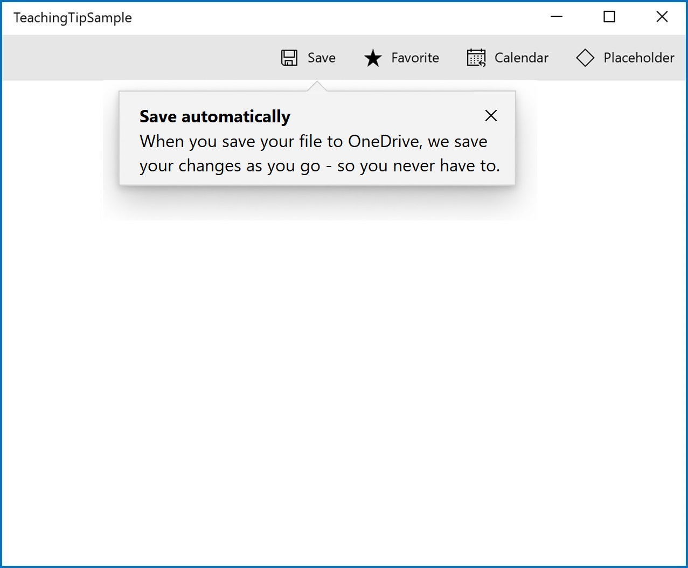
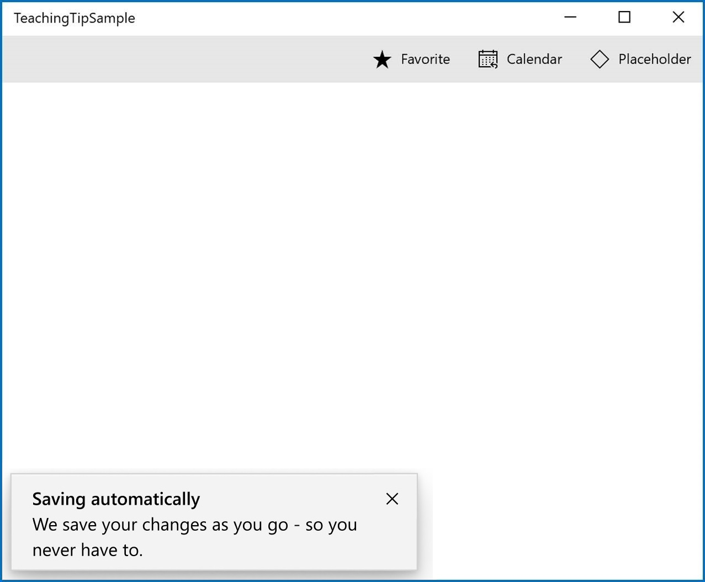
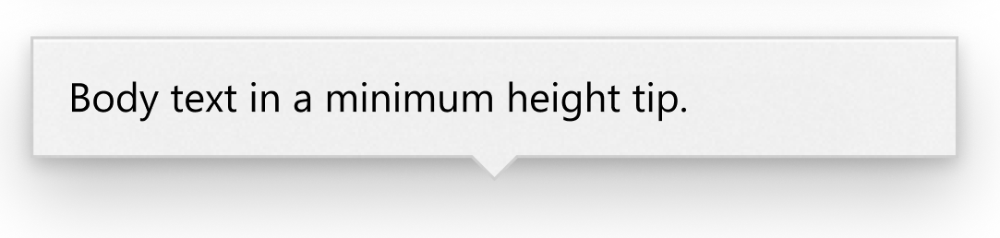
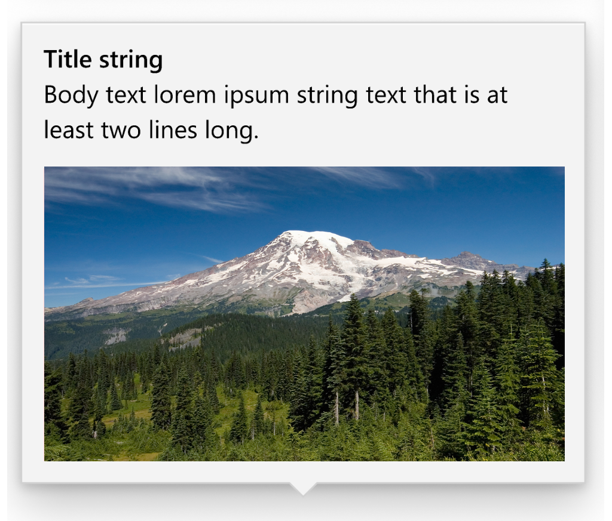
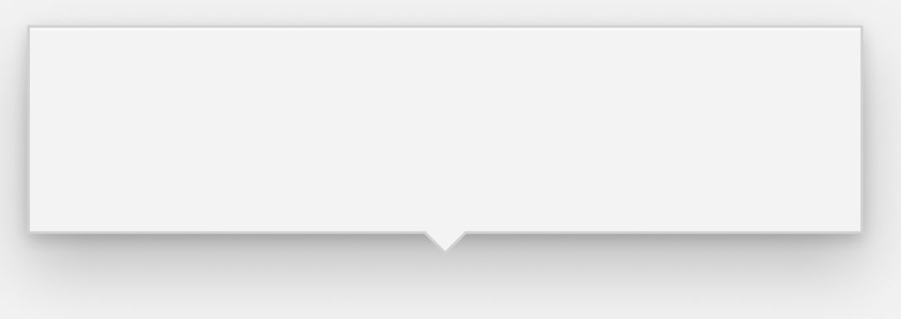
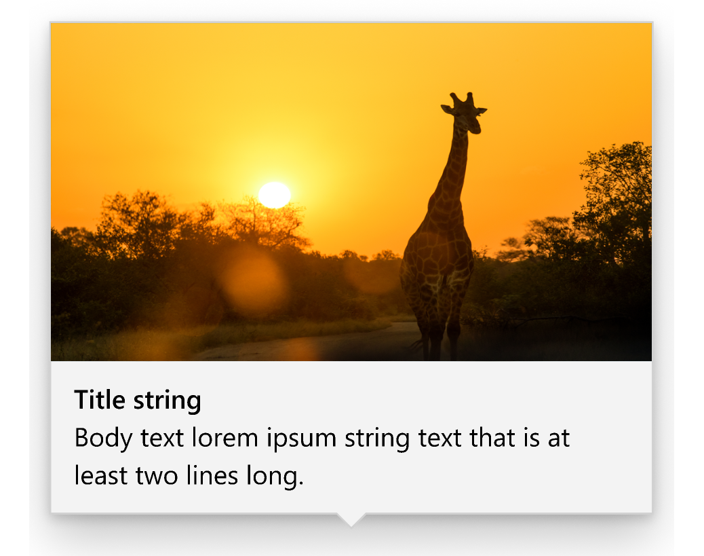

# Description

A teaching tip is a semi-persistent and content-rich flyout that provides contextual information. It is often used for informing, reminding, and teaching users about important and new features that may enhance their experience.

**Important APIs:** [TeachingTip class]() [Link TODO]

A teaching tip may be light-dismiss or require explicit action to close. A teaching tip can target a specific UI element with its tail and also be used without a tail or target.

### Is this the right control? 

Use a **TeachingTip** control to focus a user's attention on new or important updates and features, remind a user of nonessential options that would improve their experience, or teach a user how a task should be completed. 

Because teaching tip is transient, it would not be the recommended control for prompting users about errors or important status changes.


# Examples

### Some APIs shown in the following examples are not yet available in the prerelease version of this control. Please see the [Teaching Tip Sample in the XAML Sample Gallery](https://github.com/Microsoft/Xaml-Controls-Gallery/blob/w/saschule/TeachingTipSample/XamlControlsGallery/ControlPages/TeachingTipPage.xaml) for implementation examples that are accurate with the version of this control currently available through prerelease. 


The teaching tip has several states, including these notable ones.

A teaching tip can target a specific UI element with its tail to enhance contextual clarity of the information it is presenting. 



When the information presented does not pertain to a particular UI element, a nontargeted teaching tip can be created by removing the tail.


A teaching tip can require the user to dismiss it via an "X" button in a top corner or a "Close" button at the bottom. A teaching tip may also be light-dismiss enabled in which case there is no dismiss button and the teaching tip will instead dismiss when a user scrolls or interacts with other elements of the application. Because of this behavior, light-dismiss tips are the best solution when a tip needs to be placed in a scrollable area. 


### Create a teaching tip

Here's the XAML for a targeted teaching tip control that demonstrates the default look of the TeachingTip with a title and subtitle. 
Note that the teaching tip can appear anywhere in the element tree. In this example below, it's located in a ResourceDictionary.

XAML
```XAML
<Button x:Name="SaveButton" Content="Save">
    <Button.Resources>
        <controls:TeachingTip x:Name="AutoSaveTip"
            Target="{x:Bind SaveButton}"
            Title="Save automatically"
            Subtitle="When you save your file to OneDrive, we save your changes as you go - so you never have to.">
        </controls:TeachingTip>
    </Button.Resources>
</Button>
```

C#
```C#
public MainPage()
{
    this.InitializeComponent();

    if(!HaveExplainedAutoSave())
    {
        AutoSaveTip.IsOpen = true;
        SetHaveExplainedAutoSave();
    }
}
```

Here's the result when this Page containing the button and teaching tip shown:


### Non-targeted tips

Not all tips relate to an element onscreen. For these scenarios, do not set the Target property and the teaching tip will instead display relative to the edges of the XamlRoot. However, a teaching tip can have the tail removed while retaining placement relative to a UI element by setting the TailVisibility property to "Collapsed".

XAML
```XAML
<Button x:Name="SaveButton" Content="Save" />

<controls:TeachingTip x:Name="AutoSaveTip"
    Title="Saving automatically"
    Subtitle="We save your changes as you go - so you never have to.">
</controls:TeachingTip>
```

Note that in this example the TeachingTip is in the element tree rather than in a ResourceDictionary. This has no effect on behavior; the TeachingTip only displays when opened, and takes up no layout space.


### Add a placement margin  

You can control how far a targeted teaching tip is set apart from its target and how far a non-targeted teaching tip is set apart from the the edges of the XamlRoot by using the PlacementMargin property. Like [Margin](https://docs.microsoft.com/en-us/uwp/api/windows.ui.xaml.frameworkelement.margin), PlacementMargin has four values – left, right, top, and bottom – so only the relevant values are used. For example, PlacementMargin.Left applies when the tip is left of the target or on the left edge of the XamlRoot bounds.

The following example shows a non-targeted tip with the PlacementMargin’s Left/Top/Right/Bottom all set to 80.

XAML
```XAML
<Button x:Name="SaveButton" Content="Save" />

<controls:TeachingTip x:Name="AutoSaveTip"
    Title="Saving automatically"
    Subtitle="We save your changes as you go - so you never have to."
    PlacementMargin="80">
</controls:TeachingTip>
```


### Add content

Content can be added to a teaching tip using the Content property. If there is more content to show than what the size of a teaching tip will allow, a scrollbar will be automatically enabled to allow a user to scroll the content area. 

XAML
```XAML
<Button x:Name="SaveButton" Content="Save">
    <Button.Resources>
        <controls:TeachingTip x:Name="AutoSaveTip"
            Target="{x:Bind SaveButton}"
            Title="Saving automatically"
            Subtitle="We save your changes as you go - so you never have to.">
                <StackPanel>
                    <CheckBox x:Name="HideTipsCheckBox" Content="Don't show tips at start up" IsChecked="{x:Bind HidingTips, Mode=TwoWay}" />
                    <TextBlock>You can change your tip preferences in <Hyperlink NavigateUri="app:/item/SettingsPage">Settings</Hyperlink> if you change your mind.</TextBlock>
                </StackPanel>
        </controls:TeachingTip>
    </Button.Resources>
</Button>
```

![A sample app with a teaching tip targeting the save button. The tip title reads "Saving automatically" and the subtitle reads "We save your changes as you go - so you never have to." In the content area of the teaching tip is a CheckBox labeled "Don't show tips at startup" and underneath is text that reads "You can change your tip preferences in Settings if you change your mind" where "Settings" is a link to the app's settings page. There is a close button on the top right corner of the teaching tip.](TeachingTipContentSample.jpg)

### Add buttons

By default, a standard "X" close button is shown next to the title of a teaching tip. The Close button can be customized with the CloseButtonContent property, in which case the button is moved to the bottom of the teaching tip.

**Note: no close button will appear on light-dismiss enabled tips**

A custom action button can be added by setting ActionButtonContent property (and optionally the ActionButtonCommand and the ActionButtonCommandParameter properties).

XAML
```XAML
<Button x:Name="SaveButton" Content="Save">
    <Button.Resources> 
        <controls:TeachingTip x:Name="AutoSaveTip"
            Target="{x:Bind SaveButton}"
            Title="Saving automatically"
            Subtitle="We save your changes as you go - so you never have to."
            ActionButtonContent="Disable"
            ActionButtonCommand="DisableAutoSave"
            CloseButtonContent="Got it!">
                <CheckBox Content="Don't show tips at start up" IsChecked="{x:Bind HidingTips, Mode=TwoWay}" />
                <TextBlock>You can change your tip preferences in <Hyperlink NavigateUri="app:/item/SettingsPage">Settings</Hyperlink> if you change your mind.</TextBlock>
        </controls:TeachingTip>
    </Button.Resources>
</Button>
```

![A sample app with a teaching tip targeting the save button. The tip title reads "Saving automatically" and the subtitle reads "We save your changes as you go - so you never have to." In the content area of the teaching tip is a CheckBox labeled "Don't show tips at startup" and underneath is text that reads "You can change your tip preferences in Settings if you change your mind" where "Settings" is a link to the app's settings page. At the bottom of the teaching are two buttons, a gray one on the left that reads "Disable" and a blue one on the right that reads "Got it!"](TeachingTipButtonsSample.jpg)

### Hero content

Edge to edge content can be added to a teaching tip by setting the HeroContent property. The location of hero content can be set to the top or bottom of a teaching tip by setting the HeroContentPlacement property.

XAML
```XAML
<Button x:Name="SaveButton" Content="Save">
    <Button.Resources> 
        <controls:TeachingTip x:Name="AutoSaveTip"
            Target="{x:Bind SaveButton}"
            Title="Saving automatically"
            Subtitle="We save your changes as you go - so you never have to."
            <controls:TeachingTip.HeroContent>
                <Image Source="Assets/Giraffe.png" />
            </controls:TeachingTip.HeroContent>
        </controls:TeachingTip>
    </Button.Resources>
</Button>
```


### Add an icon

An icon can be added beside the title and subtitle using the IconSource property. Recommended icon sizes include 16px, 24px, and 32px. 

XAML
```XAML
<Button x:Name="SaveButton" Content="Save">
    <Button.Resources>
        <controls:TeachingTip x:Name="AutoSaveTip"
            Target="{x:Bind SaveButton}"
            Title="Saving automatically"
            Subtitle="We save your changes as you go - so you never have to."
            IconSource="SaveIcon.png">
        </controls:TeachingTip>
    </Button.Resources>
</Button>
```


### Enable light-dismiss

Light-dismiss functionality is disabled by default but it can enabled so that a teaching tip will dismiss, for example, when a user scrolls or interacts with other elements of the application. Because of this behavior, light-dismiss tips are the best solution when a tip needs to be placed in a scrollable area. 

The close button will be automatically removed from a light-dismiss enabled teaching tip to identify its light-dismiss behavior to users. 

XAML
```XAML
<Button x:Name="SaveButton" Content="Save" />

<controls:TeachingTip x:Name="AutoSaveTip"
    Title="Saving automatically"
    Subtitle="We save your changes as you go - so you never have to."
    IsLightDismissEnabled="True">
</controls:TeachingTip>
```


### Preferred placement

Teaching tip replicates all of Flyout's [FlyoutPlacementMode](https://docs.microsoft.com/uwp/api/Windows.UI.Xaml.Controls.Primitives.FlyoutPlacementMode) placement behavior with the TeachingTipPlacementMode property. The default placement mode will try to place a targeted teaching tip above its target and a non-targeted teaching tip in the bottom right corner of the XamlRoot. As with Flyout, if the preferred placement mode would not leave room for the teaching tip to show, another placement mode will be automatically chosen. 

A targeted teaching tip with its PreferredPlacement set to "BottomEdgeAlignedLeft" will appear below its target and will have its left edge aligned to the left edge of the target.

XAML
```XAML
<Button x:Name="SaveButton" Content="Save">
    <Button.Resources>
        <controls:TeachingTip x:Name="AutoSaveTip"
            Target="{x:Bind SaveButton}"
            Title="Saving automatically"
            Subtitle="We save your changes as you go - so you never have to."
            PreferredPlacement="BottomEdgeAlignedLeft">
        </controls:TeachingTip>
    </Button.Resources>
</Button>
```


A non-targeted teaching tip with its PreferredPlacement set to "BottomEdgeAlignedLeft" will appear in the bottom left corner of the XamlRoot.

XAML
```XAML
<Button x:Name="SaveButton" Content="Save" />

<controls:TeachingTip x:Name="AutoSaveTip"
    Title="Saving automatically"
    Subtitle="We save your changes as you go - so you never have to."
    PreferredPlacement="BottomEdgeAlignedLeft">
</controls:TeachingTip>
```



### Escaping XamlRoot bounds

On Windows version 19H1 and above, a teaching tip can escape XamlRoot bounds by setting the ShouldConstrainToRootBounds property. On earlier versions of Windows, this property is ignored and the teaching tip always stays within the XamlRoot bounds.

XAML
```XAML
<Button x:Name="SaveButton" Content="Save" />

<controls:TeachingTip x:Name="AutoSaveTip"
    Title="Saving automatically"
    Subtitle="We save your changes as you go - so you never have to."
    PreferredPlacement="BottomEdgeAlignedRight"
    PlacementMargin="-80,-50,0,0"
    ShouldConstrainToRootBounds="False">
</controls:TeachingTip>
```


### Canceling and deferring close

The Closing event can be used to cancel and/or defer the close of a teaching tip. This can be used to keep the teaching tip open or allow time for an action or custom animation to occur. 

XAML
```XAML
<controls:TeachingTip x:Name="EnableNewSettingsTip"
    Title="New ways to protect your privacy!"
    Subtitle="Please close this tip and review our updated privacy policy and privacy settings."
    Closing="OnTipClosing">
</controls:TeachingTip>
```

C#
```C#
public void OnTipClosing(object sender, TeachingTipClosingEventArgs args)
{
    if (args.Reason == TeachingTipCloseReason.CloseButton)
    {
        using(args.GetDeferral())
        {
            bool success = await UpdateUserSettings(User thisUsersID);
            if(!success)
            {
                //We were not able to update the settings! Don't close the tip and display the reason why.
                args.Cancel = true;
                ShowLastErrorMessage();
            }
        }
    }
}
```

# Remarks

### Related articles 

* [Dialogs and flyouts](https://docs.microsoft.com/en-us/windows/uwp/design/controls-and-patterns/dialogs-and-flyouts/index)

### Recommendations
* Tips are impermanent and should not contain information or options that are critical to the experience of an application. 
* Try to avoid showing teaching tips too often. Teaching tips are most likely to each recieve individual attention when they are staggered throughout long sessions or across multiple sessions.    
* Keep tips succinct and their topic clear. Research shows users, on average, only read 3-5 words and only comprehend 2-3 words before deciding whether to interact with a tip. 

# API Notes

### Notable Properties  

| Name | Description |
|:-:|:--|
| TailVisibility | Gets or sets a value that indicates whether to collapse the tail of a teaching tip or leave it visible. |
| PreferredPlacement  | Gets or sets the default placement to be used for the teaching tip. |
| ShouldConstrainToRootBounds | Gets or sets a value that indicates whether the teaching tip will constrain to the bounds of its root. |

### Events    

| Name | Description |
|:-:|:--|
| ActionButtonClick | Occurs after the action button has been tapped. |
| CloseButtonClick | Occurs after the close button has been tapped. |
| Closed | Occurs after the tip is closed. |
| Closing |Occurs just before the tip begins to close. |

# API Details 

```c++ 
enum TeachingTipCloseReason
{
    CloseButton,
    LightDismiss,
    Programmatic,
};

enum TeachingTipPlacementMode
{
    Auto,
    Top,
    Bottom,
    Left,
    Right,
    TopEdgeAlignedRight,
    TopEdgeAlignedLeft,
    BottomEdgeAlignedRight,
    BottomEdgeAlignedLeft,
    LeftEdgeAlignedTop,
    LeftEdgeAlignedBottom,
    RightEdgeAlignedTop,
    RightEdgeAlignedBottom,
    Center,
};

enum TeachingTipHeroContentPlacementMode
{
    Auto,
    Top,
    Bottom,
};

enum TeachingTipTailVisibility
{
	Auto,
	Visible,
	Collapsed,
};

runtimeclass TeachingTipClosedEventArgs
{
    TeachingTipCloseReason Reason{ get; };
};

runtimeclass TeachingTipClosingEventArgs
{
    TeachingTipCloseReason Reason{ get; };
    Boolean Cancel;
    Windows.Foundation.Deferral GetDeferral();
};

unsealed runtimeclass TeachingTipTemplateSettings : Windows.UI.Xaml.DependencyObject
{
    TeachingTipTemplateSettings();

    Windows.UI.Xaml.Thickness TopRightHighlightMargin;
    Windows.UI.Xaml.Thickness TopLeftHighlightMargin;

    Windows.UI.Xaml.Controls.IconElement IconElement;

    static Windows.UI.Xaml.DependencyProperty TopRightHighlightMarginProperty{ get; };
    static Windows.UI.Xaml.DependencyProperty TopLeftHighlightMarginProperty{ get; };
    static Windows.UI.Xaml.DependencyProperty IconElementProperty{ get; };
}

unsealed runtimeclass TeachingTip : Windows.UI.Xaml.Controls.ContentControl
{
    TeachingTip();

    String Title;
    String Subtitle;

    Boolean IsOpen;

    Windows.UI.Xaml.FrameworkElement Target;

    Object ActionButtonContent;
    Windows.UI.Xaml.Style ActionButtonStyle;
    Windows.UI.Xaml.Input.ICommand ActionButtonCommand;
    Object ActionButtonCommandParameter;

    Object CloseButtonContent;
    Windows.UI.Xaml.Style CloseButtonStyle;
    Windows.UI.Xaml.Input.ICommand CloseButtonCommand;
    Object CloseButtonCommandParameter;

    Windows.UI.Xaml.Thickness PlacementMargin;
    Boolean IsLightDismissEnabled;
    Boolean ShouldConstrainToRootBounds;
    TeachingTipPlacementMode PreferredPlacement;
    TeachingTipHeroContentPlacementMode HeroContentPlacement;
    TeachingTip
    Mode TailVisibility;

    Windows.UI.Xaml.UIElement HeroContent;
    IconSource IconSource;

    TeachingTipTemplateSettings TemplateSettings{ get; };

    event Windows.Foundation.TypedEventHandler<TeachingTip, Object> ActionButtonClick;
    event Windows.Foundation.TypedEventHandler<TeachingTip, Object> CloseButtonClick;
    event Windows.Foundation.TypedEventHandler<TeachingTip, TeachingTipClosingEventArgs> Closing;
    event Windows.Foundation.TypedEventHandler<TeachingTip, TeachingTipClosedEventArgs> Closed;

    static Windows.UI.Xaml.DependencyProperty IsOpenProperty{ get; };

    static Windows.UI.Xaml.DependencyProperty TargetProperty{ get; };

    static Windows.UI.Xaml.DependencyProperty TitleProperty{ get; };
    static Windows.UI.Xaml.DependencyProperty SubtitleProperty{ get; };

    static Windows.UI.Xaml.DependencyProperty ActionButtonContentProperty{ get; };
    static Windows.UI.Xaml.DependencyProperty ActionButtonStyleProperty{ get; };
    static Windows.UI.Xaml.DependencyProperty ActionButtonCommandProperty{ get; };
    static Windows.UI.Xaml.DependencyProperty ActionButtonCommandParameterProperty{ get; };

    static Windows.UI.Xaml.DependencyProperty CloseButtonContentProperty{ get; };
    static Windows.UI.Xaml.DependencyProperty CloseButtonStyleProperty{ get; };
    static Windows.UI.Xaml.DependencyProperty CloseButtonCommandProperty{ get; };
    static Windows.UI.Xaml.DependencyProperty CloseButtonCommandParameterProperty{ get; };

    static Windows.UI.Xaml.DependencyProperty PlacementMarginProperty{ get; };
    static Windows.UI.Xaml.DependencyProperty IsLightDismissEnabledProperty{ get; };
    static Windows.UI.Xaml.DependencyProperty ShouldConstrainToRootBounds{ get; };
    static Windows.UI.Xaml.DependencyProperty PreferredPlacementProperty{ get; };
    static Windows.UI.Xaml.DependencyProperty HeroContentPlacementProperty{ get; };
    static Windows.UI.Xaml.DependencyProperty TailVisibilityProperty{ get; };

    static Windows.UI.Xaml.DependencyProperty HeroContentProperty{ get; };
    static Windows.UI.Xaml.DependencyProperty IconSourceProperty{ get; };

    static Windows.UI.Xaml.DependencyProperty TemplateSettingsProperty{ get; };
}
```

# Appendix

### Visual Components

 | Component |  Notes |
|:---:|:---|
| Container | * The container is the body of the tip and encapsulates all the tip components. <br> * Nonmodal. <br> * If content height exceeds max height or width, vertical scrolling will be enabled. See Scroll. <br> * For visibility concerns, the container has a border around the outer edge, which adheres to the tail if present. See Tail. <br> * For visibility concerns, the top edge of the container has a 1px highlight which also adheres to the tail if present. See Tail. <br><br>  |
| Title| * Semi-bolded. <br> * Text wraps at Close (X) Button and Container border. <br><br>  |
| Subtitle | * Text wraps at Close (X) Button and Container border. <br><br>  |
| Content | * Can be customized to include text, images, videos, animation, checkboxes, hyperlinks, and any other XAML content. <br> * Will scroll if there is more content to show than tip height allows. See Scroll Bar. <br> * Placed below Subtitle and above Close/Action Button. <br><br>  |
| Close Button | * Will appear as an X Button in the top right corner by default and in the top left corner automatically for RTL languages. The close button may also be set to appear in the bottom right corner of the tip as a traditional button or be set to not show at all so that a custom close option may be implemented in the Content Area. <br> * If a tip is set to light-dismiss, no close button will appear at all. <br><br>  &nbsp;&nbsp;&nbsp;&nbsp;&nbsp;&nbsp;&nbsp;&nbsp;  |
| Action Button | * Allows the user to invoke a custom event. <br> * This is the only non-Close button provided out of the box. Other buttons may be implemented in the Content Area. <br><br>  |
| Tail | * Triangular extension of the tip body that can be used to indicate that the tip is referring to on-screen UI element. <br> * When TailVisibility is set to auto, the tail will automatically appear on tips that are attached to a target and off for tips that are not attached to a target. <br> * Prefers to center on target. <br> * Maintains a 12px margin from edges of the tip. <br> * Not animated. <br> * Will not have a shadow as shadows cannot yet be added to nonrectangular surfaces.  |
| Icon | * Added to the left of the Title and Subtitle by default and automatically moved to the right for RTL languages. <br><br>  |
| Hero Content | * Hero Content is media that stretches to the edges of a tip. <br> * Can be placed at the top or bottom of a tip. <br><br>  |
| Scroll Bar | * If the tip's contents are large enough to require scrolling, a scrollbar which will not intersect the Close (X) Button will be added to the content area. <br><br>  |

### Behavioral Components

 | Property | Notes |
|:---:|:---|
| Opening | * A tip is shown by setting its IsOpen property to true. <br> * Tips will animate on opening. <br> * When a tip does not have enough available window space to fully show in any location [see Placement], it will not open and will instead overwrite IsOpen to false. |
| Closing | * There are three ways to close a tip: set the IsOpen property to false, the user invokes a close button, or the tip is closed via light dismiss. These will return the method used in TeachingTipCloseReason.  <br> * Closing can be deferred by taking a handle to the deferral object in the closing event args. |
| Placement | * Placement modes for targeted teaching tips will follow the precedent of Flyout. Full placement mode will be replaced by Center which positions Tail at the center of the element. <br> * Placement modes for non-targeted tips will include each side, corner, and center of the application window. <br> * The following properties are not preferred in tip placement: <br> &nbsp;&nbsp;&nbsp;&nbsp; * There is not enough space for the tip to show without clipping. <br> &nbsp;&nbsp;&nbsp;&nbsp; * The target is not large enough to maintain the tip's alignment and the Tail's 12px margin from the edge of the tip. <br> &nbsp;&nbsp;&nbsp;&nbsp; * The target element is too large to maintain edge alignment while keeping the Tail centered on the target. |
| Light-dismiss | * Allows a tip to be dismissed when the user scrolls or clicks elsewhere within the application. <br> * **TODO:** Work with Accessibility and Design to create a timed fade-out that would allow users to recover a dismissing tip via click or cursor hover. |
| Persistent Tip Location | * Once a tip is open, it will not move even if its target does. The exception to this is when the window is resized. |
| Motion | * Tips have built in open and close animations that can be customizable using Storyboards.|
| Tail/Hero Content Avoidance | * To avoid the visual oddity of the Tail emerging from Hero Content, the Tail and Hero Content will attempt to avoid intersecting using the following rules: <br> &nbsp;&nbsp;&nbsp;&nbsp; * Move the hero content to Top or Bottom (Disabled when HeroContentPlacement is not auto). <br> &nbsp;&nbsp;&nbsp;&nbsp; * Shift the beak along the edge of the tip (Disabled when the placement of the tip is edge aligned). <br> &nbsp;&nbsp;&nbsp;&nbsp; * Change the placement of the tip (Disabled when the tip placement is not auto).  |
| Out of Window Bounds | * Tips can escape window bounds on newer OS versions via the ShouldConstrainToRootBounds property.  When this property is set to false, the tip uses screen boundaries instead of window boundaries during its placement algorithm. |

### Inputs and Accessibility

#### UI Automation Patterns 

TeachingTip will alternate between Pane for persistent TeachingTips and Window for light-dismiss enabled TeachingTips with IScrollProvider for the (conditionally) scrollable content area within TeachingTip. 

#### Keyboard Navigation 
| State | Action |
|:---|:---|
| Tip appears | No action is needed invoke the tip. |
| Tip recieves focus | F6: <br> Tip will be added to F6 region navigation stops so that F6 may be used to focus into and out of the tip. <br><br> Tab: <br> If Narrator is active, TeachingTip will automatically be added to the top of Narrator navigation stops thanks to its UI Automation Pattern(s), similar to popups or ContentDialog, and can be accessed via tabbing. |
| Tip is tabbed through | Tab Button: <br> Will go through all actionable items, regardless of group, in order. When tab is pressed on the last element in the teaching tip, focus will cycle to the first element in the teaching tip.  <br> <br> Left + Right Arrow Keys: <br> Can be used to navigate between the footer Action and Close buttons if both are present. <br><br> Escape: <br> Will result in closing the tip. |
| Tip is dismissed | 1. X Button is pressed. <br> 2. Close Button is pressed. <br> 3. Action Button is pressed. <br><br> * Tab increments focus to the next element but does not close the tip. |

#### Narrator

TeachingTip will leverage the existing APIs used by Windows Notifications.

| State | Action |
|:---|:---|
| Tip appears | Narrator will say "Click Up to move to new notifcation from" + App Name + Tip Contents | 
| Tip recieves focus | Ctrl + Narrator + Up arrow: <br> Will move focus to tip and Narrator will read the element in focus. |
| Tip is tabbed through | Tab Button: <br> Will navigate through all actionable items, regardless of group, in order. When tab is pressed on the last element in the teaching tip, focus will cycle to the first element in the teaching tip.  <br> <br> Swipe (for touch screen devices): <br> Will navigate through all actionable items, regardless of group, in order. When Swiping on the last element in the teaching tip, focus will move to Narrator's fullscreen invisible Close Button and the user may double tap the screen to close the window. Swiping again will move focus out of the tip. <br><br> Left + Right Arrow Keys: <br> Can be used to navigate between the footer Action and Close buttons if both are present. <br><br> Escape: <br> Will result in closing the tip. |
| Tip is dismissed | 1. Header Close Button is invoked. <br> 2. Footer Close Button is invoked. <br> 3. Action Button is invoked. <br> 4. Swipe (for touch screen devices) moves focus to Narrator's fullscreen invisible Close Button and the user double taps the screen to close the window. * Tab increments focus to the next element but does not close the tip. |

#### Gamepad  
| State | Action |
|:---|:---|
| Tip appears | No action is needed invoke the tip. |
| Tip recieves focus | Spatial navigation: <br> Spatial navigation may be used to access tip. Guidance will be added to advise proper design consideration for tip accessibility and testing for gamepad. |
| Tip is navigated | Spatial navigation: <br> Will spatially navigate focus across actionable items (without respect to group).  <br> <br> A Button: <br> Will interact with the item in focus, such as "press" the action or close button. <br><br> B Button: <br> Will result in closing the tip. |
| Tip is dismissed | 1. Header "X" Close Button is pressed. <br> 2. Footer Close Button is pressed. <br> 3. Action Button is pressed. <br> 4. B Button returns focus to the element previously in focus. |

### Data and Intelligence Metrics

##### P0: Feature Key Performance Indicators

Feature has received enough app/developer validation and feedback for it to exit preview.

* KPI: Three or more first party applications are validating the feature in prerelease.
    * Measurement: Occurrence of TeachingTip type in apps on developer devices via telemetry (running under debugger). **Note for telemetry sampling considerations:** Need to be cautious for WinUI as it does not work the same way as with OS SDK. If the solution is not carefully considered, it will result in too little dev data (at 2% sampling) or too much end-user data (at 100% sampling) and hence throttling (telemetry data loss). Requires further investigation. 
    * Measurement: Count of users providing feedback on GitHub/UserVoice/Feedback Hub/SIUF.
    
Developers feel delighted and satisfied with the feature. 

* KPI: Dev NSAT is positive (min), >20 (aspirational) as we exit 2019.
    * Measurement: Developer survey via SIUF, e.g.: "How useful is the feature?" 
    
Control is accessible to end users. 

* KPI: F6 is discoverable to keyboard navigation users.  
    * Measurement: Number of devices and total number of times F6 is used to access the control.

* KPI: Instances of teaching tip consistently surface to end users. 
    * Measurement: Number of times a control has immediately iterated through its lifecycle to force a close because it could not find room to show. 
    
##### P1: Feature Performance Indicators

Ratio of apps applying teaching tip should be comparable across all Windows experiences.

* KPI: Ratio of apps using teaching tip per Windows experience and form factor is comparable as we exit 2019. 
    * Measurement: Occurrence of TeachingTip type in apps via static analysis and telemetry.

* KPI: Average time before teaching tip is dismissed by end user per Windows experience and form factor is comparable.
    * Measurement: Time delta between TeachingTip.IsOpen = true/false via telemetry.

Uses of teaching tip are perceived useful and are not an annoyance for end users.

* KPI: Average display time for teaching tip is between 3 and 30 seconds, excluding instances containing video media.
    * Measurement: Time delta between TeachingTip.IsOpen = true/false via telemetry for tips not containing video media. 
  
##### P2+: Trailing Indicators
 
N/A
