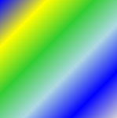
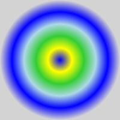
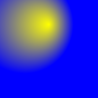

# Background

Xaml has a [LinearGradientBrush](https://docs.microsoft.com/uwp/api/Windows.UI.Xaml.Media.LinearGradientBrush) to paint an area with a linear gradient. For example



This spec adds a new _radial_ gradient brush. 

This is roughly the same as WPF's [RadialGradientBrush](https://docs.microsoft.com/dotnet/api/System.Windows.Media.RadialGradientBrush), and is actually implemented using the existing Windows [CompositionRadialGradientBrush](https://docs.microsoft.com/uwp/api/Windows.UI.Composition.CompositionRadialGradientBrush).

This brush will ship in the WinUI 2 NuGet/Framework package. Since it can be used on older Windows 10 versions, where the CompositionRadialGradientBrush isn't available, it has fallback behavior to draw a solid color instead when necessary, as is done by [AcrylicBrush](https://docs.microsoft.com/uwp/api/Microsoft.UI.Xaml.Media.AcrylicBrush).

## Composition brush usage

The Xaml RadialGradientBrush will inherit from [XamlCompositionBrushBase](https://docs.microsoft.com/uwp/api/windows.ui.xaml.media.xamlcompositionbrushbase) and use a [CompositionRadialGradientBrush](https://docs.microsoft.com/uwp/api/windows.ui.composition.compositionradialgradientbrush), which is supported on Windows 10 1903 (v10.0.18362+). This seems like a useful model for new brushes going forward for both WinUI 2 and 3, and we aren't too concerned about duplicating some properties from other candidate base classes [GradientBrush](https://docs.microsoft.com/uwp/api/windows.ui.xaml.media.gradientbrush).

The RadialGradientBrush API will more closely mirror the behavior of the Composition API than the WPF API: for example, the gradient origin defaults to center and provides a `GradientOriginOffset` property to specify an offset rather than providing a `GradientOrigin` property.

Notable inconsistencies with the composition API include:
1. Usage of [Point](https://docs.microsoft.com/uwp/api/windows.foundation.point) rather than [Vector2](https://docs.microsoft.com/uwp/api/windows.foundation.numerics.vector2)/[float2](https://docs.microsoft.com/windows/win32/numerics_h/float2-structure)
2. Usage of [GradientStop](https://docs.microsoft.com/uwp/api/windows.ui.xaml.media.gradientstop) rather than [CompositionColorGradientStop](https://docs.microsoft.com/uwp/api/windows.ui.composition.compositioncolorgradientstop)

The main reason for the above is to enable Xaml markup parsing for brushes defined in markup and consistency with the rest of the Xaml API.

### Animation support

Ideally, RadialGradientBrush would support animation of GradientStops and other properties using composition animations by implementing [IAnimationObject](https://docs.microsoft.com/uwp/api/windows.ui.composition.ianimationobject). However, the `IAnimationObject` interface and support for animation of non-composition types is only supported on Windows 10 1809 (v10.0.17763) and newer. This could be revisited with WinUI 3.

## Downlevel fallback behavior

When this brush is used on pre-1903 versions of Windows, where [CompositionRadialGradientBrush](https://docs.microsoft.com/uwp/api/Windows.UI.Composition.CompositionRadialGradientBrush) isn't available, the options for fallback behavior are:

1. Draw a gradient using another renderer, e.g. Direct2D
   * This would require loading additional expensive dependencies which WinUI doesn't currently rely on.
2. Draw a custom gradient surface, e.g. using a CompositionSurfaceBrush or WriteableBitmap
   * This would require largely reimplementing the complex CompositionRadialGradientBrush.
3. **Rely on FallbackColor**
   * Draw a solid color, as specified by the [XamlCompositionBrushBase.FallbackColor](https://docs.microsoft.com/uwp/api/Windows.UI.Xaml.Media.XamlCompositionBrushBase.FallbackColor) (which RadialGradientBrush will inherit from its base class).

Using FallbackColor follows the precedence of [AcrylicBrush](https://docs.microsoft.com/uwp/api/Microsoft.UI.Xaml.Media.AcrylicBrush). And since CompositionRadialGradientBrush should be available downlevel with WinUI 3, this seems like a reasonable approach in the meantime.

## InterpolationSpace

Note that the underlying [CompositionRadialGradientBrush](https://docs.microsoft.com/uwp/api/windows.ui.composition.compositionradialgradientbrush) currently only supports the following [CompositionColorSpace](https://docs.microsoft.com/uwp/api/windows.ui.composition.compositioncolorspace) values:

* `Auto`
* `Rgb`
* `RgbLinear`

Applying any other interpolation color space will have no effect.

# Description

RadialGradientBrush paints an area with a radial gradient. A center point defines the origin of the gradient, and an ellipse defines the outer bounds of the gradient.

# Examples

This example creates a radial gradient with six gradient stops and uses it to paint a Rectangle.



XAML
```XAML
<Page
  xmlns:media="using:Microsoft.UI.Xaml.Media">

  <Rectangle Width="200" Height="200">
      <Rectangle.Fill>
          <media:RadialGradientBrush>
              <GradientStop Color="Blue" Offset="0.0" />
              <GradientStop Color="Yellow" Offset="0.2" />
              <GradientStop Color="LimeGreen" Offset="0.4" />
              <GradientStop Color="LightBlue" Offset="0.6" />
              <GradientStop Color="Blue" Offset="0.8" />
              <GradientStop Color="LightGray" Offset="1" />
          </media:RadialGradientBrush>
      </Rectangle.Fill>
  </Rectangle>

</Page>
```

This example creates a radial gradient that uses Absolute mapping mode with custom values for `EllipseCenter`, `EllipseRadius` and `GradientOriginOffset`:



```XAML
<Page
  xmlns:media="using:Microsoft.UI.Xaml.Media">

  <Rectangle Width="200" Height="200">
      <Rectangle.Fill>
          <media:RadialGradientBrush
            MappingMode="Absolute"
            EllipseCenter="50,50"
            EllipseRadius="100,100"
            GradientOriginOffset="50,0"
            >
              <GradientStop Color="Yellow" Offset="0.0" />
              <GradientStop Color="Blue" Offset="1" />
          </media:RadialGradientBrush>
      </Rectangle.Fill>
  </Rectangle>

</Page>
```

# Remarks

## Gradient layout

The gradient is drawn within an ellipse that is defined by the `EllipseCenter` and `EllipseRadius` properties. Colors for the gradient start at the center of the ellipse and end at the radius.

The colors for the radial gradient are defined by color stops added to the `GradientStops` collection property. Each gradient stop specifies a color and an offset along the gradient.

The gradient origin defaults to center and can be offset using the `GradientOriginOffset` property.

`MappingMode` defines whether `EllipseCenter`, `EllipseRadius` and `GradientOriginOffset` represent relative or absolute coordinates.

When `MappingMode` is set to `RelativeToBoundingBox`, the X and Y values of the three properties are treated as relative to the brush's rendered bounds, where `(0,0)` represents the top left and `(1,1)` represents the bottom right of the brush's rendered bounds for the `EllipseCenter` and `EllipseRadius` properties and `(0,0)` represents the center for the `GradientOriginOffset` property.

When `MappingMode` is set to `Absolute`, the X and Y values of the three properties are treated as absolute coordinates within the brush's rendered bounds.

## Windows 10 Version Support

Gradient rendering is supported on Windows 10 version 1903 (v10.0.18362.0) and higher. On previous OS versions the brush will render a solid color specified by the `FallbackColor` property.

## See Also

* [LinearGradientBrush](https://docs.microsoft.com/uwp/api/Windows.UI.Xaml.Media.LinearGradientBrush)

* [CompositionRadialGradientBrush](https://docs.microsoft.com/uwp/api/windows.ui.composition.compositionradialgradientbrush)

# API Notes

## Fields

| | |
| - | - |
| EllipseCenter | The center of the ellipse that contains the gradient. The default is `(0.5, 0.5)`. |
| EllipseRadius | The radius of the ellipse that contains the gradient. The default is `(0.5, 0.5)`. |
| GradientOriginOffset | The gradient origin's offset from the center of the element. |
| GradientStops | A collection of [GradientStop](https://docs.microsoft.com/uwp/api/windows.ui.xaml.media.gradientstop) objects that define the gradient. |
| InterpolationSpace | The color space used to interpolate the gradient's colors. The default is `Auto`. For supported values, see [CompositionRadialGradientBrush.InterpolationSpace](https://docs.microsoft.com/uwp/api/windows.ui.composition.compositiongradientbrush.interpolationspace#Windows_UI_Composition_CompositionGradientBrush_InterpolationSpace) |
| MappingMode | Defines whether `EllipseCenter`, `EllipseRadius` and `GradientOriginOffset` represent relative coordinates in the range 0 to 1 or absolute coordinates. The default is `RelativeToBoundingBox`. |
| SpreadMethod | Gets or sets the type of spread method that specifies how to draw a gradient that starts or ends inside the bounds of the object to be painted. The default is `Pad`. |

# API Details

```C++
[webhosthidden]
[contentproperty("GradientStops")]
unsealed runtimeclass RadialGradientBrush : Windows.UI.Xaml.Media.XamlCompositionBrushBase
{
    RadialGradientBrush();

    Windows.Foundation.Point EllipseCenter { get; set; };

    Windows.Foundation.Point EllipseRadius { get; set; };

    Windows.Foundation.Point GradientOriginOffset { get; set; };

    Windows.UI.Xaml.Media.BrushMappingMode MappingMode { get; set; };

    Windows.UI.Composition.CompositionColorSpace InterpolationSpace { get; set; };

    Windows.UI.Xaml.Media.GradientSpreadMethod SpreadMethod { get; set; };

    Windows.Foundation.Collections.IObservableVector<Windows.UI.Xaml.Media.GradientStop> GradientStops { get; };

    static Windows.UI.Xaml.DependencyProperty EllipseCenterProperty { get; };
    static Windows.UI.Xaml.DependencyProperty EllipseRadiusProperty { get; };
    static Windows.UI.Xaml.DependencyProperty GradientOriginOffsetProperty { get; };
    static Windows.UI.Xaml.DependencyProperty InterpolationSpaceProperty { get; };
    static Windows.UI.Xaml.DependencyProperty MappingModeProperty { get; };
    static Windows.UI.Xaml.DependencyProperty SpreadMethodProperty { get; };
}
```

<!-- # Appendix -->
<!-- Anything else that you want to write down for posterity, but
that isn't necessary to understand the purpose and usage of the API.
For example, implementation details. -->
