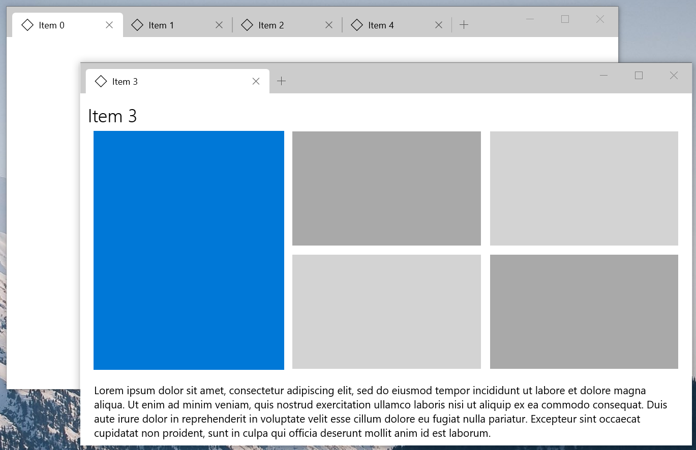
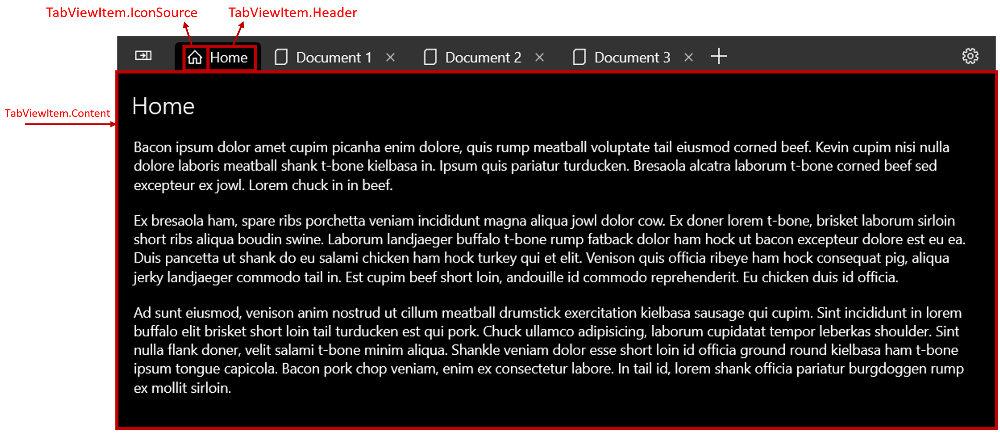
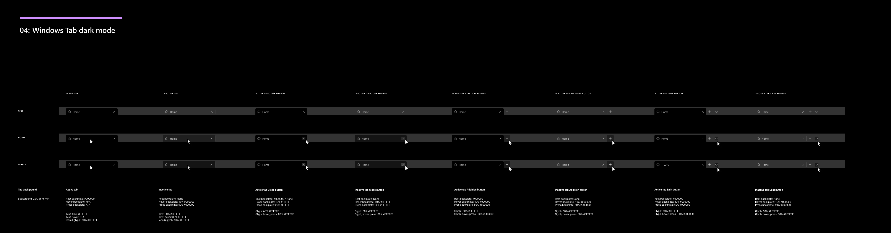

> This spec is archived and may not be up to date.
> For up-to-date developer documentation please see: [Guidance Doc](https://docs.microsoft.com/windows/uwp/design/controls-and-patterns/tab-view), [API Doc](https://docs.microsoft.com/uwp/api/microsoft.ui.xaml.controls.tabview?view=winui-2.3)

<!-- The purpose of this spec is to describe a new feature and
its APIs that make up a new feature in WinUI. -->

<!-- There are two audiences for the spec. The first are people
that want to evaluate and give feedback on the API, as part of
the submission process.  When it's complete
it will be incorporated into the public documentation at
docs.microsoft.com (http://docs.microsoft.com/uwp/toolkits/winui/).
Hopefully we'll be able to copy it mostly verbatim.
So the second audience is everyone that reads there to learn how
and why to use this API. -->

# Background
<!-- Use this section to provide background context for the new API(s) 
in this spec. -->

<!-- This section and the appendix are the only sections that likely
do not get copied to docs.microsoft.com; they're just an aid to reading this spec. -->

<!-- If you're modifying an existing API, included a link here to the
existing page(s) -->

<!-- For example, this section is a place to explain why you're adding this API rather than
modifying an existing API. -->

<!-- For example, this is a place to provide a brief explanation of some dependent
area, just explanation enough to understand this new API, rather than telling
the reader "go read 100 pages of background information posted at ...". -->

> See [proposal document](https://github.com/Microsoft/microsoft-ui-xaml/issues/304) for more background

The TabView control is a way to display a set of tabs and their respective content. Tab controls are useful for displaying several pages (or documents) of content while giving a user the capability to rearrange, open, or close new tabs. 


Tab-like UI comes in two distinct styles that affect not only the visualization of the control, but also the user experience:
* Static tabs
    * Generally display a set number of pages
    * User can change between pages, but cannot open new pages, close pages, or rearrange pages
* Document tabs
    * Display a variable number of pages
    * User can add, remove, and rearrange pages
    * User can "tear off" tabs into their own window or "recombine" tabs from one group into another group

The Xaml platform already provides several controls to represent "static-style tabs" including [Pivot](https://docs.microsoft.com/en-us/windows/uwp/design/controls-and-patterns/pivot) and top [NavigationView](https://docs.microsoft.com/en-us/windows/uwp/design/controls-and-patterns/navigationview#display-modes). However, these controls do not well support "document-style" tabs due to a variety of limitations, including:
* Significant effort up to (and including) retemplating to build simple tabs
* No built-in support for closing tabs
* No built-in support for drag/drop into new windows
* No built-in support for moving a tab from a window and combining it with another window
* Limited keyboard and accessibility support

This spec therefore covers "document-style tabs" specifically as this platform gap isn't easily solved with an app-side workaround. 

# Description
<!-- Use this section to provide a brief description of the feature.
For an example, see the introduction to the PasswordBox control 
(http://docs.microsoft.com/windows/uwp/design/controls-and-patterns/password-box). -->

TabView is a collection of tabs that each represents a new page or document in your app. Use TabView when your app has several pages of content and the user expects to be able to add, close, and rearrange the pages.

**Is this the right control?**

Use a TabView to help the user manage multiple app pages or documents within the same window. 

Do not use a TabView to display a static set of tabs that the user cannot rearrange, open, or close. Use a Pivot or top NavigationView instead. 

# Examples
<!-- Use this section to explain the features of the API, showing
example code with each description. The general format is: 
  feature explanation,
  example code
  feature explanation,
  example code
  etc.-->

<!-- As an example of this section, see the Examples section for the PasswordBox control 
(https://docs.microsoft.com/windows/uwp/design/controls-and-patterns/password-box#examples). -->

## Basic TabView Sample, similar to a Web Browser

``` xml
<TabView AddTabButtonClick="Tabs_AddTabButtonClick"
         TabCloseRequested="Tabs_TabCloseRequested" />
```

``` csharp
// Add a new Tab to the TabView
private void Tabs_AddTabButtonClick(TabView sender, TabViewAddTabButtonClickEventArgs e)
{
    var newTab = new TabViewItem();
    newTab.IconSource = new SymbolIconSource() { Symbol = Symbol.Document };
    newTab.Header = "New Document";

    // The Content of a TabViewItem is often a frame which hosts a page.
    Frame frame = new Frame();
    newTab.Content = frame;
    frame.Navigate(typeof(BaconIpsumPage));

    sender.TabItems.Add(newTab);
}

// Remove the requested tab from the TabView
private void Tabs_TabCloseRequested(TabView sender, TabViewTabCloseRequestedEventArgs args)
{
    sender.TabItems.Remove(args.Tab);
}
```

## Put TabView in the titlebar area


This sample demonstrates how to extend the TabView into the title bar area and also specify a portion of the UI as the draggable region, using [CoreApplicationViewTitleBar.ExtendViewIntoTitleBar](https://docs.microsoft.com/uwp/api/Windows.ApplicationModel.Core.CoreApplicationViewTitleBar.ExtendViewIntoTitleBar). Per the [titlebar customization guidelines](https://docs.microsoft.com/en-us/windows/uwp/design/shell/title-bar), we must set a [specific drag region](https://docs.microsoft.com/en-us/windows/uwp/design/shell/title-bar#draggable-regions) (the space that a user can use to drag the window around the screen using mouse or touch). If we don't specify the drag region, the entire titlebar area remains draggable (meaning input won't be routed to the tabs, making the tabs unclickable).

``` xml
<Page>
    <TabView HorizontalAlignment="Stretch" VerticalAlignment="Stretch">
        <TabViewItem Icon="Home" Header="Home" IsCloseable="False" />
        <TabViewItem Icon="Document" Header="Document 1" />
        <TabViewItem Icon="Document" Header="Document 2" />
        <TabViewItem Icon="Document" Header="Document 3" />

        <TabView.TabStripHeader>
            <Grid x:Name="ShellTitlebarInset" Background="Transparent" />
        </TabView.TabStripHeader>
        <TabView.TabStripFooter>
            <Grid x:Name="CustomDragRegion" Background="Transparent" />
        </TabView.TabStripFooter>
    </TabView>
</Page>
```

``` csharp
// Customize the titlebar area using the guidance from here: https://docs.microsoft.com/en-us/windows/uwp/design/shell/title-bar
public MainPage()
{
    this.InitializeComponent();

    var coreTitleBar = CoreApplication.GetCurrentView().TitleBar;
    coreTitleBar.ExtendViewIntoTitleBar = true;
    coreTitleBar.LayoutMetricsChanged += CoreTitleBar_LayoutMetricsChanged;

    Window.Current.SetTitleBar(CustomDragRegion);
}

private void CoreTitleBar_LayoutMetricsChanged(CoreApplicationViewTitleBar sender, object args)
{
    // To ensure that the tabs in the titlebar are not occluded by shell
    // content, we must ensure that we account for left and right overlays.
    // In LTR layouts, the right inset includes the caption buttons and the
    // drag region, which is flipped in RTL. 

    // The SystemOverlayLeftInset and SystemOverlayRightInset values are
    // in terms of physical left and right. Therefore, we need to flip
    // then when our flow direction is RTL.
    if (FlowDirection == FlowDirection.LeftToRight)
    {
        CustomDragRegion.MinWidth = sender.SystemOverlayRightInset;
        ShellTitlebarInset.MinWidth = sender.SystemOverlayLeftInset;
    }
    else
    {
        CustomDragRegion.MinWidth = sender.SystemOverlayLeftInset;
        ShellTitlebarInset.MinWidth = sender.SystemOverlayRightInset;
    }

    // Ensure that the height of the custom regions are the same as the titlebar.
    CustomDragRegion.Height = ShellTitlebarInset.Height = sender.Height;
}
```

## Create a new window when tearing out tabs



There are different ways that content can be hosted inside an app. The [Show multiple views for an app](https://docs.microsoft.com/en-us/windows/uwp/design/layout/show-multiple-views) documentation outlines the various technologies for displaying multiple views or windows. 

The example below uses AppWindow, which is available starting in Windows 10, version 1903 (SDK 18362). AppWindow simplifies the creation of multi-window UWP apps because it operates on the same UI thread that it's created from. The complete TabView + AppWindow sample can be found in the [Xaml Controls Gallery](https://github.com/microsoft/Xaml-Controls-Gallery/blob/w/stmoy/TabViewPreview/XamlControlsGallery/TabViewPages/TabViewWindowingSamplePage.xaml.cs). 

If your app targets Windows 10 versions less than 1903, you will need to use CoreWindow/ApplicationView. The Windows Community Toolkit [TabView tear out sample](https://github.com/windows-toolkit/Sample-TabView-TearOff/tree/master/TabViewTear) demonstrates how to create a multi-window application using CoreWindow/ApplicationView.


``` xml
<TabView CanDragTabs="True"
            CanReorderTabs="True"
            TabDroppedOutside="TabView_TabDroppedOutside">
```
``` csharp
// NOTE: The app is responsible for writing this code. A full sample can be found in the Xaml Controls Gallery.
private async void TabView_TabDroppedOutside(TabView sender, TabDroppedOutsideEventArgs e)
{
    // Create a new AppWindow
    AppWindow newWindow = await AppWindow.TryCreateAsync();

    // Create the content for the new window
    var newPage = new MainPage();

    // Remove tab from existing list
    Tabs.TabItems.Remove(e.Tab);

    // Add tab to list of Tabs on new page
    newPage.AddItemToTabs(e.Tab);

    // Set the Window's content to the new page
    ElementCompositionPreview.SetAppWindowContent(newWindow, newPage);

    // Show the window
    await newWindow.TryShowAsync();
}
```

## Databind to a set of tabs 

``` xml
<TabView TabItemsSource="{x:Bind TabViewItemCollection}" />
```

## Implement browser-style keyboarding behavior

The below example shows how to use KeyboardAccelerators to enable the following experiences:
* Open a new tab with CTRL+T
* Close the selected tab with CTRL+W
* Change the selected tab with CTRL+1 through CTRL+8
* Select the last tab with CTRL+9

``` xml
<controls:TabView x:Name="TabRoot">
    <controls:TabView.KeyboardAccelerators>
        <KeyboardAccelerator Key="T" Modifiers="Control" Invoked="NewTabKeyboardAccelerator_Invoked" />
        <KeyboardAccelerator Key="W" Modifiers="Control" Invoked="CloseSelectedTabKeyboardAccelerator_Invoked" />
        <KeyboardAccelerator Key="Number1" Modifiers="Control" Invoked="NavigateToNumberedTabKeyboardAccelerator_Invoked" />
        <KeyboardAccelerator Key="Number2" Modifiers="Control" Invoked="NavigateToNumberedTabKeyboardAccelerator_Invoked" />
        <KeyboardAccelerator Key="Number3" Modifiers="Control" Invoked="NavigateToNumberedTabKeyboardAccelerator_Invoked" />
        <KeyboardAccelerator Key="Number4" Modifiers="Control" Invoked="NavigateToNumberedTabKeyboardAccelerator_Invoked" />
        <KeyboardAccelerator Key="Number5" Modifiers="Control" Invoked="NavigateToNumberedTabKeyboardAccelerator_Invoked" />
        <KeyboardAccelerator Key="Number6" Modifiers="Control" Invoked="NavigateToNumberedTabKeyboardAccelerator_Invoked" />
        <KeyboardAccelerator Key="Number7" Modifiers="Control" Invoked="NavigateToNumberedTabKeyboardAccelerator_Invoked" />
        <KeyboardAccelerator Key="Number8" Modifiers="Control" Invoked="NavigateToNumberedTabKeyboardAccelerator_Invoked" />
        <KeyboardAccelerator Key="Number9" Modifiers="Control" Invoked="NavigateToNumberedTabKeyboardAccelerator_Invoked" />
    </controls:TabView.KeyboardAccelerators>
    <!-- ... some tabs ... -->
</controls:TabView>
```

``` csharp

private void NewTabKeyboardAccelerator_Invoked(KeyboardAccelerator sender, KeyboardAcceleratorInvokedEventArgs args)
{
    // See previous sample
    CreateNewTab();
}

private void CloseSelectedTabKeyboardAccelerator_Invoked(KeyboardAccelerator sender, KeyboardAcceleratorInvokedEventArgs args)
{
    // Only close the selected tab if it is closeable
    if (((TabViewItem)TabRoot.SelectedItem).IsCloseable)
    {
        TabRoot.TabItems.Remove(TabRoot.SelectedItem);
    }
}

private void NavigateToNumberedTabKeyboardAccelerator_Invoked(KeyboardAccelerator sender, KeyboardAcceleratorInvokedEventArgs args)
{
    int tabToSelect = 0;

    switch (sender.Key)
    {
        case Windows.System.VirtualKey.Number1:
            tabToSelect = 0;
            break;
        case Windows.System.VirtualKey.Number2:
            tabToSelect = 1;
            break;
        case Windows.System.VirtualKey.Number3:
            tabToSelect = 2;
            break;
        case Windows.System.VirtualKey.Number4:
            tabToSelect = 3;
            break;
        case Windows.System.VirtualKey.Number5:
            tabToSelect = 4;
            break;
        case Windows.System.VirtualKey.Number6:
            tabToSelect = 5;
            break;
        case Windows.System.VirtualKey.Number7:
            tabToSelect = 6;
            break;
        case Windows.System.VirtualKey.Number8:
            tabToSelect = 7;
            break;
        case Windows.System.VirtualKey.Number9:
            // Select the last tab
            tabToSelect = TabRoot.TabItems.Count - 1;
            break;
    }

    // Only select the tab if it is in the list
    if (tabToSelect < TabRoot.TabItems.Count)
    {
        TabRoot.SelectedIndex = tabToSelect;
    }
}

```

# Remarks
<!-- Explanation and guidance that doesn't fit into the Examples
section.  For example, see the Remarks for the MediaPlayerElement 
(https://docs.microsoft.com/uwp/api/Windows.UI.Xaml.Controls.MediaPlayerElement#remarks). -->

## Parts of a TabView




## Keyboard guidance for App Developers
The [Appendix/Detailed Keyboarding Behavior](#detailed-keyboarding-behavior) section outlines built-in keyboarding behavior provided by the TabView. This section discusses specific recommendations to extend the keyboarding functionality for your app.

* If your app does not already handle the CTRL+T shortcut, consider using it to open a new tab.
* If your app does not already handle the CTRL+W shortcut, consider using it to close the selected tab.
* Consider maintaining a list of recently closed Tabs. If the user presses CTRL+SHIFT+T, they expect recently closed tabs to be reopened.
* Modern browsers support selecting tabs when pressing CTRL and a number. Consider handling Ctrl+1 through 8, which should select that number Tab. Additionally, you can consider handling Ctrl+9 which selects the last tab (regardless of the number of tabs).
* If users can perform more commands on a Tab than just closing the Tab (for example, pinning a Tab or duplicating a Tab), consider adding a context menu to the TabViewItem. 

## Tab Strip Overflow
What happens when too many tabs appear in the tab strip? The TabView control resizes the tabs and provides a scrollbar so the app doesn't need to. The behavior is slightly different depending on the value of the TabView.TabWidthMode property.

| TabWidthMode Value | Behavior |
|:-------- |:----------- |
| Equal | The tabs get narrower to a min width and then bumpers appear and allow for horizontal scrolling. |
| SizeToContent | The tabs do not get narrower than their natural size, but bumpers will appear and allow for horizontal scrolling. | 

## Guidance for Tab selection
* Users expect that a tab is selected by default. Ensure that a TabViewItem is initially selected when TabView is created by setting the SelectedItem or SelectedIndex.
* The TabView will attempt to ensure that a tab is selected if the previously selected Tab is closed. By default, the TabView will select the next tab item if it is enabled. 
* If no tab is selected, the main content area of the TabView will appear blank.

# API Notes
<!-- Give a one or two line description of each API (type
and member), or at least the ones that aren't obvious
from their name.  These descriptions are what show up
in IntelliSense. -->

### TabView properties, events, methods

| Property | Description |
|:-------- |:----------- |
| AddTabButtonCommand | Gets or sets the command to invoke when the Add button is tapped. |
| AddTabButtonCommandParameter | Gets or sets the parameter to pass to the command for the Add button. |
| CanDragTabs | Gets or sets a value that indicates whether tabs in the collection can be dragged. Default is true. |
| CanReorderTabs | Gets or sets a value that indicates whether tabs in the collection can be reordered through user interaction. Default is true. |
| IsAddTabButtonVisible | Determines if the plus button appears to the right of the tab strip |
| TabItemsSource | Gets or sets an object source used to generate the tabs. |
| TabItems | Gets the collection used to generate the tabs. |
| TabItemTemplate | Gets or sets the DataTemplate used to display the TabViewItem. |
| TabItemTemplateSelector | Gets or sets a reference to a custom DataTemplateSelector logic class. The DataTemplateSelector referenced by this property returns a template to apply to items. |
| SelectedIndex | Gets or sets the index of the selected item. |
| SelectedItem | Gets or sets the selected item. |
| TabStripHeader | Content to the left of the tab strip. |
| TabStripFooter | Content to the right of the tab strip. |
| TabWidthMode | Specifies how the tabs should be sized. Values are {Equal, SizeToContent}. Default is Equal. |

| Event | Description |
|---|---|
| AddTabButtonClick | Raised when the + button is clicked. |
| SelectionChanged | Occurs when the currently selected tab changes. |
| TabCloseRequested | Raised when the user attempts to close a Tab via clicking the x-to-close, CTRL+F4, or mousewheel. |
| TabDroppedOutside | Raised when a Tab is dropped outside of the Tab bar. |

| Method | Description |
|---|---|
| DependencyObject ContainerFromItem(object item) | Returns the generated container for the specified item. |
| DependencyObject ContainerFromIndex(Int32 index) | Returns the generated container for the specified index. |

### TabViewItem properties and events

| Property | Description |
|:-------- |:----------- |
| Content | The content that appears inside the TabView's content area when the TabViewItem is selected. |
| Header | The content that appears inside the tab strip to represent the tab.  |
| HeaderTemplate | Template for the header object. |
| Icon | Icon for the tab. |
| IsCloseable | Determines if the tab shows a close button. Default is "True". |

| Event | Description |
|---|---|
| TabCloseRequested | Raised when a tab's close button is clicked. |

# API Details
<!-- The exact API, in MIDL3 format (https://docs.microsoft.com/en-us/uwp/midl-3/) -->

```
namespace MU_XC_NAMESPACE
{

[WUXC_VERSION_MUXONLY]
[webhosthidden]
enum TabViewWidthMode
{
    Equal = 0,
    SizeToContent = 1,
};

[WUXC_VERSION_MUXONLY]
[webhosthidden]
runtimeclass TabViewTabCloseRequestedEventArgs
{
    Object Item { get; };
    TabViewItem Tab { get; };
}

[WUXC_VERSION_MUXONLY]
[webhosthidden]
runtimeclass TabViewTabDroppedOutsideEventArgs
{
    Object Item { get; };
    TabViewItem Tab { get; };
}

[WUXC_VERSION_MUXONLY]
[webhosthidden]
runtimeclass TabViewTabDragStartingEventArgs
{
    Boolean Cancel { get; set; };
    Windows.ApplicationModel.DataTransfer.DataPackage Data { get; };
    Object Item { get; };
    TabViewItem Tab { get; };
}

[WUXC_VERSION_MUXONLY]
[webhosthidden]
runtimeclass TabViewTabDragCompletedEventArgs
{
    Windows.ApplicationModel.DataTransfer.DataPackageOperation DropResult { get; };
    Object Item { get; };
    TabViewItem Tab { get; };
}

[WUXC_VERSION_MUXONLY]
[webhosthidden]
unsealed runtimeclass TabView : Windows.UI.Xaml.Controls.Control
{
    TabView();

    [MUX_DEFAULT_VALUE("winrt::TabViewWidthMode::Equal")]
    [MUX_PROPERTY_CHANGED_CALLBACK(TRUE)]
    TabViewWidthMode TabWidthMode{ get; set; };

    Object TabStripHeader{ get; set; };
    Windows.UI.Xaml.DataTemplate TabStripHeaderTemplate{ get; set; };

    Object TabStripFooter{ get; set; };
    Windows.UI.Xaml.DataTemplate TabStripFooterTemplate{ get; set; };

    [MUX_DEFAULT_VALUE("true")]
    Boolean IsAddTabButtonVisible{ get; set; };
    Windows.UI.Xaml.Input.ICommand AddTabButtonCommand{ get; set; };
    Object AddTabButtonCommandParameter{ get; set; };

    event Windows.Foundation.TypedEventHandler<TabView, TabViewTabCloseRequestedEventArgs> TabCloseRequested;

    event Windows.Foundation.TypedEventHandler<TabView, TabViewTabDroppedOutsideEventArgs> TabDroppedOutside;

    event Windows.Foundation.TypedEventHandler<TabView, Object> AddTabButtonClick;

    // From ListView
    Object TabItemsSource;
    Windows.Foundation.Collections.IVector<Object> TabItems{ get; };

    Windows.UI.Xaml.DataTemplate TabItemTemplate;
    Windows.UI.Xaml.Controls.DataTemplateSelector TabItemTemplateSelector{ get; set; };

    [MUX_DEFAULT_VALUE("false")]
    Boolean CanDragTabs{ get; set; };
    [MUX_DEFAULT_VALUE("true")]
    Boolean CanReorderTabs{ get; set; };
    [MUX_DEFAULT_VALUE("true")]
    Boolean AllowDropTabs{ get; set; };

    [MUX_DEFAULT_VALUE("0")]
    [MUX_PROPERTY_CHANGED_CALLBACK(TRUE)]
    Int32 SelectedIndex;

    [MUX_PROPERTY_CHANGED_CALLBACK(TRUE)]
    Object SelectedItem;

    Windows.UI.Xaml.DependencyObject ContainerFromItem(Object item);
    Windows.UI.Xaml.DependencyObject ContainerFromIndex(Int32 index);

    event Windows.UI.Xaml.Controls.SelectionChangedEventHandler SelectionChanged;

    event Windows.Foundation.TypedEventHandler<TabView, TabViewTabDragStartingEventArgs> TabDragStarting;
    event Windows.Foundation.TypedEventHandler<TabView, TabViewTabDragCompletedEventArgs> TabDragCompleted;
    event Windows.UI.Xaml.DragEventHandler TabStripDragOver;
    event Windows.UI.Xaml.DragEventHandler TabStripDrop;

    static Windows.UI.Xaml.DependencyProperty TabWidthModeProperty{ get; };
    static Windows.UI.Xaml.DependencyProperty TabStripHeaderProperty{ get; };
    static Windows.UI.Xaml.DependencyProperty TabStripHeaderTemplateProperty{ get; };
    static Windows.UI.Xaml.DependencyProperty TabStripFooterProperty{ get; };
    static Windows.UI.Xaml.DependencyProperty TabStripFooterTemplateProperty{ get; };
    static Windows.UI.Xaml.DependencyProperty IsAddTabButtonVisibleProperty{ get; };
    static Windows.UI.Xaml.DependencyProperty AddTabButtonCommandProperty{ get; };
    static Windows.UI.Xaml.DependencyProperty AddTabButtonCommandParameterProperty{ get; };

    static Windows.UI.Xaml.DependencyProperty TabItemsSourceProperty{ get; };
    static Windows.UI.Xaml.DependencyProperty TabItemsProperty{ get; };
    static Windows.UI.Xaml.DependencyProperty TabItemTemplateProperty{ get; };
    static Windows.UI.Xaml.DependencyProperty TabItemTemplateSelectorProperty{ get; };
    static Windows.UI.Xaml.DependencyProperty CanDragTabsProperty{ get; };
    static Windows.UI.Xaml.DependencyProperty CanReorderTabsProperty{ get; };
    static Windows.UI.Xaml.DependencyProperty AllowDropTabsProperty{ get; };
    static Windows.UI.Xaml.DependencyProperty SelectedIndexProperty{ get; };
    static Windows.UI.Xaml.DependencyProperty SelectedItemProperty{ get; };
}

[WUXC_VERSION_MUXONLY]
[webhosthidden]
unsealed runtimeclass TabViewItem : Windows.UI.Xaml.Controls.ListViewItem
{
    TabViewItem();

    [MUX_PROPERTY_CHANGED_CALLBACK(TRUE)]
    Object Header{ get; set; };

    Windows.UI.Xaml.DataTemplate HeaderTemplate{ get; set; };

    [MUX_PROPERTY_CHANGED_CALLBACK(TRUE)]
    IconSource IconSource{ get; set; };

    [MUX_DEFAULT_VALUE("true")]
    [MUX_PROPERTY_CHANGED_CALLBACK(TRUE)]
    Boolean IsClosable{ get; set; };

    TabViewItemTemplateSettings TabViewTemplateSettings{ get; };

    event Windows.Foundation.TypedEventHandler<TabViewItem, TabViewTabCloseRequestedEventArgs> CloseRequested;

    static Windows.UI.Xaml.DependencyProperty HeaderProperty{ get; };
    static Windows.UI.Xaml.DependencyProperty HeaderTemplateProperty{ get; };
    static Windows.UI.Xaml.DependencyProperty IconSourceProperty{ get; };
    static Windows.UI.Xaml.DependencyProperty IsClosableProperty{ get; };
    static Windows.UI.Xaml.DependencyProperty TabViewTemplateSettingsProperty{ get; };
}

[WUXC_VERSION_MUXONLY]
[webhosthidden]
unsealed runtimeclass TabViewItemTemplateSettings : Windows.UI.Xaml.DependencyObject
{
    TabViewItemTemplateSettings();

    Windows.UI.Xaml.Controls.IconElement IconElement;

    static Windows.UI.Xaml.DependencyProperty IconElementProperty{ get; };
}

}

namespace MU_XCP_NAMESPACE
{

[WUXC_VERSION_MUXONLY]
[webhosthidden]
unsealed runtimeclass TabViewListView : Windows.UI.Xaml.Controls.ListView
{
    TabViewListView();
}

}

namespace MU_XAP_NAMESPACE
{

[WUXC_VERSION_MUXONLY]
[webhosthidden]
unsealed runtimeclass TabViewAutomationPeer : Windows.UI.Xaml.Automation.Peers.FrameworkElementAutomationPeer
{
    TabViewAutomationPeer(MU_XC_NAMESPACE.TabView owner);
}

[WUXC_VERSION_MUXONLY]
[webhosthidden]
unsealed runtimeclass TabViewItemAutomationPeer : Windows.UI.Xaml.Automation.Peers.ListViewItemAutomationPeer
{
    TabViewItemAutomationPeer(MU_XC_NAMESPACE.TabViewItem owner);
}

}
```

# Appendix
<!-- Anything else that you want to write down for posterity, but 
that isn't necessary to understand the purpose and usage of the API.
For example, implementation details. -->

## Detailed Keyboarding Behavior

This section discusses the built-in keyboarding functionality of the TabView control. The [Keyboard Guidance for App Developers](#Keyboard-guidance-for-App-Developers) section discusses specific recommendations to extend the keyboarding functionality for apps using TabView.

### TAB and Arrow key behavior in the TabStrip
When focus moves into the TabStrip area, the selected TabViewItem gains focus. The user can then use the LEFT/RIGHT arrow keys to move focus (not selection) to other tabs in the TabStrip. Arrow focus is trapped inside the Tab content area. To move focus out of the TabStrip area, the user can press the TAB key which will move focus to the next focusable element. 

_Move focus via TAB_


_ARROW does not cycle focus_


### Selecting a tab
When a TabViewItem has focus, pressing SPACE or ENTER will select that TabViewItem.

_Use ARROW to move focus, ENTER to select tab_


### Shortcuts for selecting adjacent tabs
Ctrl+TAB will select the next TabViewItem.
Ctrl+Shift+TAB will select the previous TabViewItem.
TAB selection cycles (meaning if the user has selected the last tab and presses Ctrl+TAB, the first tab becomes selected).

### Closing a tab 
Hitting CTRL+F4 will close the selected TabViewItem (assuming it is closable). 

## Visual Design Mockups





# Open Questions
